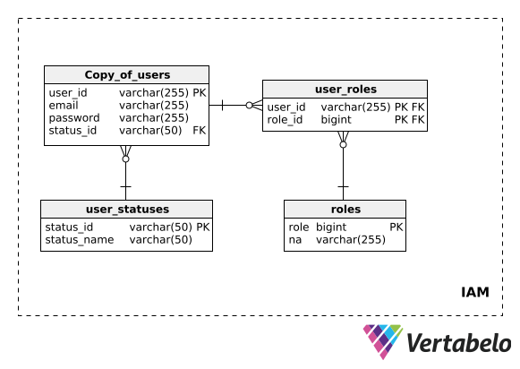
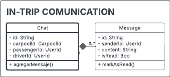

<body>
    

        
Universidad Peruana de Ciencias Aplicadas - Ingeniería de Software - 6 Ciclo

        
        
1ACC0238 - Aplicaciones para Dispositivos Móviles

        
Docente: Ing. Jorge Luis Mayta Guillermo
   
        
Informe de Trabajo Final

        
Startup: CampusMov

        
Producto: CarPool

    

    

        <h3 style="font-weight: bolder">Team Members:</h3>
        <table style="width: fit-content">
            <tr>
                <th style="text-align:center;">Estudiante</th>
                <th style="text-align:center;">Código</th>
            </tr>
            <tr>
                <td>Gutiérrez Soto, Jhosepmyr Orlando</td>
                <td>202317638</td>
            </tr>
            <tr>
                <td>Hernández Tuiro, Eric Ernesto</td>
                <td>20221C857</td>
            </tr>
            <tr>
                <td>Riva Rodríguez, Elmer Augusto</td>
                <td>202220829</td>
            </tr><tr>
                <td>Sanchez Montero, Carlos</td>
                <td>202015274</td>
            </tr>
            <tr>
                <td>Moraloes Quispe, Brayan Smith</td>
                <td>20211f984</td>
            </tr>
        </table>
    

    
Marzo 2025

</body>

# Registro de Versiones del Informe

| Versión | Fecha | Autor | Descripción de la modificación |
|---------|-------|-------|--------------------------------|

# Project Report Collaboration Insights

* URL del repositorio del Project Report en la organización de GitHub del equipo:
* [https://github.com/CampusMov/Report](https://github.com/CampusMov/Report)

# Contenido

<!-- TOC -->
* [Registro de Versiones del Informe](#registro-de-versiones-del-informe)
* [Project Report Collaboration Insights](#project-report-collaboration-insights)
* [Contenido](#contenido)
* [Student Outcome](#student-outcome)
  * [**ABET - EAC - Student Outcome 7**](#abet---eac---student-outcome-7)
* [Objetivos SMART](#objetivos-smart)
* [Capítulo I: Presentación](#capítulo-i-presentación)
  * [1.1. Startup Profile](#11-startup-profile)
    * [1.1.1. Descripción de la Startup](#111-descripción-de-la-startup)
    * [1.1.2. Perfiles de los integrantes del equipo](#112-perfiles-de-los-integrantes-del-equipo)
  * [1.2. Solution Profile](#12-solution-profile)
    * [1.2.1. Antecedentes y problemática](#121-antecedentes-y-problemática)
    * [1.2.2. Lean UX Process](#122-lean-ux-process)
      * [1.2.2.1. Lean UX Problem Statements](#1221-lean-ux-problem-statements)
      * [1.2.2.2. Lean UX Assumptions](#1222-lean-ux-assumptions)
      * [1.2.2.3. Lean UX Hypothesis Statements](#1223-lean-ux-hypothesis-statements)
      * [1.2.2.4. Lean UX Canvas](#1224-lean-ux-canvas)
  * [1.3. Segmentos objetivo](#13-segmentos-objetivo)
    * [*Estudiante conductor*](#estudiante-conductor)
      * [Perfil:](#perfil)
      * [Necesidades:](#necesidades)
    * [*Estudiante pasajero*](#estudiante-pasajero)
      * [Perfil:](#perfil-1)
      * [Necesidades:](#necesidades-1)
* [Capítulo II: Requirements Elicitation & Analysis](#capítulo-ii-requirements-elicitation--analysis)
  * [2.1. Competidores](#21-competidores)
    * [2.1.1. Análisis competitivo](#211-análisis-competitivo)
    * [2.1.2. Estrategias y tácticas frente a competidores](#212-estrategias-y-tácticas-frente-a-competidores)
  * [2.2. Entrevistas](#22-entrevistas)
    * [2.2.1. Diseño de entrevistas](#221-diseño-de-entrevistas)
    * [2.2.2. Registro de entrevistas](#222-registro-de-entrevistas)
    * [2.2.3. Análisis de entrevistas](#223-análisis-de-entrevistas)
  * [2.3. Needfinding](#23-needfinding)
    * [2.3.1. User Personas](#231-user-personas)
    * [2.3.2. User Task Matrix](#232-user-task-matrix)
    * [2.3.3. User Journey Mapping](#233-user-journey-mapping)
    * [2.3.4. Empathy Mapping](#234-empathy-mapping)
    * [2.3.5. As-is Scenario Mapping](#235-as-is-scenario-mapping)
  * [2.4. Ubiquitous Language](#24-ubiquitous-language)
* [Capítulo III: Requirements specification](#capítulo-iii-requirements-specification)
  * [3.1. To-Be Scenario Mapping](#31-to-be-scenario-mapping)
  * [3.2. User Stories](#32-user-stories)
  * [3.3. Impact Mapping](#33-impact-mapping)
  * [3.4. Product Backlog](#34-product-backlog)
* [Capítulo IV: Solution Software Design](#capítulo-iv-solution-software-design)
  * [4.1. Strategic-Level Domain-Driven Design](#41-strategic-level-domain-driven-design)
    * [4.1.1. EventStorming](#411-eventstorming)
      * [4.1.1.1. Candidate Context Discovery](#4111-candidate-context-discovery)
      * [4.1.1.2. Domain Message Flows Modeling](#4112-domain-message-flows-modeling)
      * [4.1.1.3. Bounded Context Canvases](#4113-bounded-context-canvases)
    * [4.1.2. Context Mapping](#412-context-mapping)
    * [4.1.3. Software Architecture](#413-software-architecture)
      * [4.1.3.1. Software Architecture Context Level Diagrams](#4131-software-architecture-context-level-diagrams)
      * [4.1.3.2. Software Architecture Container Level Diagrams](#4132-software-architecture-container-level-diagrams)
      * [4.1.3.3. Software Architecture Deployment Diagrams](#4133-software-architecture-deployment-diagrams)
  * [4.2. Tactical-Level Domain-Driven Design](#42-tactical-level-domain-driven-design)
    * [4.2.1. Bounded Context: Matching & Routing Management](#421-bounded-context-matching--routing-management)
      * [4.2.1.1. Domain Layer](#4211-domain-layer)
      * [4.2.1.2. Interface Layer](#4212-interface-layer)
      * [4.2.1.3. Application Layer](#4213-application-layer)
      * [4.2.1.4. Infrastructure Layer](#4214-infrastructure-layer)
      * [4.2.1.5. Bounded Context Software Architecture Component Level Diagrams](#4215-bounded-context-software-architecture-component-level-diagrams)
      * [4.2.1.6. Bounded Context Software Architecture Code Level Diagrams](#4216-bounded-context-software-architecture-code-level-diagrams)
        * [4.2.1.6.1. Bounded Context Domain Layer Class Diagrams](#42161-bounded-context-domain-layer-class-diagrams)
        * [4.2.1.6.2. Bounded Context Database Design Diagram](#42162-bounded-context-database-design-diagram)
    * [4.2.2. Bounded Context: Payment & Fees Management](#422-bounded-context-payment--fees-management)
      * [4.2.2.1. Domain Layer](#4221-domain-layer)
      * [4.2.2.2. Interface Layer](#4222-interface-layer)
      * [4.2.2.3. Application Layer](#4223-application-layer)
      * [4.2.2.4. Infrastructure Layer](#4224-infrastructure-layer)
      * [4.2.2.5. Bounded Context Software Architecture Component Level Diagrams](#4225-bounded-context-software-architecture-component-level-diagrams)
      * [4.2.2.6. Bounded Context Software Architecture Code Level Diagrams](#4226-bounded-context-software-architecture-code-level-diagrams)
        * [4.2.2.6.1. Bounded Context Domain Layer Class Diagrams](#42261-bounded-context-domain-layer-class-diagrams)
        * [4.2.2.6.2. Bounded Context Database Design Diagram](#42262-bounded-context-database-design-diagram)
    * [4.2.3. Bounded Context: Profile Management](#423-bounded-context-profile-management)
      * [4.2.3.1. Domain Layer](#4231-domain-layer)
      * [4.2.3.2. Interface Layer](#4232-interface-layer)
      * [4.2.3.3. Application Layer](#4233-application-layer)
      * [4.2.3.4. Infrastructure Layer](#4234-infrastructure-layer)
      * [4.2.3.5. Bounded Context Software Architecture Component Level Diagrams](#4235-bounded-context-software-architecture-component-level-diagrams)
      * [4.2.3.6. Bounded Context Software Architecture Code Level Diagrams](#4236-bounded-context-software-architecture-code-level-diagrams)
        * [4.2.3.6.1. Bounded Context Domain Layer Class Diagrams](#42361-bounded-context-domain-layer-class-diagrams)
        * [4.2.3.6.2. Bounded Context Database Design Diagram](#42362-bounded-context-database-design-diagram)
    * [4.2.4. Bounded Context: IAM](#424-bounded-context-iam)
      * [4.2.4.1. Domain Layer](#4241-domain-layer)
      * [4.2.4.2. Interface Layer](#4242-interface-layer)
      * [4.2.4.3. Application Layer](#4243-application-layer)
      * [4.2.4.4. Infrastructure Layer](#4244-infrastructure-layer)
      * [4.2.4.5. Bounded Context Software Architecture Component Level Diagrams](#4245-bounded-context-software-architecture-component-level-diagrams)
      * [4.2.4.6. Bounded Context Software Architecture Code Level Diagrams](#4246-bounded-context-software-architecture-code-level-diagrams)
        * [4.2.4.6.1. Bounded Context Domain Layer Class Diagrams](#42461-bounded-context-domain-layer-class-diagrams)
        * [4.2.4.6.2. Bounded Context Database Design Diagram](#42462-bounded-context-database-design-diagram)
    * [4.2.5. Bounded Context: Reputation & Incentives Management](#425-bounded-context-reputation--incentives-management)
      * [4.2.5.1. Domain Layer](#4251-domain-layer)
      * [4.2.5.2. Interface Layer](#4252-interface-layer)
      * [4.2.5.3. Application Layer](#4253-application-layer)
      * [4.2.5.4. Infrastructure Layer](#4254-infrastructure-layer)
      * [4.2.5.5. Bounded Context Software Architecture Component Level Diagrams](#4255-bounded-context-software-architecture-component-level-diagrams)
      * [4.2.5.6. Bounded Context Software Architecture Code Level Diagrams](#4256-bounded-context-software-architecture-code-level-diagrams)
        * [4.2.5.6.1. Bounded Context Domain Layer Class Diagrams](#42561-bounded-context-domain-layer-class-diagrams)
        * [4.2.5.6.2. Bounded Context Database Design Diagram](#42562-bounded-context-database-design-diagram)
    * [4.2.6. Bounded Context: In Trip Communication Management](#426-bounded-context-in-trip-communication-management)
      * [4.2.6.1. Domain Layer](#4261-domain-layer)
      * [4.2.6.2. Interface Layer](#4262-interface-layer)
      * [4.2.6.3. Application Layer](#4263-application-layer)
      * [4.2.6.4. Infrastructure Layer](#4264-infrastructure-layer)
      * [4.2.6.5. Bounded Context Software Architecture Component Level Diagrams](#4265-bounded-context-software-architecture-component-level-diagrams)
      * [4.2.6.6. Bounded Context Software Architecture Code Level Diagrams](#4266-bounded-context-software-architecture-code-level-diagrams)
        * [4.2.6.6.1. Bounded Context Domain Layer Class Diagrams](#42661-bounded-context-domain-layer-class-diagrams)
        * [4.2.6.6.2. Bounded Context Database Design Diagram](#42662-bounded-context-database-design-diagram)
    * [4.2.7. Bounded Context: Analytics Management](#427-bounded-context-analytics-management)
      * [4.2.7.1. Domain Layer](#4271-domain-layer)
      * [4.2.7.2. Interface Layer](#4272-interface-layer)
      * [4.2.7.3. Application Layer](#4273-application-layer)
      * [4.2.7.4. Infrastructure Layer](#4274-infrastructure-layer)
      * [4.2.7.5. Bounded Context Software Architecture Component Level Diagrams](#4275-bounded-context-software-architecture-component-level-diagrams)
      * [4.2.7.6. Bounded Context Software Architecture Code Level Diagrams](#4276-bounded-context-software-architecture-code-level-diagrams)
        * [4.2.7.6.1. Bounded Context Domain Layer Class Diagrams](#42761-bounded-context-domain-layer-class-diagrams)
        * [4.2.7.6.2. Bounded Context Database Design Diagram](#42762-bounded-context-database-design-diagram)
    * [4.2.8. Bounded Context: Communication Management](#428-bounded-context-communication-management)
      * [4.2.8.1. Domain Layer](#4281-domain-layer)
      * [4.2.8.2. Interface Layer](#4282-interface-layer)
      * [4.2.8.3. Application Layer](#4283-application-layer)
      * [4.2.8.4. Infrastructure Layer](#4284-infrastructure-layer)
      * [4.2.8.5. Bounded Context Software Architecture Component Level Diagrams](#4285-bounded-context-software-architecture-component-level-diagrams)
      * [4.2.8.6. Bounded Context Software Architecture Code Level Diagrams](#4286-bounded-context-software-architecture-code-level-diagrams)
        * [4.2.8.6.1. Bounded Context Domain Layer Class Diagrams](#42861-bounded-context-domain-layer-class-diagrams)
        * [4.2.8.6.2. Bounded Context Database Design Diagram](#42862-bounded-context-database-design-diagram)
* [Capítulo V: Solution UI/UX Design](#capítulo-v-solution-uiux-design)
  * [5.1. Product Design](#51-product-design)
    * [5.1.1. Style Guidelines](#511-style-guidelines)
      * [5.1.1.1. General Style Guidelines](#5111-general-style-guidelines)
    * [5.1.2. Information Architecture](#512-information-architecture)
      * [5.1.2.1. Organization Systems](#5121-organization-systems)
      * [5.1.2.2. Labelling Systems](#5122-labelling-systems)
      * [5.1.2.3. SEO Tags and Meta Tags](#5123-seo-tags-and-meta-tags)
      * [5.1.2.4. Searching Systems](#5124-searching-systems)
      * [5.1.2.5. Navigation Systems](#5125-navigation-systems)
    * [5.1.3. Landing Page UI Design](#513-landing-page-ui-design)
      * [5.1.3.1. Landing Page Wireframe](#5131-landing-page-wireframe)
      * [5.1.3.2. Landing Page Mock-up](#5132-landing-page-mock-up)
    * [5.1.4. Mobile Applications UX/UI Design](#514-mobile-applications-uxui-design)
      * [5.1.4.1. Mobile Applications Wireframes](#5141-mobile-applications-wireframes)
      * [5.1.4.2. Mobile Applications Wireflow Diagrams](#5142-mobile-applications-wireflow-diagrams)
      * [5.1.4.3. Mobile Applications Mock-ups](#5143-mobile-applications-mock-ups)
      * [5.1.4.4. Mobile Applications User Flow Diagrams](#5144-mobile-applications-user-flow-diagrams)
      * [5.1.4.5. Mobile Applications Prototyping](#5145-mobile-applications-prototyping)
<!-- TOC -->

# Student Outcome

El curso contribuye al cumplimiento del Student Outcome ABET:

## **ABET - EAC - Student Outcome 7**

* Criterio: La capacidad de adquirir y aplicar nuevos conocimientos según sea necesario, utilizando estrategias de aprendizaje apropiadas.

En el siguiente cuadro se describe las acciones realizadas y enunciados de conclusiones por parte del grupo, que permiten sustentar el haber alcanzado el logro del ABET – EAC - Student Outcome 7.

| Criterio específico                                                                                                                     | Acciones realizadas | Conclusiones |
|-----------------------------------------------------------------------------------------------------------------------------------------|---------------------|--------------|
| Actualiza conceptos y conocimientos necesarios para su desarrollo profesional y en especial para su proyecto en soluciones de software. |  
 Daniel del Castillo 
TB1: Para esta entrega dediqué un par de horas de mi vida en procesar el cambio a clean architecture, un buen ingeniero no se dedica enteramente a aplicar un estilo de arquitectura unico
 
 
 Carlos Sanchez 
TB1: En esta entrega tuve un primer acercamiento a Kotlin lo cual me ayudó a entender la estructura base de la aplicación
 
             |      
TB1: El aprendizaje permanente y la actualización sistemática de conocimientos constituyen un ciclo virtuoso que impacta directamente en la calidad de nuestras soluciones. Al compartir experiencias —desde cursos hasta mejoras en CI/CD— convertimos los logros individuales en capital intelectual colectivo. Esto nos permite reducir el lead time, elevar la resiliencia de las aplicaciones y mantener la competitividad frente a la rápida evolución del ecosistema de software.
       |
| Reconoce la necesidad del aprendizaje permanente para el desempeño profesional y el desarrollo de proyectos en soluciones de software.  |    
 Daniel del Castillo 
TB1: Durante la ultima semana estuve empapandome del tema de clean architchure, dicha arquitectura es mucho mas aplicable a tecnologias moviles 
 
  
 Carlos Sanchez 
TB1: En este proyecto me di cuenta que siempre debes estar actualizado con las últimas herrmientas pues te harán el trabajo mucho más llevable 
 
                |        
TB1: Como equipo coincidimos en que el aprendizaje permanente no es un complemento, sino un pilar estratégico para la innovación. Al compartir cursos, meetups y prototipos en sesiones retro, convertimos el conocimiento individual en ventaja colectiva. Este ciclo de actualización constante fortalece nuestra capacidad para entregar software de mayor calidad, reducir riesgos técnicos y mantenernos competitivos en un entorno que evoluciona rápidamente.
      |

# Objetivos SMART

En el siguiente cuadro se presentan los objetivos SMART de cada integrante del equipo ; donde cada objetivo debe ser específico, medible, alcanzable, relevante y con un tiempo definido.

| Estudiante                        | Objetivos                                                                                                                                                                                                                                                                                                                                                                                                                                                                                                                                                                                                                                                                                                                                                                                                                                                                                                                                                                                                                                                      |
|-----------------------------------|----------------------------------------------------------------------------------------------------------------------------------------------------------------------------------------------------------------------------------------------------------------------------------------------------------------------------------------------------------------------------------------------------------------------------------------------------------------------------------------------------------------------------------------------------------------------------------------------------------------------------------------------------------------------------------------------------------------------------------------------------------------------------------------------------------------------------------------------------------------------------------------------------------------------------------------------------------------------------------------------------------------------------------------------------------------|
| Gutiérrez Soto, Jhosepmyr Orlando | 
 **Objetivo 1**: Obtener la certificación oficial AWS Certified Solutions Architect – Associate en un plazo máximo de 6 meses después de graduarme, dedicando al menos 7 horas semanales a estudios avanzados mediante plataformas especializadas (como A Cloud Guru, Pluralsight o AWS Skill Builder), con el fin de consolidar mis conocimientos en arquitecturas escalables y seguras en la nube, y posicionarme como candidato fuerte para roles técnicos en empresas medianas o grandes que trabajen con infraestructura cloud. 
  
 **Objetivo 2**: Obtener una posición como Desarrollador Backend en una empresa internacional de tecnología, dentro de los primeros 9 meses posteriores a mi graduación, aplicando a al menos 7 ofertas semanales, mejorando continuamente mi portafolio con 3 proyectos open-source utilizando Java, Spring Boot, PostgreSQL y AWS, y participando en comunidades técnicas (como Meetup, Dev.to o GitHub Discussions) para aumentar mi visibilidad profesional y networking con desarrolladores senior. 
 |
| Riva Rodriguez, Elmer Augusto     | 
 **Objetivo 1**: Conseguir un puesto como Desarrollador Backend en una empresa de tecnología en un plazo máximo de 6 meses después de mi graduación. Para ello, mejoraré mi portafolio con al menos 3 proyectos avanzados utilizando Java y Spring Boot, mantendré un ritmo de 5 aplicaciones semanales a ofertas laborales y expandiré mi red de contactos asistiendo a eventos tecnológicos 
 
 **Objetivo 2**: Iniciar una maestría en Inteligencia Artificial dentro de los 12 meses posteriores a mi graduación. Para ello, investigaré a cerca de al menos 3 universidades o programas en línea, completando las solicitudes necesarias, a la vez de dedicar al menos 3 horas semanales a la preparación de documentos. 
| 
Brayan Smith Morales Quispe   | 
 **Objetivo 1**: Desarrollarme como freelance en el desarrollo Frontend usando tecnologias como Angular ya sea con modulos o componentes standalone, vue usando vite, desplegandolas en servicios cloud. Todo esto sera mostrado con mejora continua en mi portafolio.
  
 **Objetivo 2**: Obtener certificaciones en Azure en un plazo de 6 meses dedicando 3 horas al dia en la plataforma de aprendizaje de microsoft, todo con el fin de mejorar mi perfil profesional y conocimientos en el campo de manejo de estas tecnologias.  
                                                                                                                                                                                                                                                                                                                     |
| Del Castillo Bueno, Daniel Mateo | 
**Objetivo 1:** Conseguir un puesto como arquitecto de software junior en una empresa desarrolladora de software luego de mi titulación. Para cumplir este objetivo voy a investigar los requisitos para el puesto y haré 3 cursos o bootcamps adicionales en arquitectura de software  
 
 **Objetivo 2:** Postular a una beca para estudiar una maestría en Arquitectura de Software luego de 2 años de experiencia laboral mencionada en el objetivo anterior. Para ello voy a postular a Fullbright en estados unidos o DAAD para alemania

| Sanchez Montero, Carlos | 
**Objetivo 1:** Obtener una posición como Desarrollador Full Stack en una startup tecnológica antes de que transcurran 8 meses desde mi titulación, aplicando a al menos 6 ofertas semanales y fortaleciendo mi portafolio con 2 proyectos completos (uno personal y uno colaborativo) usando tecnologías como Vue.js, Node.js, y MongoDB, incluyendo despliegue en servicios cloud como Firebase o Vercel, con el fin de consolidar mis habilidades en desarrollo de aplicaciones modernas y demostrar experiencia práctica.  
 
 **Objetivo 2:** Obtener la certificación oficial “Google Associate Cloud Engineer” dentro de los próximos 5 meses, dedicando 5 horas semanales al estudio mediante la plataforma de Google Cloud Skills Boost y material complementario (como Coursera o Udemy), con el propósito de ampliar mis conocimientos en infraestructura cloud y aumentar mis oportunidades laborales en empresas que utilizan servicios en GCP.
 | 

# Capítulo I: Presentación

## 1.1. Startup Profile

### 1.1.1. Descripción de la Startup

### 1.1.2. Perfiles de los integrantes del equipo

## 1.2. Solution Profile

### 1.2.1. Antecedentes y problemática

Lima es reconocida como una de las ciudades más congestionadas del mundo, lo que genera pérdidas significativas de tiempo y afecta la calidad de vida de sus habitantes. La congestión vehicular en Lima también tiene un impacto económico considerable. De acuerdo con la Gerencia de Estudios Económicos y Estadística, el peruano promedio gasta 2268 soles en combustible anualmente. Además, la flota vehicular es responsable del 40% de las emisiones de gases de efecto invernadero en Lima. Esta situación es causada por la ineficiencia del sistema de transporte público, la falta de planificación urbana y el uso excesivo de vehículos privados. Quienes sufren más las consecuencias del tráfico son los estudiantes que no cuentan con vehículos particulares. Muchos deben recurrir diariamente a taxis informales, buses sin horarios fijos o paraderos establecidos, o incluso caminar largas distancias para llegar a tiempo a sus centros de estudios. Esto no solo implica un gasto económico adicional, sino también altos niveles de estrés, cansancio y pérdida de horas de estudio. Según el Ministerio de Educación del Perú, los estudiantes que enfrentan largos tiempos de traslado tienden a tener menor rendimiento académico y mayor ausentismo escolar.

- ¿Quienes se ven más afectados?(Who?)
Los estudiantes quienes todavía no tienen un sustento económico para solventar los gastos completos de tener un vehiculo.

- ¿Qué sucede?(What?)
Lima enfrenta una de las peores congestiones vehiculares del mundo, lo que ocasiona pérdidas significativas de tiempo, afecta la calidad de vida de sus habitantes y limita el acceso a servicios esenciales como la educación.

- ¿Dónde sucede?(Where?)
En la ciudad de Lima metropolitana, especificamente en avenidas de alta congestión.

- ¿Cuando se manifiestan las consecuencias?(When?)
Las consecuencias se manifiestan diariamente, especialmente durante las horas pico.

- ¿Por qué ocurre?(Why?)
Debido a la pobre planificación urbana, el pésimo servicio de transporte público y el abuso de vehiculos privados.

- ¿Cómo afecta el tráfico?(How?)
Los estudiantes se ven obligados a usar taxis informales, buses sin horarios fijos o caminar largas distancias, lo que implica un gasto económico adicional, altos niveles de estrés, cansancio y menor rendimiento académico.

- ¿Cúanto impacta en la actualidad?(How Much?)
El peruano promedio dueño de un vehiculo gasta alrededor de 2,268 soles anuales en combustible. Esta cifra es inalcanzable para un estudiante que no trabaja todavía.

### 1.2.2. Lean UX Process

#### 1.2.2.1. Lean UX Problem Statements

#### 1.2.2.2. Lean UX Assumptions

#### 1.2.2.3. Lean UX Hypothesis Statements

#### 1.2.2.4. Lean UX Canvas

## 1.3. Segmentos objetivo

Lima continúa siendo la ciudad con mayores niveles de congestión vehicular en América Latina. De acuerdo con el Índice de Congestión Vehicular 2023 de la firma TomTom, la capital peruana se ubicó en el primer lugar regional y el quinto a nivel mundial. En promedio, recorrer una distancia de 10 km en Lima toma 28 minutos con 30 segundos, representando un incremento de 1 minuto con 20 segundos respecto al 2022 (Asociación automotriz del Perú, 2024). Este aumento coloca a Lima entre las tres ciudades del mundo con mayor deterioro en tiempo de desplazamiento. Asimismo, este contexto urbano representa un reto cotidiano para los estudiantes universitarios, quienes enfrentan:
- Largas demoras en el tráfico.
- Transporte público ineficiente, inseguro y poco cómodo.
- Altos costos de movilidad.
- Pérdida de tiempo que afecta su productividad.

Por lo tanto, nuestra aplicación de carpooling universitario está dirigida a dos segmentos principales de usuarios dentro de la comunidad estudiantil de la Universidad Peruana de Ciencias Aplicadas, ubicada en Lima, Perú. Ambos comparten características demográficas similares, pero cumplen roles distintos dentro del servicio: estudiante conductor y estudiante pasajero. A continuación se describen sus perfiles y necesidades:

### *Estudiante conductor*

#### Perfil:

- Género: Masculino y femenino
- Edad: 18 a 27 años
- Ubicación: Lima, Perú
- Nivel educativo: Universitario (pregrado)
- Estado civil: Soltero
- Universidad: Universidad Peruana de Ciencias Aplicadas (UPC)
- Medio de transporte: Vehículo propio o familiar

#### Necesidades:

- Se moviliza diariamente hacia la universidad en auto propio, generalmente solo.
- Busca reducir gastos de movilidad (combustible, mantenimiento).
- Tiene disposición a compartir su ruta con otros estudiantes.
- Le motiva la posibilidad de socializar.

### *Estudiante pasajero*

#### Perfil:

- Género: Masculino y femenino
- Edad: 18 a 25 años
- Ubicación: Lima, Perú
- Nivel educativo: Universitario (pregrado)
- Estado civil: Soltero
- Universidad: Universidad Peruana de Ciencias Aplicadas (UPC)
- Medio de transporte: Transporte público, taxi, o movilidad por app

#### Necesidades:

- Enfrenta demoras, incomodidad e inseguridad en el transporte público.
- Busca una alternativa más rápida, económica y segura para llegar a la universidad.
- Valora compartir viajes con otros estudiantes.
- Está dispuesto a contribuir con un monto a cambio del servicio.

# Capítulo II: Requirements Elicitation & Analysis

## 2.1. Competidores

### 2.1.1. Análisis competitivo

El análisis competitivo es una herramienta fundamental para entender el entorno en el que se desarrollará la startup. A través de este análisis, se busca identificar las fortalezas y debilidades de los competidores, así como las oportunidades y amenazas que presenta el mercado. Esto permitirá definir una propuesta de valor única y construir una identidad distintiva para la plataforma dirigida a estudiantes universitarios. A continuación, se presenta un análisis detallado de los principales competidores en el mercado de aplicaciones de carpooling.

<table>
    <tr>
        <th colspan="6">Competitive Analysis Landscape</th>
    </tr>
    <tr>
        <td colspan="2" rowspan="2">Competitive Analysis Landscape</td>
        <td colspan="4">Escriba en el recuadro la pregunta que busca responder o el objetivo de este análisis.</td>
    </tr>
    <tr>
        <td colspan="4">El objetivo de este análisis es evaluar el estado actual del mercado de aplicaciones de carpooling, identificando el alcance, las características y las limitaciones de las soluciones existentes. Esto permitirá definir una propuesta de valor única, construir una identidad distintiva para nuestra plataforma dirigida a estudiantes universitarios, diferenciarla claramente en el mercado y satisfacer necesidades específicas que actualmente no están siendo plenamente abordadas por la competencia.</td>
    </tr>
    <tr>
        <td colspan="2">(En la cabecera colocar por cada competidor nombre y logo)</td>
        <th scope="col"></th>
        <th scope="col"></th>
        <th scope="col"></th>
        <th scope="col"></th>
    </tr>
    <tr>
        <th scope="row" rowspan="2">Perfil</th>
        <th scope="row">Overview</th>
        <td>App de carpooling enfocada en estudiantes universitarios. Permite compartir viajes diarios casa-universidad. Inicia en Lima (UPC) como piloto. Seguridad, comunidad y eficiencia como pilares clave.</td>
        <td>App de movilidad con enfoque en la negociación directa entre conductor y pasajero. Permite viajes urbanos e interurbanos con flexibilidad.</td>
        <td>Plataforma europea de carpooling interprovincial. Fuerte enfoque en comunidad, reputación del conductor y planificación anticipada.</td>
        <td>Funcionalidad dentro de Uber para compartir rutas similares entre pasajeros. Reduce costos. Se activa en ciudades seleccionadas.</td>
    </tr>
    <tr>
        <th scope="row">Ventaja competitiva ¿Qué valor ofrece a los clientes?</th>
        <td>Verificación institucional, ahorro económico, rutas frecuentes optimizadas, comunidad segura y comunicación directa entre estudiantes.</td>
        <td>Tarifas flexibles, opción de pago en efectivo, libertad para elegir conductor y ruta.</td>
        <td>Planificación previa, usuarios verificados, reputación sólida y opción de múltiples paradas.</td>
        <td>Interfaz familiar, automatización del emparejamiento, integración con sistema de pagos digitales.</td>
    </tr>
    <tr>
        <th scope="row" rowspan="2">Perfil de Marketing</th>
        <th scope="row">Mercado Objetivo</th>
        <td>Estudiantes universitarios (18–25 años) sin vehículo propio o con disposición a compartir viajes.</td>
        <td>Jóvenes urbanos, trabajadores sin auto, usuarios con presupuesto limitado.</td>
        <td>Viajeros frecuentes entre ciudades, estudiantes de intercambio, mochileros.</td>
        <td>Usuarios de Uber que buscan reducir costos compartiendo rutas urbanas similares.</td>
    </tr>
    <tr>
        <th scope="row">Estrategias de Marketing</th>
        <td>Activaciones en campus, embajadores estudiantiles, redes sociales universitarias, convenios con asociaciones estudiantiles.</td>
        <td>Promociones por invitación, posicionamiento digital en redes sociales, marketing de boca a boca.</td>
        <td>Campañas de referidos, presencia en blogs de viajes, alianzas estratégicas con servicios de transporte.</td>
        <td>Publicidad dentro de la app, campañas con descuentos, promociones grupales.</td>
    </tr>
 <tr>
        <th scope="row" rowspan="3">Perfil de Producto</th>
        <th scope="row">Productos y Servicios</th>
        <td>- App móvil exclusiva para estudiantes. - Verificación con correo institucional. - Match por horarios y ubicación. - Chat interno y soporte.</td>
        <td>- App móvil y web. - Negociación directa de tarifas. - Soporte en tiempo real.</td>
        <td>- BlaBlaCar Daily / Long Distance. - Reseñas y filtros de preferencia. - Planificación de viajes.</td>
        <td>- UberPool dentro de Uber. - Emparejamiento automatizado. - Pago digital.</td>
    </tr>
    <tr>
        <th scope="row">Precios y costos</th>
        <td>- Costo de gasolina compartido. - Sin comisiones en piloto. - Modelo transparente y colaborativo.</td>
        <td>- Precios negociables. - Sin tarifas ocultas. - Libre acuerdo entre usuarios.</td>
        <td>- Tarifa fija según distancia. - Más barato que el transporte público.</td>
        <td>- Tarifa dinámica. - Ahorro del 30% promedio sobre UberX.</td>
    </tr>
    <tr>
        <th scope="row">Canales de distribución (Web y/o Móvil)</th>
        <td>- App Android/iOS. - Acceso con correo .edu. - Soporte por WhatsApp y correo.</td>
        <td>- App Android/iOS y web. - Soporte por correo. - Multilenguaje.</td>
        <td>- App móvil y web. - Foro comunitario. - Centro de ayuda.</td>
        <td>- App móvil de Uber. - Centro de ayuda interno. - Soporte automatizado.</td>
    </tr>
    <tr>
        <th scope="row" rowspan="5">Análisis SWOT</th>
        <td colspan="5">Realice esto para su startup y sus competidores. Sus fortalezas deberían apoyar sus oportunidades y contribuir a lo que ustedes definen como su posible ventaja competitiva.</td>
    </tr>
    <tr>
        <th scope="row">Fortalezas</th>
        <td>- Foco en estudiantes. - Confianza entre usuarios. - Modelo económico colaborativo. - Alta frecuencia de uso. - Adaptación al entorno universitario.</td>
        <td>- Alta flexibilidad. - Amplia cobertura. - Modelo simple.</td>
        <td>- Fuerte reputación. - Base sólida de usuarios. - Ideal para viajes largos.</td>
        <td>- Plataforma establecida. - Automatización completa. - Base de usuarios masiva.</td>
    </tr>
    <tr>
        <th scope="row">Debilidades</th>
        <td>- Necesita masa crítica inicial. - Limitado a estudiantes. - Requiere fuerte difusión en el inicio.</td>
        <td>- Poca personalización. - Control limitado de calidad entre usuarios.</td>
        <td>- Poco útil en trayectos urbanos. - Foco en rutas largas.</td>
        <td>- Solo en zonas activas. - Comunidad poco conectada.</td>
    </tr>
    <tr>
        <th scope="row">Oportunidades</th>
        <td>- Escalabilidad a más universidades. - Integración con apps académicas. - Alianzas con marcas jóvenes. - Eventos estudiantiles.</td>
        <td>- Expansión urbana. - Integración con transporte público. - Nuevas funciones.</td>
        <td>- Ampliar a rutas cortas. - Alianzas universitarias. - Extensión regional.</td>
        <td>- Reactivar UberPool en LATAM. - Segmentación más precisa.</td>
    </tr>
    <tr>
        <th scope="row">Amenazas</th>
        <td>- Apps grandes imitando el modelo. - Alternativas informales (colectivos, taxis piratas). - Adopción lenta sin red inicial.</td>
        <td>- Regulación del sector. - Competencia informal.</td>
        <td>- Nuevos competidores. - Uso limitado diario.</td>
        <td>- Canibalización de UberX. - Baja escalabilidad.</td>
    </tr>
</table>

### 2.1.2. Estrategias y tácticas frente a competidores

Para que UniRide logre posicionarse como la opción preferida de carpooling entre estudiantes universitarios, es fundamental implementar estrategias que aborden tanto los retos iniciales como las oportunidades de crecimiento sostenido. A continuación, se presentan cinco ejes estratégicos que responden a las principales fortalezas, debilidades, oportunidades y amenazas identificadas en el análisis anterior.

Cada eje incluye una estrategia central orientada a un objetivo clave (confianza, adopción, diferenciación, expansión o recurrencia) y un conjunto de tácticas concretas diseñadas para generar impacto real dentro del entorno universitario. Estas acciones buscan aprovechar el contexto diario del estudiante, construir comunidad, activar la participación desde el primer contacto y proteger la propuesta de valor frente a competidores más grandes.

### **Fortalecimiento de la Confianza en la Comunidad Estudiantil**
#### Estrategia:
Combatir la desconfianza inicial de los usuarios hacia una app nueva mediante un enfoque centrado en comunidad, seguridad y visibilidad dentro del entorno universitario.

#### Tácticas:
- Verificación obligatoria mediante correo institucional (.edu) y validación de identidad con DNI. 
- Campaña “Viajes seguros entre compañeros” con testimonios de estudiantes y microinfluencers universitarios. 
- Convenios con asociaciones estudiantiles para promover la app como solución comunitaria. 
- Sistema de calificaciones y alertas ante comportamiento inapropiado.

### **Aprovechamiento de la Rutina Diaria Estudiantil (Fortaleza)**
#### Estrategia:
Basarse en la recurrencia y predictibilidad de los trayectos casa-universidad para crear una experiencia optimizada y funcional.

#### Tácticas:
- Programación de viajes semanales con recordatorios automáticos.
- Rutas frecuentes sugeridas con base en historial del usuario. 
- Recompensas por consistencia de uso (puntos, descuentos, insignias).
- Match automático por horario, facultad y ubicación.

### **Crecimiento a Través de Alianzas Educativas (Oportunidad)**
#### Estrategia:
Expandir el alcance de UniRide mediante alianzas con universidades, centros de estudiantes y marcas juveniles.

#### Tácticas:
- Inclusión de UniRide como app recomendada en canales institucionales (redes, web, correo). 
- Embajadores de marca en cada facultad para onboarding y soporte. 
- Beneficios exclusivos con cafés, librerías o marcas juveniles aliadas.

### **Mitigación del Riesgo de Copia por Grandes Apps (Amenaza)**
#### Estrategia:
Consolidar el posicionamiento de UniRide como solución hiper-especializada en estudiantes antes de que otras plataformas repliquen el modelo.

#### Tácticas:
- Branding universitario fuerte y experiencia centrada en vida académica. 
- Gamificación con rankings por facultad, retos entre carreras y logros sostenibles. 
- Registro de marca y diseño para proteger elementos clave del producto.

### **Activación Rápida para Generar Masa Crítica (Debilidad)**
#### Estrategia:
Acelerar la adopción en campus piloto mediante campañas de activación intensiva y uso incentivado.

#### Tácticas:
- Programa de referidos con recompensas por usuarios activos. 
- “Semanas UniRide” con sorteos, retos y eventos en campus. 
- Metas comunitarias (ej. “500 viajes esta semana”) con premios colectivos (eventos, conciertos, vales).

## 2.2. Entrevistas

### 2.2.1. Diseño de entrevistas

### 2.2.2. Registro de entrevistas
<table>
    <tr>
        <th scope="col">Segmento</th>
        <th scope="col">Datos y resumen de entrevista</th>
        <th scope="col">Evidencia fotográfica</th>
    </tr>
    <tr>
        <th rowspan="4" scope="row">Estudiantes conductores</th>
        <td>
            <strong>Gabriel Jesus Gamboa Diaz</strong> 
            Edad: 23 años 
            Distrito: Chorrillos 
            Nivel de educación: Superior 
            Estado civil: Soltero 
            Familia: No tiene hijos 
            Dispositivo preferido: celular 
            Tiempo de la entrevista: <a href="">0:00</a>  
            Gabriel Gamboa, un joven de 23 años recién graduado en Administración por la UPC, expone cómo una aplicación de carpooling podría mejorar su experiencia diaria al ir a la universidad. Actualmente utiliza Google Maps para sus rutas y WhatsApp para coordinarse, pero ve claro el beneficio de una app que integre un calendario de viajes, selección de pasajeros basada en la cercanía y calificaciones, y un chat interno que respete la privacidad. La posibilidad de generar ingresos adicionales al compartir su vehículo y optimizar el uso del combustible, junto a la reducción del estrés al manejar acompañado, hacen que considere esta solución como una opción práctica, confiable y atractiva para su rutina.
        </td>
        <td></td>
    </tr>
    <tr>
        <td>
            <strong>Piero Alonso Espinoza Bohorquez</strong> 
            Edad: 21 años 
            Distrito: Surco 
            Nivel de educación: Universitario 
            Estado civil: Soltero 
            Composición familiar: Vive solo 
            Ocupación principal: Estudiante universitario 
            Tiempo de la entrevista: <a href="https://upcedupe-my.sharepoint.com/:v:/g/personal/u202015274_upc_edu_pe/EYE8B_iTwqZApdAr64dLdksBVwhEyb7hHbDU-DtXu5vmdA?nav=eyJyZWZlcnJhbEluZm8iOnsicmVmZXJyYWxBcHAiOiJPbmVEcml2ZUZvckJ1c2luZXNzIiwicmVmZXJyYWxBcHBQbGF0Zm9ybSI6IldlYiIsInJlZmVycmFsTW9kZSI6InZpZXciLCJyZWZlcnJhbFZpZXciOiJNeUZpbGVzTGlua0NvcHkifX0&e=7FsFRv">10:00</a>  
            <b>Resumen:</b> 
            Piero es un estudiante universitario de la Universidad de Lima que vive en Surco. Todos los días se traslada en su auto particular desde su casa hasta la universidad, un trayecto que le toma alrededor de una hora. Señala que aunque manejar le permite comodidad y control, también resulta agotador debido al intenso tráfico limeño. Para organizar su ruta diaria, Piero se levanta temprano y utiliza aplicaciones como Waze o Google Maps para evaluar el tráfico y decidir el mejor camino. No suele coordinar con otras personas para compartir el viaje, pero está abierto a esa posibilidad si existiera una solución segura y práctica. Utiliza principalmente WhatsApp como herramienta de comunicación en su día a día.  Cuando se le presentó la idea de una aplicación de carpooling universitario, mostró interés, destacando que podría ser útil para reducir costos, ahorrar gasolina, y contar con compañía durante el trayecto. Aceptaría compartir su auto siempre que los pasajeros sean verificados, idealmente estudiantes de su universidad. También valoró que el conductor tenga el control de aceptar o rechazar solicitudes de viaje según su conveniencia.  Consideró útil que la aplicación tenga funciones como un calendario semanal para planificar los viajes con antelación y poder coordinar tanto las idas como los regresos. También opinó que los pasajeros deberían sugerirse en base a cercanía, coincidencia de horarios y calificaciones/reseñas. Si bien reconoce que coordinar con más personas podría ser más complicado, está dispuesto a hacerlo si hay un beneficio económico claro.  En relación a la monetización de la plataforma, no tendría problema en que la app retenga un pequeño porcentaje por gestionar pagos y penalizaciones, siempre que se vea reflejado de forma clara en un balance mensual, incluyendo el ahorro en combustible. Además, estaría motivado a recomendar la app a conocidos si recibe algún tipo de recompensa, como vales de consumo o descuentos.  En general, Piero considera que la idea del carpooling universitario es viable, siempre que se priorice la seguridad, la organización y el beneficio mutuo entre conductor y pasajeros.
        </td>
        <td></td>
    </tr>
    <tr>
        <td>
            <strong>Gabriel Jesus Chipana Dionicio</strong> 
            Edad: 22 años 
            Distrito: La Molina 
            Nivel de educación: Universitario 
            Estado civil: Soltero 
            Composición familiar: Vive solo 
            Ocupación principal: Estudiante universitario 
            Tiempo de la entrevista: <a href="https://upcedupe-my.sharepoint.com/:v:/g/personal/u202015274_upc_edu_pe/Ee42qvYvrgVIkzhJyPPgAXAB4eQfhbu0G_-ewwhO3J1ulQ?nav=eyJyZWZlcnJhbEluZm8iOnsicmVmZXJyYWxBcHAiOiJPbmVEcml2ZUZvckJ1c2luZXNzIiwicmVmZXJyYWxBcHBQbGF0Zm9ybSI6IldlYiIsInJlZmVycmFsTW9kZSI6InZpZXciLCJyZWZlcnJhbFZpZXciOiJNeUZpbGVzTGlua0NvcHkifX0&e=5oYqNq">09:46</a>  
            <b>Resumen:</b> 
            Gabriel es estudiante de décimo ciclo de la carrera de Ingeniería Empresarial en la Universidad del Pacífico (UP). Vive en La Molina y se traslada diariamente en su auto hacia la universidad. Actualmente trabaja en Entel, por lo que valora mucho la eficiencia en su rutina diaria. Suele organizar su ruta levantándose temprano y utilizando aplicaciones como Waze o Google Maps para evitar el tráfico. La coordinación con otras personas es mínima, y si ocurre, es principalmente a través de WhatsApp.  Respecto a los problemas que enfrenta al manejar solo, Gabriel menciona principalmente el tráfico intenso y la soledad en el trayecto. Por eso, mostró bastante interés cuando se le presentó la idea de una aplicación de carpooling universitario, la cual permitiría compartir su vehículo con otros estudiantes que tengan horarios y rutas similares, recibiendo a cambio entre 5 a 10 soles por pasajero. Considera que esto le permitiría generar ingresos adicionales y hacer sus viajes más llevaderos.  Valoró positivamente la función de calendario semanal, ya que le permitiría planificar sus viajes con anticipación y conocer la demanda de pasajeros. Le gustaría poder cargar su horario personal y comparar con otros para hacer "match" tanto en la ida como en el regreso. En cuanto a la forma de sugerir pasajeros, prefiere que sea en función de la cercanía y del monto que puedan pagar, aunque también resaltó la importancia de la seguridad, afirmando que solo aceptaría a estudiantes de su universidad.  Gabriel consideró que aceptar pasajeros espontáneos no sería ideal, y prefiere viajes previamente programados. Para aumentar su confianza, valoraría ver reseñas breves, calificaciones, historial de viajes y datos académicos como la facultad a la que pertenece el pasajero. También considera útil saber si el pasajero suele pagar puntualmente o si tiende a llegar tarde. En cuanto a la promoción de la app, está dispuesto a recomendarla a conocidos si eso le ayuda a conseguir más pasajeros, aunque aceptaría un incentivo adicional, como vales de consumo o descuentos.  Finalmente, Gabriel está de acuerdo con que la app retenga un pequeño porcentaje de comisión por gestionar pagos y penalizaciones. Le gustaría ver sus ingresos y ahorros reflejados claramente en la app, idealmente en un resumen mensual. También expresó dudas sobre cómo evitar que los pagos se realicen por fuera de la aplicación, lo cual podría afectar la trazabilidad y seguridad del servicio.
        </td>
        <td></td>
    </tr>
    <td>
        <strong>Ignacio</strong> 
        Edad: 19 años 
        Distrito: -- 
        Nivel de educación: Universitario 
        Estado civil: Soltero 
        Composición familiar: Vive solo 
        Ocupación principal: Estudiante universitario 
        Tiempo de la entrevista: <a href="https://upcedupe-my.sharepoint.com/:v:/g/personal/u20211f984_upc_edu_pe/EZEdMdN9zlhKs3pt6I42Xx0B8QWdDHQkB-sbh3Hc5QZd2Q?e=xcGx9t&nav=eyJyZWZlcnJhbEluZm8iOnsicmVmZXJyYWxBcHAiOiJTdHJlYW1XZWJBcHAiLCJyZWZlcnJhbFZpZXciOiJTaGFyZURpYWxvZy1MaW5rIiwicmVmZXJyYWxBcHBQbGF0Zm9ybSI6IldlYiIsInJlZmVycmFsTW9kZSI6InZpZXcifX0%3D">10:07</a>  
        <b>Resumen</b>:
         Ignacio es un estudiante de 19 años que cursa sus estudios en la Universidad de Lima. Vive con su familia y a veces comparte su ruta hacia la universidad con su hermana, quien también estudia. Dependiendo de si viaja solo o acompañado, su ruta varía, aunque ya conoce bien los caminos. Aun así, utiliza aplicaciones como Google Maps o Waze para verificar el tráfico en tiempo real y optimizar su recorrido.
          Entre los principales problemas que enfrenta al conducir, Ignacio destaca el tráfico y el alto costo de la gasolina, el cual estima entre 340 y 400 soles mensuales. Reconoce que estos gastos pueden variar dependiendo de la hora de salida, ya que salir más temprano ayuda a evitar tráfico y, por ende, a reducir el consumo de combustible.
          Cuando se le presentó la idea del aplicativo CarPool, Ignacio mostró interés inmediato. Considera que compartir su auto con otros estudiantes sería una buena manera de reducir costos, especialmente en gasolina, y poder usar ese dinero en otras necesidades académicas o personales. Le pareció atractiva la posibilidad de que sea una experiencia recurrente y útil para ambas partes, creando una relación simbiótica entre conductores y pasajeros.
          Ignacio valoró funciones como el calendario semanal, que permitiría hacer “match” con otros estudiantes de acuerdo a los horarios. Le parece una herramienta muy conveniente, ya que al ser estudiantes de la misma universidad, es muy probable que haya coincidencias horarias, sobre todo en las mañanas. También consideró útil un sistema que sugiera pasajeros basándose en horario y cercanía, ya que no desea desviarse mucho de su ruta ni perder tiempo llegando demasiado temprano.
          En cuanto a la formación de grupos fijos de viaje, Ignacio expresó que sería ideal para ahorrar tiempo de coordinación y asegurar un ingreso constante. Aun así, cree que si algún integrante no cumple, sería mejor reemplazarlo para no afectar la rutina. Apoyó la inclusión de un sistema de reputación para evaluar la confiabilidad de los pasajeros, así como la verificación universitaria, para garantizar la seguridad.
          Por último, dijo que sí aceptaría pasajeros espontáneos, siempre y cuando estén en su ruta y hayan sido previamente verificados como estudiantes. Considera que la plataforma debe registrar esta información para mantener la confianza y seguridad del servicio.
    </td>
    <td></td>
    <tr>
    <th rowspan="4" scope="row">Estudiantes pasajeros</th>
    <td>
        <strong>Leonardo Melendez Alvarez</strong> 
        Edad: 18 años 
        Distrito: San Borja 
        Nivel de educación: Universitario 
        Estado civil: Soltero 
        Composición familiar: Vive solo 
        Ocupación principal: Estudiante universitario 
        Tiempo de la entrevista: <a href="https://upcedupe-my.sharepoint.com/:v:/g/personal/u20221e247_upc_edu_pe/ES8DkIjICzxHuXzDnPTW-6wBRsy-hmMG7HxQOQzXi_SNUw?e=PrjY8W&nav=eyJyZWZlcnJhbEluZm8iOnsicmVmZXJyYWxBcHAiOiJTdHJlYW1XZWJBcHAiLCJyZWZlcnJhbFZpZXciOiJTaGFyZURpYWxvZy1MaW5rIiwicmVmZXJyYWxBcHBQbGF0Zm9ybSI6IldlYiIsInJlZmVycmFsTW9kZSI6InZpZXcifSwicGxheWJhY2tPcHRpb25zIjp7InN0YXJ0VGltZUluU2Vjb25kcyI6ODkzLjI5fX0%3D">14:53</a>  
        <b>Resumen</b>:
         Leonardo, estudiante de Administración en la UPC, utiliza el microbús como principal medio de transporte debido a su bajo costo. Sin embargo, este medio le genera frustración por el tráfico constante, el riesgo de inseguridad en horarios nocturnos y la imprevisibilidad en los tiempos de llegada, lo que le ocasiona estrés y ansiedad, especialmente cuando debe asistir a clases por la noche.
          Ante la propuesta de una app de carpooling enfocada en estudiantes, Leonardo expresó gran interés, ya que considera que podría ahorrar tiempo y dinero, además de sentirse más seguro al viajar con personas verificadas de su misma universidad. Le resulta atractiva la posibilidad de coordinar viajes fijos semanalmente, mediante un calendario compartido, lo cual le permitiría organizar mejor su rutina académica.
          Asimismo, considera indispensable que la app garantice confianza, por lo que valora funciones como la verificación institucional del conductor, la visibilidad de su información personal y un sistema de penalizaciones en caso de cancelaciones. En cuanto al pago, prefiere medios digitales como Yape o Plin, siempre que haya un costo claro y uniforme para todos los usuarios.
          Además, estaría dispuesto a invitar a sus amigos a unirse si recibe recompensas, especialmente si estas se traducen en descuentos o viajes gratuitos. Para difundir la app, usaría redes sociales o recomendaciones directas, ya que reconoce el valor de compartir una buena experiencia. Finalmente, señala que lo más decisivo para adoptarla sería la combinación entre seguridad, ahorro y facilidad de uso. A mediano plazo, imagina una rutina más eficiente, con mayor puntualidad, mejor descanso y menos incertidumbre en sus desplazamientos diarios.
    </td>
    <td></td>
    <tr>
    <td>
        <strong>Haziel Solis Hidalgo</strong> 
        Edad: 19 años 
        Distrito: San Juan de Lurigancho 
        Nivel de educación: Universitario 
        Estado civil: Soltero 
        Composición familiar: Vive solo 
        Ocupación principal: Estudiante universitario 
        Tiempo de la entrevista: <a href="https://upcedupe.sharepoint.com/:v:/r/sites/Reuniones33/Shared%20Documents/General/Recordings/Meeting%20in%20_%20Reuniones-20250408_131232-Meeting%20Recording.mp4?csf=1&web=1&e=WkZrUc&nav=eyJyZWZlcnJhbEluZm8iOnsicmVmZXJyYWxBcHAiOiJTdHJlYW1XZWJBcHAiLCJyZWZlcnJhbFZpZXciOiJTaGFyZURpYWxvZy1MaW5rIiwicmVmZXJyYWxBcHBQbGF0Zm9ybSI6IldlYiIsInJlZmVycmFsTW9kZSI6InZpZXcifX0%3D">15:18</a>  
        <b>Resumen</b>:
         Haziel es estudiante de ingeniería de software en la UPC y sus principales intereses incluyen jugar fútbol y asistir al gimnasio. En cuanto a su rutina diaria, viaja desde su casa en San Juan de Lurigancho hasta la sede de Monterrey en Surco, utilizando principalmente buses y combis debido a su aspecto económico y seguridad. El tiempo de viaje varía entre 1 hora y 1 hora y 20 minutos, dependiendo del tráfico. La ruta que sigue incluye tomar un bus hasta Puente Nuevo, luego otro bus hasta Puente Primavera, y finalmente una combi o bus que lo lleva hasta la universidad. Sin embargo, menciona que uno de los principales problemas de su trayecto es el tráfico excesivo, que lo genera estrés, cansancio y la posibilidad de llegar tarde a clases o incluso perderlas, además de la falta de disponibilidad de transporte en ciertos momentos.
          En cuanto a alternativas de transporte, considera importante tanto el ahorro de dinero como de tiempo y estaría dispuesto a probar una opción que ofrezca mayor seguridad y eficiencia en el viaje, siempre que sea económica. Para él, ahorrar dinero es crucial, pero también valora la seguridad y el tiempo de viaje, ya que el dinero se obtiene trabajando y el tiempo es valioso. En relación con la idea de unirse a un grupo fijo de estudiantes para viajar, la ve como una buena opción, ya que le permitiría llegar más rápido y con mayor seguridad. Aunque estaría dispuesto a pagar una tarifa un poco mayor que la de un bus, valora que se trate de un servicio directo de punto a punto, lo que lo haría más atractivo.
          El entrevistado también considera útil la opción de planificar sus viajes con antelación, especialmente en fechas importantes como exámenes o entregas de proyectos, ya que en estos casos la puntualidad es fundamental. Aunque no planea usar esta opción de manera periódica, ve con buenos ojos la idea de poder coordinar sus viajes con anticipación en situaciones críticas. Respecto a la opción de unirse a un viaje en curso, considera útil poder hacerlo, pero valora tener información previa sobre el conductor, como su nombre completo, número de placa, reseñas de otros pasajeros y cuánto tiempo lleva utilizando la aplicación, ya que esto le generaría más confianza en la seguridad del servicio.
          En cuanto a la comunicación con el conductor, le parecería útil contar con un chat previo al viaje para resolver dudas y confirmar detalles como el tiempo estimado de llegada y la tarifa del viaje, ya que el tráfico y otros factores pueden alterar los tiempos de manera impredecible. Sobre el método de pago, prefiere usar Yape, aunque también está dispuesto a utilizar tarjeta de crédito o débito si es necesario. No tiene inconveniente con los cargos adicionales (del 5 al 8%) si el pago se realiza mediante tarjeta, aunque su opción principal es Yape. Finalmente, respecto a la posibilidad de que el conductor cancele el viaje o no cumpla con lo acordado, considera que un sistema de penalizaciones o notificaciones inmediatas aumentaría su confianza en el servicio y en los conductores, asegurando una mayor fiabilidad en la plataforma.
    </td>
    <td></td>
    <tr>
    <td>
        <strong>Giancarlo Davila</strong> 
        Edad: 18 años 
        Distrito: Ate 
        Nivel de educación: Universitario 
        Estado civil: Soltero 
        Composición familiar: Vive solo 
        Ocupación principal: Estudiante universitario 
        Tiempo de la entrevista: <a href="https://upcedupe-my.sharepoint.com/:v:/g/personal/u202015274_upc_edu_pe/ESzW7zBtQttMjLhalASoxNMBNeOv1VUW3LOPLJ2Y99A2XA?e=F5WJzb&nav=eyJyZWZlcnJhbEluZm8iOnsicmVmZXJyYWxBcHAiOiJTdHJlYW1XZWJBcHAiLCJyZWZlcnJhbFZpZXciOiJTaGFyZURpYWxvZy1MaW5rIiwicmVmZXJyYWxBcHBQbGF0Zm9ybSI6IldlYiIsInJlZmVycmFsTW9kZSI6InZpZXcifX0%3D">12:37</a>  
        <b>Resumen</b>:
         El entrevistado, Giancarlo Davila, es estudiante de la UTEC y utiliza transporte público para asistir a clases. Su rutina consiste en tomar el Corredor Rojo hasta la Plaza de las Flores y luego el Metropolitano hasta una estación cercana a Barranco, desde donde camina unos minutos hasta su universidad. Indica que el transporte público en Perú es complicado, especialmente por el tráfico excesivo, las altas temperaturas, y la incomodidad de ir de pie en unidades llenas. Estas condiciones le generan frustración, estrés y cansancio, afectando incluso su rendimiento académico.
           Giancarlo considera muy importante ahorrar tiempo y estaría dispuesto a pagar más por una alternativa de transporte más cómoda y tranquila, que le permita descansar mejor, evitar el estrés y llegar puntual. Al conocer la propuesta de una app de carpooling universitario, donde los propios estudiantes ofrecen transporte en sus vehículos, le parece una buena solución. Considera que podría beneficiar a muchos y estaría dispuesto a unirse a un grupo fijo de estudiantes durante la semana para planificar mejor sus viajes.
          Valora especialmente la posibilidad de contar con un calendario compartido con conductores y pasajeros, el cual usaría principalmente por las mañanas, ya que sus clases inician temprano y en esa franja horaria el tráfico es peor. También le interesa la opción de unirse a viajes en curso, siempre que pueda ver información del conductor como su identidad, reputación y experiencia previa en la aplicación. Aunque rara vez cambia sus horarios, admite que ocasionalmente puede haber modificaciones de último momento por reuniones o proyectos, por lo que aprecia la flexibilidad que una app así podría ofrecer. En cuanto a su seguridad, considera crucial la confianza en el conductor, sustentada por su reputación y la posibilidad de viajar sin preocupaciones.
    </td>
    <td></td>
    </tr>
    <tr>
    <td>
        <strong>Irving Allca</strong> 
        Edad: 19 años 
        Distrito: San Borja 
        Nivel de educación: Universitario 
        Estado civil: Soltero 
        Composición familiar: Vive solo 
        Ocupación principal: Estudiante universitario 
        Tiempo de la entrevista: <a href="https://upcedupe-my.sharepoint.com/:v:/g/personal/u202015274_upc_edu_pe/EbZEa_-cBbhFtfHQDDyJdz0BSsca7oL41b_YHPLlpQsHrw?e=bG1mCU&nav=eyJyZWZlcnJhbEluZm8iOnsicmVmZXJyYWxBcHAiOiJTdHJlYW1XZWJBcHAiLCJyZWZlcnJhbFZpZXciOiJTaGFyZURpYWxvZy1MaW5rIiwicmVmZXJyYWxBcHBQbGF0Zm9ybSI6IldlYiIsInJlZmVycmFsTW9kZSI6InZpZXcifX0%3D">17:14</a>  
        <b>Resumen</b>:
         Eric entrevista a Irving Alca, estudiante de Ingeniería de Software, quien comparte su experiencia diaria para asistir a la universidad. Su rutina empieza con una preparación rápida en casa antes de tomar un automóvil, lo cual le toma entre 40 minutos a una hora debido al tráfico. Este tiempo puede extenderse dependiendo de la hora y la congestión vehicular. Irving menciona que el tráfico en Lima es una de las mayores frustraciones para los estudiantes, no solo por el tiempo perdido, sino también por los riesgos de inseguridad como robos durante las paradas obligadas.
          Irving considera que una alternativa de transporte debe evaluarse en base a su costo-beneficio. Si bien está dispuesto a cambiar de rutina, prefiere que la solución tenga un costo razonable considerando las ventajas que ofrezca. Al conocer el prototipo de una aplicación de carpooling entre estudiantes universitarios, muestra interés y destaca que sería una herramienta útil para ahorrar tiempo, viajar con mayor seguridad y evitar las complicaciones del transporte público.
          Sobre la idea de formar parte de un grupo fijo de estudiantes para movilizarse toda la semana, Irving opina que sería una opción muy beneficiosa. Le parece importante contar con un medio de transporte estable, coordinado y confiable, especialmente en un entorno donde la inseguridad es un problema constante. Asimismo, considera que tener un calendario compartido con conductores y otros pasajeros sería muy útil para planificar sus viajes con anticipación.
          Finalmente, también valora positivamente la posibilidad de ver conductores cercanos en tiempo real y unirse a un viaje espontáneamente. Aunque reconoce que nunca había considerado esta opción, le parece una idea interesante que puede aportar aún más flexibilidad al sistema. En general, Irving muestra una actitud receptiva hacia la propuesta y considera que podría facilitar considerablemente la movilidad estudiantil.
    </td>
    <td></td>
    </tr>

</tr>
</table>

### 2.2.3. Análisis de entrevistas
Una vez finalizada la recopilación de información por parte del equipo, procedemos a analizar dichos datos con el fin de enfocar y contrastar la información específica de interés. Este proceso nos permitirá extraer información relevante y fundamentar nuestras conclusiones de manera rigurosa y profesional. A continuación documentaremos dicho proceso por cada segmento objetivo.

 ## Segmento Objetivo 1 (Estudiante Conductor):
  ### Perfil Demografico
  
  - Edades: 22 
  - Estado civil: Soltero
  - Ubicación Geográfica: Lima metropolitana
  - Uso de tecnología y Dispositivos: Predomina el uso de Yape, Whatsaapp Google Maps en dispositivos moviles android
 
 
  #### Frustraciones
  - **Costo elevado de gasolina** (≈ S/ 340 – 400 mensuales) y mantenimiento del auto.  
  - **Tráfico limeño intenso**, trayectos largos y estrés al conducir en solitario.  
  - **Coordinación dispersa**: tener que alternar entre Maps, WhatsApp y Yape para organizar rutas, pagos y comunicación.
 

  #### Puntos de interés / Motivadores
  - **Ahorro y monetización**: reducir gasto en combustible y ganar S/ 5 – 10 por pasajero.  
  - **Planificación eficiente** mediante un **calendario semanal** para programar ida y retorno y prever demanda.  
  - **Seguridad y confianza**: pasajeros verificados de la misma universidad, con calificaciones visibles.  
  - **Algoritmo de “match”** por cercanía geográfica y coincidencia de horarios.  
  - **Pagos integrados** tipo Yape dentro de la app, con comisión baja y panel de ingresos/ahorros.  
  - **Compañía y comunidad**: viajar acompañado reduce la monotonía y aumenta seguridad.  
  - **Flexibilidad** para aceptar pasajeros espontáneos verificados o formar grupos fijos.  
  - **Recompensas** (vales/descuentos) por reputación alta o referir nuevos usuarios.
 

 ## Segmento Objetivo 2 (Estudiante Pasajero):
  
  ### Perfil Demografico
  
  - Edades: 22 años
  - Estado civil: Soltero
  - Ubicación Geográfica: Lima metropolitana
    - Dada la dispersión de datos, decidimos colocar 
  
  - Uso de tecnología y Dispositivos:
  ### Frustraciones
  Podemos ver que nuestros entrevistados se ven más preocupados por la demora y congestión vehicular en lima metropolitana, esto nos dice que un 75% de nuestros entrevistados se ven insatisfechos por el sistema de transporte público y taxis de nuestra ciudad.
  

  ### Puntos de interés
  Podemos ver que los usuarios se ven interesados en conseguir beneficios que no se pueden satisfacer de manera regular, los taxis no pueden brindar comodidad económica y los buses no pueden ser más rapidos. Por ello nuestra iniciativa podrá ser más adecuada para ellos.
  

## 2.3. Needfinding

### 2.3.1. User Personas

### 2.3.2. User Task Matrix

### 2.3.3. User Journey Mapping

### 2.3.4. Empathy Mapping

### 2.3.5. As-is Scenario Mapping

## 2.4. Ubiquitous Language

# Capítulo III: Requirements specification

## 3.1. To-Be Scenario Mapping

## 3.2. User Stories

## 3.3. Impact Mapping

## 3.4. Product Backlog

# Capítulo IV: Solution Software Design

## 4.1. Strategic-Level Domain-Driven Design

### 4.1.1. EventStorming

#### 4.1.1.1. Candidate Context Discovery

#### 4.1.1.2. Domain Message Flows Modeling

#### 4.1.1.3. Bounded Context Canvases

### 4.1.2. Context Mapping

### 4.1.3. Software Architecture

#### 4.1.3.1. Software Architecture Context Level Diagrams

#### 4.1.3.2. Software Architecture Container Level Diagrams

#### 4.1.3.3. Software Architecture Deployment Diagrams

## 4.2. Tactical-Level Domain-Driven Design

En esta sección se desarrolla la perspectiva táctica del enfoque Domain-Driven Design (DDD)
, centrada en cómo se representa el dominio del negocio mediante elementos concretos de software. 
A partir de los límites establecidos en el diseño estratégico, se definen los componentes clave que modelan las reglas del dominio, 
gestionan los flujos de aplicación, y permiten la interacción con sistemas externos.

### 4.2.1. Bounded Context: Matching & Routing Management

Este bounded context tiene como propósito gestionar la creación, actualización y coordinación de viajes compartidos (carpools) dentro de la aplicación. Abarca tanto la lógica para vincular pasajeros a rutas disponibles como la definición estructurada de los trayectos a realizar, optimizando el proceso de emparejamiento entre conductores y pasajeros según ubicación, horarios y disponibilidad de asientos.
Se incluyen las siguientes clases y estructuras dentro de las distintas capas del diseño táctico:

#### 4.2.1.1. Domain Layer

En esta capa se modela la lógica central y las reglas del dominio para carpools, rutas y solicitudes de pasajeros:

| Clase              | Tipo                    | Propósito                                                                                                                                              |
|--------------------|-------------------------|--------------------------------------------------------------------------------------------------------------------------------------------------------|
| `Carpool`          | Aggregate Root (Entity) | Representa un viaje compartido. Gestiona estado, asientos, ruta, pasajeros vinculados y operaciones clave como iniciar, cancelar, o aceptar pasajeros. |
| `LinkedPassenger`  | Entity                  | Representa a un pasajero vinculado a un carpool, con su punto de recogida, estado y hora de recogida.                                                  |
| `PassengerRequest` | Entity                  | Encapsula la solicitud de un usuario para unirse a un carpool. Incluye su estado, cantidad de asientos solicitados y fecha de solicitud.               |
| `Route`            | Aggregate               | Contiene detalles de la ruta: distancia, duración estimada, puntos intermedios y tiempo de llegada. Asociada a un `Carpool`.                           |
| `WayPoint`         | Value Object            | Punto intermedio en una ruta, con localización, tipo, orden y hora estimada de llegada.                                                                |
| `Location`         | Value Object            | Información geográfica con nombre, dirección y coordenadas. Reutilizable para puntos de recogida, destino, etc.                                        |
| `CarpoolStatus`    | Enum                    | Estados posibles de un carpool: Created, Scheduled, InProgress, Completed, Cancelled.                                                                  |
| `RequestStatus`    | Enum                    | Estados de una solicitud: Pending, Approved, Rejected, Cancelled.                                                                                      |
| `LocationType`     | Enum                    | Tipo de ubicación: Origin, Destination, Pickup, Dropoff, Waypoint.                                                                                     |

#### 4.2.1.2. Interface Layer

Aquí se describen las clases que exponen la funcionalidad del contexto a través de controladores o consumidores de eventos:

| Clase               | Tipo       | Propósito                                                                                                                       |
|---------------------|------------|---------------------------------------------------------------------------------------------------------------------------------|
| `CarpoolController` | Controller | Expone endpoints para crear, iniciar, finalizar y cancelar un viaje, así como aceptar o rechazar solicitudes de pasajeros.      |
| `RequestController` | Controller | Permite a los usuarios enviar, cancelar y consultar el estado de sus solicitudes de emparejamiento.                             |
| `RouteConsumer`     | Consumer   | Escucha eventos para actualizar rutas, reordenar puntos o recalcular duración. Puede usarse con arquitectura basada en eventos. |

#### 4.2.1.3. Application Layer

Esta capa orquesta los flujos de negocio mediante handlers de comandos y eventos:

| Clase                          | Tipo                  | Propósito                                                                         |
|--------------------------------|-----------------------|-----------------------------------------------------------------------------------|
| `StartCarpoolCommandHandler`   | Command Handler       | Inicia un viaje cambiando su estado a `InProgress` si hay pasajeros suficientes.  |
| `UpdateRouteCommandHandler`    | Command Handler       | Permite actualizar la ruta de un viaje ya creado.                                 |
| `MatchPassengerCommandHandler` | Command Handler       | Procesa una solicitud pendiente, revisa asientos y aprueba o rechaza.             |
| `PassengerRequestHandler`      | Command/Event Handler | Aprueba o rechaza solicitudes según reglas de negocio, y genera eventos internos. |

#### 4.2.1.4. Infrastructure Layer

En esta capa se implementan los repositorios y adaptadores a servicios externos para persistencia y mensajería:

| Clase                        | Tipo             | Propósito                                                                                                                      |
|------------------------------|------------------|--------------------------------------------------------------------------------------------------------------------------------|
| `CarpoolRepository`          | Repository Impl. | Implementa la interfaz de persistencia para la entidad `Carpool`, con funciones como save, findById y findAvailableCarpools(). |
| `RouteRepository`            | Repository Impl. | Permite almacenar y recuperar rutas, con operaciones para agregar puntos o recalcular rutas.                                   |
| `PassengerRequestRepository` | Repository Impl. | Persiste solicitudes de pasajeros, incluyendo búsquedas por estado, usuario o carpool.                                         |
| `GeoServiceAdapter`          | External Service | Servicio externo para calcular distancias y duración estimada entre puntos.                                                    |
| `NotificationService`        | External Service | Envía notificaciones push o correos sobre el estado de solicitudes y viajes.                                                   |

#### 4.2.1.5. Bounded Context Software Architecture Component Level Diagrams

#### 4.2.1.6. Bounded Context Software Architecture Code Level Diagrams

En esta sección profundizamos en los detalles de implementación interna del contexto, presentando diagramas que ilustran cómo se materializan los componentes a nivel de código. Se incluyen dos partes clave: los diagramas de clases del Domain Layer y el diagrama de base de datos relacional.

##### 4.2.1.6.1. Bounded Context Domain Layer Class Diagrams

Aquí se muestra el diagrama UML de clases para el Domain Layer, incluyendo entidades, value objects, interfaces y enumeraciones. Cada elemento viene con sus atributos, métodos y visibilidad (public, private, protected), así como las relaciones (nombres, direcciones y multiplicidades) que definen la estructura del modelo de dominio.

##### 4.2.1.6.2. Bounded Context Database Design Diagram

En este apartado se presenta el modelo relacional que soporta el contexto: tablas, columnas, llaves primarias y foráneas, índices y demás constraints. El diagrama evidencia las relaciones de integridad entre las tablas y cómo se persisten las entidades del dominio en la base de datos.

### 4.2.2. Bounded Context: Payment & Fees Management

Este bounded context se encarga de calcular, registrar y procesar las tarifas (“fares”) de los viajes compartidos, así como de generar y gestionar las comisiones de los conductores en períodos definidos.

#### 4.2.2.1. Domain Layer
En esta capa se modela la lógica central para tarifación y comisiones:

| Clase                       | Tipo                    | Propósito                                                                                                                               |
|-----------------------------|-------------------------|-----------------------------------------------------------------------------------------------------------------------------------------|
| `Fare`                      | Aggregate Root (Entity) | Representa la tarifa de un pasajero en un viaje. Contiene referencia a carpool y pasajero, el importe (con desglose) y su estado final. |
| `FareAmount`                | Value Object            | Desglosa el importe de la tarifa: `baseAmount`, `discountAmount` y `finalAmount`, todos de tipo `Money`.                                |
| `Money`                     | Value Object            | Representa un valor monetario con `amount: Double` y `currency: Currency`.                                                              |
| `Currency`                  | Value Object            | Define el código y símbolo de la divisa (`code: String`, `symbol: String`).                                                             |
| `Commission`                | Aggregate Root (Entity) | Agrupa las comisiones de un conductor en un período: total de carpools, total de fares y estado de pago.                                |
| `DriverCommissionStatement` | Value Object            | Detalla la declaración de comisiones: `totalCarpools: Integer`, `totalFares: Money`, `totalCommission: Money`.                          |
| `CommissionStatus`          | Enum                    | Estado de la comisión: `Active`, `PendingPayment`, `Paid`, `Overdue`.                                                                   |
| `PassengerId`               | Value Object            | Identificador de pasajero.                                                                                                              |
| `CarpoolId`                 | Value Object            | Identificador de carpool.                                                                                                               |
| `DriverId`                  | Value Object            | Identificador de conductor.                                                                                                             |

#### 4.2.2.2. Interface Layer

Clases que exponen los servicios de tarifa y comisiones:

| Clase                     | Tipo       | Propósito                                                                                                            |
|---------------------------|------------|----------------------------------------------------------------------------------------------------------------------|
| `FareController`          | Controller | Endpoints para calcular, consultar y finalizar tarifas (`calculateFare()`, `finalizeFare()`).                        |
| `CommissionController`    | Controller | Endpoints para generar períodos de comisión, consultar estados y marcar como pagadas (`generateCommission()`, etc.). |
| `PaymentCallbackConsumer` | Consumer   | Escucha notificaciones de pasarelas de pago para actualizar el estado de `Fare` o `Commission`.                      |

#### 4.2.2.3. Application Layer

Handlers que orquestan los procesos de negocio:

| Clase                               | Tipo            | Propósito                                                                                   |
|-------------------------------------|-----------------|---------------------------------------------------------------------------------------------|
| `CalculateFareCommandHandler`       | Command Handler | Recibe detalles de un viaje y crea un `Fare` con importe base y estructura de `FareAmount`. |
| `ApplyDiscountToFareCommandHandler` | Command Handler | Aplica un descuento a un `Fare` existente y recalcula su `FareAmount`.                      |
| `FinalizeFareCommandHandler`        | Command Handler | Marca el `Fare` como final y no modificable, lista para cobro.                              |
| `GenerateCommissionCommandHandler`  | Command Handler | Agrupa todas las `Fare` de un conductor en un `Commission` para un período dado.            |
| `MarkCommissionPaidCommandHandler`  | Command Handler | Cambia el estado de una `Commission` a `Paid` y dispara eventos de notificación.            |

#### 4.2.2.4. Infrastructure Layer

Implementaciones de repositorios y adaptadores a servicios externos:

| Clase                        | Tipo             | Propósito                                                                                                |
|------------------------------|------------------|----------------------------------------------------------------------------------------------------------|
| `FareRepository`             | Repository Impl. | Persiste y consulta objetos `Fare`, con métodos como `save()`, `findByPassenger()`, `findUnfinalized()`. |
| `CommissionRepository`       | Repository Impl. | Persiste `Commission` y facilita búsquedas por conductor o período.                                      |
| `PaymentGatewayAdapter`      | External Service | Integra con pasarela de pago para procesar cobros y notificaciones (callbacks).                          |
| `NotificationService`        | External Service | Envía correos o push sobre estados de tarifas y comisiones.                                              |
| `DatabaseTransactionManager` | Infrastructure   | Maneja transacciones atómicas para operaciones de tarifas y generación de comisiones.                    |

#### 4.2.2.5. Bounded Context Software Architecture Component Level Diagrams

#### 4.2.2.6. Bounded Context Software Architecture Code Level Diagrams

Aquí se muestra el diagrama UML de clases para el Domain Layer, incluyendo entidades, value objects, interfaces y enumeraciones. Cada elemento viene con sus atributos, métodos y visibilidad (public, private, protected), así como las relaciones (nombres, direcciones y multiplicidades) que definen la estructura del modelo de dominio.

##### 4.2.2.6.1. Bounded Context Domain Layer Class Diagrams

En este apartado se presenta el modelo relacional que soporta el contexto: tablas, columnas, llaves primarias y foráneas, índices y demás constraints. El diagrama evidencia las relaciones de integridad entre las tablas y cómo se persisten las entidades del dominio en la base de datos.

##### 4.2.2.6.2. Bounded Context Database Design Diagram

En este apartado se presenta el modelo relacional que soporta el contexto: tablas, columnas, llaves primarias y foráneas, índices y demás constraints. El diagrama evidencia las relaciones de integridad entre las tablas y cómo se persisten las entidades del dominio en la base de datos.

### 4.2.3. Bounded Context: Profile Management

Este bounded context se encarga de la creación, consulta y actualización de los perfiles de usuario, incluyendo datos personales, académicos, de contacto, paraderos favoritos y vehículos registrados.

#### 4.2.3.1. Domain Layer

Modela las entidades y objetos de valor que representan el perfil y sus componentes:

| Clase                   | Tipo                    | Propósito                                                                                                              |
|-------------------------|-------------------------|------------------------------------------------------------------------------------------------------------------------|
| `Profile`               | Aggregate Root (Entity) | Representa el perfil completo del usuario, agregando datos personales, académicos, de contacto, paraderos y vehículos. |
| `PersonInfo`            | Value Object            | Contiene nombre, apellido, fecha de nacimiento y género.                                                               |
| `ContactInformation`    | Value Object            | Agrupa email, teléfono y dirección.                                                                                    |
| `AcademicInformation`   | Value Object            | Detalla facultad, programa académico y horarios de clases.                                                             |
| `ClassSchedule`         | Entity                  | Define un horario de clase con curso, ubicación, hora de inicio/fin y día de la semana.                                |
| `FavoriteStop`          | Entity                  | Punto favorito de recogida con nombre, ubicación, dirección y descripción.                                             |
| `Vehicle`               | Entity / Aggregate      | Representa un vehículo del usuario con especificaciones, estado, imagen y propietario.                                 |
| `VehicleIdentification` | Value Object            | Identifica un vehículo por VIN y placa.                                                                                |
| `BasicVehicleSpecs`     | Value Object            | Especificaciones: marca, modelo y año.                                                                                 |
| `Money`                 | Value Object            | Valor monetario reutilizable (`amount: Double`, `currency: Currency`). (p.ej. para pagos de imagen en futuro)          |
| `Currency`              | Value Object            | Divisa con código y símbolo.                                                                                           |
| `Field`                 | Value Object            | Identificador genérico (usado para IDs de archivo, paradero, etc.).                                                    |
| `OwnerId`               | Value Object            | Identificador de propietario de vehículo.                                                                              |
| `Email`                 | Value Object            | Dirección de correo y estado de verificación.                                                                          |
| `PhoneNumber`           | Value Object            | Teléfono con código de país y número.                                                                                  |
| `Address`               | Value Object            | Calle, ciudad, código postal y país.                                                                                   |
| `Gender`                | Enum                    | Género: `MALE`, `FEMALE`.                                                                                              |
| `EDay`                  | Enum                    | Día de la semana: `Monday`…`Sunday`.                                                                                   |
| `VehicleStatus`         | Enum                    | Estado del vehículo: `Active`, `Inactive`, `Retired`.                                                                  |

#### 4.2.3.2. Interface Layer

Expone la funcionalidad del perfil a través de controladores REST:

| Clase                    | Tipo       | Propósito                                                        |
|--------------------------|------------|------------------------------------------------------------------|
| `ProfileController`      | Controller | CRUD de perfil y secciones: personal, académico, contacto, foto. |
| `FavoriteStopController` | Controller | Gestiona paraderos favoritos: alta, edición, baja y listado.     |
| `VehicleController`      | Controller | Registra, actualiza y elimina vehículos vinculados al perfil.    |

#### 4.2.3.3. Application Layer

Orquesta flujos de negocio con handlers de comandos y eventos:

| Clase                              | Tipo               | Propósito                                                                                         |
|------------------------------------|--------------------|---------------------------------------------------------------------------------------------------|
| `UpdateProfileCommandHandler`      | Command Handler    | Actualiza uno o varios apartados del perfil del usuario.                                          |
| `AddFavoriteStopCommandHandler`    | Command Handler    | Añade un nuevo paradero favorito al perfil.                                                       |
| `RemoveFavoriteStopCommandHandler` | Command Handler    | Elimina un paradero favorito existente.                                                           |
| `AddVehicleCommandHandler`         | Command Handler    | Registra un nuevo vehículo en el perfil.                                                          |
| `UpdateVehicleCommandHandler`      | Command Handler    | Modifica datos de un vehículo existente.                                                          |
| `RemoveVehicleCommandHandler`      | Command Handler    | Elimina un vehículo del perfil.                                                                   |

#### 4.2.3.4. Infrastructure Layer
Implementa persistencia y adaptadores a servicios externos:

| Clase                    | Tipo             | Propósito                                                              |
|--------------------------|------------------|------------------------------------------------------------------------|
| `ProfileRepository`      | Repository Impl. | Persiste y consulta perfiles (`save()`, `findById()`, `findByUser()`). |
| `FavoriteStopRepository` | Repository Impl. | Persiste paraderos favoritos.                                          |
| `VehicleRepository`      | Repository Impl. | Persiste vehículos y sus especificaciones.                             |
| `FileStorageAdapter`     | External Service | Almacena y recupera imágenes de perfil y fotos de vehículos.           |
| `GeoServiceAdapter`      | External Service | Valida y geocodifica direcciones para paraderos favoritos.             |

#### 4.2.3.5. Bounded Context Software Architecture Component Level Diagrams

#### 4.2.3.6. Bounded Context Software Architecture Code Level Diagrams

Aquí se muestra el diagrama UML de clases para el Domain Layer, incluyendo entidades, value objects, interfaces y enumeraciones. Cada elemento viene con sus atributos, métodos y visibilidad (public, private, protected), así como las relaciones (nombres, direcciones y multiplicidades) que definen la estructura del modelo de dominio.

##### 4.2.3.6.1. Bounded Context Domain Layer Class Diagrams

En este apartado se presenta el modelo relacional que soporta el contexto: tablas, columnas, llaves primarias y foráneas, índices y demás constraints. El diagrama evidencia las relaciones de integridad entre las tablas y cómo se persisten las entidades del dominio en la base de datos.

##### 4.2.3.6.2. Bounded Context Database Design Diagram

En este apartado se presenta el modelo relacional que soporta el contexto: tablas, columnas, llaves primarias y foráneas, índices y demás constraints. El diagrama evidencia las relaciones de integridad entre las tablas y cómo se persisten las entidades del dominio en la base de datos.

### 4.2.4. Bounded Context: IAM

Este bounded context se encarga de la gestión de usuarios, autenticación y autorización, incluyendo la administración de roles y estados de cuenta.

#### 4.2.4.1. Domain Layer

Aquí se modela el núcleo de usuarios y roles, así como las reglas de negocio para el registro, estado y asignación de permisos:

| Clase              | Tipo                          | Propósito                                                                                               |
|--------------------|-------------------------------|---------------------------------------------------------------------------------------------------------|
| `User`             | Aggregate Root (Entity)       | Representa la cuenta de un usuario, con credenciales, estado y roles asignados.                         |
| `Role`             | Entity                        | Define un rol de autorización que agrupa permisos o capacidades dentro del sistema.                     |
| `UserId`           | Value Object                  | Identificador único de usuario.                                                                         |
| `RoleId`           | Value Object                  | Identificador único de rol.                                                                             |
| `Email`            | Value Object                  | Dirección de correo y flag de verificación.                                                             |
| `PasswordHash`     | Value Object                  | Contraseña cifrada.                                                                                     |
| `UserStatus`       | Enum                          | Estados posibles de usuario: `Active`, `Blocked`, `Deleted`.                                            |
| `PasswordEncoder`  | Interface (Domain Service)    | Abstracción para cifrar y validar contraseñas (`encode()`, `matches()`).                                |

#### 4.2.4.2. Interface Layer

Expone la funcionalidad de IAM a través de APIs REST o consumidores de eventos:

| Clase                | Tipo       | Propósito                                                                       |
|----------------------|------------|---------------------------------------------------------------------------------|
| `AuthController`     | Controller | Endpoints para registro, login, logout y refresh de tokens.                     |
| `UserController`     | Controller | CRUD de usuarios: consulta, actualización de perfil y estado.                   |
| `RoleController`     | Controller | CRUD de roles y asignación de permisos.                                         |
| `TokenEventConsumer` | Consumer   | Escucha eventos de expiración o revocación de tokens para limpieza de sesiones. |

#### 4.2.4.3. Application Layer

Orquesta los flujos de registro, autenticación y gestión de roles con handlers de comandos y eventos:

| Clase                            | Tipo            | Propósito                                                                            |
|----------------------------------|-----------------|--------------------------------------------------------------------------------------|
| `RegisterUserCommandHandler`     | Command Handler | Valida datos, crea un `User`, cifra la contraseña y dispara evento `UserRegistered`. |
| `AuthenticateUserCommandHandler` | Command Handler | Verifica credenciales, genera JWT y refresh token.                                   |
| `RefreshTokenCommandHandler`     | Command Handler | Valida refresh token y emite nuevo access token.                                     |
| `AssignRoleCommandHandler`       | Command Handler | Asigna un `Role` a un `User` según reglas de negocio.                                |
| `ChangePasswordCommandHandler`   | Command Handler | Valida contraseña actual, aplica cifrado y actualiza `PasswordHash`.                 |
| `DeactivateUserCommandHandler`   | Command Handler | Cambia `UserStatus` a `Blocked` o `Deleted` y dispara evento `UserDeactivated`.      |

#### 4.2.4.4. Infrastructure 

Implementa la persistencia, el cifrado y la emisión de tokens o correos:

| Clase                        | Tipo                   | Propósito                                                                                |
|------------------------------|------------------------|------------------------------------------------------------------------------------------|
| `UserRepository`             | Repository Impl.       | Persiste y consulta objetos `User` (`save()`, `findById()`, `findByEmail()`).            |
| `RoleRepository`             | Repository Impl.       | Persiste y consulta objetos `Role` (`save()`, `findAll()`).                              |
| `PasswordEncoderAdapter`     | External Service       | Implementa `PasswordEncoder` usando Bcrypt u otro algoritmo.                             |
| `JwtTokenProvider`           | External Service       | Genera y valida JWT y refresh tokens.                                                    |
| `EmailServiceAdapter`        | External Service       | Envía correos de confirmación, recuperación de contraseña y notificaciones de seguridad. |
| `DatabaseTransactionManager` | Infrastructure Utility | Garantiza transacciones atómicas en operaciones críticas de IAM.                         |

#### 4.2.4.5. Bounded Context Software Architecture Component Level Diagrams

#### 4.2.4.6. Bounded Context Software Architecture Code Level Diagrams

Aquí se muestra el diagrama UML de clases para el Domain Layer, incluyendo entidades, value objects, interfaces y enumeraciones. Cada elemento viene con sus atributos, métodos y visibilidad (public, private, protected), así como las relaciones (nombres, direcciones y multiplicidades) que definen la estructura del modelo de dominio.

##### 4.2.4.6.1. Bounded Context Domain Layer Class Diagrams

En este apartado se presenta el modelo relacional que soporta el contexto: tablas, columnas, llaves primarias y foráneas, índices y demás constraints. El diagrama evidencia las relaciones de integridad entre las tablas y cómo se persisten las entidades del dominio en la base de datos.

##### 4.2.4.6.2. Bounded Context Database Design Diagram

En este apartado se presenta el modelo relacional que soporta el contexto: tablas, columnas, llaves primarias y foráneas, índices y demás constraints. El diagrama evidencia las relaciones de integridad entre las tablas y cómo se persisten las entidades del dominio en la base de datos.

### 4.2.5. Bounded Context: Reputation & Incentives Management

Este bounded context agrupa la lógica de cálculo y seguimiento del puntaje de reputación de los usuarios, así como la gestión de incentivos, recompensas e infracciones asociadas.

#### 4.2.5.1. Domain Layer

En esta capa se modela el núcleo de reputación e incentivos, con entidades, objetos de valor y enumeraciones:

| Clase               | Tipo                    | Propósito                                                                                                                               |
|---------------------|-------------------------|-----------------------------------------------------------------------------------------------------------------------------------------|
| `ReputationProfile` | Aggregate Root (Entity) | Representa el perfil de reputación de un usuario, centralizando su puntaje y operaciones de actualización, penalización o bonificación. |
| `ReputationScore`   | Value Object            | Desglosa el puntaje con `value: Integer` y `category: ScoreCategory`.                                                                   |
| `InfractionTracker` | Entity                  | Lleva el registro de infracciones en un período, contando tipos y ocurrencias consecutivas.                                             |
| `Penalty`           | Entity                  | Aplica sanciones al usuario según infracciones, con estado, tipo y motivo.                                                              |
| `Incentive`         | Aggregate Root (Entity) | Define un incentivo disponible: tipo, período de vigencia, y operaciones para activarlo o aplicarlo a usuarios elegibles.               |
| `IncentiveReward`   | Entity                  | Representa una recompensa concreta otorgada a un usuario por un incentivo. Incluye estado de canje.                                     |
| `IncentiveType`     | Enum                    | Tipos de incentivo: FullCapacityBonus, ReferralReward, LoyaltyDiscount, SpecialPromotion.                                               |
| `RewardStatus`      | Enum                    | Estado de la recompensa: Issued, Pending, Redeemed, Expired.                                                                            |
| `InfractionType`    | Enum                    | Tipos de infracción: LateCancellation, PassengerRejection, LateCommissionPayment, NoShow.                                               |
| `PenaltyType`       | Enum                    | Tipos de sanción: Warning, Fine, TemporarySuspension, PermanentBan.                                                                     |
| `PenaltyStatus`     | Enum                    | Estado de la sanción: Active, Dismissed, Expired, Completed.                                                                            |
| `ScoreCategory`     | Enum                    | Categorías de puntaje: Excellent, Good, Average, Poor, Critical.                                                                        |
| `UserId`            | Value Object            | Identificador único de usuario.                                                                                                         |
| `IncentiveId`       | Value Object            | Identificador único de incentivo.                                                                                                       |

#### 4.2.5.2. Interface Layer

Aquí se exponen los servicios REST o consumidores de eventos para interactuar con reputación e incentivos:

| Clase                  | Tipo       | Propósito                                                                              |
|------------------------|------------|----------------------------------------------------------------------------------------|
| `ReputationController` | Controller | Endpoints para consultar y actualizar el perfil de reputación de un usuario.           |
| `InfractionController` | Controller | Permite registrar infracciones y obtener historial de sanciones.                       |
| `PenaltyController`    | Controller | CRUD y gestión de sanciones aplicadas a los usuarios.                                  |
| `IncentiveController`  | Controller | Endpoints para listar, activar y desactivar incentivos.                                |
| `RewardController`     | Controller | Permite reclamar o consultar el estado de las recompensas de incentivos.               |
| `EventConsumer`        | Consumer   | Escucha eventos de sistema (p.ej. viaje completado) para generar o revocar incentivos. |

#### 4.2.5.3. Application Layer

Orquesta los flujos de reputación, infracciones e incentivos mediante handlers:

| Clase                                         | Tipo            | Propósito                                                                                 |
|-----------------------------------------------|-----------------|-------------------------------------------------------------------------------------------|
| `RecordInfractionCommandHandler`              | Command Handler | Procesa y registra una infracción, actualiza el contador en `InfractionTracker`.          |
| `IssuePenaltyCommandHandler`                  | Command Handler | Emite una sanción basada en reglas de negocio al exceder umbrales de infracciones.        |
| `UpdateReputationCommandHandler`              | Command Handler | Recalcula y actualiza el `ReputationScore` tras eventos de infracciones o recompensas.    |
| `ActivateIncentiveCommandHandler`             | Command Handler | Activa un incentivo en el período definido.                                               |
| `DeactivateIncentiveCommandHandler`           | Command Handler | Desactiva incentivos caducados o revocados.                                               |
| `ApplyIncentiveToEligibleUsersCommandHandler` | Command Handler | Recorre perfiles elegibles y crea instancias de `IncentiveReward`.                        |
| `RedeemRewardCommandHandler`                  | Command Handler | Marca una recompensa como canjeada y genera efectos asociados (descuento, crédito, etc.). |

#### 4.2.5.4. Infrastructure Layer

Implementaciones de persistencia y adaptadores a servicios externos:

| Clase                          | Tipo               | Propósito                                                                               |
|--------------------------------|--------------------|-----------------------------------------------------------------------------------------|
| `ReputationProfileRepository`  | Repository Impl.   | Persiste y consulta `ReputationProfile` y sus `ReputationScore`.                        |
| `InfractionTrackerRepository`  | Repository Impl.   | Almacena los trackers de infracciones por usuario.                                      |
| `PenaltyRepository`            | Repository Impl.   | Persiste y consulta sanciones aplicadas.                                                |
| `IncentiveRepository`          | Repository Impl.   | Gestiona incentivos activos e históricos.                                               |
| `RewardRepository`             | Repository Impl.   | Persiste las recompensas emitidas y su estado.                                          |
| `NotificationServiceAdapter`   | External Service   | Envía notificaciones de sanciones, recompensas y cambios de reputación a los usuarios.  |
| `SchedulerAdapter`             | Infrastructure     | Planifica tareas periódicas para desactivar incentivos o recalcular puntajes.           |
| `DatabaseTransactionManager`   | Utility            | Maneja transacciones atómicas en operaciones críticas de reputación e incentivos.       |

#### 4.2.5.5. Bounded Context Software Architecture Component Level Diagrams

#### 4.2.5.6. Bounded Context Software Architecture Code Level Diagrams

Aquí se muestra el diagrama UML de clases para el Domain Layer, incluyendo entidades, value objects, interfaces y enumeraciones. Cada elemento viene con sus atributos, métodos y visibilidad (public, private, protected), así como las relaciones (nombres, direcciones y multiplicidades) que definen la estructura del modelo de dominio.

##### 4.2.5.6.1. Bounded Context Domain Layer Class Diagrams

En este apartado se presenta el modelo relacional que soporta el contexto: tablas, columnas, llaves primarias y foráneas, índices y demás constraints. El diagrama evidencia las relaciones de integridad entre las tablas y cómo se persisten las entidades del dominio en la base de datos.

##### 4.2.5.6.2. Bounded Context Database Design Diagram

En este apartado se presenta el modelo relacional que soporta el contexto: tablas, columnas, llaves primarias y foráneas, índices y demás constraints. El diagrama evidencia las relaciones de integridad entre las tablas y cómo se persisten las entidades del dominio en la base de datos.

### 4.2.6. Bounded Context: In Trip Communication Management

Este bounded context gestiona el intercambio de mensajes entre conductor y pasajeros durante el trayecto, facilitando la comunicación en tiempo real.

#### 4.2.6.1. Domain Layer

Define las entidades y objetos de valor que modelan chats y mensajes:

| Clase       | Tipo                    | Propósito                                                                                     |
|-------------|-------------------------|-----------------------------------------------------------------------------------------------|
| `Chat`      | Aggregate Root (Entity) | Representa la conversación de un carpool, relacionando conductor, pasajeros y sus mensajes.   |
| `Message`   | Entity                  | Modelo de un mensaje individual con contenido, remitente, marca temporal y estado de lectura. |
| `UserId`    | Value Object            | Identificador único de un usuario.                                                            |
| `CarpoolId` | Value Object            | Identificador único de un viaje compartido.                                                   |

#### 4.2.6.2. Interface Layer

Expone APIs o consumidores para interactuar con el sistema de mensajería:

| Clase               | Tipo       | Propósito                                                                                                    |
|---------------------|------------|--------------------------------------------------------------------------------------------------------------|
| `ChatController`    | Controller | Endpoints para crear o recuperar chats y enviar/listar mensajes dentro de un carpool.                        |
| `MessageController` | Controller | Endpoints para marcar mensajes como leídos y consultar detalles de un mensaje específico.                    |
| `ChatEventConsumer` | Consumer   | (Opcional) Escucha eventos de sistema para notificar en tiempo real (p.ej. WebSocket) sobre nuevos mensajes. |

#### 4.2.6.3. Application Layer

Orquesta los comandos y eventos relacionados con la mensajería:

| Clase                              | Tipo               | Propósito                                                                                |
|------------------------------------|--------------------|------------------------------------------------------------------------------------------|
| `SendMessageCommandHandler`        | Command Handler    | Procesa el envío de un mensaje, lo agrega al `Chat` y dispara el evento `MessageSent`.   |
| `MarkMessageReadCommandHandler`    | Command Handler    | Marca un `Message` como leído y dispara el evento `MessageRead`.                         |
| `ReceiveMessageEventHandler`       | Event Handler      | Gestiona eventos de `MessageSent` para enrutar notificaciones a los usuarios conectados. |

#### 4.2.6.4. Infrastructure Layer

Implementa persistencia y adaptadores a servicios de notificación:

| Clase                          | Tipo               | Propósito                                                                                 |
|--------------------------------|--------------------|-------------------------------------------------------------------------------------------|
| `ChatRepository`               | Repository Impl.   | Persiste y consulta `Chat`, con métodos como `findByCarpoolId()`.                         |
| `MessageRepository`            | Repository Impl.   | Persiste y consulta `Message`, con métodos como `findByChatId()` o `findUnreadByUser()`.  |
| `NotificationServiceAdapter`   | External Service   | Envía notificaciones en tiempo real (p.ej. WebSocket, push) a los participantes del chat. |
| `DatabaseTransactionManager`   | Utility            | Gestiona transacciones atómicas en el envío y marcado de mensajes.                        |

#### 4.2.6.5. Bounded Context Software Architecture Component Level Diagrams

#### 4.2.6.6. Bounded Context Software Architecture Code Level Diagrams

Aquí se muestra el diagrama UML de clases para el Domain Layer, incluyendo entidades, value objects, interfaces y enumeraciones. Cada elemento viene con sus atributos, métodos y visibilidad (public, private, protected), así como las relaciones (nombres, direcciones y multiplicidades) que definen la estructura del modelo de dominio.

##### 4.2.6.6.1. Bounded Context Domain Layer Class Diagrams

En este apartado se presenta el modelo relacional que soporta el contexto: tablas, columnas, llaves primarias y foráneas, índices y demás constraints. El diagrama evidencia las relaciones de integridad entre las tablas y cómo se persisten las entidades del dominio en la base de datos.

##### 4.2.6.6.2. Bounded Context Database Design Diagram

En este apartado se presenta el modelo relacional que soporta el contexto: tablas, columnas, llaves primarias y foráneas, índices y demás constraints. El diagrama evidencia las relaciones de integridad entre las tablas y cómo se persisten las entidades del dominio en la base de datos.

### 4.2.7. Bounded Context: Analytics Management

Este bounded context se encarga de recopilar, calcular y exponer métricas clave de comportamiento y desempeño de usuarios (pasajeros y conductores), facilitando el análisis y la toma de decisiones basada en datos.

#### 4.2.7.1. Domain Layer

Modela el núcleo de las métricas como agregados y objetos de valor:

| Clase             | Tipo                    | Propósito                                                                                                                                                                        |
|-------------------|-------------------------|----------------------------------------------------------------------------------------------------------------------------------------------------------------------------------|
| `UserAnalytics`   | Aggregate Root (Entity) | Centraliza todas las métricas de un usuario (`carpoolMetrics`, `ratingMetrics`, `timeMetrics`, `economicMetrics`) y provee operaciones para actualizarlas.                       |
| `CarpoolMetrics`  | Value Object            | Métricas de uso de viajes: `totalCarpoolsCompleted: Integer`, `totalCarpoolsCancelled: Integer`, `totalDistanceKm: Double`, `totalTimeMinutes: Integer`, `totalPayments: Money`. |
| `RatingMetrics`   | Value Object            | Métricas de calificaciones: `averageRating: Double`, `totalRatingReceived: Integer`.                                                                                             |
| `TimeMetrics`     | Value Object            | Ahorro y eficiencia de tiempo: `estimatedTimeSavingMinutes: Integer`, `totalTravelMinutes: Integer`, `efficiencyPercentage: Double`.                                             |
| `EconomicMetrics` | Value Object            | Métricas económicas: `totalEarnings: Money`, `totalCommissionPaid: Money`, `estimatedFuelSaving: Money`.                                                                         |
| `Money`           | Value Object            | Valor monetario con `amount: Double` y `currency: Currency`.                                                                                                                     |
| `Currency`        | Value Object            | Define la moneda (`code: String`, `symbol: String`).                                                                                                                             |
| `UserType`        | Enum                    | Tipo de usuario: `Passenger`, `Driver`.                                                                                                                                          |
| `UserId`          | Value Object            | Identificador único de usuario.                                                                                                                                                  |

#### 4.2.7.2. Interface Layer

Exposición de APIs y/o consumidores para interactuar con las métricas:

| Clase                  | Tipo       | Propósito                                                                                                         |
|------------------------|------------|-------------------------------------------------------------------------------------------------------------------|
| `AnalyticsController`  | Controller | Endpoints para consultar métricas agregadas o por tipo de usuario (`GET /analytics/{userId}`).                    |
| `MetricsEventConsumer` | Consumer   | Escucha eventos de dominio (e.g., `CarpoolCompleted`, `FareFinalized`, `RatingReceived`) y lanza actualizaciones. |

#### 4.2.7.3. Application Layer

Orquesta la actualización y el cálculo de métricas mediante handlers:

| Clase                             | Tipo            | Propósito                                                                                          |
|-----------------------------------|-----------------|----------------------------------------------------------------------------------------------------|
| `UserMetricsUpdateCommandHandler` | Command Handler | Dispara la recomputación completa de todas las métricas de un usuario invocando `updateMetrics()`. |
| `CarpoolCompletedEventHandler`    | Event Handler   | Actualiza `CarpoolMetrics` y `TimeMetrics` al completarse un viaje.                                |
| `FareFinalizedEventHandler`       | Event Handler   | Ajusta `EconomicMetrics` cuando se finaliza el cobro de una tarifa.                                |
| `RatingReceivedEventHandler`      | Event Handler   | Recalcula `RatingMetrics` al registrarse una nueva calificación.                                   |

#### 4.2.7.4. Infrastructure Layer

Implementaciones de persistencia y adaptadores para apoyo a métricas:

| Clase                        | Tipo             | Propósito                                                                                    |
|------------------------------|------------------|----------------------------------------------------------------------------------------------|
| `UserAnalyticsRepository`    | Repository Impl. | Persiste y recupera objetos `UserAnalytics` (`save()`, `findByUserId()`, `findAllByType()`). |
| `EventBusAdapter`            | Infrastructure   | Suscribe y publica eventos de métricas en el bus de dominio.                                 |
| `DatabaseTransactionManager` | Utility          | Maneja transacciones atómicas en las operaciones de cálculo y persistencia de métricas.      |

#### 4.2.7.5. Bounded Context Software Architecture Component Level Diagrams

#### 4.2.7.6. Bounded Context Software Architecture Code Level Diagrams

Aquí se muestra el diagrama UML de clases para el Domain Layer, incluyendo entidades, value objects, interfaces y enumeraciones. Cada elemento viene con sus atributos, métodos y visibilidad (public, private, protected), así como las relaciones (nombres, direcciones y multiplicidades) que definen la estructura del modelo de dominio.

##### 4.2.7.6.1. Bounded Context Domain Layer Class Diagrams

En este apartado se presenta el modelo relacional que soporta el contexto: tablas, columnas, llaves primarias y foráneas, índices y demás constraints. El diagrama evidencia las relaciones de integridad entre las tablas y cómo se persisten las entidades del dominio en la base de datos.

##### 4.2.7.6.2. Bounded Context Database Design Diagram

En este apartado se presenta el modelo relacional que soporta el contexto: tablas, columnas, llaves primarias y foráneas, índices y demás constraints. El diagrama evidencia las relaciones de integridad entre las tablas y cómo se persisten las entidades del dominio en la base de datos.

### 4.2.8. Bounded Context: Communication Management

Este bounded context gestiona la generación, entrega y seguimiento de notificaciones a los usuarios, ya sea de forma sincrónica o basada en eventos de dominio.

#### 4.2.8.1. Domain Layer

En esta capa se modela la lógica central de las notificaciones:

| Clase                 | Tipo                    | Propósito                                                                                                                          |
|-----------------------|-------------------------|------------------------------------------------------------------------------------------------------------------------------------|
| `Notification`        | Aggregate Root (Entity) | Representa una notificación dirigida a un usuario, con tipo, contenido y estados de entrega/lectura.                               |
| `NotificationContent` | Value Object            | Contiene el título, cuerpo y datos adicionales de la notificación, con validación interna.                                         |
| `NotificationType`    | Enum                    | Define los tipos de notificación: `CarpoolAccepted`, `CarpoolCancelled`, `DriverApproaching`, `PaymentDue`, `CarpoolStartingSoon`. |
| `UserId`              | Value Object            | Identificador único de usuario.                                                                                                    |

#### 4.2.8.2. Interface Layer

Expone la funcionalidad de notificaciones a través de controladores y consumidores:

| Clase                       | Tipo       | Propósito                                                                                 |
|-----------------------------|------------|-------------------------------------------------------------------------------------------|
| `NotificationController`    | Controller | Endpoints para enviar notificaciones, marcar como leídas, entregadas o reenviar.          |
| `NotificationEventConsumer` | Consumer   | Escucha eventos de dominio (p.ej. `CarpoolAccepted`) y genera notificaciones automáticas. |

#### 4.2.8.3. Application Layer

Orquesta los flujos de negocio de notificaciones mediante handlers:

| Clase                              | Tipo            | Propósito                                                          |
|------------------------------------|-----------------|--------------------------------------------------------------------|
| `SendNotificationCommandHandler`   | Command Handler | Crea y envía una nueva `Notification` a un usuario.                |
| `MarkDeliveredCommandHandler`      | Command Handler | Actualiza el estado de entrega de una notificación.                |
| `MarkReadCommandHandler`           | Command Handler | Marca una notificación como leída.                                 |
| `ResendNotificationCommandHandler` | Command Handler | Reenvía notificaciones pendientes o fallidas.                      |
| `NotificationEventHandler`         | Event Handler   | Traduce eventos de dominio en comandos de envío de notificaciones. |

#### 4.2.8.4. Infrastructure Layer

Implementa la persistencia y los adaptadores a sistemas de mensajería:

| Clase                        | Tipo             | Propósito                                                                                      |
|------------------------------|------------------|------------------------------------------------------------------------------------------------|
| `NotificationRepository`     | Repository Impl. | Persiste y consulta objetos `Notification`.                                                    |
| `NotificationGatewayAdapter` | External Service | Integra con servicios de mensajería (push, email, SMS) para la entrega real de notificaciones. |
| `EventBusAdapter`            | Infrastructure   | Publica y suscribe eventos de notificación en el bus de dominio.                               |
| `DatabaseTransactionManager` | Utility          | Asegura transacciones atómicas al crear y actualizar notificaciones.                           |

#### 4.2.8.5. Bounded Context Software Architecture Component Level Diagrams

#### 4.2.8.6. Bounded Context Software Architecture Code Level Diagrams

Aquí se muestra el diagrama UML de clases para el Domain Layer, incluyendo entidades, value objects, interfaces y enumeraciones. Cada elemento viene con sus atributos, métodos y visibilidad (public, private, protected), así como las relaciones (nombres, direcciones y multiplicidades) que definen la estructura del modelo de dominio.

##### 4.2.8.6.1. Bounded Context Domain Layer Class Diagrams

En este apartado se presenta el modelo relacional que soporta el contexto: tablas, columnas, llaves primarias y foráneas, índices y demás constraints. El diagrama evidencia las relaciones de integridad entre las tablas y cómo se persisten las entidades del dominio en la base de datos.

##### 4.2.8.6.2. Bounded Context Database Design Diagram

En este apartado se presenta el modelo relacional que soporta el contexto: tablas, columnas, llaves primarias y foráneas, índices y demás constraints. El diagrama evidencia las relaciones de integridad entre las tablas y cómo se persisten las entidades del dominio en la base de datos.

# Capítulo V: Solution UI/UX Design

## 5.1. Product Design

### 5.1.1. Style Guidelines

#### 5.1.1.1. General Style Guidelines

### 5.1.2. Information Architecture

#### 5.1.2.1. Organization Systems

#### 5.1.2.2. Labelling Systems

#### 5.1.2.3. SEO Tags and Meta Tags

#### 5.1.2.4. Searching Systems

#### 5.1.2.5. Navigation Systems

### 5.1.3. Landing Page UI Design

#### 5.1.3.1. Landing Page Wireframe

#### 5.1.3.2. Landing Page Mock-up

### 5.1.4. Mobile Applications UX/UI Design

#### 5.1.4.1. Mobile Applications Wireframes

#### 5.1.4.2. Mobile Applications Wireflow Diagrams

#### 5.1.4.3. Mobile Applications Mock-ups

#### 5.1.4.4. Mobile Applications User Flow Diagrams

#### 5.1.4.5. Mobile Applications Prototyping

