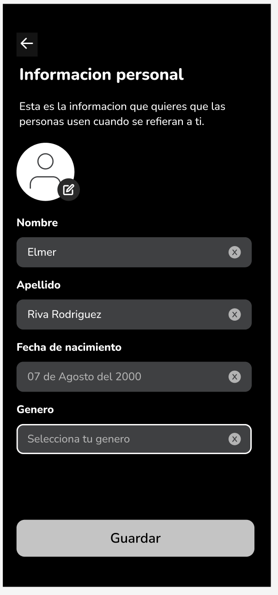

<body>
    <div style="text-align: center; font-weight: bolder">
        <p>Universidad Peruana de Ciencias Aplicadas - Ingeniería de Software - 6 Ciclo</p>
        
        <p>1ACC0238 - Aplicaciones para Dispositivos Móviles</p>
        <p>Docente: Ing. Jorge Luis Mayta Guillermo</p>   
        <p>Informe de Trabajo Final<p>
        <p>Startup: CampusMov</p>
        <p>Producto: UniRide</p>
    </div>
    <div style="text-align: center; display: flex; flex-direction: column; align-items: center">
        <h3 style="font-weight: bolder">Team Members:</h3>
        <table style="width: fit-content">
            <tr>
                <th style="text-align:center;">Estudiante</th>
                <th style="text-align:center;">Código</th>
            </tr>
            <tr>
                <td>Gutiérrez Soto, Jhosepmyr Orlando</td>
                <td>202317638</td>
            </tr>
            <tr>
                <td>Hernández Tuiro, Eric Ernesto</td>
                <td>20221C857</td>
            </tr>
            <tr>
                <td>Riva Rodríguez, Elmer Augusto</td>
                <td>202220829</td>
            </tr><tr>
                <td>Sanchez Montero, Carlos</td>
                <td>202015274</td>
            </tr>
            <tr>
              <td>Morales Quispe, Brayan Smith</td>
              <td>20211f984</td>
            </tr>
            <tr>
              <td>Del Castillo Bueno, Daniel Mateo</td>
              <td>202211212</td>            
            </tr>
        </table>
    </div>
    <p style="text-align: center">Marzo 2025</p>
</body>

<div style="page-break-before: always"></div>

# Registro de Versiones del Informe

| Versión | Fecha      | Autor(es)                  | Contenido cubierto                                                                                        |
|---------|------------|----------------------------|-----------------------------------------------------------------------------------------------------------|
| 1.0.0   | 2025-03-01 | Jhosepmyr Orlando          | Inicio del informe: índice, portada, estructura general del documento.                                    |
| 1.1.0   | 2025-03-02 | Todo el equipo             | Inclusión de los Objetivos SMART individuales de cada integrante.                                         |
| 1.2.0   | 2025-04-03 | Jhosepmyr Orlando, Eric    | Capítulo I completo: Descripción de la Startup y Perfiles del equipo (1.1), Problemática y Lean UX (1.2). |
| 1.3.0   | 2025-04-06 | Jhosepmyr Orlando          | Sección 1.3 completa: Lean UX Assumptions, Hypotheses, Canvas y Segmentos objetivo.                       |
| 1.4.0   | 2025-04-09 | Elmer Riva, Brayan Morales | Capítulo II completo: Análisis competitivo (2.1), Entrevistas (2.2), y Needfinding (2.3).                 |
| 1.5.0   | 2025-04-10 | Carlos, Daniel             | Final de Cap. II: Empathy Mapping, As-Is Mapping y Ubiquitous Language (2.4).                             |
| 1.6.0   | 2025-04-24 | Jhosepmyr, Carlos, Eric    | Capítulo III completo: To-Be Mapping, User Stories, Impact Map y Backlog.                                 |
| 1.6.1   | 2025-04-24 | Elmer Riva                 | Reversión temporal de requirements-specification.                                                         |
| 1.7.0   | 2025-04-24 | Todo el equipo             | Inicio del Capítulo IV: EventStorming, Context Mapping, evidencia ABET S07.                               |
| 2.0.0   | 2025-04-24 | Todo el equipo             | Informe completo hasta el Capítulo IV: Diseño de Software finalizado con tácticas DDD.                    |

<div style="page-break-before: always"></div>

# Project Report Collaboration Insights

En esta sección se documenta la colaboración del equipo en la elaboración del informe, mostrando evidencias gráficas de la actividad en GitHub y su coherencia con el registro de versiones.

* URL del repositorio del Project Report en la organización de GitHub del equipo:
* [https://github.com/CampusMov/Report](https://github.com/CampusMov/Report)

**Figura 1: Contributors** 

Muestra el número de commits por miembro a lo largo del tiempo. 
Por ejemplo, Jhosepmyr realizó 32 commits, Elmer 25, Brayan 16, Carlos 15, Eric 13 y Mateo 12, lo cual refleja una distribución equilibrada de la redacción y revisión del documento.


Ante lo observado, las métricas confirman que **todos** los miembros contribuyeron activamente: redacción de secciones, creación de diagramas, revisiones de contenido y coordinación de entregas. Se recomienda mantener la práctica de PRs y revisiones cruzadas en las siguientes iteraciones para asegurar calidad y trazabilidad.

<div style="page-break-before: always"></div>

# Contenido

<!-- TOC -->
* [Registro de Versiones del Informe](#registro-de-versiones-del-informe)
* [Project Report Collaboration Insights](#project-report-collaboration-insights)
* [Contenido](#contenido)
* [Student Outcome](#student-outcome)
  * [**ABET - EAC - Student Outcome 7**](#abet---eac---student-outcome-7)
* [Objetivos SMART](#objetivos-smart)
* [Capítulo I: Presentación](#capítulo-i-presentación)
  * [1.1. Startup Profile](#11-startup-profile)
    * [1.1.1. Descripción de la Startup](#111-descripción-de-la-startup)
    * [1.1.2. Perfiles de los integrantes del equipo](#112-perfiles-de-los-integrantes-del-equipo)
  * [1.2. Solution Profile](#12-solution-profile)
    * [1.2.1. Antecedentes y problemática](#121-antecedentes-y-problemática)
    * [Contexto del Transporte en Lima y su Impacto en Estudiantes Universitarios](#contexto-del-transporte-en-lima-y-su-impacto-en-estudiantes-universitarios)
    * [Antecedentes](#antecedentes)
    * [Problemática](#problemática)
    * [Análisis 5W2H](#análisis-5w2h)
    * [1.2.2. Lean UX Process](#122-lean-ux-process)
      * [1.2.2.1. Lean UX Problem Statements](#1221-lean-ux-problem-statements)
      * [1.2.2.2. Lean UX Assumptions](#1222-lean-ux-assumptions)
      * [1.2.2.3. Lean UX Hypothesis Statements](#1223-lean-ux-hypothesis-statements)
      * [1.2.2.4. Lean UX Canvas](#1224-lean-ux-canvas)
  * [1.3. Segmentos objetivo](#13-segmentos-objetivo)
    * [*Estudiante conductor*](#estudiante-conductor)
      * [Perfil:](#perfil)
      * [Necesidades:](#necesidades)
    * [*Estudiante pasajero*](#estudiante-pasajero)
      * [Perfil:](#perfil-1)
      * [Necesidades:](#necesidades-1)
* [Capítulo II: Requirements Elicitation & Analysis](#capítulo-ii-requirements-elicitation--analysis)
  * [2.1. Competidores](#21-competidores)
    * [2.1.1. Análisis competitivo](#211-análisis-competitivo)
    * [2.1.2. Estrategias y tácticas frente a competidores](#212-estrategias-y-tácticas-frente-a-competidores)
    * [**Fortalecimiento de la Confianza en la Comunidad Estudiantil**](#fortalecimiento-de-la-confianza-en-la-comunidad-estudiantil)
      * [Estrategia:](#estrategia)
      * [Tácticas:](#tácticas)
    * [**Aprovechamiento de la Rutina Diaria Estudiantil (Fortaleza)**](#aprovechamiento-de-la-rutina-diaria-estudiantil-fortaleza)
      * [Estrategia:](#estrategia-1)
      * [Tácticas:](#tácticas-1)
    * [**Crecimiento a Través de Alianzas Educativas (Oportunidad)**](#crecimiento-a-través-de-alianzas-educativas-oportunidad)
      * [Estrategia:](#estrategia-2)
      * [Tácticas:](#tácticas-2)
    * [**Mitigación del Riesgo de Copia por Grandes Apps (Amenaza)**](#mitigación-del-riesgo-de-copia-por-grandes-apps-amenaza)
      * [Estrategia:](#estrategia-3)
      * [Tácticas:](#tácticas-3)
    * [**Activación Rápida para Generar Masa Crítica (Debilidad)**](#activación-rápida-para-generar-masa-crítica-debilidad)
      * [Estrategia:](#estrategia-4)
      * [Tácticas:](#tácticas-4)
  * [2.2. Entrevistas](#22-entrevistas)
    * [2.2.1. Diseño de entrevistas](#221-diseño-de-entrevistas)
    * [2.2.2. Registro de entrevistas](#222-registro-de-entrevistas)
    * [2.2.3. Análisis de entrevistas](#223-análisis-de-entrevistas)
  * [Segmento Objetivo 1 (Estudiante Conductor):](#segmento-objetivo-1-estudiante-conductor)
    * [Perfil Demografico](#perfil-demografico)
      * [Frustraciones](#frustraciones)
      * [Puntos de interés / Motivadores](#puntos-de-interés--motivadores)
      * [Análisis de insights sobre carpooling en conductores universitarios](#análisis-de-insights-sobre-carpooling-en-conductores-universitarios)
  * [Segmento Objetivo 2 (Estudiante Pasajero):](#segmento-objetivo-2-estudiante-pasajero)
    * [Perfil Demografico](#perfil-demografico-1)
    * [Frustraciones](#frustraciones-1)
    * [Puntos de interés](#puntos-de-interés)
    * [Perfil del pasajero universitario: motivaciones, expectativas y confianza](#perfil-del-pasajero-universitario-motivaciones-expectativas-y-confianza)
  * [2.3. Needfinding](#23-needfinding)
    * [2.3.1. User Personas](#231-user-personas)
    * [2.3.2. User Task Matrix](#232-user-task-matrix)
    * [2.3.3. User Journey Mapping](#233-user-journey-mapping)
    * [2.3.4. Empathy Mapping](#234-empathy-mapping)
    * [2.3.5. As-is Scenario Mapping](#235-as-is-scenario-mapping)
  * [2.4. Ubiquitous Language](#24-ubiquitous-language)
* [Capítulo III: Requirements specification](#capítulo-iii-requirements-specification)
  * [3.1. To-Be Scenario Mapping](#31-to-be-scenario-mapping)
  * [3.2. User Stories](#32-user-stories)
  * [3.3. Impact Mapping](#33-impact-mapping)
  * [3.4. Product Backlog](#34-product-backlog)
* [Capítulo IV: Solution Software Design](#capítulo-iv-solution-software-design)
  * [4.1. Strategic-Level Domain-Driven Design](#41-strategic-level-domain-driven-design)
    * [4.1.1. EventStorming](#411-eventstorming)
      * [4.1.1.1. Candidate Context Discovery](#4111-candidate-context-discovery)
      * [4.1.1.2. Domain Message Flows Modeling](#4112-domain-message-flows-modeling)
      * [4.1.1.3. Bounded Context Canvases](#4113-bounded-context-canvases)
    * [4.1.2. Context Mapping](#412-context-mapping)
    * [4.1.3. Software Architecture](#413-software-architecture)
      * [4.1.3.1. Software Architecture Context Level Diagrams](#4131-software-architecture-context-level-diagrams)
      * [4.1.3.2. Software Architecture Container Level Diagrams](#4132-software-architecture-container-level-diagrams)
      * [4.1.3.3. Software Architecture Deployment Diagrams](#4133-software-architecture-deployment-diagrams)
      * [4.1.3.4 Software Architecture Components Diagrams](#4134-software-architecture-components-diagrams)
  * [4.2. Tactical-Level Domain-Driven Design](#42-tactical-level-domain-driven-design)
    * [4.2.1. Bounded Context: Matching & Routing Management](#421-bounded-context-matching--routing-management)
      * [4.2.1.1. Domain Layer](#4211-domain-layer)
      * [4.2.1.2. Interface Layer](#4212-interface-layer)
      * [4.2.1.3. Application Layer](#4213-application-layer)
      * [4.2.1.4. Infrastructure Layer](#4214-infrastructure-layer)
      * [4.2.1.5. Bounded Context Software Architecture Component Level Diagrams](#4215-bounded-context-software-architecture-component-level-diagrams)
      * [4.2.1.6. Bounded Context Software Architecture Code Level Diagrams](#4216-bounded-context-software-architecture-code-level-diagrams)
        * [4.2.1.6.1. Bounded Context Domain Layer Class Diagrams](#42161-bounded-context-domain-layer-class-diagrams)
        * [4.2.1.6.2. Bounded Context Database Design Diagram](#42162-bounded-context-database-design-diagram)
    * [4.2.2. Bounded Context: Payment & Fees Management](#422-bounded-context-payment--fees-management)
      * [4.2.2.1. Domain Layer](#4221-domain-layer)
      * [4.2.2.2. Interface Layer](#4222-interface-layer)
      * [4.2.2.3. Application Layer](#4223-application-layer)
      * [4.2.2.4. Infrastructure Layer](#4224-infrastructure-layer)
      * [4.2.2.5. Bounded Context Software Architecture Component Level Diagrams](#4225-bounded-context-software-architecture-component-level-diagrams)
      * [4.2.2.6. Bounded Context Software Architecture Code Level Diagrams](#4226-bounded-context-software-architecture-code-level-diagrams)
        * [4.2.2.6.1. Bounded Context Domain Layer Class Diagrams](#42261-bounded-context-domain-layer-class-diagrams)
        * [4.2.2.6.2. Bounded Context Database Design Diagram](#42262-bounded-context-database-design-diagram)
    * [4.2.3. Bounded Context: Profile Management](#423-bounded-context-profile-management)
      * [4.2.3.1. Domain Layer](#4231-domain-layer)
      * [4.2.3.2. Interface Layer](#4232-interface-layer)
      * [4.2.3.3. Application Layer](#4233-application-layer)
      * [4.2.3.4. Infrastructure Layer](#4234-infrastructure-layer)
      * [4.2.3.5. Bounded Context Software Architecture Component Level Diagrams](#4235-bounded-context-software-architecture-component-level-diagrams)
      * [4.2.3.6. Bounded Context Software Architecture Code Level Diagrams](#4236-bounded-context-software-architecture-code-level-diagrams)
        * [4.2.3.6.1. Bounded Context Domain Layer Class Diagrams](#42361-bounded-context-domain-layer-class-diagrams)
        * [4.2.3.6.2. Bounded Context Database Design Diagram](#42362-bounded-context-database-design-diagram)
    * [4.2.4. Bounded Context: IAM](#424-bounded-context-iam)
      * [4.2.4.1. Domain Layer](#4241-domain-layer)
      * [4.2.4.2. Interface Layer](#4242-interface-layer)
      * [4.2.4.3. Application Layer](#4243-application-layer)
      * [4.2.4.4. Infrastructure](#4244-infrastructure-)
      * [4.2.4.5. Bounded Context Software Architecture Component Level Diagrams](#4245-bounded-context-software-architecture-component-level-diagrams)
      * [4.2.4.6. Bounded Context Software Architecture Code Level Diagrams](#4246-bounded-context-software-architecture-code-level-diagrams)
        * [4.2.4.6.1. Bounded Context Domain Layer Class Diagrams](#42461-bounded-context-domain-layer-class-diagrams)
        * [4.2.4.6.2. Bounded Context Database Design Diagram](#42462-bounded-context-database-design-diagram)
    * [4.2.5. Bounded Context: Reputation & Incentives Management](#425-bounded-context-reputation--incentives-management)
      * [4.2.5.1. Domain Layer](#4251-domain-layer)
      * [4.2.5.2. Interface Layer](#4252-interface-layer)
      * [4.2.5.3. Application Layer](#4253-application-layer)
      * [4.2.5.4. Infrastructure Layer](#4254-infrastructure-layer)
      * [4.2.5.5. Bounded Context Software Architecture Component Level Diagrams](#4255-bounded-context-software-architecture-component-level-diagrams)
      * [4.2.5.6. Bounded Context Software Architecture Code Level Diagrams](#4256-bounded-context-software-architecture-code-level-diagrams)
        * [4.2.5.6.1. Bounded Context Domain Layer Class Diagrams](#42561-bounded-context-domain-layer-class-diagrams)
        * [4.2.5.6.2. Bounded Context Database Design Diagram](#42562-bounded-context-database-design-diagram)
    * [4.2.6. Bounded Context: In Trip Communication Management](#426-bounded-context-in-trip-communication-management)
      * [4.2.6.1. Domain Layer](#4261-domain-layer)
      * [4.2.6.2. Interface Layer](#4262-interface-layer)
      * [4.2.6.3. Application Layer](#4263-application-layer)
      * [4.2.6.4. Infrastructure Layer](#4264-infrastructure-layer)
      * [4.2.6.5. Bounded Context Software Architecture Component Level Diagrams](#4265-bounded-context-software-architecture-component-level-diagrams)
      * [4.2.6.6. Bounded Context Software Architecture Code Level Diagrams](#4266-bounded-context-software-architecture-code-level-diagrams)
        * [4.2.6.6.1. Bounded Context Domain Layer Class Diagrams](#42661-bounded-context-domain-layer-class-diagrams)
        * [4.2.6.6.2. Bounded Context Database Design Diagram](#42662-bounded-context-database-design-diagram)
    * [4.2.7. Bounded Context: Analytics Management](#427-bounded-context-analytics-management)
      * [4.2.7.1. Domain Layer](#4271-domain-layer)
      * [4.2.7.2. Interface Layer](#4272-interface-layer)
      * [4.2.7.3. Application Layer](#4273-application-layer)
      * [4.2.7.4. Infrastructure Layer](#4274-infrastructure-layer)
      * [4.2.7.5. Bounded Context Software Architecture Component Level Diagrams](#4275-bounded-context-software-architecture-component-level-diagrams)
      * [4.2.7.6. Bounded Context Software Architecture Code Level Diagrams](#4276-bounded-context-software-architecture-code-level-diagrams)
        * [4.2.7.6.1. Bounded Context Domain Layer Class Diagrams](#42761-bounded-context-domain-layer-class-diagrams)
        * [4.2.7.6.2. Bounded Context Database Design Diagram](#42762-bounded-context-database-design-diagram)
    * [4.2.8. Bounded Context: Communication Management](#428-bounded-context-communication-management)
      * [4.2.8.1. Domain Layer](#4281-domain-layer)
      * [4.2.8.2. Interface Layer](#4282-interface-layer)
      * [4.2.8.3. Application Layer](#4283-application-layer)
      * [4.2.8.4. Infrastructure Layer](#4284-infrastructure-layer)
      * [4.2.8.5. Bounded Context Software Architecture Component Level Diagrams](#4285-bounded-context-software-architecture-component-level-diagrams)
      * [4.2.8.6. Bounded Context Software Architecture Code Level Diagrams](#4286-bounded-context-software-architecture-code-level-diagrams)
        * [4.2.8.6.1. Bounded Context Domain Layer Class Diagrams](#42861-bounded-context-domain-layer-class-diagrams)
        * [4.2.8.6.2. Bounded Context Database Design Diagram](#42862-bounded-context-database-design-diagram)
* [Conclusiones](#conclusiones)
* [Bibliografía](#bibliografía)
* [Anexos](#anexos)
<!-- TOC -->

<div style="page-break-before: always"></div>

# Student Outcome

El curso contribuye al cumplimiento del Student Outcome ABET:

## **ABET - EAC - Student Outcome 7**

* Criterio: La capacidad de adquirir y aplicar nuevos conocimientos según sea necesario, utilizando estrategias de aprendizaje apropiadas.

En el siguiente cuadro se describe las acciones realizadas y enunciados de conclusiones por parte del grupo, que permiten sustentar el haber alcanzado el logro del ABET – EAC - Student Outcome 7.

| Criterio específico                                                                                                                     | Acciones realizadas                                                                                                                                                                                                                                                                                                                                                                                                                                                                                                                                                                                                                                                                                                                                                                                                                                                                                                                                                                                                                                                                                                                                                                                                                                                                                    | Conclusiones                                                                                                                                                                                                                                                                                                                                                                                                                                                                                    |
|-----------------------------------------------------------------------------------------------------------------------------------------|--------------------------------------------------------------------------------------------------------------------------------------------------------------------------------------------------------------------------------------------------------------------------------------------------------------------------------------------------------------------------------------------------------------------------------------------------------------------------------------------------------------------------------------------------------------------------------------------------------------------------------------------------------------------------------------------------------------------------------------------------------------------------------------------------------------------------------------------------------------------------------------------------------------------------------------------------------------------------------------------------------------------------------------------------------------------------------------------------------------------------------------------------------------------------------------------------------------------------------------------------------------------------------------------------------|-------------------------------------------------------------------------------------------------------------------------------------------------------------------------------------------------------------------------------------------------------------------------------------------------------------------------------------------------------------------------------------------------------------------------------------------------------------------------------------------------|
| Actualiza conceptos y conocimientos necesarios para su desarrollo profesional y en especial para su proyecto en soluciones de software. | <div> Daniel del Castillo <p>TB1: Para esta entrega dediqué un par de horas de mi vida en procesar el cambio a clean architecture. Un buen ingeniero no se dedica enteramente a aplicar un único estilo de arquitectura.</p></div> <div> Carlos Sánchez <p>TB1: En esta entrega tuve un primer acercamiento a Kotlin, lo cual me ayudó a entender la estructura base de la aplicación.</p></div> <div> Elmer Riva <p>TB1: Investigué y apliqué patrones tácticos de DDD para el diseño del Domain Layer, además reforcé conceptos de arquitectura hexagonal como parte del diseño de bounded contexts.</p></div> <div> Jhosepmyr Gutiérrez <p>TB1: Consolidé conocimientos en EventStorming y Context Mapping, y lideré el modelado de flujos de mensajes y relaciones entre bounded contexts.</p></div> <div> Erick Hernández <p>TB1: Aprendí sobre Impact Mapping y su conexión con las User Stories, integrándolo en la especificación de requerimientos y en el diseño de la solución basada en objetivos.</p></div> <div> Brayan Morales <p>TB1: Exploré cómo adaptar patrones de arquitectura limpia en sistemas modulares, revisando componentes frontend en Angular y su integración con la lógica de dominio.</p></div>                                                                       | <p>TB1: El aprendizaje permanente y la actualización sistemática de conocimientos constituyen un ciclo virtuoso que impacta directamente en la calidad de nuestras soluciones. Al compartir experiencias —desde cursos hasta mejoras en CI/CD— convertimos los logros individuales en capital intelectual colectivo. Esto nos permite reducir el lead time, elevar la resiliencia de las aplicaciones y mantener la competitividad frente a la rápida evolución del ecosistema de software.</p> |
| Reconoce la necesidad del aprendizaje permanente para el desempeño profesional y el desarrollo de proyectos en soluciones de software.  | <div> Daniel del Castillo <p>TB1: Durante la última semana estuve empapándome del tema de clean architecture; dicha arquitectura es mucho más aplicable a tecnologías móviles.</p></div> <div> Carlos Sánchez <p>TB1: En este proyecto me di cuenta de que siempre debes estar actualizado con las últimas herramientas, pues te harán el trabajo mucho más llevadero.</p></div> <div> Elmer Riva <p>TB1: Me enfoqué en dominar los principios de integración frontend-backend mediante APIs RESTful, reconociendo que el aprendizaje técnico constante es vital para mantener la calidad en un entorno cambiante.</p></div> <div> Jhosepmyr Gutiérrez <p>TB1: Reafirmé la importancia del aprendizaje autodirigido al profundizar en técnicas de modelado estratégico. Esta capacidad fue clave para estructurar nuestra solución desde lo conceptual.</p></div> <div> Erick Hernández <p>TB1: El proceso de aprendizaje sobre metodologías de descubrimiento de necesidades (Needfinding, Mapping) me permitió alinear diseño y requerimientos desde el usuario.</p></div> <div> Brayan Morales <p>TB1: Entendí que el dominio de tecnologías frontend requiere actualización continua; por eso trabajé con Vite y Vue de forma autodidacta para garantizar un prototipo fluido y moderno.</p></div> | <p>TB1: Como equipo coincidimos en que el aprendizaje permanente no es un complemento, sino un pilar estratégico para la innovación. Al compartir cursos, meetups y prototipos en sesiones retro, convertimos el conocimiento individual en ventaja colectiva. Este ciclo de actualización constante fortalece nuestra capacidad para entregar software de mayor calidad, reducir riesgos técnicos y mantenernos competitivos en un entorno que evoluciona rápidamente.</p>                     |
<div style="page-break-before: always"></div>

# Objetivos SMART

En el siguiente cuadro se presentan los objetivos SMART de cada integrante del equipo ; donde cada objetivo debe ser específico, medible, alcanzable, relevante y con un tiempo definido.

| Estudiante                        | Objetivos                                                                                                                                                                                                                                                                                                                                                                                                                                                                                                                                                                                                                                                                                                                                                                                                                                                                                                                                                                                                                                                      |
|-----------------------------------|----------------------------------------------------------------------------------------------------------------------------------------------------------------------------------------------------------------------------------------------------------------------------------------------------------------------------------------------------------------------------------------------------------------------------------------------------------------------------------------------------------------------------------------------------------------------------------------------------------------------------------------------------------------------------------------------------------------------------------------------------------------------------------------------------------------------------------------------------------------------------------------------------------------------------------------------------------------------------------------------------------------------------------------------------------------|
| Gutiérrez Soto, Jhosepmyr Orlando | <p> **Objetivo 1**: Obtener la certificación oficial AWS Certified Solutions Architect – Associate en un plazo máximo de 6 meses después de graduarme, dedicando al menos 7 horas semanales a estudios avanzados mediante plataformas especializadas (como A Cloud Guru, Pluralsight o AWS Skill Builder), con el fin de consolidar mis conocimientos en arquitecturas escalables y seguras en la nube, y posicionarme como candidato fuerte para roles técnicos en empresas medianas o grandes que trabajen con infraestructura cloud. </p>  <p> **Objetivo 2**: Obtener una posición como Desarrollador Backend en una empresa internacional de tecnología, dentro de los primeros 9 meses posteriores a mi graduación, aplicando a al menos 7 ofertas semanales, mejorando continuamente mi portafolio con 3 proyectos open-source utilizando Java, Spring Boot, PostgreSQL y AWS, y participando en comunidades técnicas (como Meetup, Dev.to o GitHub Discussions) para aumentar mi visibilidad profesional y networking con desarrolladores senior. </p> |
| Riva Rodriguez, Elmer Augusto     | <p> **Objetivo 1**: Conseguir un puesto como Desarrollador Backend en una empresa de tecnología en un plazo máximo de 6 meses después de mi graduación. Para ello, mejoraré mi portafolio con al menos 3 proyectos avanzados utilizando Java y Spring Boot, mantendré un ritmo de 5 aplicaciones semanales a ofertas laborales y expandiré mi red de contactos asistiendo a eventos tecnológicos </p> <p> **Objetivo 2**: Iniciar una maestría en Inteligencia Artificial dentro de los 12 meses posteriores a mi graduación. Para ello, investigaré a cerca de al menos 3 universidades o programas en línea, completando las solicitudes necesarias, a la vez de dedicar al menos 3 horas semanales a la preparación de documentos. </p>                                                                                                                                                                                                                                                                                                                     | 
| Brayan Smith Morales Quispe       | <p> **Objetivo 1**: Desarrollarme como freelance en el desarrollo Frontend usando tecnologias como Angular ya sea con modulos o componentes standalone, vue usando vite, desplegandolas en servicios cloud. Todo esto sera mostrado con mejora continua en mi portafolio.</p>  <p> **Objetivo 2**: Obtener certificaciones en Azure en un plazo de 6 meses dedicando 3 horas al dia en la plataforma de aprendizaje de microsoft, todo con el fin de mejorar mi perfil profesional y conocimientos en el campo de manejo de estas tecnologias.  </p>                                                                                                                                                                                                                                                                                                                                                                                                                                                                                                           |
| Del Castillo Bueno, Daniel Mateo  | <p>**Objetivo 1:** Conseguir un puesto como arquitecto de software junior en una empresa desarrolladora de software luego de mi titulación. Para cumplir este objetivo voy a investigar los requisitos para el puesto y haré 3 cursos o bootcamps adicionales en arquitectura de software  </p> <p> **Objetivo 2:** Postular a una beca para estudiar una maestría en Arquitectura de Software luego de 2 años de experiencia laboral mencionada en el objetivo anterior. Para ello voy a postular a Fullbright en estados unidos o DAAD para alemania</p>                                                                                                                                                                                                                                                                                                                                                                                                                                                                                                     |
| Sanchez Montero, Carlos           | <p>**Objetivo 1:** Obtener una posición como Desarrollador Full Stack en una startup tecnológica antes de que transcurran 8 meses desde mi titulación, aplicando a al menos 6 ofertas semanales y fortaleciendo mi portafolio con 2 proyectos completos (uno personal y uno colaborativo) usando tecnologías como Vue.js, Node.js, y MongoDB, incluyendo despliegue en servicios cloud como Firebase o Vercel, con el fin de consolidar mis habilidades en desarrollo de aplicaciones modernas y demostrar experiencia práctica.  </p> <p> **Objetivo 2:** Obtener la certificación oficial “Google Associate Cloud Engineer” dentro de los próximos 5 meses, dedicando 5 horas semanales al estudio mediante la plataforma de Google Cloud Skills Boost y material complementario (como Coursera o Udemy), con el propósito de ampliar mis conocimientos en infraestructura cloud y aumentar mis oportunidades laborales en empresas que utilizan servicios en GCP.</p>                                                                                       | 
| Hernandez Tuiro, Eric Ernesto     | <p> **Objetivo 1**: Conseguir un puesto de trabajo como desarrollador de Backend en un empresa nacional de tecnología un año después de graduarse. Para lograrlo desarrollé varios proyectos pequeños freelancers para añadir a mi portafolio profesional y convencer que las empresas se interesen en mí. </p> <p> **Objetivo 2**: Aumentar mi empleabilidad y fortalecer mi perfil profesional como ingeniero de software en 10 meses. Para lograrlo obtendré dos certificaciones en metodologías ágiles (Scrum y Kanban) y participaré en al menos 3 eventos de desarrollo colaborativo para mejorar mis habilidades de trabajo en equipo, aprendizaje continuo y resolución de problemas en tiempo real. </p>                                                                                                                                                                                                                                                                                                                                              |

<div style="page-break-before: always"></div>

# Capítulo I: Presentación

## 1.1. Startup Profile

### 1.1.1. Descripción de la Startup

CampusMov es una startup creada por estudiantes de la carrera de Ingeniería de Software. Nuestro objetivo es mejorar y optimizar la movilización de alumnos universitarios mediante la creación de software. 

**Misión**  

Desarrollar soluciones tecnológicas innovadoras que mejoren la experiencia de movilidad de los estudiantes universitarios, reduciendo el impacto del tráfico en su vida diaria y facilitando desplazamientos más eficientes, conectados y sostenibles dentro del entorno urbano.

**Visión** 

Llegar a los universitarios de todo el país para mejorar su movilidad en ciudades con alto tráfico y ser reconocida como una empresa importante en el tráfico urbano en 5 años.

### 1.1.2. Perfiles de los integrantes del equipo

| Foto del participante                               | Nombres y apellidos              | Código de estudiante   | Carrera                | Conocimientos técnicos y habilidades                                                                                                                               |
|-----------------------------------------------------|----------------------------------|------------------------|------------------------|--------------------------------------------------------------------------------------------------------------------------------------------------------------------|
|          | Eric Ernesto Hernández Tuiro     | 20221C857              | Ingeniería de Software | Conocimientos en Java, C++, C#, Python, SQL, Angular, Vue.js, React y ASP .Net Core.                                                                               |
|          | Elmer Augusto Riva Rodríguez     | 202220829              | Ingeniería de Software | Conocimientos en Angular, Vue, React, ASP .Net Core, Spring Boot y desarrollo de APIs RESTful. Experiencia en integración frontend-backend y metodologías ágiles.  | 
|  | Jhosepmyr Orlando Gutiérrez Soto | 202317638              | Ingeniería de Software | Conocimientos en Micro servicios, Spring boot, ASP .NetCore, Angular, Vue.js, DDD, TDD, BDD, GitOps, Git Actions, Docker, Kubernetes y Google Kubernetes Engine.   | 
|        | Brayan Smith Morales Quispe      | 20211f984              | Ingeniería de Software | Conocimientos en javascript, phaser, sql, java, c++, c#, Angular, Vite y Vue.                                                                                      | 
|          | Daniel Mateo del Castillo Bueno  | 202211212              | Ingeniería de Software | Conocimientos en Angular, vue, React, ASP .Net Core, SpringBoot y Flask.                                                                                           | 
|        | Carlos Sanchez Montero           | 202015274              | Ingeniería de Software | Conocimientos en JavaScript, Python, C++, Java, C#, Angular, Vue, SQL.                                                                                             | 

## 1.2. Solution Profile

### 1.2.1. Antecedentes y problemática

### Contexto del Transporte en Lima y su Impacto en Estudiantes Universitarios

En Lima, una de las ciudades más congestionadas del mundo, el tráfico vehicular representa un desafío crítico para la vida diaria de sus habitantes. Este problema afecta de manera significativa a los estudiantes universitarios, quienes, a menudo, no tienen acceso a vehículos privados y dependen del transporte público o soluciones informales para movilizarse, lo que conlleva a un aumento en los tiempos de traslado, un mayor gasto económico y altos niveles de estrés.

---

### Antecedentes

Lima enfrenta una grave congestión vehicular que afecta directamente la productividad, la calidad de vida de sus habitantes y la sostenibilidad ambiental. Según el Banco Central de Reserva del Perú (2023), la congestión vehicular le cuesta a la economía nacional aproximadamente **S/ 23.300 millones anuales**, lo que representa el 2,4% del Producto Bruto Interno (PBI) del país. Esta cifra refleja el costo directo del tráfico, pero también destaca cómo la congestión interrumpe la eficiencia de los sistemas de transporte, especialmente en un contexto urbano desorganizado.

Aparte de la congestión, uno de los factores más críticos que motivan la adopción de un sistema de carpool entre los estudiantes universitarios es el alto costo económico del transporte. La Asociación Automotriz del Perú (AAP, 2023) estima que cada peruano propietario de un vehículo gasta, en promedio, **S/ 2.368 anuales en combustible**, de los cuales **S/ 652** corresponden al tiempo perdido en el tráfico. Este gasto adicional tiene un impacto significativo en los estudiantes, quienes generalmente carecen de los recursos financieros para sostener el uso diario de un vehículo particular. Para estos estudiantes, el carpool representa una solución directa para compartir costos, reduciendo así el gasto mensual en transporte.

El impacto ambiental también es un factor clave que justifica la necesidad de soluciones como el carpool. Según la Autoridad de Transporte Urbano (ATU, 2023), la flota vehicular es responsable del **58% de las emisiones de material particulado en Lima Metropolitana**, lo que no solo contribuye a la contaminación del aire, sino que afecta la salud pública.

Además, la seguridad vial es otra preocupación importante. La Policía Nacional del Perú (2023) reporta que la falta de orden y la conducción imprudente en Lima han contribuido al aumento de accidentes de tránsito. El uso de vehículos compartidos entre estudiantes no solo puede reducir la cantidad de autos en circulación, sino también contribuir a un tráfico más ordenado y seguro.

La inseguridad en las calles de Lima, especialmente durante las horas tempranas y nocturnas, es una preocupación creciente para los estudiantes universitarios. La PUCP (2024) destaca que los estudiantes enfrentan altos riesgos durante sus desplazamientos debido a la escasez de transporte público eficiente y la alta criminalidad. En el periodo julio-agosto de 2023, Lima Metropolitana registró **39,479 denuncias por delitos**, representando el 35.6% del total nacional. En este contexto, el uso de un sistema de carpool universitario se presenta como una alternativa que no solo reduce costos y emisiones, sino que también ofrece una mayor seguridad.

---

### Problemática

El sistema de transporte público ineficiente, la falta de planificación urbana y el uso excesivo de vehículos privados agravan esta situación. Los estudiantes, especialmente aquellos sin acceso a vehículos privados, se ven obligados a recurrir a taxis informales, buses sin horarios fijos o caminar largas distancias, lo que genera un aumento en los costos, el estrés y la fatiga. Esta situación también afecta su rendimiento académico, ya que el tiempo perdido en traslados reduce las horas de estudio, como lo indica el Ministerio de Educación del Perú.

---

### Análisis 5W2H

- **WHAT (Qué)**  
  Lima enfrenta una de las peores congestiones vehiculares a nivel mundial, lo que causa pérdidas de tiempo, afecta la calidad de vida y limita el acceso a servicios esenciales como la educación.

- **WHEN (Cuándo)**  
  Las consecuencias se manifiestan constantemente, especialmente durante las horas pico.

- **WHERE (Dónde)**  
  En Lima Metropolitana, particularmente en avenidas como Av. Javier Prado, Av. Paseo de la República y Av. Universitaria.

- **WHO (Quién)**  
  Los estudiantes universitarios, especialmente aquellos sin acceso a vehículos privados.

- **WHY (Por qué)**  
  Debido a un sistema de transporte público deficiente, una planificación urbana inadecuada y alta dependencia de vehículos privados.

- **HOW (Cómo)**  
  El tráfico incrementa los costos de transporte (S/ 2,368 anuales por combustible). Para los estudiantes, este gasto es insostenible, obligándolos a optar por medios informales o caminar largas distancias (TomTom, 2023; Trading Economics, 2023).

- **HOW MUCH (Cuánto)**  
  Según la PUCP (2024), muchos estudiantes deben recorrer hasta dos horas para llegar a sus universidades, lo que afecta su descanso y rendimiento académico. Además, el 30% de los limeños tarda más de una hora en llegar a su destino.


### 1.2.2. Lean UX Process

Se describe en los siguientes apartados el proceso de Lean UX que se ha seguido para la solución propuesta.

#### 1.2.2.1. Lean UX Problem Statements

El estado actual de **la movilidad de estudiantes universitarios en Lima** se ha centrado principalmente en **el uso individual de autos, transporte público congestionado y servicios de taxi costosos.**

Lo que los productos/servicios existentes no logran abordar es **la falta de una solución específica para coordinar viajes compartidos dentro de comunidades universitarias, lo que genera altos costos personales, tiempos de traslado excesivos y contribuye al tráfico urbano.**

Nuestro producto/servicio abordará esta brecha mediante **una plataforma que permita a estudiantes universitarios coordinar viajes compartidos seguros y confiables según sus rutas, horarios y preferencias.**

Nuestro enfoque inicial serán **estudiantes de universidades privadas con horarios definidos y largas distancias de traslado, empezando por Lima Metropolitana.**

Sabremos que hemos tenido éxito cuando veamos **una reducción promedio del 30% en costos de traslado por estudiante, un 25% de incremento en la ocupación vehicular y un aumento mensual en la retención de usuarios activos del 50%.**

#### 1.2.2.2. Lean UX Assumptions

Se han definido las siguientes suposiciones para el desarrollo de la solución:

**Users**

Se describe los siguientes perfiles de usuarios mediante Proto-Personas:

* **Valeria** - **La Estudiante Madrugadora**
  * **Role**: Estudiante Universitaria Pasajera
  * **Datos Relevantes**:
    * Vive en Surquillo, estudia en Monterrico.
    * Sale a la U a las 6:00 am.
    * Gasta S/ 10 diarios en transporte público.
    * Gasta 1h50 en transporte público.
    * Usa Android, Google Maps, Youtube y Yape.
  * **Objetivos y necesidades**:
    * Llegar puntual a clases sin gastar demasiado.
    * Viajar más tranquila y segura en la mañana.
    * Evitar el estrés del transporte público.
    * Reducir su tiempo promedio de viaje (actualmente 1h50).
    * Ahorrar al menos S/50 mensuales.
  * **Obstáculos**:
    * No tiene rutas claras de quiénes van cerca.
    * No se atreve a coordinar con desconocidos.
    * El transporte público es impredecible en tiempos y seguridad.
    * No tiene claridad para compensar al conductor de forma segura y confiable, ni sabe cómo confirmar que el viaje se completó
    * Teme que el conductor cancele o no cumpla el viaje acordado

* **Diego** - **El Conductor Buena Onda**
  * **Role**: Estudiante Universitario Conductor
  * **Datos Relevantes**:
    * Vive en San Isidro, maneja su auto al campus universitario de la UPC en Monterrico.
    * Sale a la U a las 6:30 am.
    * Gasta S/ 20 diarios en combustible.
    * Gasta 30 minutos en el tráfico.
    * Usa iPhone, Waze, Spotify y Yape.
  * **Objetivos y necesidades**:
    * Optimizar sus gastos en gasolina.
    * Aprovechar los asientos vacíos de su carro.
    * Ahorrar al menos S/100 mensuales.
  * **Obstáculos**:
    * No tiene claro cómo coordinar con otros estudiantes.
    * No sabe si los pasajeros serán puntuales.
    * No confía en la seguridad de compartir su auto.
    * No tiene un método integrado para cobrar a los pasajeros ni visualizar de manera clara cuánto está ahorrando por viaje.

**Business Outcomes**

Usando el User Journey Type - Pirate Metrics, se han definido los siguientes objetivos de negocio:

* **Acquisition**:
  * Lograr que entre el 15% y 25% de los visitantes se registren en la plataforma.
  * Asegurar que al menos el 60% completen su perfil con zona, horario y rol.
* **Activation**: 
  * Conseguir que entre el 40% y 60% de los nuevos usuarios conductores realicen su primer viaje dentro del primer mes.
  * Lograr que entre el 50% y 70% de usuarios pasajeros se unan a un grupo de carpool.
* **Retention**: 
  * Mantener una retención semanal entre el 50% y 60% de los usuarios activos.
  * Alcanzar una retención mensual sostenida entre el 30% y 40%.
* **Revenue**: 
  * Lograr que entre el 40% y 50% de los viajes generen comisión efectiva.
  * Alcanzar un ingreso promedio mensual por conductor activo entre S/8 y S/12 en la etapa inicial.
* **Referral**: 
  * Incentivar que entre el 15% y 25% de los usuarios inviten a nuevos compañeros
  * Lograr que entre el 10% y 15% de esos referidos se conviertan en usuarios activos.

**User Outcomes & Benefits**

* **Estudiante Universitaria Pasajera**
  * Funcional: Reducir su tiempo de viaje y el costo mensual de transporte.
  * Emocional: Sentirse segura, acompañada y tranquila en sus traslados matutinos. 
  * Aspiracional: Sentirse en control de su rutina diaria y más enfocada en su desarrollo académico.

* **Estudiante Universitario Conductor**
  * Funcional: Disminuir su gasto mensual en combustible y evita desvíos innecesarios.
  * Emocional: Sentirse valorado, seguro y en control al compartir su auto con confianza. 
  * Aspiracional: Posicionarse como alguien práctico, solidario y que cuida su economía sin sacrificar comodidad.

**Solutions**

Acorde a los problemas y necesidades de los usuarios, se han definido las siguientes soluciones:

* **Estudiante Universitaria Pasajera**
  * Problema 1: No tiene rutas claras de quiénes van cerca
    * Algoritmo de coincidencia de rutas y horarios. 
    * Filtro por facultad/zona para mostrar solo estudiantes de trayectos similares. 
    * Mapa interactivo en tiempo real de conductores que estén pasando cerca si aun no se unió a un grupo preformado.
  * Problema 2: No se atreve a coordinar con desconocidos
    * Sistema de calificaciones y comentarios por viaje.
    * Validación con correo institucional y perfil completo con foto y facultad.
    * Chat interno con opción de ver perfiles antes de unirse al grupo.
  * Problema 3: El transporte público es impredecible en tiempos y seguridad
    * Seguimiento en tiempo real del viaje.
    * Botón de emergencia con ubicación compartida.
    * Notificaciones automáticas: “Tu conductor está en camino” o “Viaje confirmado”.
  * Problema 4: No tiene claridad para compensar al conductor ni confirmar viaje
    * Integración con Yape u otro método de pago para aportar el costo compartido.
    * Confirmación automática de viaje completado para que tanto conductor como pasajera validen la transacción.
    * Resumen de aportes realizados por semana o mes para controlar sus gastos.
    * Ofrecer un precio sugerido basado en la distancia y el combustible, con posibilidad de ajuste por parte del conductor, pero con un tope para no desincentivar a los pasajeros.
    * Panel de gastos para el pasajero que muestra resumen de aportes realizados por semana o mes para controlar sus gastos.
  * Problema 5: Teme que el conductor cancele o no cumpla el viaje acordado
    * Penalizaciones para los conductores que no cumplan con el viaje acordado o cancelen sin previo aviso.
    * Chat interno para coordinar cambios de último momento y reducir cancelaciones sorpresivas.

* **Estudiante Universitario Conductor**
  * Problema 1: No tiene claro cómo coordinar con otros estudiantes
    * Panel con sugerencias de pasajeros compatibles
    * Calendario semanal para agendar viajes con un solo clic.
    * Historial de viajes con opción de invitar a los mismos pasajeros.
    * Grupos preformados y búsqueda individual para sincronizar horarios con mayor anticipación.
  * Problema 2: No sabe si los pasajeros serán puntuales
    * Reputación visible: puntualidad y asistencia previa.
    * Notificaciones automáticas a pasajeros: “Tu conductor sale en 10 minutos”.
    * Penalización/reporte por inasistencia o retraso frecuente.
    * Comunicación post-viaje para calificar la puntualidad del pasajero.
  * Problema 3: No confía en la seguridad de compartir su auto
    * Configuración de privacidad: solo permitir pasajeros verificados o conocidos.
    * Información visible del perfil del pasajero (foto, carrera, historial).
    * Botón de bloqueo/reportar usuario desde el grupo de carpool.
  * Problema 4: No tiene un método integrado para cobrar a los pasajeros ni visualizar sus ahorros
    * Integración con Yape para solicitar aportes directamente desde la app.
    * Confirmación de viaje completado que registre automáticamente la contribución de cada pasajero.
    * Panel o dashboard que muestre cuántos viajes ha hecho, cuánta gasolina ha compensado y su comisión acumulada.
    * Manejo de la comisión: se define un porcentaje (por ejemplo, 10%) que la plataforma retiene. Puede ser cobro quincenal o mensual al conductor, o retención inmediata.
    * Mostrar cuántos pasajeros va llevando y cuánto ahorra con 1, 2 o 3 pasajeros, incentivando así llenar el carro.
    * Bonus por carro lleno: si hay 3 (o más) pasajeros confirmados, el conductor recibe un pequeño incentivo adicional que sale de la comisión recaudada.

* **Soluciones transversales**
  * Sistema de referidos y recompensas:
    *  Ganar puntos o descuentos al invitar amigos, mayor probabilidad de coincidir con gente confiable.
    *  Distintivos (badges) por cantidad de viajes compartidos, calificaciones positivas o referencias exitosas.
  * Gamificación:
    * Otorgar insignias o niveles (Bronce, Plata, Oro) dependiendo del número de viajes, buena reputación y puntualidad.
  * Penalizaciones y reputación:
    * Reglas claras en caso de cancelaciones de último minuto, no pagos, retrasos frecuentes, etc. 
    * Comunicación post-viaje para recopilar feedback rápido sobre puntualidad y comodidad.

* **Riesgos**

De ese modo, los riesgos son eventos inciertos que pueden afectar el éxito del proyecto. 
Ante ello, se han identificado los siguientes riesgos por cada hipótesis:

  * H1:
    * Deseabilidad y confianza:
      * Es posible que las pasajeras sigan sin confiar en “desconocidos” aunque sean estudiantes; la validación institucional puede no ser suficiente para romper barreras culturales.
      * El chat y las calificaciones podrían no bastar para generar la seguridad esperada (p. ej. necesitan ver reseñas de viajes reales, fotos, etc.).
      
  * H2:
    * Viabilidad económica:
      * El ahorro del 30% podría no ser real si la tarifa propuesta (o el aporte al conductor) termina siendo igual o mayor que el transporte público debido a comisiones o altos costos de gasolina.
    * Disponibilidad de conductores:
      * El factor más fuerte en reducir costos es encontrar conductores suficientes. Sin masa crítica de conductores, la oferta será limitada y tal vez no se logre el ahorro deseado.
  
  * H3:
    * Complejidad de penalizaciones:
      * Implementar y gestionar correctamente un sistema de penalizaciones puede ser conflictivo; si es muy severo, los usuarios se van, si es muy laxo, pierde eficacia.

  * H4:
    * Evasión de la plataforma:
      * Conductor y pasajero podrían acordar pagar en efectivo o por otro medio fuera de la app, evitando la comisión.
    * Integración técnica con Yape:
      * El desarrollo y la coordinación con el servicio de pago podría presentar problemas o limitaciones.

  * H5:
    * Deseabilidad:
      * Diego podría no encontrar suficiente valor en la plataforma para organizar sus viajes; tal vez use canales informales (WhatsApp, Facebook).
      * No haya suficientes pasajeros interesados en la misma ruta/horario, lo cual desincentive a Diego a hacer su primer viaje.
    * Factibilidad técnica:
      * Implementar el “panel de sugerencias” y el “calendario semanal” puede requerir un algoritmo de coincidencia robusto, y podría ser más complejo de lo previsto.
    * Viabilidad de negocio:
      * Incluso si se ofrece la herramienta de coordinación, ¿la tasa de adopción será la suficiente para sostener la plataforma en el primer mes?

  * H6:
    * Exactitud de los cálculos:
      * La estimación de ahorro de S/8–12 podría no ser realista si la app no logra captar la cantidad de viajes o pasajeros necesarios.
    * Volumen de pasajeros y viajes:
      * La plataforma podría no captar suficientes pasajeros o viajes para que Diego vea un ahorro significativo en gasolina.
     
  * H7:
    * Atracción del incentivo:
      * La recompensa puede no ser suficiente para motivar a la gente a invitar amigos.
    * Visibilidad y usabilidad del programa:
      * Si el programa de referidos no está bien integrado en la app, pocos lo usarán.

  * H8:
    * Onboarding efectivo:
      * El proceso inicial podría ser confuso, largo o poco atractivo, generando abandono temprano.
    * Disponibilidad real de grupos o viajes:
      * Si la persona se registra, pero no ve ningún viaje o grupo al que unirse, simplemente no se activa.
    * Expectativas incumplidas:
      * El usuario podría llegar con altas expectativas tras ser invitado, pero la oferta de rutas o la experiencia no cumple sus necesidades, y se da de baja rápido.
     
* **Experimentos**

Para validar las hipótesis, se han diseñado experimentos que permitan obtener datos concretos sobre la aceptación de la solución propuesta. 
A continuación, se describen los experimentos y las métricas asociadas a cada hipótesis:

  * H1: 
    * Experimento: El equipo realizará breves entrevistas con pasajeras, mostrando un wireframe de validación institucional, calificaciones y chat. Al final, se aplicará una mini encuesta sobre cuán seguras se sienten.
    * Métrica: Se apunta a que entre el 50% y 70% indiquen que sí se unirían a un carpool tras ver esa verificación.
  * H2:
    * Experimento: Se entrevistará a estudiantes, presentándoles un boceto que compare “costo actual” vs. “carpool con seguimiento en tiempo real”. Luego, se harán 2-3 preguntas cerradas sobre la viabilidad del ahorro.
    * Métrica: Se busca que al menos 60% afirmen que cambiarían a la opción de carpool, validando la percepción de un 30% de reducción de costos.
  * H3:
    * Experimento: Se explicará la idea de penalizaciones y notificaciones en entrevistas, mostrando un wireframe sencillo con reputación. Al final, se incluirá una breve encuesta sobre su disposición a usar la app.
    * Métrica: Se apunta a que 50–60% declaren que continuarían activos, confirmando la retención prevista.
  * H4:
    * Experimento: El equipo mostrará un boceto de “Pagar con Yape + confirmación” a conductores y pasajeros, y al final hará una mini encuesta sobre la preferencia de pago.
    * Métrica: Se requiere que entre 40–50% indiquen que sí usarían la opción integrada, sustentando el cobro dentro de la plataforma.
  * H5:
    * Experimento: Se entrevistará a conductores y se presentará un wireframe de “panel de sugerencias” y “calendario semanal”. Después, se preguntará si lo usarían para su primer viaje.
    * Métrica: Se espera que 80% declaren que sí lo considerarían útil, validando la coordinación anticipada.
  * H6:
    * Experimento: Se mostrará un boceto de “panel de ahorro” a conductores y se harán 2-3 preguntas cerradas sobre su motivación al ver cuántos pasajeros llevan y el combustible compensado.
    * Métrica: Se necesita que 60% indiquen sentirse motivados al visualizar su ahorro, validando la hipótesis.
  * H7:
    * Experimento: El equipo realizará entrevistas con usuarios, describiendo un sistema de referidos con recompensas y mostrando un wireframe simple de “badges” o descuentos. Se incluirá una mini encuesta para medir la intención de compartir invitaciones.
    * Métrica: SSe busca que 15–25% afirmen que invitarían a conocidos a la plataforma, confirmando el potencial de crecimiento por referidos.
  * H8:
    * Experimento: Se entrevistará a nuevos usuarios, presentándoles un boceto de “onboarding” (perfil, zona/horario, unirse a un grupo). Al final, se incluirá una breve encuesta sobre su disposición a completar el proceso.
    * Métrica: Se espera que 10–15% confirmen que se convertirían en usuarios activos tras probar ese flujo de inicio, validando la eficacia del onboarding.

#### 1.2.2.3. Lean UX Hypothesis Statements

De ese modo, se junta la información de los usuarios, los resultados de negocio y los beneficios de la solución para crear las hipótesis.
Asímismo, se clasifican según los 4 cuadrantes del Hypothesis Prioritization Canvas.

* Test (Alto valor, alto riesgo)
  * H1: Creemos que entre el 50% y 70% de los usuarios pasajeros se unirán a un grupo de carpool
    si Valeria obtiene mayor confianza al compartir ruta con estudiantes verificados
    con la validación institucional, sistema de calificaciones y chat previo al viaje.
  * H2: Creemos que reduciremos en un 30% el costo de traslado
    si Valeria obtiene una alternativa confiable al transporte público
    con un algoritmo de coincidencia de rutas, posibilidad de “viaje en curso” y el seguimiento en tiempo real del conductor.
  * H3: Creemos que mantendremos una retención semanal de 50–60%
    si Valeria y Diego obtienen seguridad y previsibilidad en sus viajes
    con notificaciones automáticas, reputación visible y penalización de impuntuales.
  * H4: Creemos que entre el 40% y 50% de los viajes generarán comisión efectiva
    si los conductores obtienen un método integrado de cobro y confirmación
    con una integración de Yape dentro de la app y notificaciones de viaje completado.

* Ship & Measure (Alto valor, bajo riesgo)
  * H5: Creemos que lograremos que entre el 40% y 60% de los nuevos usuarios conductores realicen su primer viaje dentro del primer mes
    si Diego obtiene una forma clara de coordinar con otros estudiantes
    con un panel de sugerencias de pasajeros, calendario semanal y grupos preformados. 
  * H6: Creemos que alcanzaremos un ingreso promedio mensual de S/8–12 por conductor 
    si Diego obtiene visibilidad de cuántos pasajeros lleva y cuánto ahorra en gasolina 
    con un panel de comisiones, registro de viajes y aportes recibidos.
  * H7: Creemos que incentivaremos que entre el 15% y 25% de los usuarios inviten a nuevos compañeros
    si tanto pasajeros como conductores obtienen recompensas al referir contactos confiables
    con un sistema de invitaciones, seguimiento de referidos y badges por referencias exitosas.
  * H8: Creemos que entre el 10% y 15% de los referidos se convertirán en usuarios activos
    si los usuarios invitados obtienen una experiencia de onboarding clara
    con completar su perfil, zona/horario y unirse a un grupo de carpool (o “viaje en curso”) desde el primer ingreso.
  
* Don't test. Usually Don't Build (Bajo valor, bajo riesgo)
  * Actualmente, no se han identificado hipótesis que aporten poco valor y tengan bajo riesgo.

* Discard 
  * Tampoco se ha identificado ninguna hipótesis con riesgo alto y valor bajo dentro de la información actual.

#### 1.2.2.4. Lean UX Canvas

Una vez definidos los usuarios, supuestos y las hipótesis, se ha elaborado el Lean UX Canvas, que resume la información recopilada y las decisiones tomadas hasta el momento. 
A continuación se presenta el Lean UX Canvas:

<div style="width: 100%; display: grid; place-content: center">
  
</div>

## 1.3. Segmentos objetivo

Lima continúa siendo la ciudad con mayores niveles de congestión vehicular en América Latina. De acuerdo con el Índice de Congestión Vehicular 2023 de la firma TomTom, la capital peruana se ubicó en el primer lugar regional y el quinto a nivel mundial. En promedio, recorrer una distancia de 10 km en Lima toma 28 minutos con 30 segundos, representando un incremento de 1 minuto con 20 segundos respecto al 2022 (Asociación automotriz del Perú, 2024). Este aumento coloca a Lima entre las tres ciudades del mundo con mayor deterioro en tiempo de desplazamiento. Asimismo, este contexto urbano representa un reto cotidiano para los estudiantes universitarios, quienes enfrentan:
- Largas demoras en el tráfico.
- Transporte público ineficiente, inseguro y poco cómodo.
- Altos costos de movilidad.
- Pérdida de tiempo que afecta su productividad.

Por lo tanto, nuestra aplicación de carpooling universitario está dirigida a dos segmentos principales de usuarios dentro de la comunidad estudiantil de la Universidad Peruana de Ciencias Aplicadas, ubicada en Lima, Perú. Ambos comparten características demográficas similares, pero cumplen roles distintos dentro del servicio: estudiante conductor y estudiante pasajero. A continuación se describen sus perfiles y necesidades:

### *Estudiante conductor*

#### Perfil:

- Género: Masculino y femenino
- Edad: 18 a 27 años
- Ubicación: Lima, Perú
- Nivel educativo: Universitario (pregrado)
- Estado civil: Soltero
- Universidad: Universidad Peruana de Ciencias Aplicadas (UPC)
- Medio de transporte: Vehículo propio o familiar

#### Necesidades:

- Se moviliza diariamente hacia la universidad en auto propio, generalmente solo.
- Busca reducir gastos de movilidad (combustible, mantenimiento).
- Tiene disposición a compartir su ruta con otros estudiantes.
- Le motiva la posibilidad de socializar.

### *Estudiante pasajero*

#### Perfil:

- Género: Masculino y femenino
- Edad: 18 a 25 años
- Ubicación: Lima, Perú
- Nivel educativo: Universitario (pregrado)
- Estado civil: Soltero
- Universidad: Universidad Peruana de Ciencias Aplicadas (UPC)
- Medio de transporte: Transporte público, taxi, o movilidad por app

#### Necesidades:

- Enfrenta demoras, incomodidad e inseguridad en el transporte público.
- Busca una alternativa más rápida, económica y segura para llegar a la universidad.
- Valora compartir viajes con otros estudiantes.
- Está dispuesto a contribuir con un monto a cambio del servicio.

# Capítulo II: Requirements Elicitation & Analysis

## 2.1. Competidores

### 2.1.1. Análisis competitivo

El análisis competitivo es una herramienta fundamental para entender el entorno en el que se desarrollará la startup. A través de este análisis, se busca identificar las fortalezas y debilidades de los competidores, así como las oportunidades y amenazas que presenta el mercado. Esto permitirá definir una propuesta de valor única y construir una identidad distintiva para la plataforma dirigida a estudiantes universitarios. A continuación, se presenta un análisis detallado de los principales competidores en el mercado de aplicaciones de carpooling.

<table>
    <tr>
        <th colspan="6">Competitive Analysis Landscape</th>
    </tr>
    <tr>
        <td colspan="2" rowspan="2">Competitive Analysis Landscape</td>
        <td colspan="4">Escriba en el recuadro la pregunta que busca responder o el objetivo de este análisis.</td>
    </tr>
    <tr>
        <td colspan="4">El objetivo de este análisis es evaluar el estado actual del mercado de aplicaciones de carpooling, identificando el alcance, las características y las limitaciones de las soluciones existentes. Esto permitirá definir una propuesta de valor única, construir una identidad distintiva para nuestra plataforma dirigida a estudiantes universitarios, diferenciarla claramente en el mercado y satisfacer necesidades específicas que actualmente no están siendo plenamente abordadas por la competencia.</td>
    </tr>
    <tr>
        <td colspan="2">(En la cabecera colocar por cada competidor nombre y logo)</td>
        <th scope="col"></th>
        <th scope="col"></th>
        <th scope="col"></th>
        <th scope="col"></th>
    </tr>
    <tr>
        <th scope="row" rowspan="2">Perfil</th>
        <th scope="row">Overview</th>
        <td>App de carpooling enfocada en estudiantes universitarios. Permite compartir viajes diarios casa-universidad. Inicia en Lima (UPC) como piloto. Seguridad, comunidad y eficiencia como pilares clave.</td>
        <td>App de movilidad con enfoque en la negociación directa entre conductor y pasajero. Permite viajes urbanos e interurbanos con flexibilidad.</td>
        <td>Plataforma europea de carpooling interprovincial. Fuerte enfoque en comunidad, reputación del conductor y planificación anticipada.</td>
        <td>Funcionalidad dentro de Uber para compartir rutas similares entre pasajeros. Reduce costos. Se activa en ciudades seleccionadas.</td>
    </tr>
    <tr>
        <th scope="row">Ventaja competitiva ¿Qué valor ofrece a los clientes?</th>
        <td>Verificación institucional, ahorro económico, rutas frecuentes optimizadas, comunidad segura y comunicación directa entre estudiantes.</td>
        <td>Tarifas flexibles, opción de pago en efectivo, libertad para elegir conductor y ruta.</td>
        <td>Planificación previa, usuarios verificados, reputación sólida y opción de múltiples paradas.</td>
        <td>Interfaz familiar, automatización del emparejamiento, integración con sistema de pagos digitales.</td>
    </tr>
    <tr>
        <th scope="row" rowspan="2">Perfil de Marketing</th>
        <th scope="row">Mercado Objetivo</th>
        <td>Estudiantes universitarios (18–25 años) sin vehículo propio o con disposición a compartir viajes.</td>
        <td>Jóvenes urbanos, trabajadores sin auto, usuarios con presupuesto limitado.</td>
        <td>Viajeros frecuentes entre ciudades, estudiantes de intercambio, mochileros.</td>
        <td>Usuarios de Uber que buscan reducir costos compartiendo rutas urbanas similares.</td>
    </tr>
    <tr>
        <th scope="row">Estrategias de Marketing</th>
        <td>Activaciones en campus, embajadores estudiantiles, redes sociales universitarias, convenios con asociaciones estudiantiles.</td>
        <td>Promociones por invitación, posicionamiento digital en redes sociales, marketing de boca a boca.</td>
        <td>Campañas de referidos, presencia en blogs de viajes, alianzas estratégicas con servicios de transporte.</td>
        <td>Publicidad dentro de la app, campañas con descuentos, promociones grupales.</td>
    </tr>
 <tr>
        <th scope="row" rowspan="3">Perfil de Producto</th>
        <th scope="row">Productos y Servicios</th>
        <td>- App móvil exclusiva para estudiantes.<br>- Verificación con correo institucional.<br>- Match por horarios y ubicación.<br>- Chat interno y soporte.</td>
        <td>- App móvil y web.<br>- Negociación directa de tarifas.<br>- Soporte en tiempo real.</td>
        <td>- BlaBlaCar Daily / Long Distance.<br>- Reseñas y filtros de preferencia.<br>- Planificación de viajes.</td>
        <td>- UberPool dentro de Uber.<br>- Emparejamiento automatizado.<br>- Pago digital.</td>
    </tr>
    <tr>
        <th scope="row">Precios y costos</th>
        <td>- Costo de gasolina compartido.<br>- Sin comisiones en piloto.<br>- Modelo transparente y colaborativo.</td>
        <td>- Precios negociables.<br>- Sin tarifas ocultas.<br>- Libre acuerdo entre usuarios.</td>
        <td>- Tarifa fija según distancia.<br>- Más barato que el transporte público.</td>
        <td>- Tarifa dinámica.<br>- Ahorro del 30% promedio sobre UberX.</td>
    </tr>
    <tr>
        <th scope="row">Canales de distribución (Web y/o Móvil)</th>
        <td>- App Android/iOS.<br>- Acceso con correo .edu.<br>- Soporte por WhatsApp y correo.</td>
        <td>- App Android/iOS y web.<br>- Soporte por correo.<br>- Multilenguaje.</td>
        <td>- App móvil y web.<br>- Foro comunitario.<br>- Centro de ayuda.</td>
        <td>- App móvil de Uber.<br>- Centro de ayuda interno.<br>- Soporte automatizado.</td>
    </tr>
    <tr>
        <th scope="row" rowspan="5">Análisis SWOT</th>
        <td colspan="5">Realice esto para su startup y sus competidores. Sus fortalezas deberían apoyar sus oportunidades y contribuir a lo que ustedes definen como su posible ventaja competitiva.</td>
    </tr>
    <tr>
        <th scope="row">Fortalezas</th>
        <td>- Foco en estudiantes.<br>- Confianza entre usuarios.<br>- Modelo económico colaborativo.<br>- Alta frecuencia de uso.<br>- Adaptación al entorno universitario.</td>
        <td>- Alta flexibilidad.<br>- Amplia cobertura.<br>- Modelo simple.</td>
        <td>- Fuerte reputación.<br>- Base sólida de usuarios.<br>- Ideal para viajes largos.</td>
        <td>- Plataforma establecida.<br>- Automatización completa.<br>- Base de usuarios masiva.</td>
    </tr>
    <tr>
        <th scope="row">Debilidades</th>
        <td>- Necesita masa crítica inicial.<br>- Limitado a estudiantes.<br>- Requiere fuerte difusión en el inicio.</td>
        <td>- Poca personalización.<br>- Control limitado de calidad entre usuarios.</td>
        <td>- Poco útil en trayectos urbanos.<br>- Foco en rutas largas.</td>
        <td>- Solo en zonas activas.<br>- Comunidad poco conectada.</td>
    </tr>
    <tr>
        <th scope="row">Oportunidades</th>
        <td>- Escalabilidad a más universidades.<br>- Integración con apps académicas.<br>- Alianzas con marcas jóvenes.<br>- Eventos estudiantiles.</td>
        <td>- Expansión urbana.<br>- Integración con transporte público.<br>- Nuevas funciones.</td>
        <td>- Ampliar a rutas cortas.<br>- Alianzas universitarias.<br>- Extensión regional.</td>
        <td>- Reactivar UberPool en LATAM.<br>- Segmentación más precisa.</td>
    </tr>
    <tr>
        <th scope="row">Amenazas</th>
        <td>- Apps grandes imitando el modelo.<br>- Alternativas informales (colectivos, taxis piratas).<br>- Adopción lenta sin red inicial.</td>
        <td>- Regulación del sector.<br>- Competencia informal.</td>
        <td>- Nuevos competidores.<br>- Uso limitado diario.</td>
        <td>- Canibalización de UberX.<br>- Baja escalabilidad.</td>
    </tr>
</table>

### 2.1.2. Estrategias y tácticas frente a competidores

Para que UniRide logre posicionarse como la opción preferida de carpooling entre estudiantes universitarios, es fundamental implementar estrategias que aborden tanto los retos iniciales como las oportunidades de crecimiento sostenido. A continuación, se presentan cinco ejes estratégicos que responden a las principales fortalezas, debilidades, oportunidades y amenazas identificadas en el análisis anterior.

Cada eje incluye una estrategia central orientada a un objetivo clave (confianza, adopción, diferenciación, expansión o recurrencia) y un conjunto de tácticas concretas diseñadas para generar impacto real dentro del entorno universitario. Estas acciones buscan aprovechar el contexto diario del estudiante, construir comunidad, activar la participación desde el primer contacto y proteger la propuesta de valor frente a competidores más grandes.

### **Fortalecimiento de la Confianza en la Comunidad Estudiantil**
#### Estrategia:
Combatir la desconfianza inicial de los usuarios hacia una app nueva mediante un enfoque centrado en comunidad, seguridad y visibilidad dentro del entorno universitario.

#### Tácticas:
- Verificación obligatoria mediante correo institucional (.edu) y validación de identidad con DNI. 
- Campaña “Viajes seguros entre compañeros” con testimonios de estudiantes y microinfluencers universitarios. 
- Convenios con asociaciones estudiantiles para promover la app como solución comunitaria. 
- Sistema de calificaciones y alertas ante comportamiento inapropiado.

### **Aprovechamiento de la Rutina Diaria Estudiantil (Fortaleza)**
#### Estrategia:
Basarse en la recurrencia y predictibilidad de los trayectos casa-universidad para crear una experiencia optimizada y funcional.

#### Tácticas:
- Programación de viajes semanales con recordatorios automáticos.
- Rutas frecuentes sugeridas con base en historial del usuario. 
- Recompensas por consistencia de uso (puntos, descuentos, insignias).
- Match automático por horario, facultad y ubicación.

### **Crecimiento a Través de Alianzas Educativas (Oportunidad)**
#### Estrategia:
Expandir el alcance de UniRide mediante alianzas con universidades, centros de estudiantes y marcas juveniles.

#### Tácticas:
- Inclusión de UniRide como app recomendada en canales institucionales (redes, web, correo). 
- Embajadores de marca en cada facultad para onboarding y soporte. 
- Beneficios exclusivos con cafés, librerías o marcas juveniles aliadas.

### **Mitigación del Riesgo de Copia por Grandes Apps (Amenaza)**
#### Estrategia:
Consolidar el posicionamiento de UniRide como solución hiper-especializada en estudiantes antes de que otras plataformas repliquen el modelo.

#### Tácticas:
- Branding universitario fuerte y experiencia centrada en vida académica. 
- Gamificación con rankings por facultad, retos entre carreras y logros sostenibles. 
- Registro de marca y diseño para proteger elementos clave del producto.

### **Activación Rápida para Generar Masa Crítica (Debilidad)**
#### Estrategia:
Acelerar la adopción en campus piloto mediante campañas de activación intensiva y uso incentivado.

#### Tácticas:
- Programa de referidos con recompensas por usuarios activos. 
- “Semanas UniRide” con sorteos, retos y eventos en campus. 
- Metas comunitarias (ej. “500 viajes esta semana”) con premios colectivos (eventos, conciertos, vales).

## 2.2. Entrevistas

### 2.2.1. Diseño de entrevistas

## Entrevista a Pasajeros

### Contexto Inicial
- ¿Cómo es tu rutina para ir a la universidad? ¿Cuánto tiempo te toma, qué pasos sigues y cómo decides el medio de transporte?
- ¿Qué aplicaciones o herramientas usas para orientarte (bus, taxi, Google Maps, chats con amigos)?

### Sentimientos y Frustraciones
- ¿Qué situaciones en tu trayecto te generan mayor frustración, cansancio o inseguridad?
- ¿Has tenido experiencias en las que te sientas estresado, con miedo o ansioso al viajar?

### Motivaciones y Deseos
- ¿Qué tan importante es para ti ahorrar dinero o tiempo en tus viajes matutinos?
- ¿Qué seguros y lugares tú encontrarías una alternativa distinta a tu rutina actual?

### Presentación de la Solución – Grupos Preformados y Calendario Compartido
- ¿Cómo percibes la idea de unirte a un grupo fijo de estudiantes para toda la semana?
- ¿En qué crees que te beneficiaría o perjudicaría coordinar así?
- Si tuvieras un calendario compartido con conductores y demás pasajeros, ¿en qué momentos o situaciones verías útil planificar tus viajes con antelación?

### Búsqueda Individual y Viaje en Curso
- ¿Qué te parecería ver conductores que están pasando cerca en el mismo momento y unirte al 'viaje en curso' sin planear?
- ¿Qué información necesitarías antes de subirte?
- ¿Suelen tener cambios de horario de último minuto?
- ¿Cómo crees que esta opción encajaría cuando cambias tus planes repentinamente?

### Validación, Chat Previo y Reputación
- ¿En qué te fijarías para sentirte seguro con un conductor desconocido?
- ¿Cómo crees que un chat previo te ayudaría a resolver dudas o confirmar detalles del viaje?
- ¿Te interesaría un método de pago integrado, como Yape?
- Si el conductor cancela o no cumple, ¿te daría más confianza un sistema de penalización o notificaciones?

### Sistema de Recompensas
- ¿Te animarías a invitar a tus amigos a usar la app si obtuvieras recompensas (descuentos, puntos, niveles)?
- ¿Qué te motivaría más?
- ¿Qué tan cómoda fue tu experiencia con otras personas para que se sumen?

### Cierre y Visión Futura
- De todo lo que acabas de ver y escuchar, ¿qué aspecto te parece más decisivo para que adoptes esta solución sin pensarlo dos veces?
- Imagina que usas este sistema a diario: ¿qué cambio notarías más en tu rutina a 6 meses?
- ¿Qué situaciones crees que quedarían solucionadas y cuáles seguirían siendo un reto?

---

## Entrevista a Conductores

### Contexto Inicial – Perfil y Motivaciones
- ¿Cómo organizas tu ruta a la universidad cuando manejas?
- ¿Qué pasos sigues y qué herramientas usas para coordinar con alguien?

### Problemas Actuales
- ¿Qué costos o problemas te generan más frustración al ir solo en tu auto?

### Motivaciones y Deseos
- ¿Qué esperas obtener (aparte de llegar a tiempo) al compartir tu auto con otros estudiantes?

### Presentación de la Idea – Grupos Preformados y Calendario Compartido
- ¿Qué beneficios ves en crear un grupo constante para los viajes?
- ¿Crees que te ahorraría tiempo de coordinación o temes que alguno no aparezca?
- ¿Qué te parece esta pantalla con un calendario semanal?
- ¿Te facilitaría planificar con anticipación?

### Sugerencias de Pasajeros y Viaje en Curso
- ¿Cómo preferirías que se te sugieran pasajeros? ¿Por cercanía, por horario, por calificación?
- ¿Aceptarías pasajeros espontáneos en pleno viaje?
- ¿Consideras que esta dinámica puede ser caótica o conflictiva?
- ¿Qué problemas crees que causaría?

### Reputación de Pasajeros y Puntualidad
- ¿Qué datos específicos de un pasajero te ayudarían a sentirte seguro para aceptarlo?
- ¿Observarías la reputación de cada pasajero?
- ¿Qué otra información te gustaría ver?

### Sistema de Recompensas
- ¿Te ves hablándole a tus conocidos para que usen la app o necesitarías un incentivo más fuerte?
- ¿Qué te motivaría a compartir tu auto con amigos a cambio de recompensas?
- ¿Qué tipo de recompensas te gustaría? (descuentos en comisión, insignias, etc.)

### Panel de Ahorro y Cobro Integrado
- ¿Cómo te gustaría ver reflejados tus ingresos o ahorros (por ejemplo, gasolina, compensación)?
- ¿Qué te motivaría más: ver un número claro al fin de mes?
- ¿Estarías dispuesto a que la app entregue un pequeño porcentaje como forma de gestionar los pagos y penalizaciones?
- ¿Prefieres cobro inmediato por viaje o balance quincenal?
- ¿Qué opinas de penalizar a pasajeros que falten sin avisar?
- ¿Crees que eso te daría más seguridad?

### Chat Previo y Notificaciones
- ¿Crees que un chat entre el pasajero y tú ayudaría a planificar bien el horario?
- ¿Te gustaría recibir recordatorios de que alguien no se presentó o avisos de impuntualidad?

### Cierre y Visión Futura
- ¿De todo lo que hemos visto, qué función consideras fundamental para animarte a llevar pasajeros con confianza?
- ¿Cómo imaginas tus viajes dentro de 6 meses si adoptaras esta app?
- ¿Qué problemas quedarían resueltos y qué retos crees que seguirían?

### 2.2.2. Registro de entrevistas
<table>
    <tr>
        <th scope="col">Segmento</th>
        <th scope="col">Datos y resumen de entrevista</th>
        <th scope="col">Evidencia fotográfica</th>
    </tr>
    <tr>
        <th rowspan="4" scope="row">Estudiantes conductores</th>
        <td>
            <strong>Gabriel Jesus Gamboa Diaz</strong><br>
            Edad: 23 años<br>
            Distrito: Chorrillos<br>
            Nivel de educación: Superior<br>
            Estado civil: Soltero<br>
            Familia: No tiene hijos<br>
            Dispositivo preferido: celular<br>
            Tiempo de la entrevista: <a href="">0:00</a><br><br>
            Gabriel Gamboa, un joven de 23 años recién graduado en Administración por la UPC, expone cómo una aplicación de carpooling podría mejorar su experiencia diaria al ir a la universidad. Actualmente utiliza Google Maps para sus rutas y WhatsApp para coordinarse, pero ve claro el beneficio de una app que integre un calendario de viajes, selección de pasajeros basada en la cercanía y calificaciones, y un chat interno que respete la privacidad. La posibilidad de generar ingresos adicionales al compartir su vehículo y optimizar el uso del combustible, junto a la reducción del estrés al manejar acompañado, hacen que considere esta solución como una opción práctica, confiable y atractiva para su rutina.
        </td>
        <td></td>
    </tr>
    <tr>
        <td>
            <strong>Piero Alonso Espinoza Bohorquez</strong><br>
            Edad: 21 años<br>
            Distrito: Surco<br>
            Nivel de educación: Universitario<br>
            Estado civil: Soltero<br>
            Composición familiar: Vive solo<br>
            Ocupación principal: Estudiante universitario<br>
            Tiempo de la entrevista: <a href="https://upcedupe-my.sharepoint.com/:v:/g/personal/u202015274_upc_edu_pe/EYE8B_iTwqZApdAr64dLdksBVwhEyb7hHbDU-DtXu5vmdA?nav=eyJyZWZlcnJhbEluZm8iOnsicmVmZXJyYWxBcHAiOiJPbmVEcml2ZUZvckJ1c2luZXNzIiwicmVmZXJyYWxBcHBQbGF0Zm9ybSI6IldlYiIsInJlZmVycmFsTW9kZSI6InZpZXciLCJyZWZlcnJhbFZpZXciOiJNeUZpbGVzTGlua0NvcHkifX0&e=7FsFRv">10:00</a><br><br>
            <b>Resumen:</b><br>
            Piero es un estudiante universitario de la Universidad de Lima que vive en Surco. Todos los días se traslada en su auto particular desde su casa hasta la universidad, un trayecto que le toma alrededor de una hora. Señala que aunque manejar le permite comodidad y control, también resulta agotador debido al intenso tráfico limeño. Para organizar su ruta diaria, Piero se levanta temprano y utiliza aplicaciones como Waze o Google Maps para evaluar el tráfico y decidir el mejor camino. No suele coordinar con otras personas para compartir el viaje, pero está abierto a esa posibilidad si existiera una solución segura y práctica. Utiliza principalmente WhatsApp como herramienta de comunicación en su día a día.<br><br>Cuando se le presentó la idea de una aplicación de carpooling universitario, mostró interés, destacando que podría ser útil para reducir costos, ahorrar gasolina, y contar con compañía durante el trayecto. Aceptaría compartir su auto siempre que los pasajeros sean verificados, idealmente estudiantes de su universidad. También valoró que el conductor tenga el control de aceptar o rechazar solicitudes de viaje según su conveniencia.<br><br>Consideró útil que la aplicación tenga funciones como un calendario semanal para planificar los viajes con antelación y poder coordinar tanto las idas como los regresos. También opinó que los pasajeros deberían sugerirse en base a cercanía, coincidencia de horarios y calificaciones/reseñas. Si bien reconoce que coordinar con más personas podría ser más complicado, está dispuesto a hacerlo si hay un beneficio económico claro.<br><br>En relación a la monetización de la plataforma, no tendría problema en que la app retenga un pequeño porcentaje por gestionar pagos y penalizaciones, siempre que se vea reflejado de forma clara en un balance mensual, incluyendo el ahorro en combustible. Además, estaría motivado a recomendar la app a conocidos si recibe algún tipo de recompensa, como vales de consumo o descuentos.<br><br>En general, Piero considera que la idea del carpooling universitario es viable, siempre que se priorice la seguridad, la organización y el beneficio mutuo entre conductor y pasajeros.
        </td>
        <td></td>
    </tr>
    <tr>
        <td>
            <strong>Gabriel Jesus Chipana Dionicio</strong><br>
            Edad: 22 años<br>
            Distrito: La Molina<br>
            Nivel de educación: Universitario<br>
            Estado civil: Soltero<br>
            Composición familiar: Vive solo<br>
            Ocupación principal: Estudiante universitario<br>
            Tiempo de la entrevista: <a href="https://upcedupe-my.sharepoint.com/:v:/g/personal/u202015274_upc_edu_pe/Ee42qvYvrgVIkzhJyPPgAXAB4eQfhbu0G_-ewwhO3J1ulQ?nav=eyJyZWZlcnJhbEluZm8iOnsicmVmZXJyYWxBcHAiOiJPbmVEcml2ZUZvckJ1c2luZXNzIiwicmVmZXJyYWxBcHBQbGF0Zm9ybSI6IldlYiIsInJlZmVycmFsTW9kZSI6InZpZXciLCJyZWZlcnJhbFZpZXciOiJNeUZpbGVzTGlua0NvcHkifX0&e=5oYqNq">09:46</a><br><br>
            <b>Resumen:</b><br>
            Gabriel es estudiante de décimo ciclo de la carrera de Ingeniería Empresarial en la Universidad del Pacífico (UP). Vive en La Molina y se traslada diariamente en su auto hacia la universidad. Actualmente trabaja en Entel, por lo que valora mucho la eficiencia en su rutina diaria. Suele organizar su ruta levantándose temprano y utilizando aplicaciones como Waze o Google Maps para evitar el tráfico. La coordinación con otras personas es mínima, y si ocurre, es principalmente a través de WhatsApp.<br><br>Respecto a los problemas que enfrenta al manejar solo, Gabriel menciona principalmente el tráfico intenso y la soledad en el trayecto. Por eso, mostró bastante interés cuando se le presentó la idea de una aplicación de carpooling universitario, la cual permitiría compartir su vehículo con otros estudiantes que tengan horarios y rutas similares, recibiendo a cambio entre 5 a 10 soles por pasajero. Considera que esto le permitiría generar ingresos adicionales y hacer sus viajes más llevaderos.<br><br>Valoró positivamente la función de calendario semanal, ya que le permitiría planificar sus viajes con anticipación y conocer la demanda de pasajeros. Le gustaría poder cargar su horario personal y comparar con otros para hacer "match" tanto en la ida como en el regreso. En cuanto a la forma de sugerir pasajeros, prefiere que sea en función de la cercanía y del monto que puedan pagar, aunque también resaltó la importancia de la seguridad, afirmando que solo aceptaría a estudiantes de su universidad.<br><br>Gabriel consideró que aceptar pasajeros espontáneos no sería ideal, y prefiere viajes previamente programados. Para aumentar su confianza, valoraría ver reseñas breves, calificaciones, historial de viajes y datos académicos como la facultad a la que pertenece el pasajero. También considera útil saber si el pasajero suele pagar puntualmente o si tiende a llegar tarde. En cuanto a la promoción de la app, está dispuesto a recomendarla a conocidos si eso le ayuda a conseguir más pasajeros, aunque aceptaría un incentivo adicional, como vales de consumo o descuentos.<br><br>Finalmente, Gabriel está de acuerdo con que la app retenga un pequeño porcentaje de comisión por gestionar pagos y penalizaciones. Le gustaría ver sus ingresos y ahorros reflejados claramente en la app, idealmente en un resumen mensual. También expresó dudas sobre cómo evitar que los pagos se realicen por fuera de la aplicación, lo cual podría afectar la trazabilidad y seguridad del servicio.
        </td>
        <td></td>
    </tr>
    <td>
        <strong>Ignacio</strong><br>
        Edad: 19 años<br>
        Distrito: --<br>
        Nivel de educación: Universitario<br>
        Estado civil: Soltero<br>
        Composición familiar: Vive solo<br>
        Ocupación principal: Estudiante universitario<br>
        Tiempo de la entrevista: <a href="https://upcedupe-my.sharepoint.com/:v:/g/personal/u20211f984_upc_edu_pe/EZEdMdN9zlhKs3pt6I42Xx0B8QWdDHQkB-sbh3Hc5QZd2Q?e=xcGx9t&nav=eyJyZWZlcnJhbEluZm8iOnsicmVmZXJyYWxBcHAiOiJTdHJlYW1XZWJBcHAiLCJyZWZlcnJhbFZpZXciOiJTaGFyZURpYWxvZy1MaW5rIiwicmVmZXJyYWxBcHBQbGF0Zm9ybSI6IldlYiIsInJlZmVycmFsTW9kZSI6InZpZXcifX0%3D">10:07</a><br><br>
        <b>Resumen</b>:
        <br>Ignacio es un estudiante de 19 años que cursa sus estudios en la Universidad de Lima. Vive con su familia y a veces comparte su ruta hacia la universidad con su hermana, quien también estudia. Dependiendo de si viaja solo o acompañado, su ruta varía, aunque ya conoce bien los caminos. Aun así, utiliza aplicaciones como Google Maps o Waze para verificar el tráfico en tiempo real y optimizar su recorrido.
        <br><br>Entre los principales problemas que enfrenta al conducir, Ignacio destaca el tráfico y el alto costo de la gasolina, el cual estima entre 340 y 400 soles mensuales. Reconoce que estos gastos pueden variar dependiendo de la hora de salida, ya que salir más temprano ayuda a evitar tráfico y, por ende, a reducir el consumo de combustible.
        <br><br>Cuando se le presentó la idea del aplicativo CarPool, Ignacio mostró interés inmediato. Considera que compartir su auto con otros estudiantes sería una buena manera de reducir costos, especialmente en gasolina, y poder usar ese dinero en otras necesidades académicas o personales. Le pareció atractiva la posibilidad de que sea una experiencia recurrente y útil para ambas partes, creando una relación simbiótica entre conductores y pasajeros.
        <br><br>Ignacio valoró funciones como el calendario semanal, que permitiría hacer “match” con otros estudiantes de acuerdo a los horarios. Le parece una herramienta muy conveniente, ya que al ser estudiantes de la misma universidad, es muy probable que haya coincidencias horarias, sobre todo en las mañanas. También consideró útil un sistema que sugiera pasajeros basándose en horario y cercanía, ya que no desea desviarse mucho de su ruta ni perder tiempo llegando demasiado temprano.
        <br><br>En cuanto a la formación de grupos fijos de viaje, Ignacio expresó que sería ideal para ahorrar tiempo de coordinación y asegurar un ingreso constante. Aun así, cree que si algún integrante no cumple, sería mejor reemplazarlo para no afectar la rutina. Apoyó la inclusión de un sistema de reputación para evaluar la confiabilidad de los pasajeros, así como la verificación universitaria, para garantizar la seguridad.
        <br><br>Por último, dijo que sí aceptaría pasajeros espontáneos, siempre y cuando estén en su ruta y hayan sido previamente verificados como estudiantes. Considera que la plataforma debe registrar esta información para mantener la confianza y seguridad del servicio.
    </td>
    <td></td>
    <tr>
    <th rowspan="4" scope="row">Estudiantes pasajeros</th>
    <td>
        <strong>Leonardo Melendez Alvarez</strong><br>
        Edad: 18 años<br>
        Distrito: San Borja<br>
        Nivel de educación: Universitario<br>
        Estado civil: Soltero<br>
        Composición familiar: Vive solo<br>
        Ocupación principal: Estudiante universitario<br>
        Tiempo de la entrevista: <a href="https://upcedupe-my.sharepoint.com/:v:/g/personal/u20221e247_upc_edu_pe/ES8DkIjICzxHuXzDnPTW-6wBRsy-hmMG7HxQOQzXi_SNUw?e=PrjY8W&nav=eyJyZWZlcnJhbEluZm8iOnsicmVmZXJyYWxBcHAiOiJTdHJlYW1XZWJBcHAiLCJyZWZlcnJhbFZpZXciOiJTaGFyZURpYWxvZy1MaW5rIiwicmVmZXJyYWxBcHBQbGF0Zm9ybSI6IldlYiIsInJlZmVycmFsTW9kZSI6InZpZXcifSwicGxheWJhY2tPcHRpb25zIjp7InN0YXJ0VGltZUluU2Vjb25kcyI6ODkzLjI5fX0%3D">14:53</a><br><br>
        <b>Resumen</b>:
        <br>Leonardo, estudiante de Administración en la UPC, utiliza el microbús como principal medio de transporte debido a su bajo costo. Sin embargo, este medio le genera frustración por el tráfico constante, el riesgo de inseguridad en horarios nocturnos y la imprevisibilidad en los tiempos de llegada, lo que le ocasiona estrés y ansiedad, especialmente cuando debe asistir a clases por la noche.
        <br><br>Ante la propuesta de una app de carpooling enfocada en estudiantes, Leonardo expresó gran interés, ya que considera que podría ahorrar tiempo y dinero, además de sentirse más seguro al viajar con personas verificadas de su misma universidad. Le resulta atractiva la posibilidad de coordinar viajes fijos semanalmente, mediante un calendario compartido, lo cual le permitiría organizar mejor su rutina académica.
        <br></br>Asimismo, considera indispensable que la app garantice confianza, por lo que valora funciones como la verificación institucional del conductor, la visibilidad de su información personal y un sistema de penalizaciones en caso de cancelaciones. En cuanto al pago, prefiere medios digitales como Yape o Plin, siempre que haya un costo claro y uniforme para todos los usuarios.
        <br></br>Además, estaría dispuesto a invitar a sus amigos a unirse si recibe recompensas, especialmente si estas se traducen en descuentos o viajes gratuitos. Para difundir la app, usaría redes sociales o recomendaciones directas, ya que reconoce el valor de compartir una buena experiencia. Finalmente, señala que lo más decisivo para adoptarla sería la combinación entre seguridad, ahorro y facilidad de uso. A mediano plazo, imagina una rutina más eficiente, con mayor puntualidad, mejor descanso y menos incertidumbre en sus desplazamientos diarios.
    </td>
    <td></td>
    <tr>
    <td>
        <strong>Haziel Solis Hidalgo</strong><br>
        Edad: 19 años<br>
        Distrito: San Juan de Lurigancho<br>
        Nivel de educación: Universitario<br>
        Estado civil: Soltero<br>
        Composición familiar: Vive solo<br>
        Ocupación principal: Estudiante universitario<br>
        Tiempo de la entrevista: <a href="https://upcedupe.sharepoint.com/:v:/r/sites/Reuniones33/Shared%20Documents/General/Recordings/Meeting%20in%20_%20Reuniones-20250408_131232-Meeting%20Recording.mp4?csf=1&web=1&e=WkZrUc&nav=eyJyZWZlcnJhbEluZm8iOnsicmVmZXJyYWxBcHAiOiJTdHJlYW1XZWJBcHAiLCJyZWZlcnJhbFZpZXciOiJTaGFyZURpYWxvZy1MaW5rIiwicmVmZXJyYWxBcHBQbGF0Zm9ybSI6IldlYiIsInJlZmVycmFsTW9kZSI6InZpZXcifX0%3D">15:18</a><br><br>
        <b>Resumen</b>:
        <br>Haziel es estudiante de ingeniería de software en la UPC y sus principales intereses incluyen jugar fútbol y asistir al gimnasio. En cuanto a su rutina diaria, viaja desde su casa en San Juan de Lurigancho hasta la sede de Monterrey en Surco, utilizando principalmente buses y combis debido a su aspecto económico y seguridad. El tiempo de viaje varía entre 1 hora y 1 hora y 20 minutos, dependiendo del tráfico. La ruta que sigue incluye tomar un bus hasta Puente Nuevo, luego otro bus hasta Puente Primavera, y finalmente una combi o bus que lo lleva hasta la universidad. Sin embargo, menciona que uno de los principales problemas de su trayecto es el tráfico excesivo, que lo genera estrés, cansancio y la posibilidad de llegar tarde a clases o incluso perderlas, además de la falta de disponibilidad de transporte en ciertos momentos.
        <br><br>En cuanto a alternativas de transporte, considera importante tanto el ahorro de dinero como de tiempo y estaría dispuesto a probar una opción que ofrezca mayor seguridad y eficiencia en el viaje, siempre que sea económica. Para él, ahorrar dinero es crucial, pero también valora la seguridad y el tiempo de viaje, ya que el dinero se obtiene trabajando y el tiempo es valioso. En relación con la idea de unirse a un grupo fijo de estudiantes para viajar, la ve como una buena opción, ya que le permitiría llegar más rápido y con mayor seguridad. Aunque estaría dispuesto a pagar una tarifa un poco mayor que la de un bus, valora que se trate de un servicio directo de punto a punto, lo que lo haría más atractivo.
        <br></br>El entrevistado también considera útil la opción de planificar sus viajes con antelación, especialmente en fechas importantes como exámenes o entregas de proyectos, ya que en estos casos la puntualidad es fundamental. Aunque no planea usar esta opción de manera periódica, ve con buenos ojos la idea de poder coordinar sus viajes con anticipación en situaciones críticas. Respecto a la opción de unirse a un viaje en curso, considera útil poder hacerlo, pero valora tener información previa sobre el conductor, como su nombre completo, número de placa, reseñas de otros pasajeros y cuánto tiempo lleva utilizando la aplicación, ya que esto le generaría más confianza en la seguridad del servicio.
        <br></br>En cuanto a la comunicación con el conductor, le parecería útil contar con un chat previo al viaje para resolver dudas y confirmar detalles como el tiempo estimado de llegada y la tarifa del viaje, ya que el tráfico y otros factores pueden alterar los tiempos de manera impredecible. Sobre el método de pago, prefiere usar Yape, aunque también está dispuesto a utilizar tarjeta de crédito o débito si es necesario. No tiene inconveniente con los cargos adicionales (del 5 al 8%) si el pago se realiza mediante tarjeta, aunque su opción principal es Yape. Finalmente, respecto a la posibilidad de que el conductor cancele el viaje o no cumpla con lo acordado, considera que un sistema de penalizaciones o notificaciones inmediatas aumentaría su confianza en el servicio y en los conductores, asegurando una mayor fiabilidad en la plataforma.
    </td>
    <td></td>
    <tr>
    <td>
        <strong>Giancarlo Davila</strong><br>
        Edad: 18 años<br>
        Distrito: Ate<br>
        Nivel de educación: Universitario<br>
        Estado civil: Soltero<br>
        Composición familiar: Vive solo<br>
        Ocupación principal: Estudiante universitario<br>
        Tiempo de la entrevista: <a href="https://upcedupe-my.sharepoint.com/:v:/g/personal/u202015274_upc_edu_pe/ESzW7zBtQttMjLhalASoxNMBNeOv1VUW3LOPLJ2Y99A2XA?e=F5WJzb&nav=eyJyZWZlcnJhbEluZm8iOnsicmVmZXJyYWxBcHAiOiJTdHJlYW1XZWJBcHAiLCJyZWZlcnJhbFZpZXciOiJTaGFyZURpYWxvZy1MaW5rIiwicmVmZXJyYWxBcHBQbGF0Zm9ybSI6IldlYiIsInJlZmVycmFsTW9kZSI6InZpZXcifX0%3D">12:37</a><br><br>
        <b>Resumen</b>:
        <br>El entrevistado, Giancarlo Davila, es estudiante de la UTEC y utiliza transporte público para asistir a clases. Su rutina consiste en tomar el Corredor Rojo hasta la Plaza de las Flores y luego el Metropolitano hasta una estación cercana a Barranco, desde donde camina unos minutos hasta su universidad. Indica que el transporte público en Perú es complicado, especialmente por el tráfico excesivo, las altas temperaturas, y la incomodidad de ir de pie en unidades llenas. Estas condiciones le generan frustración, estrés y cansancio, afectando incluso su rendimiento académico.
        <br> <br>Giancarlo considera muy importante ahorrar tiempo y estaría dispuesto a pagar más por una alternativa de transporte más cómoda y tranquila, que le permita descansar mejor, evitar el estrés y llegar puntual. Al conocer la propuesta de una app de carpooling universitario, donde los propios estudiantes ofrecen transporte en sus vehículos, le parece una buena solución. Considera que podría beneficiar a muchos y estaría dispuesto a unirse a un grupo fijo de estudiantes durante la semana para planificar mejor sus viajes.
        <br></br>Valora especialmente la posibilidad de contar con un calendario compartido con conductores y pasajeros, el cual usaría principalmente por las mañanas, ya que sus clases inician temprano y en esa franja horaria el tráfico es peor. También le interesa la opción de unirse a viajes en curso, siempre que pueda ver información del conductor como su identidad, reputación y experiencia previa en la aplicación. Aunque rara vez cambia sus horarios, admite que ocasionalmente puede haber modificaciones de último momento por reuniones o proyectos, por lo que aprecia la flexibilidad que una app así podría ofrecer. En cuanto a su seguridad, considera crucial la confianza en el conductor, sustentada por su reputación y la posibilidad de viajar sin preocupaciones.
    </td>
    <td></td>
    </tr>
    <tr>
    <td>
        <strong>Irving Allca</strong><br>
        Edad: 19 años<br>
        Distrito: San Borja<br>
        Nivel de educación: Universitario<br>
        Estado civil: Soltero<br>
        Composición familiar: Vive solo<br>
        Ocupación principal: Estudiante universitario<br>
        Tiempo de la entrevista: <a href="https://upcedupe-my.sharepoint.com/:v:/g/personal/u202015274_upc_edu_pe/EbZEa_-cBbhFtfHQDDyJdz0BSsca7oL41b_YHPLlpQsHrw?e=bG1mCU&nav=eyJyZWZlcnJhbEluZm8iOnsicmVmZXJyYWxBcHAiOiJTdHJlYW1XZWJBcHAiLCJyZWZlcnJhbFZpZXciOiJTaGFyZURpYWxvZy1MaW5rIiwicmVmZXJyYWxBcHBQbGF0Zm9ybSI6IldlYiIsInJlZmVycmFsTW9kZSI6InZpZXcifX0%3D">17:14</a><br><br>
        <b>Resumen</b>:
        <br>Eric entrevista a Irving Alca, estudiante de Ingeniería de Software, quien comparte su experiencia diaria para asistir a la universidad. Su rutina empieza con una preparación rápida en casa antes de tomar un automóvil, lo cual le toma entre 40 minutos a una hora debido al tráfico. Este tiempo puede extenderse dependiendo de la hora y la congestión vehicular. Irving menciona que el tráfico en Lima es una de las mayores frustraciones para los estudiantes, no solo por el tiempo perdido, sino también por los riesgos de inseguridad como robos durante las paradas obligadas.
        <br><br>Irving considera que una alternativa de transporte debe evaluarse en base a su costo-beneficio. Si bien está dispuesto a cambiar de rutina, prefiere que la solución tenga un costo razonable considerando las ventajas que ofrezca. Al conocer el prototipo de una aplicación de carpooling entre estudiantes universitarios, muestra interés y destaca que sería una herramienta útil para ahorrar tiempo, viajar con mayor seguridad y evitar las complicaciones del transporte público.
        <br></br>Sobre la idea de formar parte de un grupo fijo de estudiantes para movilizarse toda la semana, Irving opina que sería una opción muy beneficiosa. Le parece importante contar con un medio de transporte estable, coordinado y confiable, especialmente en un entorno donde la inseguridad es un problema constante. Asimismo, considera que tener un calendario compartido con conductores y otros pasajeros sería muy útil para planificar sus viajes con anticipación.
        <br></br>Finalmente, también valora positivamente la posibilidad de ver conductores cercanos en tiempo real y unirse a un viaje espontáneamente. Aunque reconoce que nunca había considerado esta opción, le parece una idea interesante que puede aportar aún más flexibilidad al sistema. En general, Irving muestra una actitud receptiva hacia la propuesta y considera que podría facilitar considerablemente la movilidad estudiantil.
    </td>
    <td></td>
    </tr>
</table>

### 2.2.3. Análisis de entrevistas
Una vez finalizada la recopilación de información por parte del equipo, procedemos a analizar dichos datos con el fin de enfocar y contrastar la información específica de interés. Este proceso nos permitirá extraer información relevante y fundamentar nuestras conclusiones de manera rigurosa y profesional. A continuación documentaremos dicho proceso por cada segmento objetivo.

 ## Segmento Objetivo 1 (Estudiante Conductor):
  ### Perfil Demografico
  
  - Edades: 22 
  - Estado civil: Soltero
  - Ubicación Geográfica: Lima metropolitana
  - Uso de tecnología y Dispositivos: Predomina el uso de Yape, Whatsaapp Google Maps en dispositivos moviles android


 
  #### Frustraciones
  - **Costo elevado de gasolina** (≈ S/ 340 – 400 mensuales) y mantenimiento del auto.  
  - **Tráfico limeño intenso**, trayectos largos y estrés al conducir en solitario.  
  - **Coordinación dispersa**: tener que alternar entre Maps, WhatsApp y Yape para organizar rutas, pagos y comunicación.


  #### Puntos de interés / Motivadores
  - **Ahorro y monetización**: reducir gasto en combustible y ganar S/ 5 – 10 por pasajero.  
  - **Planificación eficiente** mediante un **calendario semanal** para programar ida y retorno y prever demanda.  
  - **Seguridad y confianza**: pasajeros verificados de la misma universidad, con calificaciones visibles.  
  - **Algoritmo de “match”** por cercanía geográfica y coincidencia de horarios.  
  - **Pagos integrados** tipo Yape dentro de la app, con comisión baja y panel de ingresos/ahorros.  
  - **Compañía y comunidad**: viajar acompañado reduce la monotonía y aumenta seguridad.  
  - **Flexibilidad** para aceptar pasajeros espontáneos verificados o formar grupos fijos.  
  - **Recompensas** (vales/descuentos) por reputación alta o referir nuevos usuarios.


#### Análisis de insights sobre carpooling en conductores universitarios

En el contexto universitario actual, donde el tiempo, el presupuesto y la eficiencia son recursos prioritarios, emergen nuevas soluciones de movilidad colaborativa como el carpooling entre estudiantes. Esta encuesta ofrece un panorama claro de los intereses, resistencias y disposiciones de los conductores que podrían hacer parte de este sistema.

Una de las motivaciones más potentes para compartir el auto es el ahorro económico, específicamente en gasolina. Esto no solo sugiere una conciencia sobre los gastos cotidianos, sino también una apertura a compartir recursos cuando existe un beneficio tangible. Como evidencia de ello, se puede observar en el siguiente gráfico que el ahorro supera ampliamente otras motivaciones como el aspecto social o ambiental:


Sin embargo, aunque la disposición es alta, el principal freno identificado no está en la desconfianza hacia extraños, como se podría suponer, sino en la falta de una herramienta que facilite y regule estas interacciones. Los encuestados expresan que la ausencia de un sistema organizado que controle horarios, ubicaciones y reputaciones limita su participación. Este punto se ilustra en la imagen siguiente, donde dicha barrera supera incluso el miedo a la inseguridad:


El deseo de orden y predictibilidad también se refleja en la clara preferencia por formar grupos fijos de pasajeros para toda la semana, reduciendo así la carga de coordinación diaria. Esta funcionalidad no solo es viable, sino que aparece como una expectativa básica entre los encuestados:


En cuanto a la flexibilidad durante los trayectos, los resultados muestran una apertura condicionada: muchos estarían dispuestos a aceptar a alguien "en ruta", siempre y cuando hayan leído reseñas previas y no implique desviarse. Esto refuerza la necesidad de perfiles validados y herramientas de reputación confiables, que puedan generar un entorno de seguridad sin comprometer la comodidad del conductor:


Desde el punto de vista económico, la propuesta de integrar métodos de pago digitales como Yape fue recibida con buena disposición, siempre que la retención por comisión sea razonable y esté justificada por beneficios concretos. Esta respuesta refleja una mentalidad práctica y evaluadora por parte de los usuarios, que valoran la comodidad, pero no a cualquier costo.

Además, se detecta una necesidad emocional: sentirse respetados como conductores. La mayoría considera importante aplicar penalizaciones a pasajeros que no avisen su ausencia, lo cual no solo preserva la eficiencia, sino también la percepción de justicia en la dinámica. Implementar sanciones automatizadas sería una respuesta directa a esta demanda:


Por último, uno de los datos más relevantes en términos de crecimiento es el potencial efecto viral de la app: muchos encuestados afirman que invitarían a sus amigos si reciben recompensas como descuentos. Esta disposición ofrece un camino claro para estrategias de marketing basadas en referidos y promociones cruzadas:


 ## Segmento Objetivo 2 (Estudiante Pasajero):
  
  ### Perfil Demografico
  
  - Edades: 22 años
  - Estado civil: Soltero
  - Ubicación Geográfica: Lima metropolitana
    - Dada la dispersión de datos, decidimos colocar 
  
  
  - Uso de tecnología y Dispositivos:
  ### Frustraciones
  Podemos ver que nuestros entrevistados se ven más preocupados por la demora y congestión vehicular en lima metropolitana, esto nos dice que un 75% de nuestros entrevistados se ven insatisfechos por el sistema de transporte público y taxis de nuestra ciudad.
  


  ### Puntos de interés
  Podemos ver que los usuarios se ven interesados en conseguir beneficios que no se pueden satisfacer de manera regular, los taxis no pueden brindar comodidad económica y los buses no pueden ser más rapidos. Por ello nuestra iniciativa podrá ser más adecuada para ellos.
  


### Perfil del pasajero universitario: motivaciones, expectativas y confianza

La visión de los pasajeros universitarios sobre el transporte revela una combinación clara de insatisfacción moderada con el sistema actual y un fuerte entusiasmo por nuevas propuestas que les brinden mayor control, ahorro y seguridad. En una escala de satisfacción del 1 al 7 respecto a su transporte habitual, la mayoría se ubica en el rango medio. Esto refleja no una insatisfacción profunda, pero sí una predisposición clara a migrar hacia alternativas más eficientes.


Esta apertura se traduce en una respuesta contundente hacia la idea de un sistema de carpool entre estudiantes. Una amplia mayoría considera la propuesta como muy atractiva, especialmente cuando se estructura con claridad y se ofrecen mecanismos de confianza, lo que valida el concepto mismo del producto.


Los estudiantes no solo buscan movilidad compartida, sino también previsibilidad. Valoran enormemente la posibilidad de planificar con anticipación su semana, lo que sugiere que la funcionalidad de “grupos preformados” no es un plus, sino una expectativa clave. Contar con un grupo fijo no solo ahorra tiempo, sino que también reduce el estrés de la coordinación diaria.


En situaciones de última hora, como cuando un conductor pasa cerca de su ubicación, los pasajeros están abiertos a integrarse al viaje, siempre que se les garantice seguridad. Este tipo de flexibilidad exige un sistema con validación de perfiles, rutas verificables y notificaciones en tiempo real.


En cuanto al proceso de pago, la aceptación del cobro digital a través de Yape u otras plataformas es total. Sin embargo, no se trata solo de automatizar el pago: los estudiantes desean ver con claridad el costo sugerido antes de comprometerse, reflejando una necesidad de transparencia financiera.


De hecho, la dimensión económica emerge con más fuerza cuando se plantea una herramienta que les muestre comparativas de ahorro frente al transporte tradicional. Ver cuánto gastan menos cada semana refuerza su percepción de valor, ayudando a fidelizar usuarios más allá de la experiencia puntual del viaje.


El interés de los pasajeros no se limita a ser usuarios: pueden convertirse en promotores activos del servicio. Muchos afirmaron que estarían dispuestos a invitar a amigas a la plataforma si reciben recompensas como descuentos. Este dato sugiere un fuerte potencial de crecimiento orgánico vía referidos.


Finalmente, se identifica un aspecto emocional muy potente: la necesidad de protección ante fallas del sistema. Los pasajeros desean garantías en caso de que un conductor cancele. Las alertas anticipadas y penalizaciones no son vistas como sanciones punitivas, sino como mecanismos para asegurar la continuidad y confiabilidad del servicio.


## 2.3. Needfinding

### 2.3.1. User Personas

 * Estudiante Pasajero
 

 * Estudiante Conductor
 

### 2.3.2. User Task Matrix


 * __Frecuencia e importancia:__ Las tareas con mayor frecuencia e impotancia se enfocan en el ahorro de tiempo y dinero tanto como pasajero y conductor al dirigirse a clases. 
* __Diferencias:__ La diferencia mas notoria es al momento de coordinar viajes a la universidad con un amigo o compañeros. Teniendo diferentes puntos de vistas respecto al ambito social al momento de viajar a la universidad.

* **Coincidencias:** La coincidencias que destacan entrelos diferentes usuarios. Tanto como el pasajero como el conductor buscan  ahorrar dinero, tiempo y controlar sus gastos al momento de viajar a la universidad. Estas necesidades en comun refelajan una busqueda de una solucion respecto a los gastos de viajara a la universidad.

### 2.3.3. User Journey Mapping
* **Pasajero**


Se presenta el User Journey Map para el segmento objetivo de pasajeros mostrandonos el recorrido del usuario en el transporte publico.

* **Conductor**


Se presenta el User Journey Map para el segmento objetivo de conductor mostrandonos el recorrido su viaje a la universidad.


### 2.3.4. Empathy Mapping

* **Pasajero**


Se presenta el Empathy Map del segmento objetivo de estudiantes que cumplen el rol de pasajeros que buscan ahorrar tiempo y dinero al movilizarse a la universidad, en el cual se describe las ideas, motivaciones,frustaciones y demandas de los usuarios.

* **Conductor**


Se presenta el Empathy Map del segmento objetivo de estudiantes que cumplen el rol de conductor que buscan ahorrar tiempo y dinero al movilizarse a la universidad tratando de compartir su veihculo, en el cual se describe las ideas, motivaciones,frustaciones y demandas de los usuarios.

### 2.3.5. As-is Scenario Mapping

* **Conductor**


* **Pasajero**

## 2.4. Ubiquitous Language

En el siguiente glosario se definen los términos del dominio de UniRide, en inglés con su equivalente en español entre paréntesis, para asegurar un lenguaje común y sin ambigüedad:

* Carpool (viaje compartido): servicio por el cual un conductor ofrece asientos en su vehículo a uno o varios pasajeros que comparten ruta y horario.
* Driver (conductor): usuario que pone a disposición su vehículo y coordina un viaje compartido.
* Passenger (pasajero): usuario que solicita y ocupa uno o varios asientos en un carpool.
* Campus Parking (estacionamiento en campus): área designada donde los conductores inician o finalizan sus viajes.
* Live Tracking (seguimiento en vivo): funcionalidad que muestra en tiempo real la ubicación del vehículo durante un carpool.
* Route (ruta): secuencia de puntos geográficos (origen, destinos intermedios y final) que sigue un carpool.
* Trip Mapping (mapa de viaje): representación gráfica de una ruta con sus waypoints y horarios estimados.
* Destination (destino): punto final al que se dirige un carpool.
* Pickup Point (punto de recogida): ubicación acordada donde el conductor recoge a un pasajero.
* Schedule (horario): fecha y hora programadas para el inicio o fin de un carpool.
* Schedule Match (coincidencia de horarios): criterio de emparejamiento que compara disponibilidades temporales de conductor y pasajeros.
* Route Match (coincidencia de ruta): criterio de emparejamiento que asegura que la ruta del conductor pase cerca de la ubicación del pasajero.
* On-the-Go Ride (viaje en curso): estado de un carpool una vez iniciado y en tránsito.
* Trip Registration (registro de viajes): histórico de todos los carpools completados o cancelados por un usuario.
* Fare (tarifa): importe que debe pagar cada pasajero por su asiento en un carpool.
* Commission (comisión): porcentaje o monto que retiene la plataforma por cada pago de pasajero al conductor.
* Penalty (penalización): sanción aplicada a un usuario por incumplir reglas (cancelaciones tardías, rechazos reiterados, etc.).
* Incentive (incentivo): recompensa o bono que la plataforma otorga a conductores o pasajeros por comportamientos deseables.
* Infraction (infracción): registro de un incumplimiento que puede generar penalizaciones o reducción de reputación.
* Trip Confirmation (confirmación de viaje): acto de validar que un asiento ha sido reservado y aceptado por el conductor.
* Waiting Time Limit (tiempo máximo de espera): margen de tiempo que un pasajero debe esperar en un pickup point antes de considerarse cancelado.
* Last-Minute Cancellation (cancelación de último momento): cancelación realizada después de iniciado el período permitido, sujeta a penalización.
* Academic Verification (verificación académica): proceso de validar que un usuario pertenece a la comunidad universitaria.
* University ID (identificación universitaria): credencial oficial usada para la verificación académica.
* User Rating (calificación de usuario): puntuación otorgada por conductores o pasajeros tras completar un carpool.
* Reputation (reputación): historial agregado de calificaciones, infracciones e incentivos que refleja la confiabilidad de un usuario.
* Fee (cargo): monto fijo o variable que aplica la plataforma por el uso de ciertos servicios (p. ej. tarifa mínima).
* Bonus (bono): tipo de incentivo económico adicional, como recompensa por completar un carpool con todos los asientos ocupados.
* Tip (propina): monto voluntario que un pasajero puede añadir al pago de su tarifa para agradecer al conductor.
* Price Suggestion (precio sugerido): estimación de tarifa calculada según distancia, tiempo y demanda.
* Fuel Consumption (consumo de combustible): estimación del gasto de gasolina para cumplir la ruta planificada.
* Fuel Saving (ahorro de gasolina): cálculo de combustible y costos evitados al compartir un carpool versus viaje individual.
* Payment Methods (métodos de pago): canales o instrumentos aceptados para abonar la tarifa (efectivo, tarjeta, apps de pago).
* Referral (referido): código o enlace que un usuario comparte para invitar a otros y obtener puntos o descuentos.
* Badge (insignia): distintivo otorgado a usuarios por logros (p. ej. “100 viajes completados”).
* Reward Points (puntos de recompensa): crédito acumulado que puede canjearse por descuentos o beneficios en la plataforma.

# Capítulo III: Requirements specification

En esta sección se traduce los hallazgos de las investigaciones y el análisis de As-Is Scenario en los requisitos concretos del producto.
Aquí se define qué necesita hacer el sistema, para quién y bajo qué condiciones, organizando la especificación en cuatro sub-secciones:
To-Be Scenario Mapping, User Stories, Impact Mapping y Product Backlog.

## 3.1. To-Be Scenario Mapping

En esta sección se proyecta la experiencia futura de los usuarios mediante los To-Be Scenario Mapping.
Para ello se realizó el proceso de preparación, lluvia de ideas individual, revisión y consolidación en equipo, así como el nombrado de fases.

A continuación, se muestran las capturas para cada User Persona con las filas Phases, Doing, Thinking y Feeling.

<div style="text-align: center">
    
    
</div>

## 3.2. User Stories

En esta sección se traducen los escenarios To-Be en Epics y User Stories.
Cada historia define un rol, un objetivo y un beneficio, y se acompaña de criterios de aceptación en formato Gherkin.
Se presenta una única tabla que agrupa todas las historias (producto digital, landing page y Technical Stories) con su relación a los Epics correspondientes.

| Epic / Story ID | Título                                                      | Descripción                                                                                                                                         | Criterios de aceptación                                                                                                                                                                                                                                                                                                                                                                                                                                                               | Relacionado con (Epic ID) |
|:----------------|:------------------------------------------------------------|:----------------------------------------------------------------------------------------------------------------------------------------------------|:--------------------------------------------------------------------------------------------------------------------------------------------------------------------------------------------------------------------------------------------------------------------------------------------------------------------------------------------------------------------------------------------------------------------------------------------------------------------------------------|---------------------------|
| EP-01           | Gestión de viajes compartidos                               | Como Driver o Passenger quiero gestionar todo el flujo de un Carpool para optimizar el emparejamiento, seguimiento y finalización de los trayectos. |                                                                                                                                                                                                                                                                                                                                                                                                                                                                                       |                           |
| EP-02           | Tarifación y comisiones                                     | Como Driver o Passenger quiero calcular y registrar Fares y Commissions para asegurar la trazabilidad de los pagos y el equilibrio económico.       |                                                                                                                                                                                                                                                                                                                                                                                                                                                                                       |                           |
| EP-03           | Gestión de perfiles de usuario                              | Como Passenger o Driver quiero crear, ver y editar mi Profile para mantener mis datos personales y académicos precisos y confiables.                |                                                                                                                                                                                                                                                                                                                                                                                                                                                                                       |                           |
| EP-04           | Identidad y acceso                                          | Como estudiante quiero registrarme, autenticarme e iniciar sesión, y gestionar Roles para acceder de forma segura a la plataforma.                  |                                                                                                                                                                                                                                                                                                                                                                                                                                                                                       |                           |
| EP-05           | Reputación e incentivos                                     | Como estudiante quiero que el sistema calcule mi ReputationScore y gestione Incentives e Infractions para fomentar un buen comportamiento.          |                                                                                                                                                                                                                                                                                                                                                                                                                                                                                       |                           |
| EP-06           | Comunicación en viaje                                       | Como Driver o Passenger quiero un Chat en tiempo real dentro del Carpool para coordinar detalles sin compartir información personal.                |                                                                                                                                                                                                                                                                                                                                                                                                                                                                                       |                           |
| EP-07           | Métricas de usuario                                         | Como Driver o Passenger quiero consultar mis Analytics para evaluar mi desempeño, ahorro de tiempo y beneficios económicos.                         |                                                                                                                                                                                                                                                                                                                                                                                                                                                                                       |                           |
| EP-08           | Notificaciones                                              | Como estudiante quiero recibir Notifications basadas en eventos de dominio para estar informado de cambios críticos y poder actuar a tiempo.        |                                                                                                                                                                                                                                                                                                                                                                                                                                                                                       |                           |
| EP-09           | Landing Page                                                | Como visitante quiero explorar el sitio web estático para conocer Beneficios, Sobre la App, Videos y descargar la aplicación desde mi dispositivo.  |                                                                                                                                                                                                                                                                                                                                                                                                                                                                                       |                           |
| US-01           | Inicio de sesión                                            | Como Passenger quiero iniciar sesión en UniRide para acceder de forma segura a las funcionalidades de Carpool.                                      | Escenario de aceptación 1: Given usuario en la vista de login When ingresa credenciales válidas Then se autentica y va al dashboard<br>Escenario de aceptación 2: Given usuario en la vista de login When ingresa credenciales inválidas Then muestra “Credenciales incorrectas” y no avanza<br>Escenario de aceptación 3: Given usuario ya autenticado When cierra y reabre la app Then mantiene la sesión iniciada                                                                  | EP-04                     |
| US-02           | Creación de cuenta con correo institucional                 | Como Usuario quiero crear una cuenta con mi correo “.edu” para asegurar que solo miembros universitarios accedan.                                   | Escenario de aceptación 1: Given registro con correo “.edu” When verifica Then envía invitación por email<br>Escenario de aceptación 2: Given registro con correo no “.edu” When verifica Then muestra “Debe usar correo institucional”<br>Escenario de aceptación 3: Given usuario recibió invitación When hace clic en enlace Then va a la página de crear contraseña                                                                                                               | EP-04                     |
| US-03           | Completar perfil de usuario                                 | Como Passenger quiero completar mi Profile con foto, PersonInfo y AcademicInformation para generar confianza.                                       | Escenario de aceptación 1: Given correo validado When rellena todos los campos obligatorios Then Profile se guarda correctamente<br>Escenario de aceptación 2: Given foto inválida When intenta subir Then muestra error y no deja guardar<br>Escenario de aceptación 3: Given faltan campos obligatorios When guarda Then alerta “Faltan datos” y no guarda                                                                                                                          | EP-03                     |
| US-04           | Visualizar y editar mi perfil                               | Como Passenger quiero ver y actualizar mi Profile para mantener mi información precisa y actualizada.                                               | Escenario de aceptación 1: Given usuario autenticado When accede a perfil Then muestra datos actuales<br>Escenario de aceptación 2: Given cambios válidos When guarda Then actualiza Profile y confirma<br>Escenario de aceptación 3: Given datos inválidos When guarda Then muestra “Campos inválidos” y no guarda                                                                                                                                                                   | EP-03                     |
| US-05           | Guardar y actualizar horarios frecuentes                    | Como Passenger quiero almacenar ClassSchedules recurrentes para no ingresarlos manualmente cada vez.                                                | Escenario de aceptación 1: Given ningún choque When guarda horario Then confirma “Horario creado con éxito”<br>Escenario de aceptación 2: Given horario existente When edita Then confirma “Horario actualizado con éxito”<br>Escenario de aceptación 3: Given existe conflicto When guarda Then muestra “Conflicto de horarios” y no guarda                                                                                                                                          | EP-03                     |
| US-06           | Registro de vehículos                                       | Como Driver quiero registrar mi Vehicle (VIN, matrícula, specs) para que Passenger identifique el auto.                                             | Escenario de aceptación 1: Given datos completos When registra Then Vehicle se asocia al Profile y confirma “Vehículo registrado”<br>Escenario de aceptación 2: Given campos faltantes When registra Then alerta “Faltan campos” y no guarda                                                                                                                                                                                                                                          | EP-03                     |
| US-07           | Guardar y gestionar paraderos favoritos                     | Como Passenger quiero guardar mis FavoriteStops para seleccionarlos fácilmente al planificar un Carpool.                                            | Escenario de aceptación 1: Given lugar seleccionado When guarda Then crea FavoriteStop y confirma<br>Escenario de aceptación 2: Given FavoriteStop existente When intenta guardar de nuevo Then muestra “Ya existe este favorito”<br>Escenario de aceptación 3: Given FavoriteStop guardado When elimina Then confirma “Favorito eliminado”                                                                                                                                           | EP-03                     |
| US-08           | Creación de un viaje de Carpool                             | Como Driver quiero crear un Carpool con origen, destino, hora y asientos para que Passenger pueda unirse si hay espacio.                            | Escenario de aceptación 1: Given datos completos When activa Then confirma “Carpool activado con éxito”<br>Escenario de aceptación 2: Given availableseats=0 When activa Then muestra “No hay asientos disponibles”<br>Escenario de aceptación 3: Given datos incompletos When activa Then alerta “Completa los detalles”                                                                                                                                                             | EP-01                     |
| US-09           | Visualización de información del viaje antes de unirse      | Como Passenger quiero ver Driver, hora, ruta, tarifa, asientos y rating antes de unirme para decidir con información.                               | Escenario de aceptación 1: Given Passenger autenticado When visualiza Carpool Then muestra todos los datos básicos solicitados                                                                                                                                                                                                                                                                                                                                                        | EP-01                     |
| US-10           | Configuración de distancia máxima para solicitudes          | Como Driver quiero fijar un radio máximo para solicitudes de Passenger y evitar solicitudes lejanas.                                                | Escenario de aceptación 1: Given Driver en ajustes When establece radio Then filtra solicitudes dentro del radio<br>Escenario de aceptación 2: Given Passenger fuera del radio When solicita Then rechaza la solicitud automáticamente                                                                                                                                                                                                                                                | EP-01                     |
| US-11           | Rastreo en tiempo real del viaje                            | Como Passenger quiero ver en un mapa la ubicación actual del Carpool en curso para confirmar el itinerario.                                         | Escenario de aceptación 1: Given Carpool en curso When abre seguimiento Then muestra posición en tiempo real<br>Escenario de aceptación 2: Given fallo de ubicación When abre seguimiento Then muestra “No se puede rastrear ubicación”                                                                                                                                                                                                                                               | EP-01                     |
| US-12           | Cancelar Carpool antes de iniciar                           | Como Driver quiero cancelar un Carpool antes de iniciar para liberar Passenger y evitar esperas innecesarias.                                       | Escenario de aceptación 1: Given Carpool programado When cancela Then estado=“Cancelled” y notifica Passenger<br>Escenario de aceptación 2: Given Carpool en curso When intenta cancelar Then alerta “No se puede cancelar un viaje en curso”                                                                                                                                                                                                                                         | EP-01                     |
| US-13           | Unirse a un Carpool en curso                                | Como Passenger quiero unirme a un Carpool activo si está cerca para aprovechar rutas en curso.                                                      | Escenario de aceptación 1: Given Carpool activo lejos When solicita unirse Then notifica al Driver<br>Escenario de aceptación 2: Given Driver acepta When confirma Then añade Passenger y actualiza asientos<br>Escenario de aceptación 3: Given asientos=0 When solicita Then muestra “No hay asientos”                                                                                                                                                                              | EP-01                     |
| US-14           | Emparejamiento automático                                   | Como Passenger quiero que el sistema empareje Carpools según ruta, horario y proximidad para optimizar mi espera.                                   | Escenario de aceptación 1: Given Passenger busca When ejecuta emparejamiento Then muestra opciones compatibles<br>Escenario de aceptación 2: Given sin coincidencias When busca Then muestra “No hay resultados disponibles”                                                                                                                                                                                                                                                          | EP-01                     |
| US-15           | Iniciar recorrido y notificar a los pasajeros               | Como Driver quiero iniciar el Carpool desde mi ubicación para notificar a los Passenger que el viaje ha comenzado.                                  | Escenario de aceptación 1: Given Driver en punto de inicio When inicia Then estado=“InProgress” y envía notificación<br>Escenario de aceptación 2: Given Driver no en punto When inicia Then alerta “No puedes iniciar hasta llegar al punto de inicio”                                                                                                                                                                                                                               | EP-01                     |
| US-16           | Visualización y selección en lista de espera                | Como Driver quiero ver la lista de espera ordenada por solicitud para aceptar o rechazar Passenger según cupo.                                      | Escenario de aceptación 1: Given asientos disponibles When accede a lista Then muestra pasajeros ordenados por fecha<br>Escenario de aceptación 2: Given Passenger seleccionado When acepta Then actualiza lista y notifica al Passenger                                                                                                                                                                                                                                              | EP-01                     |
| US-17           | Confirmar pasajeros para el viaje                           | Como Driver quiero aceptar o rechazar PassengerRequests según cupo para gestionar la lista de espera.                                               | Escenario de aceptación 1: Given Passenger en lista When acepta Then actualiza lista, notifica y reordena<br>Escenario de aceptación 2: Given Passenger en lista When rechaza Then notifica rechazo y actualiza lista                                                                                                                                                                                                                                                                 | EP-01                     |
| US-18           | Actualización de ruta al aceptar nuevos Passenger           | Como Driver quiero que la ruta se reproyecte automáticamente al confirmar nuevos puntos de recogida.                                                | Escenario de aceptación 1: Given Passenger nuevo aceptado When confirma Then recalcula ruta e incluye nuevo WayPoint<br>Escenario de aceptación 2: Given Passenger cancelado When procesa Then elimina WayPoint y vuelve a optimizar ruta                                                                                                                                                                                                                                             | EP-01                     |
| US-19           | Confirmar pago de tarifa                                    | Como Driver quiero confirmar el pago de cada Fare al finalizar el Carpool para registrar la transacción.                                            | Escenario de aceptación 1: Given Carpool finalizado y Passenger marcó pago When confirma Then cambia Fare a “Final” y registra movimiento                                                                                                                                                                                                                                                                                                                                             | EP-02                     |
| US-20           | Generar comisión automática                                 | Como sistema quiero calcular y registrar la Commission cuando Driver confirma un pago para llevar control de ingresos.                              | Escenario de aceptación 1: Given Driver confirma Fare When procesa Then crea Commission y suma al balance<br>Escenario de aceptación 2: Given confirmación duplicada When procesa Then no genera otra Commission                                                                                                                                                                                                                                                                      | EP-02                     |
| US-21           | Consulta de estado de cuenta de comisiones                  | Como Driver quiero ver un resumen actualizado de mis Commissions y dueDate para planificar mis pagos.                                               | Escenario de aceptación 1: Given Commission pendientes When abre “Estado de cuenta” Then muestra total adeudado, movimientos y dueDate<br>Escenario de aceptación 2: Given sin Commission When abre Then indica “No existen comisiones pendientes”                                                                                                                                                                                                                                    | EP-02                     |
| US-22           | Cálculo automático de tarifa sugerida                       | Como Passenger quiero que la App proponga un Fare estimado según distancia y ruta para decidir antes de unirme.                                     | Escenario de aceptación 1: Given Passenger elige origen y destino When solicita tarifa Then muestra FareAmount con base, descuento y total                                                                                                                                                                                                                                                                                                                                            | EP-02                     |
| US-23           | Registrar calificación y comentario                         | Como Passenger quiero calificar con estrellas y comentario al finalizar el Carpool para dar feedback al Driver.                                     | Escenario de aceptación 1: Given Carpool finalizado When ingresa rating y comentario Then guarda valoración<br>Escenario de aceptación 2: Given ya valoró When intenta volver a valorar Then rechaza y notifica “Ya calificado”                                                                                                                                                                                                                                                       | EP-01                     |
| US-24           | Penalizar cancelación tardía                                | Como Passenger quiero recibir advertencias o sanciones por cancelaciones fuera de tiempo para respetar a otros Users.                               | Escenario de aceptación 1: Given primera cancelación tardía When confirma Then genera 1 strike y envía advertencia<br>Escenario de aceptación 2: Given strike activo When repite Then suspende temporalmente<br>Escenario de aceptación 3: Given periodo sin strikes When vence Then resetea strikes a 0<br>Escenario de aceptación 4: Given máximo strikes When excede Then bloquea cuenta permanentemente                                                                           | EP-01                     |
| US-25           | Archivar chat al terminar el viaje                          | Como Passenger quiero que el Chat se archive al cerrar el Carpool para mantener la conversación limpia pero disponible.                             | Escenario de aceptación 1: Given Carpool finalizado When detecta fin Then Chat.status=“archived”<br>Escenario de aceptación 2: Given Chat archivado When intenta enviar mensaje Then bloquea envío y notifica “Chat archivado”                                                                                                                                                                                                                                                        | EP-06                     |
| US-26           | Recibir notificaciones críticas                             | Como User quiero recibir Notifications basadas en eventos de dominio para actuar oportunamente ante cambios del Carpool.                            | Escenario de aceptación 1: Given evento de dominio When ocurre Then crea Notification y envía push/visual                                                                                                                                                                                                                                                                                                                                                                             | EP-08                     |
| US-27           | Recordatorio de salida de viaje                             | Como Passenger quiero recibir una notificación 15 min antes de la salida para prepararme y evitar retrasos.                                         | Escenario de aceptación 1: Given faltan 15 min para salida When detecta Then envía “Tu viaje sale en 15 min, prepárate”                                                                                                                                                                                                                                                                                                                                                               | EP-08                     |
| US-28           | Notificación de confirmación de viaje                       | Como Passenger quiero recibir una push cuando se acepte mi solicitud para saber que mi plaza está asegurada.                                        | Escenario de aceptación 1: Given solicitud enviada When Driver acepta Then envía push “Tu viaje ha sido aceptado”                                                                                                                                                                                                                                                                                                                                                                     | EP-08                     |
| US-29           | Recordatorio de pago de comisión                            | Como Driver quiero recibir una push el día límite de pago de mi Commission para evitar recargos.                                                    | Escenario de aceptación 1: Given Commission pendiente y dueDate When coincide fecha Then envía “Recuerda pagar tu comisión hoy”                                                                                                                                                                                                                                                                                                                                                       | EP-02                     |
| US-30           | Finalizar el viaje y certificar los pagos                   | Como Driver quiero finalizar el Carpool solo cuando todos los pagos estén confirmados para cerrar el viaje.                                         | Escenario de aceptación 1: Given todos pagaron y Carpool en destino When finaliza Then estado=“finalizado” y notifica a Passenger<br>Escenario de aceptación 2: Given pagos incompletos When intenta finalizar Then impide acción y muestra error                                                                                                                                                                                                                                     | EP-02                     |
| US-31           | Emparejamiento basado en ruta y horario                     | Como Passenger quiero que el sistema empareje Carpools según ruta, destino y horarios compatibles para optimizar mi viaje.                          | Escenario de aceptación 1: Given parámetros definidos When busca emparejamiento Then muestra opciones adecuadas<br>Escenario de aceptación 2: Given sin coincidencias When busca Then muestra “No hay resultados disponibles”                                                                                                                                                                                                                                                         | EP-01                     |
| US-32           | Habilitar chat al confirmarse el viaje                      | Como Passenger quiero un Chat 1-a-1 en cuanto la solicitud es aceptada para coordinar detalles sin compartir datos.                                 | Escenario de aceptación 1: Given solicitud aceptada When pulsa “Chat” Then abre canal WebSocket y muestra conversación                                                                                                                                                                                                                                                                                                                                                                | EP-06                     |
| US-33           | Enviar y recibir mensajes de texto                          | Como Passenger quiero poder enviar y recibir mensajes de texto en el Chat para coordinar puntos de recogida.                                        | Escenario de aceptación 1: Given WebSocket activo When envía mensaje ≤250 caracteres Then persiste y confirma “✓ enviado”<br>Escenario de aceptación 2: Given mensaje entrante When llega Then muestra notificación y actualiza ícono “nuevo mensaje”<br>Escenario de aceptación 3: Given mensaje >250 When intenta enviar Then bloquea envío y muestra “Límite 250 caracteres”                                                                                                       | EP-06                     |
| US-34           | Rastreo en tiempo real                                      | Como Passenger quiero ver la ubicación actual del Carpool en un mapa para asegurar el itinerario.                                                   | Escenario de aceptación 1: Given Carpool en curso When accede a seguimiento Then muestra posición en tiempo real sobre mapa<br>Escenario de aceptación 2: Given error de ubicación When accede Then notifica “No se puede rastrear ubicación”                                                                                                                                                                                                                                         | EP-01                     |
| US-35           | Penalizar rechazo repetido de solicitudes                   | Como Driver quiero que el sistema cuente rechazos consecutivos de PassengerRequests y aplique sanciones progresivas.                                | Escenario de aceptación 1: Given 2 rechazos consecutivos When ocurre un tercer rechazo Then envía advertencia<br>Escenario de aceptación 2: Given 4 rechazos consecutivos When ocurre un quinto Then suspende cuenta temporalmente<br>Escenario de aceptación 3: Given no rechazos en periodo definido When vence periodo Then resetea contador a 0                                                                                                                                   | EP-05                     |
| US-36           | Gestión de capacidad máxima del Carpool                     | Como Driver quiero que el sistema notifique cuando la capacidad máxima de un Carpool se cubra y evite nuevas solicitudes.                           | Escenario de aceptación 1: Given último asiento confirmado When alcanza capacidad Then estado=“Full” y deja de mostrarse en listados<br>Escenario de aceptación 2: Given Carpool lleno When un Passenger intenta unirse Then rechaza y notifica “Carpool lleno”<br>Escenario de aceptación 3: Given asiento liberado When se libera Then vuelve a mostrarse y permite solicitudes                                                                                                     | EP-01                     |
| US-37           | Explorar sección “Beneficios”                               | Como Visitor quiero explorar la sección “Beneficios” para conocer las ventajas de usar UniRide antes de descargar la App.                           | Escenario de aceptación 1: Given Visitor en desktop When hace click en “Beneficios” en la navbar Then la página hace scroll suavemente a la sección “Beneficios” y muestra títulos, iconos y descripciones de cada ventaja.<br>Escenario de aceptación 2: Given Visitor en móvil When abre el menú hamburguesa y toca “Beneficios” Then el menú se colapsa correctamente y se desplaza a la misma sección sin errores.                                                                | EP-09                     |
| US-38           | Navegación responsiva                                       | Como Visitor quiero navegar cómodamente en cualquier dispositivo para acceder a todas las secciones de la landing page.                             | Escenario de aceptación 1: Given Visitor en desktop When pasa el cursor sobre los enlaces de la navbar Then el enlace activo se resalta y al hacer click enlaza correctamente.<br>Escenario de aceptación 2: Given Visitor en móvil When toca el icono del menú hamburguesa Then el menú se despliega y permite seleccionar secciones sin superposiciones ni scroll horizontal.                                                                                                       | EP-09                     |
| US-39           | Ver sección “Sobre la App” y “Videos”                       | Como Visitor quiero ver la sección “Sobre la App” y reproducir videos acerca del equipo y la aplicación para entender el producto.                  | Escenario de aceptación 1: Given Visitor desplaza la página hasta “Sobre la App” When llega a la sección Then se muestra el texto descriptivo con estilo legible.<br>Escenario de aceptación 2: Given Visitor continúa hasta “Videos” When hace click en cualquier miniatura Then el video se reproduce correctamente en un modal o reproductor embebido.                                                                                                                             | EP-09                     |
| US-40           | Botones de call-to-action para descarga                     | Como Visitor quiero disponer de botones visibles de descarga (App Store y Play Store) para instalar la App con un solo click.                       | Escenario de aceptación 1: Given Visitor accede a la sección final When la página carga Then se muestran dos botones claros con iconos de App Store y Play Store.<br>Escenario de aceptación 2: Given Visitor hace click en el botón correspondiente a su SO When se procesa la acción Then el navegador redirige a la tienda de apps correcta (App Store o Play Store).                                                                                                              | EP-09                     |
| US-41           | Ver sección “Testimonios”                                   | Como Visitor quiero leer testimonios de usuarios satisfechos para generar confianza en el servicio.                                                 | Escenario de aceptación 1: Given Visitor en landing page When hace scroll a “Testimonios” Then aparece un carrusel con fotos y opiniones<br>Escenario de aceptación 2: Given Visitor en móvil When toca flecha del carrusel Then avanza al siguiente testimonio                                                                                                                                                                                                                       | EP-09                     |
| US-42           | Ver sección “Preguntas Frecuentes” (FAQ)                    | Como Visitor quiero consultar la sección de FAQ para resolver dudas comunes sin tener que buscar soporte.                                           | Escenario de aceptación 1: Given Visitor en desktop When expande una pregunta Then se despliega la respuesta sin afectar otras<br>Escenario de aceptación 2: Given Visitor en móvil When toca el título de una pregunta Then se despliega con animación suave                                                                                                                                                                                                                         | EP-09                     |
| US-43           | Enviar mensaje vía formulario de contacto                   | Como Visitor quiero usar el formulario de contacto para enviar preguntas específicas y recibir respuesta por email.                                 | Escenario de aceptación 1: Given Visitor completa nombre, correo y mensaje When pulsa “Enviar” Then muestra “Gracias, responderemos pronto”<br>Escenario de aceptación 2: Given Visitor deja campos vacíos When pulsa “Enviar” Then resalta los campos obligatorios y muestra error “Por favor completa todos los campos”                                                                                                                                                             | EP-09                     |
| US-44           | Ver sección “Equipo”                                        | Como Visitor quiero conocer al equipo detrás de UniRide para confiar en la profesionalidad del proyecto.                                            | Escenario de aceptación 1: Given Visitor en desktop When llega a “Equipo” Then ve fotos, nombres y roles de cada miembro<br>Escenario de aceptación 2: Given Visitor en móvil When hace scroll por la sección Entonces cada tarjeta de miembro se ajusta al ancho de la pantalla                                                                                                                                                                                                      | EP-09                     |
| TS-01           | Exponer endpoint para crear Carpools                        | Como Desarrollador quiero exponer `POST /api/carpools` para que los Conductores creen Carpools vía API.                                             | Escenario de aceptación 1: Given Driver autenticado When envía POST `/api/carpools` con origen, destino, fecha/hora y asientos > 0 Then responde 201 Created y retorna `carpoolId` y detalles<br>Escenario de aceptación 2: Given asientos = 0 When envía la petición Then responde 400 Bad Request y mensaje “No hay asientos disponibles”<br>Escenario de aceptación 3: Given datos incompletos When envía la petición Then responde 400 Bad Request y lista de campos obligatorios | EP-01                     |
| TS-02           | Exponer endpoint para leer Carpools                         | Como Desarrollador quiero exponer `GET /api/carpools/{id}` para que los Passengers obtengan los detalles de un Carpool.                             | Escenario de aceptación 1: Given `carpoolId` válido When solicita GET `/api/carpools/{id}` Then responde 200 OK y payload con Driver, ruta, horario, tarifa y asientos disponibles<br>Escenario de aceptación 2: Given `carpoolId` inexistente When solicita GET Then responde 404 Not Found y mensaje “Carpool no encontrado”                                                                                                                                                        | EP-01                     |
| TS-03           | Exponer endpoint para cancelar Carpools                     | Como Desarrollador quiero exponer `POST /api/carpools/{id}/cancel` para que los Conductores cancelen un Carpool antes de iniciarlo.                 | Escenario de aceptación 1: Given Carpool programado When invoca POST `/cancel` Then responde 200 OK y cambia estado a Cancelled<br>Escenario de aceptación 2: Given Carpool en curso When invoca `/cancel` Then responde 400 Bad Request y mensaje “No se puede cancelar un Carpool en curso”                                                                                                                                                                                         | EP-01                     |
| TS-04           | Exponer endpoint para unirse a Carpools                     | Como Desarrollador quiero exponer `POST /api/carpools/{id}/join` para que los Passengers soliciten unirse a un Carpool.                             | Escenario de aceptación 1: Given Carpool disponible y asientos > 0 When POST `/join` Then responde 202 Accepted y notifica al Driver<br>Escenario de aceptación 2: Given asientos = 0 When POST `/join` Then responde 409 Conflict y mensaje “No hay asientos disponibles”                                                                                                                                                                                                            | EP-01                     |
| TS-05           | Exponer endpoint para iniciar Carpools                      | Como Desarrollador quiero exponer `POST /api/carpools/{id}/start` para que los Conductores inicien formalmente el Carpool.                          | Escenario de aceptación 1: Given Driver en ubicación de inicio When POST `/start` Then responde 200 OK, cambia estado a InProgress y envía Notification<br>Escenario de aceptación 2: Given Driver no en ubicación When POST `/start` Then responde 400 Bad Request y mensaje “Debe estar en el punto de inicio”                                                                                                                                                                      | EP-01                     |
| TS-06           | Exponer endpoint para gestionar PassengerRequests           | Como Desarrollador quiero exponer `POST /api/carpools/{id}/accept-passenger` y `/reject-passenger` para que los Conductores manejen solicitudes.    | Escenario de aceptación 1: Given solicitud pendiente When POST `/accept-passenger` Then responde 200 OK, añade Passenger y notifica<br>Escenario de aceptación 2: Given solicitud pendiente When POST `/reject-passenger` Then responde 200 OK y notifica rechazo                                                                                                                                                                                                                     | EP-01                     |
| TS-07           | Exponer endpoint para cancelar la solicitud de un Passenger | Como Desarrollador quiero exponer `DELETE /api/carpools/{id}/join` para que los Passengers cancelen su solicitud antes del inicio.                  | Escenario de aceptación 1: Given solicitud pendiente When DELETE `/join` Then responde 200 OK y elimina PassengerRequest<br>Escenario de aceptación 2: Given Carpool en curso When DELETE `/join` Then responde 400 Bad Request y mensaje “No se puede cancelar después de iniciado”                                                                                                                                                                                                  | EP-01                     |
| TS-08           | Permitir unirse a Carpools activos                          | Como Desarrollador quiero que `POST /api/carpools/{id}/join` admita Peticiones incluso si el Carpool está en curso.                                 | Escenario de aceptación 1: Given Carpool en curso y dentro del radio When POST `/join` Then responde 202 Accepted y notifica al Driver<br>Escenario de aceptación 2: Given fuera del radio When intenta unirse Then responde 400 Bad Request y mensaje “Fuera de zona permitida”                                                                                                                                                                                                      | EP-01                     |
| TS-09           | Exponer endpoint para finalizar Carpools                    | Como Desarrollador quiero exponer `POST /api/carpools/{id}/finalize` para que los Conductores cierren el Carpool una vez completado.                | Escenario de aceptación 1: Given Carpool en destino y todos los Fares confirmados When POST `/finalize` Then responde 200 OK y estado a Finalized<br>Escenario de aceptación 2: Given alguno sin pago When POST `/finalize` Then responde 409 Conflict y mensaje “No todos los pagos están confirmados”                                                                                                                                                                               | EP-02                     |
| TS-10           | Exponer endpoint para confirmar pagos                       | Como Desarrollador quiero exponer `POST /api/payments/confirm` para que los Conductores registren el pago de cada PassengerRequest.                 | Escenario de aceptación 1: Given Carpool finalizado y PassengerRequest señalada When POST `/payments/confirm` Then responde 200 OK, cambia estado de Fare a Final y genera Commission<br>Escenario de aceptación 2: Given Carpool no finalizado When POST `/payments/confirm` Then responde 400 Bad Request y mensaje “No se puede confirmar antes de finalizar”                                                                                                                      | EP-02                     |
| TS-11           | Implementar WebSocket para Chat                             | Como Desarrollador quiero habilitar WebSocket en `/ws/carpools/{id}/chat` para que Conductores y Passengers intercambien mensajes en tiempo real.   | Escenario de aceptación 1: Given Carpool aceptado When cliente se conecta Then WebSocket handshake se establece<br>Escenario de aceptación 2: Given conexión activa When envía mensaje ≤ 250 caracteres Then persiste en DB y broadcast<br>Escenario de aceptación 3: Given mensaje > 250 caracteres When intenta enviar Then cierra con error “Límite 250 caracteres”                                                                                                                | EP-06                     |
| TS-12           | Procesamiento de mensajes WebSocket                         | Como Desarrollador quiero implementar la lógica para enviar, recibir y notificar mensajes a través de WebSocket.                                    | Escenario de aceptación 1: Given mensaje válido When llega al servidor Then se entrega al receptor y confirma<br>Escenario de aceptación 2: Given receptor desconectado When se envía mensaje Then lo almacena y envía push al reconectar<br>Escenario de aceptación 3: Given error de red When envía mensaje Then reintenta y notifica fallo                                                                                                                                         | EP-06                     |
| TS-13           | Exponer endpoint para actualizar Profile                    | Como Desarrollador quiero exponer `PUT /api/users/{id}/profile` para que los Users editen su Profile vía API.                                       | Escenario de aceptación 1: Given datos válidos When PUT `/profile` Then responde 200 OK y retorna Profile actualizado<br>Escenario de aceptación 2: Given email inválido When PUT Then responde 400 Bad Request y mensaje “Formato de email inválido”                                                                                                                                                                                                                                 | EP-03                     |
| TS-14           | Exponer endpoint para leer Profile                          | Como Desarrollador quiero exponer `GET /api/users/{id}/profile` para que los Users vean perfiles públicos.                                          | Escenario de aceptación 1: Given `userId` existe When GET `/profile` Then responde 200 OK y payload con foto, nombre y bio<br>Escenario de aceptación 2: Given `userId` no existe When GET Then responde 404 Not Found y mensaje “Usuario no encontrado”                                                                                                                                                                                                                              | EP-03                     |
| TS-15           | Exponer endpoint para gestionar Vehicles                    | Como Desarrollador quiero exponer `POST` y `GET /api/users/{id}/vehicles` para que los Conductores registren y consulten Vehicles.                  | Escenario de aceptación 1: Given datos completos When POST `/vehicles` Then responde 201 Created y retorna `vehicleId`<br>Escenario de aceptación 2: Given datos incompletos When POST Then responde 400 Bad Request y lista de campos faltantes<br>Escenario de aceptación 3: Given `userId` válido When GET `/vehicles` Then responde 200 OK y lista de Vehicles                                                                                                                    | EP-03                     |
| TS-16           | Exponer endpoint para gestionar FavoriteStops               | Como Desarrollador quiero exponer `POST` y `GET /api/users/{id}/favorites/stops` para que los Passengers gestionen sus paraderos favoritos.         | Escenario de aceptación 1: Given `stopId` válido When POST `/favorites/stops` Then responde 201 Created y retorna `favoriteId`<br>Escenario de aceptación 2: Given duplicado When POST Then responde 409 Conflict y mensaje “Ya existe este favorito”<br>Escenario de aceptación 3: Given `userId` válido When GET `/favorites/stops` Then responde 200 OK y lista de FavoriteStops                                                                                                   | EP-03                     |
| TS-17           | Exponer endpoints para ReferralCodes                        | Como Desarrollador quiero exponer `POST /api/referrals/generate` y `POST /api/referrals/{code}/redeem` para gestionar códigos de invitación.        | Escenario de aceptación 1: Given User autenticado When POST `/generate` Then responde 200 OK y retorna `referralCode` único<br>Escenario de aceptación 2: Given referido válido When POST `/redeem` Then responde 200 OK, asigna recompensa y notifica<br>Escenario de aceptación 3: Given autoreferencia When POST `/redeem` Then responde 400 Bad Request y mensaje “Código no válido”                                                                                              | EP-05                     |
| TS-18           | Exponer endpoint para estadísticas de rechazos              | Como Desarrollador quiero exponer `GET /api/drivers/{id}/rejection-stats` para que los Conductores consulten sus rechazos consecutivos.             | Escenario de aceptación 1: Given Driver con datos When GET `/rejection-stats` Then responde 200 OK con `rejectionCount` y fechas<br>Escenario de aceptación 2: Given sin rechazos When GET Then responde 200 OK con `rejectionCount=0`<br>Escenario de aceptación 3: Given suspensión activa When GET Then incluye `suspensionStatus` en el payload                                                                                                                                   | EP-05                     |
| TS-19           | Integración con GeoServiceAdapter                           | Como Desarrollador quiero integrar un servicio de geolocalización externo para calcular distancia y ETA de rutas.                                   | Escenario de aceptación 1: Given credenciales válidas When invoca GeoServiceAdapter con origen y destino Then devuelve `distanceKm` y `durationMinutes`<br>Escenario de aceptación 2: Given falla de red When invoca el servicio Then lanza excepción manejable y retorna mensaje de error                                                                                                                                                                                            | EP-01                     |
| TS-20           | Implementar EventBusAdapter                                 | Como Desarrollador quiero exponer un EventBusAdapter para publicar eventos de dominio y desacoplar NotificationService, Analytics y otros.          | Escenario de aceptación 1: Given evento `CarpoolStarted` When publica Then llega a NotificationEventConsumer<br>Escenario de aceptación 2: Given error de conexión When publica Then lanza excepción y registra en log                                                                                                                                                                                                                                                                | EP-08                     |
| TS-21           | Implementar SchedulerAdapter                                | Como Desarrollador quiero integrar un SchedulerAdapter para programar recordatorios automáticos (PaymentDue, TripReminder).                         | Escenario de aceptación 1: Given commissionDueDate configurada When scheduler dispara Then envía Notification “Recuerda pagar tu comisión”<br>Escenario de aceptación 2: Given 15 min antes de inicio When scheduler dispara Then envía Notification “Tu viaje sale en 15 min”                                                                                                                                                                                                        | EP-08                     |

## 3.3. Impact Mapping

En esta sección se alinean las funcionalidades con Business Goals SMART mediante el Impact Mapping.
Se identifican los Business Goals, los Actores implicados, los Impacts esperados, los Deliverables propuestos y las User Stories asociadas.
Se incluyen capturas extraídas de UxPressia para elaborar el mapa.

<div style="text-align: center">
    
</div>

## 3.4. Product Backlog

En esta sección se priorizan y estiman las User Stories para el Product Backlog.
Se presenta una tabla con el orden de ejecución, el identificador, el título y los puntos de historia, así como una captura y el enlace público al backlog en la herramienta elegida.
La priorización se fundamenta en el valor de negocio, garantizando la inclusión de las historias de la landing page desde el primer sprint.

| #   | User Story Id | Título                                                   | Story Points |
|-----|---------------|----------------------------------------------------------|--------------|
| 1   | US-43         | Explorar sección “Beneficios”                            | 2            |
| 2   | US-44         | Navegación responsiva                                    | 2            |
| 3   | US-45         | Ver sección “Sobre la App” y “Videos”                    | 2            |
| 4   | US-46         | Botones de call-to-action para descarga                  | 1            |
| 5   | US-49         | Ver sección “Testimonios”                                | 1            |
| 6   | US-50         | Ver sección “Preguntas Frecuentes” (FAQ)                 | 2            |
| 7   | US-51         | Enviar mensaje vía formulario de contacto                | 2            |
| 8   | US-53         | Ver sección “Equipo”                                     | 1            |
| 9   | US-08         | Creación de un viaje de Carpool                          | 5            |
| 10  | TS-01         | Exponer endpoint para crear Carpools                     | 2            |
| 11  | US-09         | Visualización de información del viaje antes de unirse   | 2            |
| 12  | TS-02         | Exponer endpoint para leer Carpools                      | 2            |
| 13  | US-10         | Configuración de distancia máxima para solicitudes       | 2            |
| 14  | US-11         | Rastreo en tiempo real del viaje                         | 5            |
| 15  | US-12         | Cancelar Carpool antes de iniciar                        | 2            |
| 16  | TS-03         | Exponer endpoint para cancelar Carpools                  | 2            |
| 17  | US-13         | Unirse a un Carpool en curso                             | 3            |
| 18  | TS-04         | Exponer endpoint para unirse a Carpools                  | 2            |
| 19  | TS-08         | Permitir unirse a Carpools activos                       | 3            |
| 20  | US-14         | Emparejamiento automático                                | 5            |
| 21  | TS-19         | Integración con GeoServiceAdapter                        | 3            |
| 22  | US-15         | Iniciar recorrido y notificar a los pasajeros            | 3            |
| 23  | TS-05         | Exponer endpoint para iniciar Carpools                   | 3            |
| 24  | US-16         | Visualización y selección en lista de espera             | 3            |
| 25  | US-17         | Confirmar pasajeros para el viaje                        | 3            |
| 26  | TS-06         | Exponer endpoint para gestionar PassengerRequests        | 2            |
| 27  | US-18         | Generar comisión automática                              | 3            |
| 28  | US-19         | Consulta de estado de cuenta de comisiones               | 2            |
| 29  | US-20         | Confirmar pago de tarifa                                 | 3            |
| 30  | TS-10         | Exponer endpoint para confirmar pagos                    | 3            |
| 31  | US-21         | Cálculo automático de tarifa sugerida                    | 2            |
| 32  | US-22         | Registrar calificación y comentario                      | 2            |
| 33  | US-23         | Penalizar cancelación tardía                             | 3            |
| 34  | US-24         | Archivar chat al terminar el viaje                       | 1            |
| 35  | US-25         | Recibir notificaciones críticas                          | 2            |
| 36  | TS-20         | Implementar EventBusAdapter                              | 3            |
| 37  | US-27         | Recordatorio de salida de viaje                          | 1            |
| 38  | TS-21         | Implementar SchedulerAdapter                             | 3            |
| 39  | US-28         | Notificación de confirmación de viaje                    | 1            |
| 40  | US-29         | Recordatorio de pago de comisión                         | 1            |
| 41  | US-30         | Finalizar el viaje y certificar los pagos                | 3            |
| 42  | TS-09         | Exponer endpoint para finalizar Carpools                 | 3            |
| 43  | US-31         | Emparejamiento basado en ruta y horario                  | 3            |
| 44  | US-32         | Habilitar chat al confirmarse el viaje                   | 2            |
| 45  | US-33         | Enviar y recibir mensajes de texto                       | 3            |
| 46  | TS-11         | Implementar WebSocket para Chat                          | 5            |
| 47  | TS-12         | Procesamiento de mensajes WebSocket                      | 5            |
| 48  | US-35         | Penalizar rechazo repetido de solicitudes                | 3            |
| 49  | TS-18         | Exponer endpoint para estadísticas de rechazos           | 2            |
| 50  | US-36         | Gestión de capacidad máxima del Carpool                  | 2            |
| 51  | TS-07         | Exponer endpoint para cancelar solicitudes               | 2            |
| 52  | TS-13         | Exponer endpoint para actualizar Profile                 | 2            |
| 53  | TS-14         | Exponer endpoint para leer Profile                       | 2            |
| 54  | TS-15         | Exponer endpoint para gestionar Vehicles                 | 2            |
| 55  | TS-16         | Exponer endpoint para gestionar FavoriteStops            | 2            |
| 56  | TS-17         | Exponer endpoints para ReferralCodes                     | 3            |

La herramienta utilizada para gestionar el Product Backlog es [Jira](https://www.atlassian.com/software/jira) y el enlace público es [UniRide Product Backlog](https://uni-ride.atlassian.net/jira/software/projects/HU/settings/details), donde se pueden ver las historias de usuario, su estado y los puntos de historia asignados.

<div style="text-align: center">
    
</div>

# Capítulo IV: Solution Software Design

## 4.1. Strategic-Level Domain-Driven Design

### 4.1.1. EventStorming

En esta sección nos reunimos todo el equipo para realizar una lluvia de ideas sobre los eventos que ocurrirían en la aplicación. Primero se empezó por poner en una pizarra todos los eventos del dominio que se nos ocurrieran que podría tener la aplicación. Despúes empezamos a agregar los commandos que desencadenan los eventos. Finalmente ya se agregaron los demás elementos como actores, políticas, aggregates, sistemas externos, y modelos de lectura. Poco a poco al hacer esto se empezaron a formar pequeños flujos de eventos que nos serviriían para el siguiente punto.


#### 4.1.1.1. Candidate Context Discovery

En esta sección el equipo se puso a organizar los elementos resultantes el event storming. Primero nos pusimos a identificar los eventos y flujos que consideramos eran os mas importantes, para separarlos que sean el core del dominio. Despues estuvimos descomponiendo los eventos en steps secuenciales y buscando eventos clave que provoquen cambios de estado en el sistema. Finalmente, con todos estos pasos pudimos segmentar los eventos para que se adequen a las necesidades del negocio, dando como resultado nuestros Bounded Context


#### 4.1.1.2. Domain Message Flows Modeling

Flujo de participación en carpool:


Flujo de cancelación tardía de participación en carpool:


Flujo de finalización de carpool:


#### 4.1.1.3. Bounded Context Canvases

En esta sección sección se ha realizado Canvas para los bounded context. La finalidad es obtener un diagrama informativo sobre cada bounded context con información clave de este en el negocio.

Routing and Matching Canvas


### 4.1.2. Context Mapping

En esta sección se realizó un mapa con los bounded context conectados según los patrones de contexto y relación que tienen.


### 4.1.3. Software Architecture

#### 4.1.3.1. Software Architecture Context Level Diagrams
En esta seccion se presentara nuestro diagrama de contexto para nuestro software, este diagrama nos muestro como nuestro sistema interactua con sus alrededor y usuarios.
.png)

#### 4.1.3.2. Software Architecture Container Level Diagrams
En esta seccion se presenta nuestro diagrama de contenedores consta de componentes de tecnicos de alto nivel, como se muestra el broker un componente que permite gestionar los eventos entre los bounded context
.png)

#### 4.1.3.3. Software Architecture Deployment Diagrams
En esta seccion se mostrara nuestro diagram de despliege donde hacemos mencion en los servicios adesplegar nuestro aplicativo y tecnologias a usar.


#### 4.1.3.4 Software Architecture Components Diagrams
En esta seccion se presenta nuestro diagrama de componentes de las principales microservicios, todos siguen el patron CQRS que permite separar la funcionalidad de los comandos y consultas a la base de datos.Ademas de mostrar mas a detalle donde se implementara los servicios externos.


**Diagrama de componentes de Matching & Routing**


**Diagrama de componentes de Payments & fees**


**Diagrama de componentes de Comunication**

## 4.2. Tactical-Level Domain-Driven Design

En esta sección se desarrolla la perspectiva táctica del enfoque Domain-Driven Design (DDD)
, centrada en cómo se representa el dominio del negocio mediante elementos concretos de software. 
A partir de los límites establecidos en el diseño estratégico, se definen los componentes clave que modelan las reglas del dominio, 
gestionan los flujos de aplicación, y permiten la interacción con sistemas externos.

### 4.2.1. Bounded Context: Matching & Routing Management

Este bounded context tiene como propósito gestionar la creación, actualización y coordinación de viajes compartidos (carpools) dentro de la aplicación. Abarca tanto la lógica para vincular pasajeros a rutas disponibles como la definición estructurada de los trayectos a realizar, optimizando el proceso de emparejamiento entre conductores y pasajeros según ubicación, horarios y disponibilidad de asientos.
Se incluyen las siguientes clases y estructuras dentro de las distintas capas del diseño táctico:

#### 4.2.1.1. Domain Layer

En esta capa se modela la lógica central y las reglas del dominio para carpools, rutas y solicitudes de pasajeros:

| Clase              | Tipo                    | Propósito                                                                                                                                              |
|--------------------|-------------------------|--------------------------------------------------------------------------------------------------------------------------------------------------------|
| `Carpool`          | Aggregate Root (Entity) | Representa un viaje compartido. Gestiona estado, asientos, ruta, pasajeros vinculados y operaciones clave como iniciar, cancelar, o aceptar pasajeros. |
| `LinkedPassenger`  | Entity                  | Representa a un pasajero vinculado a un carpool, con su punto de recogida, estado y hora de recogida.                                                  |
| `PassengerRequest` | Entity                  | Encapsula la solicitud de un usuario para unirse a un carpool. Incluye su estado, cantidad de asientos solicitados y fecha de solicitud.               |
| `Route`            | Aggregate               | Contiene detalles de la ruta: distancia, duración estimada, puntos intermedios y tiempo de llegada. Asociada a un `Carpool`.                           |
| `WayPoint`         | Value Object            | Punto intermedio en una ruta, con localización, tipo, orden y hora estimada de llegada.                                                                |
| `Location`         | Value Object            | Información geográfica con nombre, dirección y coordenadas. Reutilizable para puntos de recogida, destino, etc.                                        |
| `CarpoolStatus`    | Enum                    | Estados posibles de un carpool: Created, Scheduled, InProgress, Completed, Cancelled.                                                                  |
| `RequestStatus`    | Enum                    | Estados de una solicitud: Pending, Approved, Rejected, Cancelled.                                                                                      |
| `LocationType`     | Enum                    | Tipo de ubicación: Origin, Destination, Pickup, Dropoff, Waypoint.                                                                                     |

#### 4.2.1.2. Interface Layer

Aquí se describen las clases que exponen la funcionalidad del contexto a través de controladores o consumidores de eventos:

| Clase               | Tipo       | Propósito                                                                                                                       |
|---------------------|------------|---------------------------------------------------------------------------------------------------------------------------------|
| `CarpoolController` | Controller | Expone endpoints para crear, iniciar, finalizar y cancelar un viaje, así como aceptar o rechazar solicitudes de pasajeros.      |
| `RequestController` | Controller | Permite a los usuarios enviar, cancelar y consultar el estado de sus solicitudes de emparejamiento.                             |
| `RouteConsumer`     | Consumer   | Escucha eventos para actualizar rutas, reordenar puntos o recalcular duración. Puede usarse con arquitectura basada en eventos. |

#### 4.2.1.3. Application Layer

Esta capa orquesta los flujos de negocio mediante handlers de comandos y eventos:

| Clase                          | Tipo                  | Propósito                                                                         |
|--------------------------------|-----------------------|-----------------------------------------------------------------------------------|
| `StartCarpoolCommandHandler`   | Command Handler       | Inicia un viaje cambiando su estado a `InProgress` si hay pasajeros suficientes.  |
| `UpdateRouteCommandHandler`    | Command Handler       | Permite actualizar la ruta de un viaje ya creado.                                 |
| `MatchPassengerCommandHandler` | Command Handler       | Procesa una solicitud pendiente, revisa asientos y aprueba o rechaza.             |
| `PassengerRequestHandler`      | Command/Event Handler | Aprueba o rechaza solicitudes según reglas de negocio, y genera eventos internos. |

#### 4.2.1.4. Infrastructure Layer

En esta capa se implementan los repositorios y adaptadores a servicios externos para persistencia y mensajería:

| Clase                        | Tipo             | Propósito                                                                                                                      |
|------------------------------|------------------|--------------------------------------------------------------------------------------------------------------------------------|
| `CarpoolRepository`          | Repository Impl. | Implementa la interfaz de persistencia para la entidad `Carpool`, con funciones como save, findById y findAvailableCarpools(). |
| `RouteRepository`            | Repository Impl. | Permite almacenar y recuperar rutas, con operaciones para agregar puntos o recalcular rutas.                                   |
| `PassengerRequestRepository` | Repository Impl. | Persiste solicitudes de pasajeros, incluyendo búsquedas por estado, usuario o carpool.                                         |
| `GeoServiceAdapter`          | External Service | Servicio externo para calcular distancias y duración estimada entre puntos.                                                    |
| `NotificationService`        | External Service | Envía notificaciones push o correos sobre el estado de solicitudes y viajes.                                                   |

#### 4.2.1.5. Bounded Context Software Architecture Component Level Diagrams

#### 4.2.1.6. Bounded Context Software Architecture Code Level Diagrams

En esta sección profundizamos en los detalles de implementación interna del contexto, presentando diagramas que ilustran cómo se materializan los componentes a nivel de código. Se incluyen dos partes clave: los diagramas de clases del Domain Layer y el diagrama de base de datos relacional.

##### 4.2.1.6.1. Bounded Context Domain Layer Class Diagrams

Aquí se muestra el diagrama UML de clases para el Domain Layer, incluyendo entidades, value objects, interfaces y enumeraciones. Cada elemento viene con sus atributos, métodos y visibilidad (public, private, protected), así como las relaciones (nombres, direcciones y multiplicidades) que definen la estructura del modelo de dominio.


##### 4.2.1.6.2. Bounded Context Database Design Diagram

En este apartado se presenta el modelo relacional que soporta el contexto: tablas, columnas, llaves primarias y foráneas, índices y demás constraints. El diagrama evidencia las relaciones de integridad entre las tablas y cómo se persisten las entidades del dominio en la base de datos.


### 4.2.2. Bounded Context: Payment & Fees Management

Este bounded context se encarga de calcular, registrar y procesar las tarifas (“fares”) de los viajes compartidos, así como de generar y gestionar las comisiones de los conductores en períodos definidos.

#### 4.2.2.1. Domain Layer
En esta capa se modela la lógica central para tarifación y comisiones:

| Clase                       | Tipo                    | Propósito                                                                                                                               |
|-----------------------------|-------------------------|-----------------------------------------------------------------------------------------------------------------------------------------|
| `Fare`                      | Aggregate Root (Entity) | Representa la tarifa de un pasajero en un viaje. Contiene referencia a carpool y pasajero, el importe (con desglose) y su estado final. |
| `FareAmount`                | Value Object            | Desglosa el importe de la tarifa: `baseAmount`, `discountAmount` y `finalAmount`, todos de tipo `Money`.                                |
| `Money`                     | Value Object            | Representa un valor monetario con `amount: Double` y `currency: Currency`.                                                              |
| `Currency`                  | Value Object            | Define el código y símbolo de la divisa (`code: String`, `symbol: String`).                                                             |
| `Commission`                | Aggregate Root (Entity) | Agrupa las comisiones de un conductor en un período: total de carpools, total de fares y estado de pago.                                |
| `DriverCommissionStatement` | Value Object            | Detalla la declaración de comisiones: `totalCarpools: Integer`, `totalFares: Money`, `totalCommission: Money`.                          |
| `CommissionStatus`          | Enum                    | Estado de la comisión: `Active`, `PendingPayment`, `Paid`, `Overdue`.                                                                   |
| `PassengerId`               | Value Object            | Identificador de pasajero.                                                                                                              |
| `CarpoolId`                 | Value Object            | Identificador de carpool.                                                                                                               |
| `DriverId`                  | Value Object            | Identificador de conductor.                                                                                                             |

#### 4.2.2.2. Interface Layer

Clases que exponen los servicios de tarifa y comisiones:

| Clase                     | Tipo       | Propósito                                                                                                            |
|---------------------------|------------|----------------------------------------------------------------------------------------------------------------------|
| `FareController`          | Controller | Endpoints para calcular, consultar y finalizar tarifas (`calculateFare()`, `finalizeFare()`).                        |
| `CommissionController`    | Controller | Endpoints para generar períodos de comisión, consultar estados y marcar como pagadas (`generateCommission()`, etc.). |
| `PaymentCallbackConsumer` | Consumer   | Escucha notificaciones de pasarelas de pago para actualizar el estado de `Fare` o `Commission`.                      |

#### 4.2.2.3. Application Layer

Handlers que orquestan los procesos de negocio:

| Clase                               | Tipo            | Propósito                                                                                   |
|-------------------------------------|-----------------|---------------------------------------------------------------------------------------------|
| `CalculateFareCommandHandler`       | Command Handler | Recibe detalles de un viaje y crea un `Fare` con importe base y estructura de `FareAmount`. |
| `ApplyDiscountToFareCommandHandler` | Command Handler | Aplica un descuento a un `Fare` existente y recalcula su `FareAmount`.                      |
| `FinalizeFareCommandHandler`        | Command Handler | Marca el `Fare` como final y no modificable, lista para cobro.                              |
| `GenerateCommissionCommandHandler`  | Command Handler | Agrupa todas las `Fare` de un conductor en un `Commission` para un período dado.            |
| `MarkCommissionPaidCommandHandler`  | Command Handler | Cambia el estado de una `Commission` a `Paid` y dispara eventos de notificación.            |

#### 4.2.2.4. Infrastructure Layer

Implementaciones de repositorios y adaptadores a servicios externos:

| Clase                        | Tipo             | Propósito                                                                                                |
|------------------------------|------------------|----------------------------------------------------------------------------------------------------------|
| `FareRepository`             | Repository Impl. | Persiste y consulta objetos `Fare`, con métodos como `save()`, `findByPassenger()`, `findUnfinalized()`. |
| `CommissionRepository`       | Repository Impl. | Persiste `Commission` y facilita búsquedas por conductor o período.                                      |
| `PaymentGatewayAdapter`      | External Service | Integra con pasarela de pago para procesar cobros y notificaciones (callbacks).                          |
| `NotificationService`        | External Service | Envía correos o push sobre estados de tarifas y comisiones.                                              |
| `DatabaseTransactionManager` | Infrastructure   | Maneja transacciones atómicas para operaciones de tarifas y generación de comisiones.                    |

#### 4.2.2.5. Bounded Context Software Architecture Component Level Diagrams

#### 4.2.2.6. Bounded Context Software Architecture Code Level Diagrams

Aquí se muestra el diagrama UML de clases para el Domain Layer, incluyendo entidades, value objects, interfaces y enumeraciones. Cada elemento viene con sus atributos, métodos y visibilidad (public, private, protected), así como las relaciones (nombres, direcciones y multiplicidades) que definen la estructura del modelo de dominio.

##### 4.2.2.6.1. Bounded Context Domain Layer Class Diagrams

En este apartado se presenta el modelo relacional que soporta el contexto: tablas, columnas, llaves primarias y foráneas, índices y demás constraints. El diagrama evidencia las relaciones de integridad entre las tablas y cómo se persisten las entidades del dominio en la base de datos.


##### 4.2.2.6.2. Bounded Context Database Design Diagram

En este apartado se presenta el modelo relacional que soporta el contexto: tablas, columnas, llaves primarias y foráneas, índices y demás constraints. El diagrama evidencia las relaciones de integridad entre las tablas y cómo se persisten las entidades del dominio en la base de datos.


### 4.2.3. Bounded Context: Profile Management

Este bounded context se encarga de la creación, consulta y actualización de los perfiles de usuario, incluyendo datos personales, académicos, de contacto, paraderos favoritos y vehículos registrados.

#### 4.2.3.1. Domain Layer

Modela las entidades y objetos de valor que representan el perfil y sus componentes:

| Clase                   | Tipo                    | Propósito                                                                                                              |
|-------------------------|-------------------------|------------------------------------------------------------------------------------------------------------------------|
| `Profile`               | Aggregate Root (Entity) | Representa el perfil completo del usuario, agregando datos personales, académicos, de contacto, paraderos y vehículos. |
| `PersonInfo`            | Value Object            | Contiene nombre, apellido, fecha de nacimiento y género.                                                               |
| `ContactInformation`    | Value Object            | Agrupa email, teléfono y dirección.                                                                                    |
| `AcademicInformation`   | Value Object            | Detalla facultad, programa académico y horarios de clases.                                                             |
| `ClassSchedule`         | Entity                  | Define un horario de clase con curso, ubicación, hora de inicio/fin y día de la semana.                                |
| `FavoriteStop`          | Entity                  | Punto favorito de recogida con nombre, ubicación, dirección y descripción.                                             |
| `Vehicle`               | Entity / Aggregate      | Representa un vehículo del usuario con especificaciones, estado, imagen y propietario.                                 |
| `VehicleIdentification` | Value Object            | Identifica un vehículo por VIN y placa.                                                                                |
| `BasicVehicleSpecs`     | Value Object            | Especificaciones: marca, modelo y año.                                                                                 |
| `Money`                 | Value Object            | Valor monetario reutilizable (`amount: Double`, `currency: Currency`). (p.ej. para pagos de imagen en futuro)          |
| `Currency`              | Value Object            | Divisa con código y símbolo.                                                                                           |
| `Field`                 | Value Object            | Identificador genérico (usado para IDs de archivo, paradero, etc.).                                                    |
| `OwnerId`               | Value Object            | Identificador de propietario de vehículo.                                                                              |
| `Email`                 | Value Object            | Dirección de correo y estado de verificación.                                                                          |
| `PhoneNumber`           | Value Object            | Teléfono con código de país y número.                                                                                  |
| `Address`               | Value Object            | Calle, ciudad, código postal y país.                                                                                   |
| `Gender`                | Enum                    | Género: `MALE`, `FEMALE`.                                                                                              |
| `EDay`                  | Enum                    | Día de la semana: `Monday`…`Sunday`.                                                                                   |
| `VehicleStatus`         | Enum                    | Estado del vehículo: `Active`, `Inactive`, `Retired`.                                                                  |

#### 4.2.3.2. Interface Layer

Expone la funcionalidad del perfil a través de controladores REST:

| Clase                    | Tipo       | Propósito                                                        |
|--------------------------|------------|------------------------------------------------------------------|
| `ProfileController`      | Controller | CRUD de perfil y secciones: personal, académico, contacto, foto. |
| `FavoriteStopController` | Controller | Gestiona paraderos favoritos: alta, edición, baja y listado.     |
| `VehicleController`      | Controller | Registra, actualiza y elimina vehículos vinculados al perfil.    |

#### 4.2.3.3. Application Layer

Orquesta flujos de negocio con handlers de comandos y eventos:

| Clase                              | Tipo               | Propósito                                                                                         |
|------------------------------------|--------------------|---------------------------------------------------------------------------------------------------|
| `UpdateProfileCommandHandler`      | Command Handler    | Actualiza uno o varios apartados del perfil del usuario.                                          |
| `AddFavoriteStopCommandHandler`    | Command Handler    | Añade un nuevo paradero favorito al perfil.                                                       |
| `RemoveFavoriteStopCommandHandler` | Command Handler    | Elimina un paradero favorito existente.                                                           |
| `AddVehicleCommandHandler`         | Command Handler    | Registra un nuevo vehículo en el perfil.                                                          |
| `UpdateVehicleCommandHandler`      | Command Handler    | Modifica datos de un vehículo existente.                                                          |
| `RemoveVehicleCommandHandler`      | Command Handler    | Elimina un vehículo del perfil.                                                                   |

#### 4.2.3.4. Infrastructure Layer
Implementa persistencia y adaptadores a servicios externos:

| Clase                    | Tipo             | Propósito                                                              |
|--------------------------|------------------|------------------------------------------------------------------------|
| `ProfileRepository`      | Repository Impl. | Persiste y consulta perfiles (`save()`, `findById()`, `findByUser()`). |
| `FavoriteStopRepository` | Repository Impl. | Persiste paraderos favoritos.                                          |
| `VehicleRepository`      | Repository Impl. | Persiste vehículos y sus especificaciones.                             |
| `FileStorageAdapter`     | External Service | Almacena y recupera imágenes de perfil y fotos de vehículos.           |
| `GeoServiceAdapter`      | External Service | Valida y geocodifica direcciones para paraderos favoritos.             |

#### 4.2.3.5. Bounded Context Software Architecture Component Level Diagrams

#### 4.2.3.6. Bounded Context Software Architecture Code Level Diagrams

Aquí se muestra el diagrama UML de clases para el Domain Layer, incluyendo entidades, value objects, interfaces y enumeraciones. Cada elemento viene con sus atributos, métodos y visibilidad (public, private, protected), así como las relaciones (nombres, direcciones y multiplicidades) que definen la estructura del modelo de dominio.

##### 4.2.3.6.1. Bounded Context Domain Layer Class Diagrams

En este apartado se presenta el modelo relacional que soporta el contexto: tablas, columnas, llaves primarias y foráneas, índices y demás constraints. El diagrama evidencia las relaciones de integridad entre las tablas y cómo se persisten las entidades del dominio en la base de datos.


##### 4.2.3.6.2. Bounded Context Database Design Diagram

En este apartado se presenta el modelo relacional que soporta el contexto: tablas, columnas, llaves primarias y foráneas, índices y demás constraints. El diagrama evidencia las relaciones de integridad entre las tablas y cómo se persisten las entidades del dominio en la base de datos.


### 4.2.4. Bounded Context: IAM

Este bounded context se encarga de la gestión de usuarios, autenticación y autorización, incluyendo la administración de roles y estados de cuenta.

#### 4.2.4.1. Domain Layer

Aquí se modela el núcleo de usuarios y roles, así como las reglas de negocio para el registro, estado y asignación de permisos:

| Clase              | Tipo                          | Propósito                                                                                               |
|--------------------|-------------------------------|---------------------------------------------------------------------------------------------------------|
| `User`             | Aggregate Root (Entity)       | Representa la cuenta de un usuario, con credenciales, estado y roles asignados.                         |
| `Role`             | Entity                        | Define un rol de autorización que agrupa permisos o capacidades dentro del sistema.                     |
| `UserId`           | Value Object                  | Identificador único de usuario.                                                                         |
| `RoleId`           | Value Object                  | Identificador único de rol.                                                                             |
| `Email`            | Value Object                  | Dirección de correo y flag de verificación.                                                             |
| `PasswordHash`     | Value Object                  | Contraseña cifrada.                                                                                     |
| `UserStatus`       | Enum                          | Estados posibles de usuario: `Active`, `Blocked`, `Deleted`.                                            |
| `PasswordEncoder`  | Interface (Domain Service)    | Abstracción para cifrar y validar contraseñas (`encode()`, `matches()`).                                |

#### 4.2.4.2. Interface Layer

Expone la funcionalidad de IAM a través de APIs REST o consumidores de eventos:

| Clase                | Tipo       | Propósito                                                                       |
|----------------------|------------|---------------------------------------------------------------------------------|
| `AuthController`     | Controller | Endpoints para registro, login, logout y refresh de tokens.                     |
| `UserController`     | Controller | CRUD de usuarios: consulta, actualización de perfil y estado.                   |
| `RoleController`     | Controller | CRUD de roles y asignación de permisos.                                         |
| `TokenEventConsumer` | Consumer   | Escucha eventos de expiración o revocación de tokens para limpieza de sesiones. |

#### 4.2.4.3. Application Layer

Orquesta los flujos de registro, autenticación y gestión de roles con handlers de comandos y eventos:

| Clase                            | Tipo            | Propósito                                                                            |
|----------------------------------|-----------------|--------------------------------------------------------------------------------------|
| `RegisterUserCommandHandler`     | Command Handler | Valida datos, crea un `User`, cifra la contraseña y dispara evento `UserRegistered`. |
| `AuthenticateUserCommandHandler` | Command Handler | Verifica credenciales, genera JWT y refresh token.                                   |
| `RefreshTokenCommandHandler`     | Command Handler | Valida refresh token y emite nuevo access token.                                     |
| `AssignRoleCommandHandler`       | Command Handler | Asigna un `Role` a un `User` según reglas de negocio.                                |
| `ChangePasswordCommandHandler`   | Command Handler | Valida contraseña actual, aplica cifrado y actualiza `PasswordHash`.                 |
| `DeactivateUserCommandHandler`   | Command Handler | Cambia `UserStatus` a `Blocked` o `Deleted` y dispara evento `UserDeactivated`.      |

#### 4.2.4.4. Infrastructure 

Implementa la persistencia, el cifrado y la emisión de tokens o correos:

| Clase                        | Tipo                   | Propósito                                                                                |
|------------------------------|------------------------|------------------------------------------------------------------------------------------|
| `UserRepository`             | Repository Impl.       | Persiste y consulta objetos `User` (`save()`, `findById()`, `findByEmail()`).            |
| `RoleRepository`             | Repository Impl.       | Persiste y consulta objetos `Role` (`save()`, `findAll()`).                              |
| `PasswordEncoderAdapter`     | External Service       | Implementa `PasswordEncoder` usando Bcrypt u otro algoritmo.                             |
| `JwtTokenProvider`           | External Service       | Genera y valida JWT y refresh tokens.                                                    |
| `EmailServiceAdapter`        | External Service       | Envía correos de confirmación, recuperación de contraseña y notificaciones de seguridad. |
| `DatabaseTransactionManager` | Infrastructure Utility | Garantiza transacciones atómicas en operaciones críticas de IAM.                         |

#### 4.2.4.5. Bounded Context Software Architecture Component Level Diagrams

#### 4.2.4.6. Bounded Context Software Architecture Code Level Diagrams

Aquí se muestra el diagrama UML de clases para el Domain Layer, incluyendo entidades, value objects, interfaces y enumeraciones. Cada elemento viene con sus atributos, métodos y visibilidad (public, private, protected), así como las relaciones (nombres, direcciones y multiplicidades) que definen la estructura del modelo de dominio.

##### 4.2.4.6.1. Bounded Context Domain Layer Class Diagrams

En este apartado se presenta el modelo relacional que soporta el contexto: tablas, columnas, llaves primarias y foráneas, índices y demás constraints. El diagrama evidencia las relaciones de integridad entre las tablas y cómo se persisten las entidades del dominio en la base de datos.


##### 4.2.4.6.2. Bounded Context Database Design Diagram

En este apartado se presenta el modelo relacional que soporta el contexto: tablas, columnas, llaves primarias y foráneas, índices y demás constraints. El diagrama evidencia las relaciones de integridad entre las tablas y cómo se persisten las entidades del dominio en la base de datos.


### 4.2.5. Bounded Context: Reputation & Incentives Management

Este bounded context agrupa la lógica de cálculo y seguimiento del puntaje de reputación de los usuarios, así como la gestión de incentivos, recompensas e infracciones asociadas.

#### 4.2.5.1. Domain Layer

En esta capa se modela el núcleo de reputación e incentivos, con entidades, objetos de valor y enumeraciones:

| Clase               | Tipo                    | Propósito                                                                                                                               |
|---------------------|-------------------------|-----------------------------------------------------------------------------------------------------------------------------------------|
| `ReputationProfile` | Aggregate Root (Entity) | Representa el perfil de reputación de un usuario, centralizando su puntaje y operaciones de actualización, penalización o bonificación. |
| `ReputationScore`   | Value Object            | Desglosa el puntaje con `value: Integer` y `category: ScoreCategory`.                                                                   |
| `InfractionTracker` | Entity                  | Lleva el registro de infracciones en un período, contando tipos y ocurrencias consecutivas.                                             |
| `Penalty`           | Entity                  | Aplica sanciones al usuario según infracciones, con estado, tipo y motivo.                                                              |
| `Incentive`         | Aggregate Root (Entity) | Define un incentivo disponible: tipo, período de vigencia, y operaciones para activarlo o aplicarlo a usuarios elegibles.               |
| `IncentiveReward`   | Entity                  | Representa una recompensa concreta otorgada a un usuario por un incentivo. Incluye estado de canje.                                     |
| `IncentiveType`     | Enum                    | Tipos de incentivo: FullCapacityBonus, ReferralReward, LoyaltyDiscount, SpecialPromotion.                                               |
| `RewardStatus`      | Enum                    | Estado de la recompensa: Issued, Pending, Redeemed, Expired.                                                                            |
| `InfractionType`    | Enum                    | Tipos de infracción: LateCancellation, PassengerRejection, LateCommissionPayment, NoShow.                                               |
| `PenaltyType`       | Enum                    | Tipos de sanción: Warning, Fine, TemporarySuspension, PermanentBan.                                                                     |
| `PenaltyStatus`     | Enum                    | Estado de la sanción: Active, Dismissed, Expired, Completed.                                                                            |
| `ScoreCategory`     | Enum                    | Categorías de puntaje: Excellent, Good, Average, Poor, Critical.                                                                        |
| `UserId`            | Value Object            | Identificador único de usuario.                                                                                                         |
| `IncentiveId`       | Value Object            | Identificador único de incentivo.                                                                                                       |

#### 4.2.5.2. Interface Layer

Aquí se exponen los servicios REST o consumidores de eventos para interactuar con reputación e incentivos:

| Clase                  | Tipo       | Propósito                                                                              |
|------------------------|------------|----------------------------------------------------------------------------------------|
| `ReputationController` | Controller | Endpoints para consultar y actualizar el perfil de reputación de un usuario.           |
| `InfractionController` | Controller | Permite registrar infracciones y obtener historial de sanciones.                       |
| `PenaltyController`    | Controller | CRUD y gestión de sanciones aplicadas a los usuarios.                                  |
| `IncentiveController`  | Controller | Endpoints para listar, activar y desactivar incentivos.                                |
| `RewardController`     | Controller | Permite reclamar o consultar el estado de las recompensas de incentivos.               |
| `EventConsumer`        | Consumer   | Escucha eventos de sistema (p.ej. viaje completado) para generar o revocar incentivos. |

#### 4.2.5.3. Application Layer

Orquesta los flujos de reputación, infracciones e incentivos mediante handlers:

| Clase                                         | Tipo            | Propósito                                                                                 |
|-----------------------------------------------|-----------------|-------------------------------------------------------------------------------------------|
| `RecordInfractionCommandHandler`              | Command Handler | Procesa y registra una infracción, actualiza el contador en `InfractionTracker`.          |
| `IssuePenaltyCommandHandler`                  | Command Handler | Emite una sanción basada en reglas de negocio al exceder umbrales de infracciones.        |
| `UpdateReputationCommandHandler`              | Command Handler | Recalcula y actualiza el `ReputationScore` tras eventos de infracciones o recompensas.    |
| `ActivateIncentiveCommandHandler`             | Command Handler | Activa un incentivo en el período definido.                                               |
| `DeactivateIncentiveCommandHandler`           | Command Handler | Desactiva incentivos caducados o revocados.                                               |
| `ApplyIncentiveToEligibleUsersCommandHandler` | Command Handler | Recorre perfiles elegibles y crea instancias de `IncentiveReward`.                        |
| `RedeemRewardCommandHandler`                  | Command Handler | Marca una recompensa como canjeada y genera efectos asociados (descuento, crédito, etc.). |

#### 4.2.5.4. Infrastructure Layer

Implementaciones de persistencia y adaptadores a servicios externos:

| Clase                          | Tipo               | Propósito                                                                               |
|--------------------------------|--------------------|-----------------------------------------------------------------------------------------|
| `ReputationProfileRepository`  | Repository Impl.   | Persiste y consulta `ReputationProfile` y sus `ReputationScore`.                        |
| `InfractionTrackerRepository`  | Repository Impl.   | Almacena los trackers de infracciones por usuario.                                      |
| `PenaltyRepository`            | Repository Impl.   | Persiste y consulta sanciones aplicadas.                                                |
| `IncentiveRepository`          | Repository Impl.   | Gestiona incentivos activos e históricos.                                               |
| `RewardRepository`             | Repository Impl.   | Persiste las recompensas emitidas y su estado.                                          |
| `NotificationServiceAdapter`   | External Service   | Envía notificaciones de sanciones, recompensas y cambios de reputación a los usuarios.  |
| `SchedulerAdapter`             | Infrastructure     | Planifica tareas periódicas para desactivar incentivos o recalcular puntajes.           |
| `DatabaseTransactionManager`   | Utility            | Maneja transacciones atómicas en operaciones críticas de reputación e incentivos.       |

#### 4.2.5.5. Bounded Context Software Architecture Component Level Diagrams

#### 4.2.5.6. Bounded Context Software Architecture Code Level Diagrams

Aquí se muestra el diagrama UML de clases para el Domain Layer, incluyendo entidades, value objects, interfaces y enumeraciones. Cada elemento viene con sus atributos, métodos y visibilidad (public, private, protected), así como las relaciones (nombres, direcciones y multiplicidades) que definen la estructura del modelo de dominio.

##### 4.2.5.6.1. Bounded Context Domain Layer Class Diagrams

En este apartado se presenta el modelo relacional que soporta el contexto: tablas, columnas, llaves primarias y foráneas, índices y demás constraints. El diagrama evidencia las relaciones de integridad entre las tablas y cómo se persisten las entidades del dominio en la base de datos.


##### 4.2.5.6.2. Bounded Context Database Design Diagram

En este apartado se presenta el modelo relacional que soporta el contexto: tablas, columnas, llaves primarias y foráneas, índices y demás constraints. El diagrama evidencia las relaciones de integridad entre las tablas y cómo se persisten las entidades del dominio en la base de datos.


### 4.2.6. Bounded Context: In Trip Communication Management

Este bounded context gestiona el intercambio de mensajes entre conductor y pasajeros durante el trayecto, facilitando la comunicación en tiempo real.

#### 4.2.6.1. Domain Layer

Define las entidades y objetos de valor que modelan chats y mensajes:

| Clase       | Tipo                    | Propósito                                                                                     |
|-------------|-------------------------|-----------------------------------------------------------------------------------------------|
| `Chat`      | Aggregate Root (Entity) | Representa la conversación de un carpool, relacionando conductor, pasajeros y sus mensajes.   |
| `Message`   | Entity                  | Modelo de un mensaje individual con contenido, remitente, marca temporal y estado de lectura. |
| `UserId`    | Value Object            | Identificador único de un usuario.                                                            |
| `CarpoolId` | Value Object            | Identificador único de un viaje compartido.                                                   |

#### 4.2.6.2. Interface Layer

Expone APIs o consumidores para interactuar con el sistema de mensajería:

| Clase               | Tipo       | Propósito                                                                                                    |
|---------------------|------------|--------------------------------------------------------------------------------------------------------------|
| `ChatController`    | Controller | Endpoints para crear o recuperar chats y enviar/listar mensajes dentro de un carpool.                        |
| `MessageController` | Controller | Endpoints para marcar mensajes como leídos y consultar detalles de un mensaje específico.                    |
| `ChatEventConsumer` | Consumer   | (Opcional) Escucha eventos de sistema para notificar en tiempo real (p.ej. WebSocket) sobre nuevos mensajes. |

#### 4.2.6.3. Application Layer

Orquesta los comandos y eventos relacionados con la mensajería:

| Clase                              | Tipo               | Propósito                                                                                |
|------------------------------------|--------------------|------------------------------------------------------------------------------------------|
| `SendMessageCommandHandler`        | Command Handler    | Procesa el envío de un mensaje, lo agrega al `Chat` y dispara el evento `MessageSent`.   |
| `MarkMessageReadCommandHandler`    | Command Handler    | Marca un `Message` como leído y dispara el evento `MessageRead`.                         |
| `ReceiveMessageEventHandler`       | Event Handler      | Gestiona eventos de `MessageSent` para enrutar notificaciones a los usuarios conectados. |

#### 4.2.6.4. Infrastructure Layer

Implementa persistencia y adaptadores a servicios de notificación:

| Clase                          | Tipo               | Propósito                                                                                 |
|--------------------------------|--------------------|-------------------------------------------------------------------------------------------|
| `ChatRepository`               | Repository Impl.   | Persiste y consulta `Chat`, con métodos como `findByCarpoolId()`.                         |
| `MessageRepository`            | Repository Impl.   | Persiste y consulta `Message`, con métodos como `findByChatId()` o `findUnreadByUser()`.  |
| `NotificationServiceAdapter`   | External Service   | Envía notificaciones en tiempo real (p.ej. WebSocket, push) a los participantes del chat. |
| `DatabaseTransactionManager`   | Utility            | Gestiona transacciones atómicas en el envío y marcado de mensajes.                        |

#### 4.2.6.5. Bounded Context Software Architecture Component Level Diagrams

#### 4.2.6.6. Bounded Context Software Architecture Code Level Diagrams

Aquí se muestra el diagrama UML de clases para el Domain Layer, incluyendo entidades, value objects, interfaces y enumeraciones. Cada elemento viene con sus atributos, métodos y visibilidad (public, private, protected), así como las relaciones (nombres, direcciones y multiplicidades) que definen la estructura del modelo de dominio.

##### 4.2.6.6.1. Bounded Context Domain Layer Class Diagrams

En este apartado se presenta el modelo relacional que soporta el contexto: tablas, columnas, llaves primarias y foráneas, índices y demás constraints. El diagrama evidencia las relaciones de integridad entre las tablas y cómo se persisten las entidades del dominio en la base de datos.


##### 4.2.6.6.2. Bounded Context Database Design Diagram

En este apartado se presenta el modelo relacional que soporta el contexto: tablas, columnas, llaves primarias y foráneas, índices y demás constraints. El diagrama evidencia las relaciones de integridad entre las tablas y cómo se persisten las entidades del dominio en la base de datos.


### 4.2.7. Bounded Context: Analytics Management

Este bounded context se encarga de recopilar, calcular y exponer métricas clave de comportamiento y desempeño de usuarios (pasajeros y conductores), facilitando el análisis y la toma de decisiones basada en datos.

#### 4.2.7.1. Domain Layer

Modela el núcleo de las métricas como agregados y objetos de valor:

| Clase             | Tipo                    | Propósito                                                                                                                                                                        |
|-------------------|-------------------------|----------------------------------------------------------------------------------------------------------------------------------------------------------------------------------|
| `UserAnalytics`   | Aggregate Root (Entity) | Centraliza todas las métricas de un usuario (`carpoolMetrics`, `ratingMetrics`, `timeMetrics`, `economicMetrics`) y provee operaciones para actualizarlas.                       |
| `CarpoolMetrics`  | Value Object            | Métricas de uso de viajes: `totalCarpoolsCompleted: Integer`, `totalCarpoolsCancelled: Integer`, `totalDistanceKm: Double`, `totalTimeMinutes: Integer`, `totalPayments: Money`. |
| `RatingMetrics`   | Value Object            | Métricas de calificaciones: `averageRating: Double`, `totalRatingReceived: Integer`.                                                                                             |
| `TimeMetrics`     | Value Object            | Ahorro y eficiencia de tiempo: `estimatedTimeSavingMinutes: Integer`, `totalTravelMinutes: Integer`, `efficiencyPercentage: Double`.                                             |
| `EconomicMetrics` | Value Object            | Métricas económicas: `totalEarnings: Money`, `totalCommissionPaid: Money`, `estimatedFuelSaving: Money`.                                                                         |
| `Money`           | Value Object            | Valor monetario con `amount: Double` y `currency: Currency`.                                                                                                                     |
| `Currency`        | Value Object            | Define la moneda (`code: String`, `symbol: String`).                                                                                                                             |
| `UserType`        | Enum                    | Tipo de usuario: `Passenger`, `Driver`.                                                                                                                                          |
| `UserId`          | Value Object            | Identificador único de usuario.                                                                                                                                                  |

#### 4.2.7.2. Interface Layer

Exposición de APIs y/o consumidores para interactuar con las métricas:

| Clase                  | Tipo       | Propósito                                                                                                         |
|------------------------|------------|-------------------------------------------------------------------------------------------------------------------|
| `AnalyticsController`  | Controller | Endpoints para consultar métricas agregadas o por tipo de usuario (`GET /analytics/{userId}`).                    |
| `MetricsEventConsumer` | Consumer   | Escucha eventos de dominio (e.g., `CarpoolCompleted`, `FareFinalized`, `RatingReceived`) y lanza actualizaciones. |

#### 4.2.7.3. Application Layer

Orquesta la actualización y el cálculo de métricas mediante handlers:

| Clase                             | Tipo            | Propósito                                                                                          |
|-----------------------------------|-----------------|----------------------------------------------------------------------------------------------------|
| `UserMetricsUpdateCommandHandler` | Command Handler | Dispara la recomputación completa de todas las métricas de un usuario invocando `updateMetrics()`. |
| `CarpoolCompletedEventHandler`    | Event Handler   | Actualiza `CarpoolMetrics` y `TimeMetrics` al completarse un viaje.                                |
| `FareFinalizedEventHandler`       | Event Handler   | Ajusta `EconomicMetrics` cuando se finaliza el cobro de una tarifa.                                |
| `RatingReceivedEventHandler`      | Event Handler   | Recalcula `RatingMetrics` al registrarse una nueva calificación.                                   |

#### 4.2.7.4. Infrastructure Layer

Implementaciones de persistencia y adaptadores para apoyo a métricas:

| Clase                        | Tipo             | Propósito                                                                                    |
|------------------------------|------------------|----------------------------------------------------------------------------------------------|
| `UserAnalyticsRepository`    | Repository Impl. | Persiste y recupera objetos `UserAnalytics` (`save()`, `findByUserId()`, `findAllByType()`). |
| `EventBusAdapter`            | Infrastructure   | Suscribe y publica eventos de métricas en el bus de dominio.                                 |
| `DatabaseTransactionManager` | Utility          | Maneja transacciones atómicas en las operaciones de cálculo y persistencia de métricas.      |

#### 4.2.7.5. Bounded Context Software Architecture Component Level Diagrams

#### 4.2.7.6. Bounded Context Software Architecture Code Level Diagrams

Aquí se muestra el diagrama UML de clases para el Domain Layer, incluyendo entidades, value objects, interfaces y enumeraciones. Cada elemento viene con sus atributos, métodos y visibilidad (public, private, protected), así como las relaciones (nombres, direcciones y multiplicidades) que definen la estructura del modelo de dominio.

##### 4.2.7.6.1. Bounded Context Domain Layer Class Diagrams

En este apartado se presenta el modelo relacional que soporta el contexto: tablas, columnas, llaves primarias y foráneas, índices y demás constraints. El diagrama evidencia las relaciones de integridad entre las tablas y cómo se persisten las entidades del dominio en la base de datos.


##### 4.2.7.6.2. Bounded Context Database Design Diagram

En este apartado se presenta el modelo relacional que soporta el contexto: tablas, columnas, llaves primarias y foráneas, índices y demás constraints. El diagrama evidencia las relaciones de integridad entre las tablas y cómo se persisten las entidades del dominio en la base de datos.


### 4.2.8. Bounded Context: Communication Management

Este bounded context gestiona la generación, entrega y seguimiento de notificaciones a los usuarios, ya sea de forma sincrónica o basada en eventos de dominio.

#### 4.2.8.1. Domain Layer

En esta capa se modela la lógica central de las notificaciones:

| Clase                 | Tipo                    | Propósito                                                                                                                          |
|-----------------------|-------------------------|------------------------------------------------------------------------------------------------------------------------------------|
| `Notification`        | Aggregate Root (Entity) | Representa una notificación dirigida a un usuario, con tipo, contenido y estados de entrega/lectura.                               |
| `NotificationContent` | Value Object            | Contiene el título, cuerpo y datos adicionales de la notificación, con validación interna.                                         |
| `NotificationType`    | Enum                    | Define los tipos de notificación: `CarpoolAccepted`, `CarpoolCancelled`, `DriverApproaching`, `PaymentDue`, `CarpoolStartingSoon`. |
| `UserId`              | Value Object            | Identificador único de usuario.                                                                                                    |

#### 4.2.8.2. Interface Layer

Expone la funcionalidad de notificaciones a través de controladores y consumidores:

| Clase                       | Tipo       | Propósito                                                                                 |
|-----------------------------|------------|-------------------------------------------------------------------------------------------|
| `NotificationController`    | Controller | Endpoints para enviar notificaciones, marcar como leídas, entregadas o reenviar.          |
| `NotificationEventConsumer` | Consumer   | Escucha eventos de dominio (p.ej. `CarpoolAccepted`) y genera notificaciones automáticas. |

#### 4.2.8.3. Application Layer

Orquesta los flujos de negocio de notificaciones mediante handlers:

| Clase                              | Tipo            | Propósito                                                          |
|------------------------------------|-----------------|--------------------------------------------------------------------|
| `SendNotificationCommandHandler`   | Command Handler | Crea y envía una nueva `Notification` a un usuario.                |
| `MarkDeliveredCommandHandler`      | Command Handler | Actualiza el estado de entrega de una notificación.                |
| `MarkReadCommandHandler`           | Command Handler | Marca una notificación como leída.                                 |
| `ResendNotificationCommandHandler` | Command Handler | Reenvía notificaciones pendientes o fallidas.                      |
| `NotificationEventHandler`         | Event Handler   | Traduce eventos de dominio en comandos de envío de notificaciones. |

#### 4.2.8.4. Infrastructure Layer

Implementa la persistencia y los adaptadores a sistemas de mensajería:

| Clase                        | Tipo             | Propósito                                                                                      |
|------------------------------|------------------|------------------------------------------------------------------------------------------------|
| `NotificationRepository`     | Repository Impl. | Persiste y consulta objetos `Notification`.                                                    |
| `NotificationGatewayAdapter` | External Service | Integra con servicios de mensajería (push, email, SMS) para la entrega real de notificaciones. |
| `EventBusAdapter`            | Infrastructure   | Publica y suscribe eventos de notificación en el bus de dominio.                               |
| `DatabaseTransactionManager` | Utility          | Asegura transacciones atómicas al crear y actualizar notificaciones.                           |

#### 4.2.8.5. Bounded Context Software Architecture Component Level Diagrams

#### 4.2.8.6. Bounded Context Software Architecture Code Level Diagrams

Aquí se muestra el diagrama UML de clases para el Domain Layer, incluyendo entidades, value objects, interfaces y enumeraciones. Cada elemento viene con sus atributos, métodos y visibilidad (public, private, protected), así como las relaciones (nombres, direcciones y multiplicidades) que definen la estructura del modelo de dominio.

##### 4.2.8.6.1. Bounded Context Domain Layer Class Diagrams

En este apartado se presenta el modelo relacional que soporta el contexto: tablas, columnas, llaves primarias y foráneas, índices y demás constraints. El diagrama evidencia las relaciones de integridad entre las tablas y cómo se persisten las entidades del dominio en la base de datos.


##### 4.2.8.6.2. Bounded Context Database Design Diagram

En este apartado se presenta el modelo relacional que soporta el contexto: tablas, columnas, llaves primarias y foráneas, índices y demás constraints. El diagrama evidencia las relaciones de integridad entre las tablas y cómo se persisten las entidades del dominio en la base de datos.


<div style="page-break-before: always"></div>

# Capitulo V: Solution UI/UX Design

## 5.1. Product design
  En esta sección, presentaremos el diseño del producto como parte integral del sistema. El diseño de producto abarcará los componentes fisicos como el software. Además se va a detallar como los componentes influyen en la interación humano-computadora

### 5.1.1. Style Guidelines
Esta sección sentará las bases para contar con un repositorio para el formato visual de nuestros productos. Dicho proceso es necesario para tener una consistencia visual en los productos tanto landing como mobile.


#### 5.1.1.1. General Style Guidelines
En esta sección explicaremos las decisiones y referencias visuales sobre conceptos generales visuales.

- **Color:** 
La paleta de colores asimila las luces de un semaforo, dados los patrones visuales decidimos utilizar el color rojo para las alertas antes de utilizarlo como un terciario

- **Tipografía:**


- **Branding:** Nuestro logo debe ser jovial, debido a que nuestro publico objetivo son adultos jovenes que van a la universidad, a su vez debe ser serio y presentar los colores de la paleta


- **Spacing:** Para los componentes usaremos un pading interno por defecto en botones y formularios de 16 px, entre secciones usaremos 24px.
Debido al limitado espacio dentro de una aplicación movil usaremos de 8px a 24 px de padding.

### 5.1.2. Information Architecture
En esta sección plantearemos las decisiones que dirigan la manera en la que se organizará el contenido en las experiencias que brindarmos, sustentando dichas decisiones con propuestas orientadas a la rapida adaptación a la funcionalidad establecida
#### 5.1.2.1. Organization Systems
El sistema de organización tiene como objetivo la interacción entre usuarios y la plataforma mediante una jerarquía visual que resalta funciones clave como la solicitud de un viaje agendado.

**Sequential**
La organización secuencial(step-by-step) se implementará en procesos como la planificación de viajes en las que por ejemplo el conductor mostrará su 

**Matrix**
Se aplicaran filtros avanzados para la busqueda de conductores en una area designada brindando así opciones especificas que mejoran la navegación

#### 5.1.2.2. Labeling Systems
En Carpool components, el sistema de etiquetas tendrán nomenclaturas intuitivas para que los usuarios puedan reconocer las funcionalidades por ejemplo:

- Inicio: Botón en el logo que redirigirá a la vista general del sistema

- Beneficios: Botoón que muestra los beneficios separados por las necesidades de los segmentos objetivos

- Ir a la aplicación(Pasajero/ Conductor): Botones call to action que enviarán al usuario de cada segmento objetivo a su respectiva aplicación movil 

#### 5.1.2.3. SEO Tags and Meta Tags
En esta sección documentaremos la información de las SEO Tags y la meta data que usaremos dentro de los productos de campusmov. Esta información ayudará a la accesibilidad y a la experiencia de usuario.

**Meta & SEO(Search Engine Optimization) Tags:** Son palabras clave que se usan para que la página pueda ser buscada adecuadamente (van en el <"head">)

* Titulo:
```
<title>UniRide - Official Landing Page</title>
```
* Descripción:
```
<meta name="description" content="a place where you can generate and join a ride to your campus"/>
```
* Palabras Clave:
```
<meta name="keyword" content="carpool", "gas savings dashboard", "plan a ride", "join a ride",>
```

#### 5.1.2.4. Searching Systems
**¿Que se busca?**
Los usuarios buscarán beneficios, alcances de la aplicación
**¿Que resultados se mostrarán?**
Los resultados mostrarán información relevante sobre alianzas, terminos y condiciones, testimonios y beneficios
**Interfaz de búsqueda:**
La interfaz de busqueda mostrará un diseño intuitivo usando iconos de material design por decisión del equipo
{width=200px}
#### 5.1.2.5. Navigation Systems
La navegación dentro de la landing page contará con las secciones principales:

**Hierarchical Navigation System:** La navegación se organiza de manera jerarquica desde la pagina principal hacia las páginas de destino.

**Global Navigation Systems:** Permite el movimiento vertical dentro de la pagina. Incluye un botón que te regresará a la pagina principal.

**Local Navigation System:** Completa al sistema global permitiendo accceso a otras secciones dentro del sub-sitio.


### 5.1.3. Landing Page UI Design
#### 5.1.3.1. Landing Page Wireframe
En esta secccion se presentara el wireframe del landing page en una escala de grises mostrando todas las secciones de la pagina web desde la navegacion hasta las preguntas frecuentes.

#### 5.1.3.2. Landing Page Mock-up
En esta seccion se mostrara el landing page con el diseño final para el desarrollo de este se tomo en cuenta los estilos prestablecidos anteriormente.


### 5.1.4. Mobile Applications UX/UI Design
#### 5.1.4.1. Mobile Applications Wireframes

### Conductor


## Pasajero


## Ambos


 #### 5.1.4.2. Mobile Applications Wireflow Diagrams


 #### 5.1.4.3. Mobile Applications Mock-ups
 ### Conductor


 ### Pasajero


 ### Ambos





 #### 5.1.4.4. Mobile Applications User Flow Diagrams


 #### 5.1.4.5. Mobile Applications Prototyping

# Conclusiones

Validación de Supuestos y Resultados: La validación de las hipótesis iniciales, como la preferencia por una app móvil fácil de usar, se confirmó en gran medida. Sin embargo, aspectos como la seguridad en el proceso de asignación y la transparencia del sistema de pagos requirieron ajustes para mejorar la confianza del usuario.

Criterios de Éxito y Áreas de Mejora: Los criterios de éxito, como la adopción y la retención de usuarios, fueron positivos en la fase inicial. Sin embargo, se identificaron áreas de mejora en la comunicación entre usuarios y la flexibilidad en los pagos, lo que afectó la experiencia global.

# Bibliografía

Asociación Automotriz del Perú. (2023). Estudio sobre el gasto adicional por congestión vehicular en Lima. Recuperado de https://rpp.pe/economia/economia/peruanos-gastan-s-652-mas-en-combustible-al-ano-debido-a-congestion-vehicular-noticia-1539340?utm_source=chatgpt.com
Autoridad de Transporte Urbano (ATU). (2023). Informe sobre las emisiones de material particulado en Lima. Recuperado de https://transparencia.atu.gob.pe/transparencia_atu/CalidadAmbiental/Boletin02.pdf?utm_source=chatgpt.com
Banco Central de Reserva del Perú. (2023). Impacto económico de la congestión vehicular en Lima. Recuperado de https://indice.pe/bcr-congestion-vehicular-en-lima-hace-que-economia-pierda-s-23-300-millones-por-ano/?utm_source=chatgpt.com
Pontificia Universidad Católica del Perú. (2024, 12 de noviembre). El desafío de todo estudiante PUCP: la congestión vehicular de Lima. Facultad de Ciencias e Ingeniería. Recuperado de https://facultad-ciencias-ingenieria.pucp.edu.pe/2024/11/12/el-desafio-de-todo-estudiante-pucp-la-congestion-vehicular-de-lima/
Redaccion EC. (2024, 17 de febrero) ¿Cuánto dinero gastaron los peruanos en gasolina durante 2023 debido a la congestión vehicular?. El Comercio. https://elcomercio.pe/respuestas/trends/cuanto-dinero-gastaron-los-peruanos-en-gasolina-durante-2023-debido-a-la-congestion-vehicular-tdpe-noticia/
TomTom. (2023). Traffic Index 2023. Retrieved from https://www.tomtom.com/traffic-index/lima-traffic

# Anexos