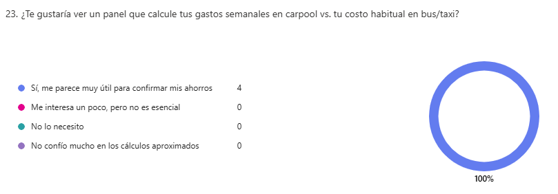

<body>
    

        
Universidad Peruana de Ciencias Aplicadas - Ingeniería de Software - 6 Ciclo

        
        
1ACC0238 - Aplicaciones para Dispositivos Móviles

        
Docente: Ing. Jorge Luis Mayta Guillermo
   
        
Informe de Trabajo Final

        
Startup: CampusMov

        
Producto: CarPool

    

    

        <h3 style="font-weight: bolder">Team Members:</h3>
        <table style="width: fit-content">
            <tr>
                <th style="text-align:center;">Estudiante</th>
                <th style="text-align:center;">Código</th>
            </tr>
            <tr>
                <td>Gutiérrez Soto, Jhosepmyr Orlando</td>
                <td>202317638</td>
            </tr>
            <tr>
                <td>Hernández Tuiro, Eric Ernesto</td>
                <td>20221C857</td>
            </tr>
            <tr>
                <td>Riva Rodríguez, Elmer Augusto</td>
                <td>202220829</td>
            </tr><tr>
                <td>Sanchez Montero, Carlos</td>
                <td>202015274</td>
            </tr>
            <tr>
                <td>Moraloes Quispe, Brayan Smith</td>
                <td>20211f984</td>
            </tr>
            <tr>
              <td>Morales Quispe, Brayan Smith</td>
              <td>20211f984</td>
            </tr>
        </table>
    

    
Marzo 2025

</body>

# Registro de Versiones del Informe

| Versión | Fecha      | Autor                             | Descripción de la modificación                               |
|---------|------------|-----------------------------------|--------------------------------------------------------------|
| 1.0     | 2025-03-01 | Gutiérrez Soto, Jhosepmyr Orlando | Versión inicial del informe.                                 |
| 1.1     | 2025-03-02 | Todos los integrantes             | Se agregó los objetivos SMART de cada integrante del equipo. |

# Project Report Collaboration Insights

* URL del repositorio del Project Report en la organización de GitHub del equipo:
* [https://github.com/CampusMov/Report](https://github.com/CampusMov/Report)

# Contenido

<!-- TOC -->
* [Registro de Versiones del Informe](#registro-de-versiones-del-informe)
* [Project Report Collaboration Insights](#project-report-collaboration-insights)
* [Contenido](#contenido)
* [Student Outcome](#student-outcome)
  * [**ABET - EAC - Student Outcome 7**](#abet---eac---student-outcome-7)
* [Objetivos SMART](#objetivos-smart)
* [Capítulo I: Presentación](#capítulo-i-presentación)
  * [1.1. Startup Profile](#11-startup-profile)
    * [1.1.1. Descripción de la Startup](#111-descripción-de-la-startup)
    * [1.1.2. Perfiles de los integrantes del equipo](#112-perfiles-de-los-integrantes-del-equipo)
  * [1.2. Solution Profile](#12-solution-profile)
    * [1.2.1. Antecedentes y problemática](#121-antecedentes-y-problemática)
    * [Contexto del Transporte en Lima y su Impacto en Estudiantes Universitarios](#contexto-del-transporte-en-lima-y-su-impacto-en-estudiantes-universitarios)
    * [Antecedentes](#antecedentes)
    * [Problemática](#problemática)
    * [Análisis 5W2H](#análisis-5w2h)
    * [1.2.2. Lean UX Process](#122-lean-ux-process)
      * [1.2.2.1. Lean UX Problem Statements](#1221-lean-ux-problem-statements)
      * [1.2.2.2. Lean UX Assumptions](#1222-lean-ux-assumptions)
      * [1.2.2.3. Lean UX Hypothesis Statements](#1223-lean-ux-hypothesis-statements)
      * [1.2.2.4. Lean UX Canvas](#1224-lean-ux-canvas)
  * [1.3. Segmentos objetivo](#13-segmentos-objetivo)
    * [*Estudiante conductor*](#estudiante-conductor)
      * [Perfil:](#perfil)
      * [Necesidades:](#necesidades)
    * [*Estudiante pasajero*](#estudiante-pasajero)
      * [Perfil:](#perfil-1)
      * [Necesidades:](#necesidades-1)
* [Capítulo II: Requirements Elicitation & Analysis](#capítulo-ii-requirements-elicitation--analysis)
  * [2.1. Competidores](#21-competidores)
    * [2.1.1. Análisis competitivo](#211-análisis-competitivo)
    * [2.1.2. Estrategias y tácticas frente a competidores](#212-estrategias-y-tácticas-frente-a-competidores)
    * [**Fortalecimiento de la Confianza en la Comunidad Estudiantil**](#fortalecimiento-de-la-confianza-en-la-comunidad-estudiantil)
      * [Estrategia:](#estrategia)
      * [Tácticas:](#tácticas)
    * [**Aprovechamiento de la Rutina Diaria Estudiantil (Fortaleza)**](#aprovechamiento-de-la-rutina-diaria-estudiantil-fortaleza)
      * [Estrategia:](#estrategia-1)
      * [Tácticas:](#tácticas-1)
    * [**Crecimiento a Través de Alianzas Educativas (Oportunidad)**](#crecimiento-a-través-de-alianzas-educativas-oportunidad)
      * [Estrategia:](#estrategia-2)
      * [Tácticas:](#tácticas-2)
    * [**Mitigación del Riesgo de Copia por Grandes Apps (Amenaza)**](#mitigación-del-riesgo-de-copia-por-grandes-apps-amenaza)
      * [Estrategia:](#estrategia-3)
      * [Tácticas:](#tácticas-3)
    * [**Activación Rápida para Generar Masa Crítica (Debilidad)**](#activación-rápida-para-generar-masa-crítica-debilidad)
      * [Estrategia:](#estrategia-4)
      * [Tácticas:](#tácticas-4)
  * [2.2. Entrevistas](#22-entrevistas)
    * [2.2.1. Diseño de entrevistas](#221-diseño-de-entrevistas)
    * [2.2.2. Registro de entrevistas](#222-registro-de-entrevistas)
    * [2.2.3. Análisis de entrevistas](#223-análisis-de-entrevistas)
  * [Segmento Objetivo 1 (Estudiante Conductor):](#segmento-objetivo-1-estudiante-conductor)
    * [Perfil Demografico](#perfil-demografico)
      * [Frustraciones](#frustraciones)
      * [Puntos de interés / Motivadores](#puntos-de-interés--motivadores)
      * [Análisis de insights sobre carpooling en conductores universitarios](#análisis-de-insights-sobre-carpooling-en-conductores-universitarios)
  * [Segmento Objetivo 2 (Estudiante Pasajero):](#segmento-objetivo-2-estudiante-pasajero)
    * [Perfil Demografico](#perfil-demografico-1)
    * [Frustraciones](#frustraciones-1)
    * [Puntos de interés](#puntos-de-interés)
    * [Perfil del pasajero universitario: motivaciones, expectativas y confianza](#perfil-del-pasajero-universitario-motivaciones-expectativas-y-confianza)
  * [2.3. Needfinding](#23-needfinding)
    * [2.3.1. User Personas](#231-user-personas)
    * [2.3.2. User Task Matrix](#232-user-task-matrix)
    * [2.3.3. User Journey Mapping](#233-user-journey-mapping)
    * [2.3.4. Empathy Mapping](#234-empathy-mapping)
    * [2.3.5. As-is Scenario Mapping](#235-as-is-scenario-mapping)
  * [2.4. Ubiquitous Language](#24-ubiquitous-language)
* [Capítulo III: Requirements specification](#capítulo-iii-requirements-specification)
  * [3.1. To-Be Scenario Mapping](#31-to-be-scenario-mapping)
  * [3.2. User Stories](#32-user-stories)
  * [3.3. Impact Mapping](#33-impact-mapping)
  * [3.4. Product Backlog](#34-product-backlog)
* [Capítulo IV: Solution Software Design](#capítulo-iv-solution-software-design)
  * [4.1. Strategic-Level Domain-Driven Design](#41-strategic-level-domain-driven-design)
    * [4.1.1. EventStorming](#411-eventstorming)
      * [4.1.1.1. Candidate Context Discovery](#4111-candidate-context-discovery)
      * [4.1.1.2. Domain Message Flows Modeling](#4112-domain-message-flows-modeling)
      * [4.1.1.3. Bounded Context Canvases](#4113-bounded-context-canvases)
    * [4.1.2. Context Mapping](#412-context-mapping)
    * [4.1.3. Software Architecture](#413-software-architecture)
      * [4.1.3.1. Software Architecture Context Level Diagrams](#4131-software-architecture-context-level-diagrams)
      * [4.1.3.2. Software Architecture Container Level Diagrams](#4132-software-architecture-container-level-diagrams)
      * [4.1.3.3. Software Architecture Deployment Diagrams](#4133-software-architecture-deployment-diagrams)
  * [4.2. Tactical-Level Domain-Driven Design](#42-tactical-level-domain-driven-design)
    * [4.2.1. Bounded Context:](#421-bounded-context)
      * [4.2.1.1. Domain Layer](#4211-domain-layer)
      * [4.2.1.2. Interface Layer](#4212-interface-layer)
      * [4.2.1.3. Application Layer](#4213-application-layer)
      * [4.2.1.4. Infrastructure Layer](#4214-infrastructure-layer)
      * [4.2.1.5. Bounded Context Software Architecture Component Level Diagrams](#4215-bounded-context-software-architecture-component-level-diagrams)
      * [4.2.1.6. Bounded Context Software Architecture Code Level Diagrams](#4216-bounded-context-software-architecture-code-level-diagrams)
        * [4.2.1.6.1. Bounded Context Domain Layer Class Diagrams](#42161-bounded-context-domain-layer-class-diagrams)
        * [4.2.1.6.2. Bounded Context Database Design Diagram](#42162-bounded-context-database-design-diagram)
* [Capítulo V: Solution UI/UX Design](#capítulo-v-solution-uiux-design)
  * [5.1. Product Design](#51-product-design)
    * [5.1.1. Style Guidelines](#511-style-guidelines)
      * [5.1.1.1. General Style Guidelines](#5111-general-style-guidelines)
    * [5.1.2. Information Architecture](#512-information-architecture)
      * [5.1.2.1. Organization Systems](#5121-organization-systems)
      * [5.1.2.2. Labelling Systems](#5122-labelling-systems)
      * [5.1.2.3. SEO Tags and Meta Tags](#5123-seo-tags-and-meta-tags)
      * [5.1.2.4. Searching Systems](#5124-searching-systems)
      * [5.1.2.5. Navigation Systems](#5125-navigation-systems)
    * [5.1.3. Landing Page UI Design](#513-landing-page-ui-design)
      * [5.1.3.1. Landing Page Wireframe](#5131-landing-page-wireframe)
      * [5.1.3.2. Landing Page Mock-up](#5132-landing-page-mock-up)
    * [5.1.4. Mobile Applications UX/UI Design](#514-mobile-applications-uxui-design)
      * [5.1.4.1. Mobile Applications Wireframes](#5141-mobile-applications-wireframes)
      * [5.1.4.2. Mobile Applications Wireflow Diagrams](#5142-mobile-applications-wireflow-diagrams)
      * [5.1.4.3. Mobile Applications Mock-ups](#5143-mobile-applications-mock-ups)
      * [5.1.4.4. Mobile Applications User Flow Diagrams](#5144-mobile-applications-user-flow-diagrams)
      * [5.1.4.5. Mobile Applications Prototyping](#5145-mobile-applications-prototyping)
<!-- TOC -->

# Student Outcome

El curso contribuye al cumplimiento del Student Outcome ABET:

## **ABET - EAC - Student Outcome 7**

* Criterio: La capacidad de adquirir y aplicar nuevos conocimientos según sea necesario, utilizando estrategias de aprendizaje apropiadas.

En el siguiente cuadro se describe las acciones realizadas y enunciados de conclusiones por parte del grupo, que permiten sustentar el haber alcanzado el logro del ABET – EAC - Student Outcome 7.

| Criterio específico                                                                                                                     | Acciones realizadas                                                                                                                                                                                                                                                                                                                                                                                                                                                                                                                                                                                                                                                                                                                                                                                                                                                                                                                                                                                                                                                                                                                                                                                                                                                                                    | Conclusiones                                                                                                                                                                                                                                                                                                                                                                                                                                                                                    |
|-----------------------------------------------------------------------------------------------------------------------------------------|--------------------------------------------------------------------------------------------------------------------------------------------------------------------------------------------------------------------------------------------------------------------------------------------------------------------------------------------------------------------------------------------------------------------------------------------------------------------------------------------------------------------------------------------------------------------------------------------------------------------------------------------------------------------------------------------------------------------------------------------------------------------------------------------------------------------------------------------------------------------------------------------------------------------------------------------------------------------------------------------------------------------------------------------------------------------------------------------------------------------------------------------------------------------------------------------------------------------------------------------------------------------------------------------------------|-------------------------------------------------------------------------------------------------------------------------------------------------------------------------------------------------------------------------------------------------------------------------------------------------------------------------------------------------------------------------------------------------------------------------------------------------------------------------------------------------|
| Actualiza conceptos y conocimientos necesarios para su desarrollo profesional y en especial para su proyecto en soluciones de software. | 
 Daniel del Castillo 
TB1: Para esta entrega dediqué un par de horas de mi vida en procesar el cambio a clean architecture. Un buen ingeniero no se dedica enteramente a aplicar un único estilo de arquitectura.

 
 Carlos Sánchez 
TB1: En esta entrega tuve un primer acercamiento a Kotlin, lo cual me ayudó a entender la estructura base de la aplicación.

 
 Elmer Riva 
TB1: Investigué y apliqué patrones tácticos de DDD para el diseño del Domain Layer, además reforcé conceptos de arquitectura hexagonal como parte del diseño de bounded contexts.

 
 Jhosepmyr Gutiérrez 
TB1: Consolidé conocimientos en EventStorming y Context Mapping, y lideré el modelado de flujos de mensajes y relaciones entre bounded contexts.

 
 Erick Hernández 
TB1: Aprendí sobre Impact Mapping y su conexión con las User Stories, integrándolo en la especificación de requerimientos y en el diseño de la solución basada en objetivos.

 
 Brayan Morales 
TB1: Exploré cómo adaptar patrones de arquitectura limpia en sistemas modulares, revisando componentes frontend en Angular y su integración con la lógica de dominio.

                                                                       | 
TB1: El aprendizaje permanente y la actualización sistemática de conocimientos constituyen un ciclo virtuoso que impacta directamente en la calidad de nuestras soluciones. Al compartir experiencias —desde cursos hasta mejoras en CI/CD— convertimos los logros individuales en capital intelectual colectivo. Esto nos permite reducir el lead time, elevar la resiliencia de las aplicaciones y mantener la competitividad frente a la rápida evolución del ecosistema de software.
 |
| Reconoce la necesidad del aprendizaje permanente para el desempeño profesional y el desarrollo de proyectos en soluciones de software.  | 
 Daniel del Castillo 
TB1: Durante la última semana estuve empapándome del tema de clean architecture; dicha arquitectura es mucho más aplicable a tecnologías móviles.

 
 Carlos Sánchez 
TB1: En este proyecto me di cuenta de que siempre debes estar actualizado con las últimas herramientas, pues te harán el trabajo mucho más llevadero.

 
 Elmer Riva 
TB1: Me enfoqué en dominar los principios de integración frontend-backend mediante APIs RESTful, reconociendo que el aprendizaje técnico constante es vital para mantener la calidad en un entorno cambiante.

 
 Jhosepmyr Gutiérrez 
TB1: Reafirmé la importancia del aprendizaje autodirigido al profundizar en técnicas de modelado estratégico. Esta capacidad fue clave para estructurar nuestra solución desde lo conceptual.

 
 Erick Hernández 
TB1: El proceso de aprendizaje sobre metodologías de descubrimiento de necesidades (Needfinding, Mapping) me permitió alinear diseño y requerimientos desde el usuario.

 
 Brayan Morales 
TB1: Entendí que el dominio de tecnologías frontend requiere actualización continua; por eso trabajé con Vite y Vue de forma autodidacta para garantizar un prototipo fluido y moderno.

 | 
TB1: Como equipo coincidimos en que el aprendizaje permanente no es un complemento, sino un pilar estratégico para la innovación. Al compartir cursos, meetups y prototipos en sesiones retro, convertimos el conocimiento individual en ventaja colectiva. Este ciclo de actualización constante fortalece nuestra capacidad para entregar software de mayor calidad, reducir riesgos técnicos y mantenernos competitivos en un entorno que evoluciona rápidamente.
                     |

# Objetivos SMART

En el siguiente cuadro se presentan los objetivos SMART de cada integrante del equipo ; donde cada objetivo debe ser específico, medible, alcanzable, relevante y con un tiempo definido.

| Estudiante                        | Objetivos                                                                                                                                                                                                                                                                                                                                                                                                                                                                                                                                                                                                                                                                                                                                                                                                                                                                                                                                                                                                                                                      |
|-----------------------------------|----------------------------------------------------------------------------------------------------------------------------------------------------------------------------------------------------------------------------------------------------------------------------------------------------------------------------------------------------------------------------------------------------------------------------------------------------------------------------------------------------------------------------------------------------------------------------------------------------------------------------------------------------------------------------------------------------------------------------------------------------------------------------------------------------------------------------------------------------------------------------------------------------------------------------------------------------------------------------------------------------------------------------------------------------------------|
| Gutiérrez Soto, Jhosepmyr Orlando | 
 **Objetivo 1**: Obtener la certificación oficial AWS Certified Solutions Architect – Associate en un plazo máximo de 6 meses después de graduarme, dedicando al menos 7 horas semanales a estudios avanzados mediante plataformas especializadas (como A Cloud Guru, Pluralsight o AWS Skill Builder), con el fin de consolidar mis conocimientos en arquitecturas escalables y seguras en la nube, y posicionarme como candidato fuerte para roles técnicos en empresas medianas o grandes que trabajen con infraestructura cloud. 
  
 **Objetivo 2**: Obtener una posición como Desarrollador Backend en una empresa internacional de tecnología, dentro de los primeros 9 meses posteriores a mi graduación, aplicando a al menos 7 ofertas semanales, mejorando continuamente mi portafolio con 3 proyectos open-source utilizando Java, Spring Boot, PostgreSQL y AWS, y participando en comunidades técnicas (como Meetup, Dev.to o GitHub Discussions) para aumentar mi visibilidad profesional y networking con desarrolladores senior. 
 |
| Riva Rodriguez, Elmer Augusto     | 
 **Objetivo 1**: Conseguir un puesto como Desarrollador Backend en una empresa de tecnología en un plazo máximo de 6 meses después de mi graduación. Para ello, mejoraré mi portafolio con al menos 3 proyectos avanzados utilizando Java y Spring Boot, mantendré un ritmo de 5 aplicaciones semanales a ofertas laborales y expandiré mi red de contactos asistiendo a eventos tecnológicos 
 
 **Objetivo 2**: Iniciar una maestría en Inteligencia Artificial dentro de los 12 meses posteriores a mi graduación. Para ello, investigaré a cerca de al menos 3 universidades o programas en línea, completando las solicitudes necesarias, a la vez de dedicar al menos 3 horas semanales a la preparación de documentos. 
                                                                                                                                                                                                                                                                                                                     | 
| Brayan Smith Morales Quispe       | 
 **Objetivo 1**: Desarrollarme como freelance en el desarrollo Frontend usando tecnologias como Angular ya sea con modulos o componentes standalone, vue usando vite, desplegandolas en servicios cloud. Todo esto sera mostrado con mejora continua en mi portafolio.
  
 **Objetivo 2**: Obtener certificaciones en Azure en un plazo de 6 meses dedicando 3 horas al dia en la plataforma de aprendizaje de microsoft, todo con el fin de mejorar mi perfil profesional y conocimientos en el campo de manejo de estas tecnologias.  
                                                                                                                                                                                                                                                                                                                                                                                                                                                                                                           |
| Del Castillo Bueno, Daniel Mateo  | 
**Objetivo 1:** Conseguir un puesto como arquitecto de software junior en una empresa desarrolladora de software luego de mi titulación. Para cumplir este objetivo voy a investigar los requisitos para el puesto y haré 3 cursos o bootcamps adicionales en arquitectura de software  
 
 **Objetivo 2:** Postular a una beca para estudiar una maestría en Arquitectura de Software luego de 2 años de experiencia laboral mencionada en el objetivo anterior. Para ello voy a postular a Fullbright en estados unidos o DAAD para alemania
                                                                                                                                                                                                                                                                                                                                                                                                                                                                                                     |
| Sanchez Montero, Carlos           | 
**Objetivo 1:** Obtener una posición como Desarrollador Full Stack en una startup tecnológica antes de que transcurran 8 meses desde mi titulación, aplicando a al menos 6 ofertas semanales y fortaleciendo mi portafolio con 2 proyectos completos (uno personal y uno colaborativo) usando tecnologías como Vue.js, Node.js, y MongoDB, incluyendo despliegue en servicios cloud como Firebase o Vercel, con el fin de consolidar mis habilidades en desarrollo de aplicaciones modernas y demostrar experiencia práctica.  
 
 **Objetivo 2:** Obtener la certificación oficial “Google Associate Cloud Engineer” dentro de los próximos 5 meses, dedicando 5 horas semanales al estudio mediante la plataforma de Google Cloud Skills Boost y material complementario (como Coursera o Udemy), con el propósito de ampliar mis conocimientos en infraestructura cloud y aumentar mis oportunidades laborales en empresas que utilizan servicios en GCP.
                                                                                       | 
| Hernandez Tuiro, Eric Ernesto     | 
 **Objetivo 1**: Conseguir un puesto de trabajo como desarrollador de Backend en un empresa nacional de tecnología un año después de graduarse. Para lograrlo desarrollé varios proyectos pequeños freelancers para añadir a mi portafolio profesional y convencer que las empresas se interesen en mí. 
 
 **Objetivo 2**: Aumentar mi empleabilidad y fortalecer mi perfil profesional como ingeniero de software en 10 meses. Para lograrlo obtendré dos certificaciones en metodologías ágiles (Scrum y Kanban) y participaré en al menos 3 eventos de desarrollo colaborativo para mejorar mis habilidades de trabajo en equipo, aprendizaje continuo y resolución de problemas en tiempo real. 
                                                                                                                                                                                                                                                                                                                                              |

# Capítulo I: Presentación

## 1.1. Startup Profile

### 1.1.1. Descripción de la Startup

CampusMov es una startup creada por estudiantes de la carrera de Ingeniería de Software. Nuestro objetivo es mejorar y optimizar la movilización de alumnos universitarios mediante la creación de software. 

**Misión**  

Desarrollar soluciones tecnológicas innovadoras que mejoren la experiencia de movilidad de los estudiantes universitarios, reduciendo el impacto del tráfico en su vida diaria y facilitando desplazamientos más eficientes, conectados y sostenibles dentro del entorno urbano.

**Visión** 

Llegar a los universitarios de todo el país para mejorar su movilidad en ciudades con alto tráfico y ser reconocida como una empresa importante en el tráfico urbano en 5 años.

### 1.1.2. Perfiles de los integrantes del equipo

| Foto del participante                               | Nombres y apellidos              | Código de estudiante   | Carrera                | Conocimientos técnicos y habilidades                                                                                                                               |
|-----------------------------------------------------|----------------------------------|------------------------|------------------------|--------------------------------------------------------------------------------------------------------------------------------------------------------------------|
|          | Eric Ernesto Hernández Tuiro     | 20221C857              | Ingeniería de Software | Conocimientos en Java, C++, C#, Python, SQL, Angular, Vue.js, React y ASP .Net Core.                                                                               |
|          | Elmer Augusto Riva Rodríguez     | 202220829              | Ingeniería de Software | Conocimientos en Angular, Vue, React, ASP .Net Core, Spring Boot y desarrollo de APIs RESTful. Experiencia en integración frontend-backend y metodologías ágiles.  | 
|  | Jhosepmyr Orlando Gutiérrez Soto | 202317638              | Ingeniería de Software | Conocimientos en Micro servicios, Spring boot, ASP .NetCore, Angular, Vue.js, DDD, TDD, BDD, GitOps, Git Actions, Docker, Kubernetes y Google Kubernetes Engine.   | 
|        | Brayan Smith Morales Quispe      | 20211f984              | Ingeniería de Software | Conocimientos en javascript, phaser, sql, java, c++, c#, Angular, Vite y Vue.                                                                                      | 
|          | Daniel Mateo del Castillo Bueno  | 202211212              | Ingeniería de Software | Conocimientos en Angular, vue, React, ASP .Net Core, SpringBoot y Flask.                                                                                           | 
|        | Carlos Sanchez Montero           | 202015274              | Ingeniería de Software | Conocimientos en JavaScript, Python, C++, Java, C#, Angular, Vue, SQL.                                                                                             | 

## 1.2. Solution Profile

### 1.2.1. Antecedentes y problemática

### Contexto del Transporte en Lima y su Impacto en Estudiantes Universitarios

En Lima, una de las ciudades más congestionadas del mundo, el tráfico vehicular representa un desafío crítico para la vida diaria de sus habitantes. Este problema afecta de manera significativa a los estudiantes universitarios, quienes, a menudo, no tienen acceso a vehículos privados y dependen del transporte público o soluciones informales para movilizarse, lo que conlleva a un aumento en los tiempos de traslado, un mayor gasto económico y altos niveles de estrés.

---

### Antecedentes

Lima enfrenta una grave congestión vehicular que afecta directamente la productividad, la calidad de vida de sus habitantes y la sostenibilidad ambiental. Según el Banco Central de Reserva del Perú (2023), la congestión vehicular le cuesta a la economía nacional aproximadamente **S/ 23.300 millones anuales**, lo que representa el 2,4% del Producto Bruto Interno (PBI) del país. Esta cifra refleja el costo directo del tráfico, pero también destaca cómo la congestión interrumpe la eficiencia de los sistemas de transporte, especialmente en un contexto urbano desorganizado.

Aparte de la congestión, uno de los factores más críticos que motivan la adopción de un sistema de carpool entre los estudiantes universitarios es el alto costo económico del transporte. La Asociación Automotriz del Perú (AAP, 2023) estima que cada peruano propietario de un vehículo gasta, en promedio, **S/ 2.368 anuales en combustible**, de los cuales **S/ 652** corresponden al tiempo perdido en el tráfico. Este gasto adicional tiene un impacto significativo en los estudiantes, quienes generalmente carecen de los recursos financieros para sostener el uso diario de un vehículo particular. Para estos estudiantes, el carpool representa una solución directa para compartir costos, reduciendo así el gasto mensual en transporte.

El impacto ambiental también es un factor clave que justifica la necesidad de soluciones como el carpool. Según la Autoridad de Transporte Urbano (ATU, 2023), la flota vehicular es responsable del **58% de las emisiones de material particulado en Lima Metropolitana**, lo que no solo contribuye a la contaminación del aire, sino que afecta la salud pública.

Además, la seguridad vial es otra preocupación importante. La Policía Nacional del Perú (2023) reporta que la falta de orden y la conducción imprudente en Lima han contribuido al aumento de accidentes de tránsito. El uso de vehículos compartidos entre estudiantes no solo puede reducir la cantidad de autos en circulación, sino también contribuir a un tráfico más ordenado y seguro.

La inseguridad en las calles de Lima, especialmente durante las horas tempranas y nocturnas, es una preocupación creciente para los estudiantes universitarios. La PUCP (2024) destaca que los estudiantes enfrentan altos riesgos durante sus desplazamientos debido a la escasez de transporte público eficiente y la alta criminalidad. En el periodo julio-agosto de 2023, Lima Metropolitana registró **39,479 denuncias por delitos**, representando el 35.6% del total nacional. En este contexto, el uso de un sistema de carpool universitario se presenta como una alternativa que no solo reduce costos y emisiones, sino que también ofrece una mayor seguridad.

---

### Problemática

El sistema de transporte público ineficiente, la falta de planificación urbana y el uso excesivo de vehículos privados agravan esta situación. Los estudiantes, especialmente aquellos sin acceso a vehículos privados, se ven obligados a recurrir a taxis informales, buses sin horarios fijos o caminar largas distancias, lo que genera un aumento en los costos, el estrés y la fatiga. Esta situación también afecta su rendimiento académico, ya que el tiempo perdido en traslados reduce las horas de estudio, como lo indica el Ministerio de Educación del Perú.

---

### Análisis 5W2H

- **WHAT (Qué)**  
  Lima enfrenta una de las peores congestiones vehiculares a nivel mundial, lo que causa pérdidas de tiempo, afecta la calidad de vida y limita el acceso a servicios esenciales como la educación.

- **WHEN (Cuándo)**  
  Las consecuencias se manifiestan constantemente, especialmente durante las horas pico.

- **WHERE (Dónde)**  
  En Lima Metropolitana, particularmente en avenidas como Av. Javier Prado, Av. Paseo de la República y Av. Universitaria.

- **WHO (Quién)**  
  Los estudiantes universitarios, especialmente aquellos sin acceso a vehículos privados.

- **WHY (Por qué)**  
  Debido a un sistema de transporte público deficiente, una planificación urbana inadecuada y alta dependencia de vehículos privados.

- **HOW (Cómo)**  
  El tráfico incrementa los costos de transporte (S/ 2,368 anuales por combustible). Para los estudiantes, este gasto es insostenible, obligándolos a optar por medios informales o caminar largas distancias (TomTom, 2023; Trading Economics, 2023).

- **HOW MUCH (Cuánto)**  
  Según la PUCP (2024), muchos estudiantes deben recorrer hasta dos horas para llegar a sus universidades, lo que afecta su descanso y rendimiento académico. Además, el 30% de los limeños tarda más de una hora en llegar a su destino.

### 1.2.2. Lean UX Process

Se describe en los siguientes apartados el proceso de Lean UX que se ha seguido para la solución propuesta.

#### 1.2.2.1. Lean UX Problem Statements

El estado actual de **la movilidad de estudiantes universitarios en Lima** se ha centrado principalmente en **el uso individual de autos, transporte público congestionado y servicios de taxi costosos.**

Lo que los productos/servicios existentes no logran abordar es **la falta de una solución específica para coordinar viajes compartidos dentro de comunidades universitarias, lo que genera altos costos personales, tiempos de traslado excesivos y contribuye al tráfico urbano.**

Nuestro producto/servicio abordará esta brecha mediante **una plataforma que permita a estudiantes universitarios coordinar viajes compartidos seguros y confiables según sus rutas, horarios y preferencias.**

Nuestro enfoque inicial serán **estudiantes de universidades privadas con horarios definidos y largas distancias de traslado, empezando por Lima Metropolitana.**

Sabremos que hemos tenido éxito cuando veamos **una reducción promedio del 30% en costos de traslado por estudiante, un 25% de incremento en la ocupación vehicular y un aumento mensual en la retención de usuarios activos del 50%.**

#### 1.2.2.2. Lean UX Assumptions

Se han definido las siguientes suposiciones para el desarrollo de la solución:

**Users**

Se describe los siguientes perfiles de usuarios mediante Proto-Personas:

* **Valeria** - **La Estudiante Madrugadora**
  * **Role**: Estudiante Universitaria Pasajera
  * **Datos Relevantes**:
    * Vive en Surquillo, estudia en Monterrico.
    * Sale a la U a las 6:00 am.
    * Gasta S/ 10 diarios en transporte público.
    * Gasta 1h50 en transporte público.
    * Usa Android, Google Maps, Youtube y Yape.
  * **Objetivos y necesidades**:
    * Llegar puntual a clases sin gastar demasiado.
    * Viajar más tranquila y segura en la mañana.
    * Evitar el estrés del transporte público.
    * Reducir su tiempo promedio de viaje (actualmente 1h50).
    * Ahorrar al menos S/50 mensuales.
  * **Obstáculos**:
    * No tiene rutas claras de quiénes van cerca.
    * No se atreve a coordinar con desconocidos.
    * El transporte público es impredecible en tiempos y seguridad.
    * No tiene claridad para compensar al conductor de forma segura y confiable, ni sabe cómo confirmar que el viaje se completó
    * Teme que el conductor cancele o no cumpla el viaje acordado

* **Diego** - **El Conductor Buena Onda**
  * **Role**: Estudiante Universitario Conductor
  * **Datos Relevantes**:
    * Vive en San Isidro, maneja su auto al campus universitario de la UPC en Monterrico.
    * Sale a la U a las 6:30 am.
    * Gasta S/ 20 diarios en combustible.
    * Gasta 30 minutos en el tráfico.
    * Usa iPhone, Waze, Spotify y Yape.
  * **Objetivos y necesidades**:
    * Optimizar sus gastos en gasolina.
    * Aprovechar los asientos vacíos de su carro.
    * Ahorrar al menos S/100 mensuales.
  * **Obstáculos**:
    * No tiene claro cómo coordinar con otros estudiantes.
    * No sabe si los pasajeros serán puntuales.
    * No confía en la seguridad de compartir su auto.
    * No tiene un método integrado para cobrar a los pasajeros ni visualizar de manera clara cuánto está ahorrando por viaje.

**Business Outcomes**

Usando el User Journey Type - Pirate Metrics, se han definido los siguientes objetivos de negocio:

* **Acquisition**:
  * Lograr que entre el 15% y 25% de los visitantes se registren en la plataforma.
  * Asegurar que al menos el 60% completen su perfil con zona, horario y rol.
* **Activation**: 
  * Conseguir que entre el 40% y 60% de los nuevos usuarios conductores realicen su primer viaje dentro del primer mes.
  * Lograr que entre el 50% y 70% de usuarios pasajeros se unan a un grupo de carpool.
* **Retention**: 
  * Mantener una retención semanal entre el 50% y 60% de los usuarios activos.
  * Alcanzar una retención mensual sostenida entre el 30% y 40%.
* **Revenue**: 
  * Lograr que entre el 40% y 50% de los viajes generen comisión efectiva.
  * Alcanzar un ingreso promedio mensual por conductor activo entre S/8 y S/12 en la etapa inicial.
* **Referral**: 
  * Incentivar que entre el 15% y 25% de los usuarios inviten a nuevos compañeros
  * Lograr que entre el 10% y 15% de esos referidos se conviertan en usuarios activos.

**User Outcomes & Benefits**

* **Estudiante Universitaria Pasajera**
  * Funcional: Reducir su tiempo de viaje y el costo mensual de transporte.
  * Emocional: Sentirse segura, acompañada y tranquila en sus traslados matutinos. 
  * Aspiracional: Sentirse en control de su rutina diaria y más enfocada en su desarrollo académico.

* **Estudiante Universitario Conductor**
  * Funcional: Disminuir su gasto mensual en combustible y evita desvíos innecesarios.
  * Emocional: Sentirse valorado, seguro y en control al compartir su auto con confianza. 
  * Aspiracional: Posicionarse como alguien práctico, solidario y que cuida su economía sin sacrificar comodidad.

**Solutions**

Acorde a los problemas y necesidades de los usuarios, se han definido las siguientes soluciones:

* **Estudiante Universitaria Pasajera**
  * Problema 1: No tiene rutas claras de quiénes van cerca
    * Algoritmo de coincidencia de rutas y horarios. 
    * Filtro por facultad/zona para mostrar solo estudiantes de trayectos similares. 
    * Mapa interactivo en tiempo real de conductores que estén pasando cerca si aun no se unió a un grupo preformado.
  * Problema 2: No se atreve a coordinar con desconocidos
    * Sistema de calificaciones y comentarios por viaje.
    * Validación con correo institucional y perfil completo con foto y facultad.
    * Chat interno con opción de ver perfiles antes de unirse al grupo.
  * Problema 3: El transporte público es impredecible en tiempos y seguridad
    * Seguimiento en tiempo real del viaje.
    * Botón de emergencia con ubicación compartida.
    * Notificaciones automáticas: “Tu conductor está en camino” o “Viaje confirmado”.
  * Problema 4: No tiene claridad para compensar al conductor ni confirmar viaje
    * Integración con Yape u otro método de pago para aportar el costo compartido.
    * Confirmación automática de viaje completado para que tanto conductor como pasajera validen la transacción.
    * Resumen de aportes realizados por semana o mes para controlar sus gastos.
    * Ofrecer un precio sugerido basado en la distancia y el combustible, con posibilidad de ajuste por parte del conductor, pero con un tope para no desincentivar a los pasajeros.
    * Panel de gastos para el pasajero que muestra resumen de aportes realizados por semana o mes para controlar sus gastos.
  * Problema 5: Teme que el conductor cancele o no cumpla el viaje acordado
    * Penalizaciones para los conductores que no cumplan con el viaje acordado o cancelen sin previo aviso.
    * Chat interno para coordinar cambios de último momento y reducir cancelaciones sorpresivas.

* **Estudiante Universitario Conductor**
  * Problema 1: No tiene claro cómo coordinar con otros estudiantes
    * Panel con sugerencias de pasajeros compatibles
    * Calendario semanal para agendar viajes con un solo clic.
    * Historial de viajes con opción de invitar a los mismos pasajeros.
    * Grupos preformados y búsqueda individual para sincronizar horarios con mayor anticipación.
  * Problema 2: No sabe si los pasajeros serán puntuales
    * Reputación visible: puntualidad y asistencia previa.
    * Notificaciones automáticas a pasajeros: “Tu conductor sale en 10 minutos”.
    * Penalización/reporte por inasistencia o retraso frecuente.
    * Comunicación post-viaje para calificar la puntualidad del pasajero.
  * Problema 3: No confía en la seguridad de compartir su auto
    * Configuración de privacidad: solo permitir pasajeros verificados o conocidos.
    * Información visible del perfil del pasajero (foto, carrera, historial).
    * Botón de bloqueo/reportar usuario desde el grupo de carpool.
  * Problema 4: No tiene un método integrado para cobrar a los pasajeros ni visualizar sus ahorros
    * Integración con Yape para solicitar aportes directamente desde la app.
    * Confirmación de viaje completado que registre automáticamente la contribución de cada pasajero.
    * Panel o dashboard que muestre cuántos viajes ha hecho, cuánta gasolina ha compensado y su comisión acumulada.
    * Manejo de la comisión: se define un porcentaje (por ejemplo, 10%) que la plataforma retiene. Puede ser cobro quincenal o mensual al conductor, o retención inmediata.
    * Mostrar cuántos pasajeros va llevando y cuánto ahorra con 1, 2 o 3 pasajeros, incentivando así llenar el carro.
    * Bonus por carro lleno: si hay 3 (o más) pasajeros confirmados, el conductor recibe un pequeño incentivo adicional que sale de la comisión recaudada.

* **Soluciones transversales**
  * Sistema de referidos y recompensas:
    *  Ganar puntos o descuentos al invitar amigos, mayor probabilidad de coincidir con gente confiable.
    *  Distintivos (badges) por cantidad de viajes compartidos, calificaciones positivas o referencias exitosas.
  * Gamificación:
    * Otorgar insignias o niveles (Bronce, Plata, Oro) dependiendo del número de viajes, buena reputación y puntualidad.
  * Penalizaciones y reputación:
    * Reglas claras en caso de cancelaciones de último minuto, no pagos, retrasos frecuentes, etc. 
    * Comunicación post-viaje para recopilar feedback rápido sobre puntualidad y comodidad.

* **Riesgos**

De ese modo, los riesgos son eventos inciertos que pueden afectar el éxito del proyecto. 
Ante ello, se han identificado los siguientes riesgos por cada hipótesis:

  * H1:
    * Deseabilidad y confianza:
      * Es posible que las pasajeras sigan sin confiar en “desconocidos” aunque sean estudiantes; la validación institucional puede no ser suficiente para romper barreras culturales.
      * El chat y las calificaciones podrían no bastar para generar la seguridad esperada (p. ej. necesitan ver reseñas de viajes reales, fotos, etc.).
      
  * H2:
    * Viabilidad económica:
      * El ahorro del 30% podría no ser real si la tarifa propuesta (o el aporte al conductor) termina siendo igual o mayor que el transporte público debido a comisiones o altos costos de gasolina.
    * Disponibilidad de conductores:
      * El factor más fuerte en reducir costos es encontrar conductores suficientes. Sin masa crítica de conductores, la oferta será limitada y tal vez no se logre el ahorro deseado.
  
  * H3:
    * Complejidad de penalizaciones:
      * Implementar y gestionar correctamente un sistema de penalizaciones puede ser conflictivo; si es muy severo, los usuarios se van, si es muy laxo, pierde eficacia.

  * H4:
    * Evasión de la plataforma:
      * Conductor y pasajero podrían acordar pagar en efectivo o por otro medio fuera de la app, evitando la comisión.
    * Integración técnica con Yape:
      * El desarrollo y la coordinación con el servicio de pago podría presentar problemas o limitaciones.

  * H5:
    * Deseabilidad:
      * Diego podría no encontrar suficiente valor en la plataforma para organizar sus viajes; tal vez use canales informales (WhatsApp, Facebook).
      * No haya suficientes pasajeros interesados en la misma ruta/horario, lo cual desincentive a Diego a hacer su primer viaje.
    * Factibilidad técnica:
      * Implementar el “panel de sugerencias” y el “calendario semanal” puede requerir un algoritmo de coincidencia robusto, y podría ser más complejo de lo previsto.
    * Viabilidad de negocio:
      * Incluso si se ofrece la herramienta de coordinación, ¿la tasa de adopción será la suficiente para sostener la plataforma en el primer mes?

  * H6:
    * Exactitud de los cálculos:
      * La estimación de ahorro de S/8–12 podría no ser realista si la app no logra captar la cantidad de viajes o pasajeros necesarios.
    * Volumen de pasajeros y viajes:
      * La plataforma podría no captar suficientes pasajeros o viajes para que Diego vea un ahorro significativo en gasolina.
     
  * H7:
    * Atracción del incentivo:
      * La recompensa puede no ser suficiente para motivar a la gente a invitar amigos.
    * Visibilidad y usabilidad del programa:
      * Si el programa de referidos no está bien integrado en la app, pocos lo usarán.

  * H8:
    * Onboarding efectivo:
      * El proceso inicial podría ser confuso, largo o poco atractivo, generando abandono temprano.
    * Disponibilidad real de grupos o viajes:
      * Si la persona se registra, pero no ve ningún viaje o grupo al que unirse, simplemente no se activa.
    * Expectativas incumplidas:
      * El usuario podría llegar con altas expectativas tras ser invitado, pero la oferta de rutas o la experiencia no cumple sus necesidades, y se da de baja rápido.
     
* **Experimentos**

Para validar las hipótesis, se han diseñado experimentos que permitan obtener datos concretos sobre la aceptación de la solución propuesta. 
A continuación, se describen los experimentos y las métricas asociadas a cada hipótesis:

  * H1: 
    * Experimento: El equipo realizará breves entrevistas con pasajeras, mostrando un wireframe de validación institucional, calificaciones y chat. Al final, se aplicará una mini encuesta sobre cuán seguras se sienten.
    * Métrica: Se apunta a que entre el 50% y 70% indiquen que sí se unirían a un carpool tras ver esa verificación.
  * H2:
    * Experimento: Se entrevistará a estudiantes, presentándoles un boceto que compare “costo actual” vs. “carpool con seguimiento en tiempo real”. Luego, se harán 2-3 preguntas cerradas sobre la viabilidad del ahorro.
    * Métrica: Se busca que al menos 60% afirmen que cambiarían a la opción de carpool, validando la percepción de un 30% de reducción de costos.
  * H3:
    * Experimento: Se explicará la idea de penalizaciones y notificaciones en entrevistas, mostrando un wireframe sencillo con reputación. Al final, se incluirá una breve encuesta sobre su disposición a usar la app.
    * Métrica: Se apunta a que 50–60% declaren que continuarían activos, confirmando la retención prevista.
  * H4:
    * Experimento: El equipo mostrará un boceto de “Pagar con Yape + confirmación” a conductores y pasajeros, y al final hará una mini encuesta sobre la preferencia de pago.
    * Métrica: Se requiere que entre 40–50% indiquen que sí usarían la opción integrada, sustentando el cobro dentro de la plataforma.
  * H5:
    * Experimento: Se entrevistará a conductores y se presentará un wireframe de “panel de sugerencias” y “calendario semanal”. Después, se preguntará si lo usarían para su primer viaje.
    * Métrica: Se espera que 80% declaren que sí lo considerarían útil, validando la coordinación anticipada.
  * H6:
    * Experimento: Se mostrará un boceto de “panel de ahorro” a conductores y se harán 2-3 preguntas cerradas sobre su motivación al ver cuántos pasajeros llevan y el combustible compensado.
    * Métrica: Se necesita que 60% indiquen sentirse motivados al visualizar su ahorro, validando la hipótesis.
  * H7:
    * Experimento: El equipo realizará entrevistas con usuarios, describiendo un sistema de referidos con recompensas y mostrando un wireframe simple de “badges” o descuentos. Se incluirá una mini encuesta para medir la intención de compartir invitaciones.
    * Métrica: SSe busca que 15–25% afirmen que invitarían a conocidos a la plataforma, confirmando el potencial de crecimiento por referidos.
  * H8:
    * Experimento: Se entrevistará a nuevos usuarios, presentándoles un boceto de “onboarding” (perfil, zona/horario, unirse a un grupo). Al final, se incluirá una breve encuesta sobre su disposición a completar el proceso.
    * Métrica: Se espera que 10–15% confirmen que se convertirían en usuarios activos tras probar ese flujo de inicio, validando la eficacia del onboarding.

#### 1.2.2.3. Lean UX Hypothesis Statements

De ese modo, se junta la información de los usuarios, los resultados de negocio y los beneficios de la solución para crear las hipótesis.
Asímismo, se clasifican según los 4 cuadrantes del Hypothesis Prioritization Canvas.

* Test (Alto valor, alto riesgo)
  * H1: Creemos que entre el 50% y 70% de los usuarios pasajeros se unirán a un grupo de carpool
    si Valeria obtiene mayor confianza al compartir ruta con estudiantes verificados
    con la validación institucional, sistema de calificaciones y chat previo al viaje.
  * H2: Creemos que reduciremos en un 30% el costo de traslado
    si Valeria obtiene una alternativa confiable al transporte público
    con un algoritmo de coincidencia de rutas, posibilidad de “viaje en curso” y el seguimiento en tiempo real del conductor.
  * H3: Creemos que mantendremos una retención semanal de 50–60%
    si Valeria y Diego obtienen seguridad y previsibilidad en sus viajes
    con notificaciones automáticas, reputación visible y penalización de impuntuales.
  * H4: Creemos que entre el 40% y 50% de los viajes generarán comisión efectiva
    si los conductores obtienen un método integrado de cobro y confirmación
    con una integración de Yape dentro de la app y notificaciones de viaje completado.

* Ship & Measure (Alto valor, bajo riesgo)
  * H5: Creemos que lograremos que entre el 40% y 60% de los nuevos usuarios conductores realicen su primer viaje dentro del primer mes
    si Diego obtiene una forma clara de coordinar con otros estudiantes
    con un panel de sugerencias de pasajeros, calendario semanal y grupos preformados. 
  * H6: Creemos que alcanzaremos un ingreso promedio mensual de S/8–12 por conductor 
    si Diego obtiene visibilidad de cuántos pasajeros lleva y cuánto ahorra en gasolina 
    con un panel de comisiones, registro de viajes y aportes recibidos.
  * H7: Creemos que incentivaremos que entre el 15% y 25% de los usuarios inviten a nuevos compañeros
    si tanto pasajeros como conductores obtienen recompensas al referir contactos confiables
    con un sistema de invitaciones, seguimiento de referidos y badges por referencias exitosas.
  * H8: Creemos que entre el 10% y 15% de los referidos se convertirán en usuarios activos
    si los usuarios invitados obtienen una experiencia de onboarding clara
    con completar su perfil, zona/horario y unirse a un grupo de carpool (o “viaje en curso”) desde el primer ingreso.
  
* Don't test. Usually Don't Build (Bajo valor, bajo riesgo)
  * Actualmente, no se han identificado hipótesis que aporten poco valor y tengan bajo riesgo.

* Discard 
  * Tampoco se ha identificado ninguna hipótesis con riesgo alto y valor bajo dentro de la información actual.

#### 1.2.2.4. Lean UX Canvas

Una vez definidos los usuarios, supuestos y las hipótesis, se ha elaborado el Lean UX Canvas, que resume la información recopilada y las decisiones tomadas hasta el momento. 
A continuación se presenta el Lean UX Canvas:

  

## 1.3. Segmentos objetivo

Lima continúa siendo la ciudad con mayores niveles de congestión vehicular en América Latina. De acuerdo con el Índice de Congestión Vehicular 2023 de la firma TomTom, la capital peruana se ubicó en el primer lugar regional y el quinto a nivel mundial. En promedio, recorrer una distancia de 10 km en Lima toma 28 minutos con 30 segundos, representando un incremento de 1 minuto con 20 segundos respecto al 2022 (Asociación automotriz del Perú, 2024). Este aumento coloca a Lima entre las tres ciudades del mundo con mayor deterioro en tiempo de desplazamiento. Asimismo, este contexto urbano representa un reto cotidiano para los estudiantes universitarios, quienes enfrentan:
- Largas demoras en el tráfico.
- Transporte público ineficiente, inseguro y poco cómodo.
- Altos costos de movilidad.
- Pérdida de tiempo que afecta su productividad.

Por lo tanto, nuestra aplicación de carpooling universitario está dirigida a dos segmentos principales de usuarios dentro de la comunidad estudiantil de la Universidad Peruana de Ciencias Aplicadas, ubicada en Lima, Perú. Ambos comparten características demográficas similares, pero cumplen roles distintos dentro del servicio: estudiante conductor y estudiante pasajero. A continuación se describen sus perfiles y necesidades:

### *Estudiante conductor*

#### Perfil:

- Género: Masculino y femenino
- Edad: 18 a 27 años
- Ubicación: Lima, Perú
- Nivel educativo: Universitario (pregrado)
- Estado civil: Soltero
- Universidad: Universidad Peruana de Ciencias Aplicadas (UPC)
- Medio de transporte: Vehículo propio o familiar

#### Necesidades:

- Se moviliza diariamente hacia la universidad en auto propio, generalmente solo.
- Busca reducir gastos de movilidad (combustible, mantenimiento).
- Tiene disposición a compartir su ruta con otros estudiantes.
- Le motiva la posibilidad de socializar.

### *Estudiante pasajero*

#### Perfil:

- Género: Masculino y femenino
- Edad: 18 a 25 años
- Ubicación: Lima, Perú
- Nivel educativo: Universitario (pregrado)
- Estado civil: Soltero
- Universidad: Universidad Peruana de Ciencias Aplicadas (UPC)
- Medio de transporte: Transporte público, taxi, o movilidad por app

#### Necesidades:

- Enfrenta demoras, incomodidad e inseguridad en el transporte público.
- Busca una alternativa más rápida, económica y segura para llegar a la universidad.
- Valora compartir viajes con otros estudiantes.
- Está dispuesto a contribuir con un monto a cambio del servicio.

# Capítulo II: Requirements Elicitation & Analysis

## 2.1. Competidores

### 2.1.1. Análisis competitivo

El análisis competitivo es una herramienta fundamental para entender el entorno en el que se desarrollará la startup. A través de este análisis, se busca identificar las fortalezas y debilidades de los competidores, así como las oportunidades y amenazas que presenta el mercado. Esto permitirá definir una propuesta de valor única y construir una identidad distintiva para la plataforma dirigida a estudiantes universitarios. A continuación, se presenta un análisis detallado de los principales competidores en el mercado de aplicaciones de carpooling.

<table>
    <tr>
        <th colspan="6">Competitive Analysis Landscape</th>
    </tr>
    <tr>
        <td colspan="2" rowspan="2">Competitive Analysis Landscape</td>
        <td colspan="4">Escriba en el recuadro la pregunta que busca responder o el objetivo de este análisis.</td>
    </tr>
    <tr>
        <td colspan="4">El objetivo de este análisis es evaluar el estado actual del mercado de aplicaciones de carpooling, identificando el alcance, las características y las limitaciones de las soluciones existentes. Esto permitirá definir una propuesta de valor única, construir una identidad distintiva para nuestra plataforma dirigida a estudiantes universitarios, diferenciarla claramente en el mercado y satisfacer necesidades específicas que actualmente no están siendo plenamente abordadas por la competencia.</td>
    </tr>
    <tr>
        <td colspan="2">(En la cabecera colocar por cada competidor nombre y logo)</td>
        <th scope="col"></th>
        <th scope="col"></th>
        <th scope="col"></th>
        <th scope="col"></th>
    </tr>
    <tr>
        <th scope="row" rowspan="2">Perfil</th>
        <th scope="row">Overview</th>
        <td>App de carpooling enfocada en estudiantes universitarios. Permite compartir viajes diarios casa-universidad. Inicia en Lima (UPC) como piloto. Seguridad, comunidad y eficiencia como pilares clave.</td>
        <td>App de movilidad con enfoque en la negociación directa entre conductor y pasajero. Permite viajes urbanos e interurbanos con flexibilidad.</td>
        <td>Plataforma europea de carpooling interprovincial. Fuerte enfoque en comunidad, reputación del conductor y planificación anticipada.</td>
        <td>Funcionalidad dentro de Uber para compartir rutas similares entre pasajeros. Reduce costos. Se activa en ciudades seleccionadas.</td>
    </tr>
    <tr>
        <th scope="row">Ventaja competitiva ¿Qué valor ofrece a los clientes?</th>
        <td>Verificación institucional, ahorro económico, rutas frecuentes optimizadas, comunidad segura y comunicación directa entre estudiantes.</td>
        <td>Tarifas flexibles, opción de pago en efectivo, libertad para elegir conductor y ruta.</td>
        <td>Planificación previa, usuarios verificados, reputación sólida y opción de múltiples paradas.</td>
        <td>Interfaz familiar, automatización del emparejamiento, integración con sistema de pagos digitales.</td>
    </tr>
    <tr>
        <th scope="row" rowspan="2">Perfil de Marketing</th>
        <th scope="row">Mercado Objetivo</th>
        <td>Estudiantes universitarios (18–25 años) sin vehículo propio o con disposición a compartir viajes.</td>
        <td>Jóvenes urbanos, trabajadores sin auto, usuarios con presupuesto limitado.</td>
        <td>Viajeros frecuentes entre ciudades, estudiantes de intercambio, mochileros.</td>
        <td>Usuarios de Uber que buscan reducir costos compartiendo rutas urbanas similares.</td>
    </tr>
    <tr>
        <th scope="row">Estrategias de Marketing</th>
        <td>Activaciones en campus, embajadores estudiantiles, redes sociales universitarias, convenios con asociaciones estudiantiles.</td>
        <td>Promociones por invitación, posicionamiento digital en redes sociales, marketing de boca a boca.</td>
        <td>Campañas de referidos, presencia en blogs de viajes, alianzas estratégicas con servicios de transporte.</td>
        <td>Publicidad dentro de la app, campañas con descuentos, promociones grupales.</td>
    </tr>
 <tr>
        <th scope="row" rowspan="3">Perfil de Producto</th>
        <th scope="row">Productos y Servicios</th>
        <td>- App móvil exclusiva para estudiantes. - Verificación con correo institucional. - Match por horarios y ubicación. - Chat interno y soporte.</td>
        <td>- App móvil y web. - Negociación directa de tarifas. - Soporte en tiempo real.</td>
        <td>- BlaBlaCar Daily / Long Distance. - Reseñas y filtros de preferencia. - Planificación de viajes.</td>
        <td>- UberPool dentro de Uber. - Emparejamiento automatizado. - Pago digital.</td>
    </tr>
    <tr>
        <th scope="row">Precios y costos</th>
        <td>- Costo de gasolina compartido. - Sin comisiones en piloto. - Modelo transparente y colaborativo.</td>
        <td>- Precios negociables. - Sin tarifas ocultas. - Libre acuerdo entre usuarios.</td>
        <td>- Tarifa fija según distancia. - Más barato que el transporte público.</td>
        <td>- Tarifa dinámica. - Ahorro del 30% promedio sobre UberX.</td>
    </tr>
    <tr>
        <th scope="row">Canales de distribución (Web y/o Móvil)</th>
        <td>- App Android/iOS. - Acceso con correo .edu. - Soporte por WhatsApp y correo.</td>
        <td>- App Android/iOS y web. - Soporte por correo. - Multilenguaje.</td>
        <td>- App móvil y web. - Foro comunitario. - Centro de ayuda.</td>
        <td>- App móvil de Uber. - Centro de ayuda interno. - Soporte automatizado.</td>
    </tr>
    <tr>
        <th scope="row" rowspan="5">Análisis SWOT</th>
        <td colspan="5">Realice esto para su startup y sus competidores. Sus fortalezas deberían apoyar sus oportunidades y contribuir a lo que ustedes definen como su posible ventaja competitiva.</td>
    </tr>
    <tr>
        <th scope="row">Fortalezas</th>
        <td>- Foco en estudiantes. - Confianza entre usuarios. - Modelo económico colaborativo. - Alta frecuencia de uso. - Adaptación al entorno universitario.</td>
        <td>- Alta flexibilidad. - Amplia cobertura. - Modelo simple.</td>
        <td>- Fuerte reputación. - Base sólida de usuarios. - Ideal para viajes largos.</td>
        <td>- Plataforma establecida. - Automatización completa. - Base de usuarios masiva.</td>
    </tr>
    <tr>
        <th scope="row">Debilidades</th>
        <td>- Necesita masa crítica inicial. - Limitado a estudiantes. - Requiere fuerte difusión en el inicio.</td>
        <td>- Poca personalización. - Control limitado de calidad entre usuarios.</td>
        <td>- Poco útil en trayectos urbanos. - Foco en rutas largas.</td>
        <td>- Solo en zonas activas. - Comunidad poco conectada.</td>
    </tr>
    <tr>
        <th scope="row">Oportunidades</th>
        <td>- Escalabilidad a más universidades. - Integración con apps académicas. - Alianzas con marcas jóvenes. - Eventos estudiantiles.</td>
        <td>- Expansión urbana. - Integración con transporte público. - Nuevas funciones.</td>
        <td>- Ampliar a rutas cortas. - Alianzas universitarias. - Extensión regional.</td>
        <td>- Reactivar UberPool en LATAM. - Segmentación más precisa.</td>
    </tr>
    <tr>
        <th scope="row">Amenazas</th>
        <td>- Apps grandes imitando el modelo. - Alternativas informales (colectivos, taxis piratas). - Adopción lenta sin red inicial.</td>
        <td>- Regulación del sector. - Competencia informal.</td>
        <td>- Nuevos competidores. - Uso limitado diario.</td>
        <td>- Canibalización de UberX. - Baja escalabilidad.</td>
    </tr>
</table>

### 2.1.2. Estrategias y tácticas frente a competidores

Para que UniRide logre posicionarse como la opción preferida de carpooling entre estudiantes universitarios, es fundamental implementar estrategias que aborden tanto los retos iniciales como las oportunidades de crecimiento sostenido. A continuación, se presentan cinco ejes estratégicos que responden a las principales fortalezas, debilidades, oportunidades y amenazas identificadas en el análisis anterior.

Cada eje incluye una estrategia central orientada a un objetivo clave (confianza, adopción, diferenciación, expansión o recurrencia) y un conjunto de tácticas concretas diseñadas para generar impacto real dentro del entorno universitario. Estas acciones buscan aprovechar el contexto diario del estudiante, construir comunidad, activar la participación desde el primer contacto y proteger la propuesta de valor frente a competidores más grandes.

### **Fortalecimiento de la Confianza en la Comunidad Estudiantil**
#### Estrategia:
Combatir la desconfianza inicial de los usuarios hacia una app nueva mediante un enfoque centrado en comunidad, seguridad y visibilidad dentro del entorno universitario.

#### Tácticas:
- Verificación obligatoria mediante correo institucional (.edu) y validación de identidad con DNI. 
- Campaña “Viajes seguros entre compañeros” con testimonios de estudiantes y microinfluencers universitarios. 
- Convenios con asociaciones estudiantiles para promover la app como solución comunitaria. 
- Sistema de calificaciones y alertas ante comportamiento inapropiado.

### **Aprovechamiento de la Rutina Diaria Estudiantil (Fortaleza)**
#### Estrategia:
Basarse en la recurrencia y predictibilidad de los trayectos casa-universidad para crear una experiencia optimizada y funcional.

#### Tácticas:
- Programación de viajes semanales con recordatorios automáticos.
- Rutas frecuentes sugeridas con base en historial del usuario. 
- Recompensas por consistencia de uso (puntos, descuentos, insignias).
- Match automático por horario, facultad y ubicación.

### **Crecimiento a Través de Alianzas Educativas (Oportunidad)**
#### Estrategia:
Expandir el alcance de UniRide mediante alianzas con universidades, centros de estudiantes y marcas juveniles.

#### Tácticas:
- Inclusión de UniRide como app recomendada en canales institucionales (redes, web, correo). 
- Embajadores de marca en cada facultad para onboarding y soporte. 
- Beneficios exclusivos con cafés, librerías o marcas juveniles aliadas.

### **Mitigación del Riesgo de Copia por Grandes Apps (Amenaza)**
#### Estrategia:
Consolidar el posicionamiento de UniRide como solución hiper-especializada en estudiantes antes de que otras plataformas repliquen el modelo.

#### Tácticas:
- Branding universitario fuerte y experiencia centrada en vida académica. 
- Gamificación con rankings por facultad, retos entre carreras y logros sostenibles. 
- Registro de marca y diseño para proteger elementos clave del producto.

### **Activación Rápida para Generar Masa Crítica (Debilidad)**
#### Estrategia:
Acelerar la adopción en campus piloto mediante campañas de activación intensiva y uso incentivado.

#### Tácticas:
- Programa de referidos con recompensas por usuarios activos. 
- “Semanas UniRide” con sorteos, retos y eventos en campus. 
- Metas comunitarias (ej. “500 viajes esta semana”) con premios colectivos (eventos, conciertos, vales).

## 2.2. Entrevistas

### 2.2.1. Diseño de entrevistas

### 2.2.2. Registro de entrevistas
<table>
    <tr>
        <th scope="col">Segmento</th>
        <th scope="col">Datos y resumen de entrevista</th>
        <th scope="col">Evidencia fotográfica</th>
    </tr>
    <tr>
        <th rowspan="4" scope="row">Estudiantes conductores</th>
        <td>
            <strong>Gabriel Jesus Gamboa Diaz</strong> 
            Edad: 23 años 
            Distrito: Chorrillos 
            Nivel de educación: Superior 
            Estado civil: Soltero 
            Familia: No tiene hijos 
            Dispositivo preferido: celular 
            Tiempo de la entrevista: <a href="">0:00</a>  
            Gabriel Gamboa, un joven de 23 años recién graduado en Administración por la UPC, expone cómo una aplicación de carpooling podría mejorar su experiencia diaria al ir a la universidad. Actualmente utiliza Google Maps para sus rutas y WhatsApp para coordinarse, pero ve claro el beneficio de una app que integre un calendario de viajes, selección de pasajeros basada en la cercanía y calificaciones, y un chat interno que respete la privacidad. La posibilidad de generar ingresos adicionales al compartir su vehículo y optimizar el uso del combustible, junto a la reducción del estrés al manejar acompañado, hacen que considere esta solución como una opción práctica, confiable y atractiva para su rutina.
        </td>
        <td></td>
    </tr>
    <tr>
        <td>
            <strong>Piero Alonso Espinoza Bohorquez</strong> 
            Edad: 21 años 
            Distrito: Surco 
            Nivel de educación: Universitario 
            Estado civil: Soltero 
            Composición familiar: Vive solo 
            Ocupación principal: Estudiante universitario 
            Tiempo de la entrevista: <a href="https://upcedupe-my.sharepoint.com/:v:/g/personal/u202015274_upc_edu_pe/EYE8B_iTwqZApdAr64dLdksBVwhEyb7hHbDU-DtXu5vmdA?nav=eyJyZWZlcnJhbEluZm8iOnsicmVmZXJyYWxBcHAiOiJPbmVEcml2ZUZvckJ1c2luZXNzIiwicmVmZXJyYWxBcHBQbGF0Zm9ybSI6IldlYiIsInJlZmVycmFsTW9kZSI6InZpZXciLCJyZWZlcnJhbFZpZXciOiJNeUZpbGVzTGlua0NvcHkifX0&e=7FsFRv">10:00</a>  
            <b>Resumen:</b> 
            Piero es un estudiante universitario de la Universidad de Lima que vive en Surco. Todos los días se traslada en su auto particular desde su casa hasta la universidad, un trayecto que le toma alrededor de una hora. Señala que aunque manejar le permite comodidad y control, también resulta agotador debido al intenso tráfico limeño. Para organizar su ruta diaria, Piero se levanta temprano y utiliza aplicaciones como Waze o Google Maps para evaluar el tráfico y decidir el mejor camino. No suele coordinar con otras personas para compartir el viaje, pero está abierto a esa posibilidad si existiera una solución segura y práctica. Utiliza principalmente WhatsApp como herramienta de comunicación en su día a día.  Cuando se le presentó la idea de una aplicación de carpooling universitario, mostró interés, destacando que podría ser útil para reducir costos, ahorrar gasolina, y contar con compañía durante el trayecto. Aceptaría compartir su auto siempre que los pasajeros sean verificados, idealmente estudiantes de su universidad. También valoró que el conductor tenga el control de aceptar o rechazar solicitudes de viaje según su conveniencia.  Consideró útil que la aplicación tenga funciones como un calendario semanal para planificar los viajes con antelación y poder coordinar tanto las idas como los regresos. También opinó que los pasajeros deberían sugerirse en base a cercanía, coincidencia de horarios y calificaciones/reseñas. Si bien reconoce que coordinar con más personas podría ser más complicado, está dispuesto a hacerlo si hay un beneficio económico claro.  En relación a la monetización de la plataforma, no tendría problema en que la app retenga un pequeño porcentaje por gestionar pagos y penalizaciones, siempre que se vea reflejado de forma clara en un balance mensual, incluyendo el ahorro en combustible. Además, estaría motivado a recomendar la app a conocidos si recibe algún tipo de recompensa, como vales de consumo o descuentos.  En general, Piero considera que la idea del carpooling universitario es viable, siempre que se priorice la seguridad, la organización y el beneficio mutuo entre conductor y pasajeros.
        </td>
        <td></td>
    </tr>
    <tr>
        <td>
            <strong>Gabriel Jesus Chipana Dionicio</strong> 
            Edad: 22 años 
            Distrito: La Molina 
            Nivel de educación: Universitario 
            Estado civil: Soltero 
            Composición familiar: Vive solo 
            Ocupación principal: Estudiante universitario 
            Tiempo de la entrevista: <a href="https://upcedupe-my.sharepoint.com/:v:/g/personal/u202015274_upc_edu_pe/Ee42qvYvrgVIkzhJyPPgAXAB4eQfhbu0G_-ewwhO3J1ulQ?nav=eyJyZWZlcnJhbEluZm8iOnsicmVmZXJyYWxBcHAiOiJPbmVEcml2ZUZvckJ1c2luZXNzIiwicmVmZXJyYWxBcHBQbGF0Zm9ybSI6IldlYiIsInJlZmVycmFsTW9kZSI6InZpZXciLCJyZWZlcnJhbFZpZXciOiJNeUZpbGVzTGlua0NvcHkifX0&e=5oYqNq">09:46</a>  
            <b>Resumen:</b> 
            Gabriel es estudiante de décimo ciclo de la carrera de Ingeniería Empresarial en la Universidad del Pacífico (UP). Vive en La Molina y se traslada diariamente en su auto hacia la universidad. Actualmente trabaja en Entel, por lo que valora mucho la eficiencia en su rutina diaria. Suele organizar su ruta levantándose temprano y utilizando aplicaciones como Waze o Google Maps para evitar el tráfico. La coordinación con otras personas es mínima, y si ocurre, es principalmente a través de WhatsApp.  Respecto a los problemas que enfrenta al manejar solo, Gabriel menciona principalmente el tráfico intenso y la soledad en el trayecto. Por eso, mostró bastante interés cuando se le presentó la idea de una aplicación de carpooling universitario, la cual permitiría compartir su vehículo con otros estudiantes que tengan horarios y rutas similares, recibiendo a cambio entre 5 a 10 soles por pasajero. Considera que esto le permitiría generar ingresos adicionales y hacer sus viajes más llevaderos.  Valoró positivamente la función de calendario semanal, ya que le permitiría planificar sus viajes con anticipación y conocer la demanda de pasajeros. Le gustaría poder cargar su horario personal y comparar con otros para hacer "match" tanto en la ida como en el regreso. En cuanto a la forma de sugerir pasajeros, prefiere que sea en función de la cercanía y del monto que puedan pagar, aunque también resaltó la importancia de la seguridad, afirmando que solo aceptaría a estudiantes de su universidad.  Gabriel consideró que aceptar pasajeros espontáneos no sería ideal, y prefiere viajes previamente programados. Para aumentar su confianza, valoraría ver reseñas breves, calificaciones, historial de viajes y datos académicos como la facultad a la que pertenece el pasajero. También considera útil saber si el pasajero suele pagar puntualmente o si tiende a llegar tarde. En cuanto a la promoción de la app, está dispuesto a recomendarla a conocidos si eso le ayuda a conseguir más pasajeros, aunque aceptaría un incentivo adicional, como vales de consumo o descuentos.  Finalmente, Gabriel está de acuerdo con que la app retenga un pequeño porcentaje de comisión por gestionar pagos y penalizaciones. Le gustaría ver sus ingresos y ahorros reflejados claramente en la app, idealmente en un resumen mensual. También expresó dudas sobre cómo evitar que los pagos se realicen por fuera de la aplicación, lo cual podría afectar la trazabilidad y seguridad del servicio.
        </td>
        <td></td>
    </tr>
    <td>
        <strong>Ignacio</strong> 
        Edad: 19 años 
        Distrito: -- 
        Nivel de educación: Universitario 
        Estado civil: Soltero 
        Composición familiar: Vive solo 
        Ocupación principal: Estudiante universitario 
        Tiempo de la entrevista: <a href="https://upcedupe-my.sharepoint.com/:v:/g/personal/u20211f984_upc_edu_pe/EZEdMdN9zlhKs3pt6I42Xx0B8QWdDHQkB-sbh3Hc5QZd2Q?e=xcGx9t&nav=eyJyZWZlcnJhbEluZm8iOnsicmVmZXJyYWxBcHAiOiJTdHJlYW1XZWJBcHAiLCJyZWZlcnJhbFZpZXciOiJTaGFyZURpYWxvZy1MaW5rIiwicmVmZXJyYWxBcHBQbGF0Zm9ybSI6IldlYiIsInJlZmVycmFsTW9kZSI6InZpZXcifX0%3D">10:07</a>  
        <b>Resumen</b>:
         Ignacio es un estudiante de 19 años que cursa sus estudios en la Universidad de Lima. Vive con su familia y a veces comparte su ruta hacia la universidad con su hermana, quien también estudia. Dependiendo de si viaja solo o acompañado, su ruta varía, aunque ya conoce bien los caminos. Aun así, utiliza aplicaciones como Google Maps o Waze para verificar el tráfico en tiempo real y optimizar su recorrido.
          Entre los principales problemas que enfrenta al conducir, Ignacio destaca el tráfico y el alto costo de la gasolina, el cual estima entre 340 y 400 soles mensuales. Reconoce que estos gastos pueden variar dependiendo de la hora de salida, ya que salir más temprano ayuda a evitar tráfico y, por ende, a reducir el consumo de combustible.
          Cuando se le presentó la idea del aplicativo CarPool, Ignacio mostró interés inmediato. Considera que compartir su auto con otros estudiantes sería una buena manera de reducir costos, especialmente en gasolina, y poder usar ese dinero en otras necesidades académicas o personales. Le pareció atractiva la posibilidad de que sea una experiencia recurrente y útil para ambas partes, creando una relación simbiótica entre conductores y pasajeros.
          Ignacio valoró funciones como el calendario semanal, que permitiría hacer “match” con otros estudiantes de acuerdo a los horarios. Le parece una herramienta muy conveniente, ya que al ser estudiantes de la misma universidad, es muy probable que haya coincidencias horarias, sobre todo en las mañanas. También consideró útil un sistema que sugiera pasajeros basándose en horario y cercanía, ya que no desea desviarse mucho de su ruta ni perder tiempo llegando demasiado temprano.
          En cuanto a la formación de grupos fijos de viaje, Ignacio expresó que sería ideal para ahorrar tiempo de coordinación y asegurar un ingreso constante. Aun así, cree que si algún integrante no cumple, sería mejor reemplazarlo para no afectar la rutina. Apoyó la inclusión de un sistema de reputación para evaluar la confiabilidad de los pasajeros, así como la verificación universitaria, para garantizar la seguridad.
          Por último, dijo que sí aceptaría pasajeros espontáneos, siempre y cuando estén en su ruta y hayan sido previamente verificados como estudiantes. Considera que la plataforma debe registrar esta información para mantener la confianza y seguridad del servicio.
    </td>
    <td></td>
    <tr>
    <th rowspan="4" scope="row">Estudiantes pasajeros</th>
    <td>
        <strong>Leonardo Melendez Alvarez</strong> 
        Edad: 18 años 
        Distrito: San Borja 
        Nivel de educación: Universitario 
        Estado civil: Soltero 
        Composición familiar: Vive solo 
        Ocupación principal: Estudiante universitario 
        Tiempo de la entrevista: <a href="https://upcedupe-my.sharepoint.com/:v:/g/personal/u20221e247_upc_edu_pe/ES8DkIjICzxHuXzDnPTW-6wBRsy-hmMG7HxQOQzXi_SNUw?e=PrjY8W&nav=eyJyZWZlcnJhbEluZm8iOnsicmVmZXJyYWxBcHAiOiJTdHJlYW1XZWJBcHAiLCJyZWZlcnJhbFZpZXciOiJTaGFyZURpYWxvZy1MaW5rIiwicmVmZXJyYWxBcHBQbGF0Zm9ybSI6IldlYiIsInJlZmVycmFsTW9kZSI6InZpZXcifSwicGxheWJhY2tPcHRpb25zIjp7InN0YXJ0VGltZUluU2Vjb25kcyI6ODkzLjI5fX0%3D">14:53</a>  
        <b>Resumen</b>:
         Leonardo, estudiante de Administración en la UPC, utiliza el microbús como principal medio de transporte debido a su bajo costo. Sin embargo, este medio le genera frustración por el tráfico constante, el riesgo de inseguridad en horarios nocturnos y la imprevisibilidad en los tiempos de llegada, lo que le ocasiona estrés y ansiedad, especialmente cuando debe asistir a clases por la noche.
          Ante la propuesta de una app de carpooling enfocada en estudiantes, Leonardo expresó gran interés, ya que considera que podría ahorrar tiempo y dinero, además de sentirse más seguro al viajar con personas verificadas de su misma universidad. Le resulta atractiva la posibilidad de coordinar viajes fijos semanalmente, mediante un calendario compartido, lo cual le permitiría organizar mejor su rutina académica.
          Asimismo, considera indispensable que la app garantice confianza, por lo que valora funciones como la verificación institucional del conductor, la visibilidad de su información personal y un sistema de penalizaciones en caso de cancelaciones. En cuanto al pago, prefiere medios digitales como Yape o Plin, siempre que haya un costo claro y uniforme para todos los usuarios.
          Además, estaría dispuesto a invitar a sus amigos a unirse si recibe recompensas, especialmente si estas se traducen en descuentos o viajes gratuitos. Para difundir la app, usaría redes sociales o recomendaciones directas, ya que reconoce el valor de compartir una buena experiencia. Finalmente, señala que lo más decisivo para adoptarla sería la combinación entre seguridad, ahorro y facilidad de uso. A mediano plazo, imagina una rutina más eficiente, con mayor puntualidad, mejor descanso y menos incertidumbre en sus desplazamientos diarios.
    </td>
    <td></td>
    <tr>
    <td>
        <strong>Haziel Solis Hidalgo</strong> 
        Edad: 19 años 
        Distrito: San Juan de Lurigancho 
        Nivel de educación: Universitario 
        Estado civil: Soltero 
        Composición familiar: Vive solo 
        Ocupación principal: Estudiante universitario 
        Tiempo de la entrevista: <a href="https://upcedupe.sharepoint.com/:v:/r/sites/Reuniones33/Shared%20Documents/General/Recordings/Meeting%20in%20_%20Reuniones-20250408_131232-Meeting%20Recording.mp4?csf=1&web=1&e=WkZrUc&nav=eyJyZWZlcnJhbEluZm8iOnsicmVmZXJyYWxBcHAiOiJTdHJlYW1XZWJBcHAiLCJyZWZlcnJhbFZpZXciOiJTaGFyZURpYWxvZy1MaW5rIiwicmVmZXJyYWxBcHBQbGF0Zm9ybSI6IldlYiIsInJlZmVycmFsTW9kZSI6InZpZXcifX0%3D">15:18</a>  
        <b>Resumen</b>:
         Haziel es estudiante de ingeniería de software en la UPC y sus principales intereses incluyen jugar fútbol y asistir al gimnasio. En cuanto a su rutina diaria, viaja desde su casa en San Juan de Lurigancho hasta la sede de Monterrey en Surco, utilizando principalmente buses y combis debido a su aspecto económico y seguridad. El tiempo de viaje varía entre 1 hora y 1 hora y 20 minutos, dependiendo del tráfico. La ruta que sigue incluye tomar un bus hasta Puente Nuevo, luego otro bus hasta Puente Primavera, y finalmente una combi o bus que lo lleva hasta la universidad. Sin embargo, menciona que uno de los principales problemas de su trayecto es el tráfico excesivo, que lo genera estrés, cansancio y la posibilidad de llegar tarde a clases o incluso perderlas, además de la falta de disponibilidad de transporte en ciertos momentos.
          En cuanto a alternativas de transporte, considera importante tanto el ahorro de dinero como de tiempo y estaría dispuesto a probar una opción que ofrezca mayor seguridad y eficiencia en el viaje, siempre que sea económica. Para él, ahorrar dinero es crucial, pero también valora la seguridad y el tiempo de viaje, ya que el dinero se obtiene trabajando y el tiempo es valioso. En relación con la idea de unirse a un grupo fijo de estudiantes para viajar, la ve como una buena opción, ya que le permitiría llegar más rápido y con mayor seguridad. Aunque estaría dispuesto a pagar una tarifa un poco mayor que la de un bus, valora que se trate de un servicio directo de punto a punto, lo que lo haría más atractivo.
          El entrevistado también considera útil la opción de planificar sus viajes con antelación, especialmente en fechas importantes como exámenes o entregas de proyectos, ya que en estos casos la puntualidad es fundamental. Aunque no planea usar esta opción de manera periódica, ve con buenos ojos la idea de poder coordinar sus viajes con anticipación en situaciones críticas. Respecto a la opción de unirse a un viaje en curso, considera útil poder hacerlo, pero valora tener información previa sobre el conductor, como su nombre completo, número de placa, reseñas de otros pasajeros y cuánto tiempo lleva utilizando la aplicación, ya que esto le generaría más confianza en la seguridad del servicio.
          En cuanto a la comunicación con el conductor, le parecería útil contar con un chat previo al viaje para resolver dudas y confirmar detalles como el tiempo estimado de llegada y la tarifa del viaje, ya que el tráfico y otros factores pueden alterar los tiempos de manera impredecible. Sobre el método de pago, prefiere usar Yape, aunque también está dispuesto a utilizar tarjeta de crédito o débito si es necesario. No tiene inconveniente con los cargos adicionales (del 5 al 8%) si el pago se realiza mediante tarjeta, aunque su opción principal es Yape. Finalmente, respecto a la posibilidad de que el conductor cancele el viaje o no cumpla con lo acordado, considera que un sistema de penalizaciones o notificaciones inmediatas aumentaría su confianza en el servicio y en los conductores, asegurando una mayor fiabilidad en la plataforma.
    </td>
    <td></td>
    <tr>
    <td>
        <strong>Giancarlo Davila</strong> 
        Edad: 18 años 
        Distrito: Ate 
        Nivel de educación: Universitario 
        Estado civil: Soltero 
        Composición familiar: Vive solo 
        Ocupación principal: Estudiante universitario 
        Tiempo de la entrevista: <a href="https://upcedupe-my.sharepoint.com/:v:/g/personal/u202015274_upc_edu_pe/ESzW7zBtQttMjLhalASoxNMBNeOv1VUW3LOPLJ2Y99A2XA?e=F5WJzb&nav=eyJyZWZlcnJhbEluZm8iOnsicmVmZXJyYWxBcHAiOiJTdHJlYW1XZWJBcHAiLCJyZWZlcnJhbFZpZXciOiJTaGFyZURpYWxvZy1MaW5rIiwicmVmZXJyYWxBcHBQbGF0Zm9ybSI6IldlYiIsInJlZmVycmFsTW9kZSI6InZpZXcifX0%3D">12:37</a>  
        <b>Resumen</b>:
         El entrevistado, Giancarlo Davila, es estudiante de la UTEC y utiliza transporte público para asistir a clases. Su rutina consiste en tomar el Corredor Rojo hasta la Plaza de las Flores y luego el Metropolitano hasta una estación cercana a Barranco, desde donde camina unos minutos hasta su universidad. Indica que el transporte público en Perú es complicado, especialmente por el tráfico excesivo, las altas temperaturas, y la incomodidad de ir de pie en unidades llenas. Estas condiciones le generan frustración, estrés y cansancio, afectando incluso su rendimiento académico.
           Giancarlo considera muy importante ahorrar tiempo y estaría dispuesto a pagar más por una alternativa de transporte más cómoda y tranquila, que le permita descansar mejor, evitar el estrés y llegar puntual. Al conocer la propuesta de una app de carpooling universitario, donde los propios estudiantes ofrecen transporte en sus vehículos, le parece una buena solución. Considera que podría beneficiar a muchos y estaría dispuesto a unirse a un grupo fijo de estudiantes durante la semana para planificar mejor sus viajes.
          Valora especialmente la posibilidad de contar con un calendario compartido con conductores y pasajeros, el cual usaría principalmente por las mañanas, ya que sus clases inician temprano y en esa franja horaria el tráfico es peor. También le interesa la opción de unirse a viajes en curso, siempre que pueda ver información del conductor como su identidad, reputación y experiencia previa en la aplicación. Aunque rara vez cambia sus horarios, admite que ocasionalmente puede haber modificaciones de último momento por reuniones o proyectos, por lo que aprecia la flexibilidad que una app así podría ofrecer. En cuanto a su seguridad, considera crucial la confianza en el conductor, sustentada por su reputación y la posibilidad de viajar sin preocupaciones.
    </td>
    <td></td>
    </tr>
    <tr>
    <td>
        <strong>Irving Allca</strong> 
        Edad: 19 años 
        Distrito: San Borja 
        Nivel de educación: Universitario 
        Estado civil: Soltero 
        Composición familiar: Vive solo 
        Ocupación principal: Estudiante universitario 
        Tiempo de la entrevista: <a href="https://upcedupe-my.sharepoint.com/:v:/g/personal/u202015274_upc_edu_pe/EbZEa_-cBbhFtfHQDDyJdz0BSsca7oL41b_YHPLlpQsHrw?e=bG1mCU&nav=eyJyZWZlcnJhbEluZm8iOnsicmVmZXJyYWxBcHAiOiJTdHJlYW1XZWJBcHAiLCJyZWZlcnJhbFZpZXciOiJTaGFyZURpYWxvZy1MaW5rIiwicmVmZXJyYWxBcHBQbGF0Zm9ybSI6IldlYiIsInJlZmVycmFsTW9kZSI6InZpZXcifX0%3D">17:14</a>  
        <b>Resumen</b>:
         Eric entrevista a Irving Alca, estudiante de Ingeniería de Software, quien comparte su experiencia diaria para asistir a la universidad. Su rutina empieza con una preparación rápida en casa antes de tomar un automóvil, lo cual le toma entre 40 minutos a una hora debido al tráfico. Este tiempo puede extenderse dependiendo de la hora y la congestión vehicular. Irving menciona que el tráfico en Lima es una de las mayores frustraciones para los estudiantes, no solo por el tiempo perdido, sino también por los riesgos de inseguridad como robos durante las paradas obligadas.
          Irving considera que una alternativa de transporte debe evaluarse en base a su costo-beneficio. Si bien está dispuesto a cambiar de rutina, prefiere que la solución tenga un costo razonable considerando las ventajas que ofrezca. Al conocer el prototipo de una aplicación de carpooling entre estudiantes universitarios, muestra interés y destaca que sería una herramienta útil para ahorrar tiempo, viajar con mayor seguridad y evitar las complicaciones del transporte público.
          Sobre la idea de formar parte de un grupo fijo de estudiantes para movilizarse toda la semana, Irving opina que sería una opción muy beneficiosa. Le parece importante contar con un medio de transporte estable, coordinado y confiable, especialmente en un entorno donde la inseguridad es un problema constante. Asimismo, considera que tener un calendario compartido con conductores y otros pasajeros sería muy útil para planificar sus viajes con anticipación.
          Finalmente, también valora positivamente la posibilidad de ver conductores cercanos en tiempo real y unirse a un viaje espontáneamente. Aunque reconoce que nunca había considerado esta opción, le parece una idea interesante que puede aportar aún más flexibilidad al sistema. En general, Irving muestra una actitud receptiva hacia la propuesta y considera que podría facilitar considerablemente la movilidad estudiantil.
    </td>
    <td></td>
    </tr>
</table>

### 2.2.3. Análisis de entrevistas
Una vez finalizada la recopilación de información por parte del equipo, procedemos a analizar dichos datos con el fin de enfocar y contrastar la información específica de interés. Este proceso nos permitirá extraer información relevante y fundamentar nuestras conclusiones de manera rigurosa y profesional. A continuación documentaremos dicho proceso por cada segmento objetivo.

 ## Segmento Objetivo 1 (Estudiante Conductor):
  ### Perfil Demografico
  
  - Edades: 22 
  - Estado civil: Soltero
  - Ubicación Geográfica: Lima metropolitana
  - Uso de tecnología y Dispositivos: Predomina el uso de Yape, Whatsaapp Google Maps en dispositivos moviles android

 
  #### Frustraciones
  - **Costo elevado de gasolina** (≈ S/ 340 – 400 mensuales) y mantenimiento del auto.  
  - **Tráfico limeño intenso**, trayectos largos y estrés al conducir en solitario.  
  - **Coordinación dispersa**: tener que alternar entre Maps, WhatsApp y Yape para organizar rutas, pagos y comunicación.

  #### Puntos de interés / Motivadores
  - **Ahorro y monetización**: reducir gasto en combustible y ganar S/ 5 – 10 por pasajero.  
  - **Planificación eficiente** mediante un **calendario semanal** para programar ida y retorno y prever demanda.  
  - **Seguridad y confianza**: pasajeros verificados de la misma universidad, con calificaciones visibles.  
  - **Algoritmo de “match”** por cercanía geográfica y coincidencia de horarios.  
  - **Pagos integrados** tipo Yape dentro de la app, con comisión baja y panel de ingresos/ahorros.  
  - **Compañía y comunidad**: viajar acompañado reduce la monotonía y aumenta seguridad.  
  - **Flexibilidad** para aceptar pasajeros espontáneos verificados o formar grupos fijos.  
  - **Recompensas** (vales/descuentos) por reputación alta o referir nuevos usuarios.

#### Análisis de insights sobre carpooling en conductores universitarios

En el contexto universitario actual, donde el tiempo, el presupuesto y la eficiencia son recursos prioritarios, emergen nuevas soluciones de movilidad colaborativa como el carpooling entre estudiantes. Esta encuesta ofrece un panorama claro de los intereses, resistencias y disposiciones de los conductores que podrían hacer parte de este sistema.

Una de las motivaciones más potentes para compartir el auto es el ahorro económico, específicamente en gasolina. Esto no solo sugiere una conciencia sobre los gastos cotidianos, sino también una apertura a compartir recursos cuando existe un beneficio tangible. Como evidencia de ello, se puede observar en el siguiente gráfico que el ahorro supera ampliamente otras motivaciones como el aspecto social o ambiental:

Sin embargo, aunque la disposición es alta, el principal freno identificado no está en la desconfianza hacia extraños, como se podría suponer, sino en la falta de una herramienta que facilite y regule estas interacciones. Los encuestados expresan que la ausencia de un sistema organizado que controle horarios, ubicaciones y reputaciones limita su participación. Este punto se ilustra en la imagen siguiente, donde dicha barrera supera incluso el miedo a la inseguridad:

El deseo de orden y predictibilidad también se refleja en la clara preferencia por formar grupos fijos de pasajeros para toda la semana, reduciendo así la carga de coordinación diaria. Esta funcionalidad no solo es viable, sino que aparece como una expectativa básica entre los encuestados:

En cuanto a la flexibilidad durante los trayectos, los resultados muestran una apertura condicionada: muchos estarían dispuestos a aceptar a alguien "en ruta", siempre y cuando hayan leído reseñas previas y no implique desviarse. Esto refuerza la necesidad de perfiles validados y herramientas de reputación confiables, que puedan generar un entorno de seguridad sin comprometer la comodidad del conductor:

Desde el punto de vista económico, la propuesta de integrar métodos de pago digitales como Yape fue recibida con buena disposición, siempre que la retención por comisión sea razonable y esté justificada por beneficios concretos. Esta respuesta refleja una mentalidad práctica y evaluadora por parte de los usuarios, que valoran la comodidad, pero no a cualquier costo.

Además, se detecta una necesidad emocional: sentirse respetados como conductores. La mayoría considera importante aplicar penalizaciones a pasajeros que no avisen su ausencia, lo cual no solo preserva la eficiencia, sino también la percepción de justicia en la dinámica. Implementar sanciones automatizadas sería una respuesta directa a esta demanda:

Por último, uno de los datos más relevantes en términos de crecimiento es el potencial efecto viral de la app: muchos encuestados afirman que invitarían a sus amigos si reciben recompensas como descuentos. Esta disposición ofrece un camino claro para estrategias de marketing basadas en referidos y promociones cruzadas:

 ## Segmento Objetivo 2 (Estudiante Pasajero):
  
  ### Perfil Demografico
  
  - Edades: 22 años
  - Estado civil: Soltero
  - Ubicación Geográfica: Lima metropolitana
    - Dada la dispersión de datos, decidimos colocar 
  
  
  - Uso de tecnología y Dispositivos:
  ### Frustraciones
  Podemos ver que nuestros entrevistados se ven más preocupados por la demora y congestión vehicular en lima metropolitana, esto nos dice que un 75% de nuestros entrevistados se ven insatisfechos por el sistema de transporte público y taxis de nuestra ciudad.
  

  ### Puntos de interés
  Podemos ver que los usuarios se ven interesados en conseguir beneficios que no se pueden satisfacer de manera regular, los taxis no pueden brindar comodidad económica y los buses no pueden ser más rapidos. Por ello nuestra iniciativa podrá ser más adecuada para ellos.
  

### Perfil del pasajero universitario: motivaciones, expectativas y confianza

La visión de los pasajeros universitarios sobre el transporte revela una combinación clara de insatisfacción moderada con el sistema actual y un fuerte entusiasmo por nuevas propuestas que les brinden mayor control, ahorro y seguridad. En una escala de satisfacción del 1 al 7 respecto a su transporte habitual, la mayoría se ubica en el rango medio. Esto refleja no una insatisfacción profunda, pero sí una predisposición clara a migrar hacia alternativas más eficientes.

Esta apertura se traduce en una respuesta contundente hacia la idea de un sistema de carpool entre estudiantes. Una amplia mayoría considera la propuesta como muy atractiva, especialmente cuando se estructura con claridad y se ofrecen mecanismos de confianza, lo que valida el concepto mismo del producto.

Los estudiantes no solo buscan movilidad compartida, sino también previsibilidad. Valoran enormemente la posibilidad de planificar con anticipación su semana, lo que sugiere que la funcionalidad de “grupos preformados” no es un plus, sino una expectativa clave. Contar con un grupo fijo no solo ahorra tiempo, sino que también reduce el estrés de la coordinación diaria.

En situaciones de última hora, como cuando un conductor pasa cerca de su ubicación, los pasajeros están abiertos a integrarse al viaje, siempre que se les garantice seguridad. Este tipo de flexibilidad exige un sistema con validación de perfiles, rutas verificables y notificaciones en tiempo real.

En cuanto al proceso de pago, la aceptación del cobro digital a través de Yape u otras plataformas es total. Sin embargo, no se trata solo de automatizar el pago: los estudiantes desean ver con claridad el costo sugerido antes de comprometerse, reflejando una necesidad de transparencia financiera.

De hecho, la dimensión económica emerge con más fuerza cuando se plantea una herramienta que les muestre comparativas de ahorro frente al transporte tradicional. Ver cuánto gastan menos cada semana refuerza su percepción de valor, ayudando a fidelizar usuarios más allá de la experiencia puntual del viaje.

El interés de los pasajeros no se limita a ser usuarios: pueden convertirse en promotores activos del servicio. Muchos afirmaron que estarían dispuestos a invitar a amigas a la plataforma si reciben recompensas como descuentos. Este dato sugiere un fuerte potencial de crecimiento orgánico vía referidos.

Finalmente, se identifica un aspecto emocional muy potente: la necesidad de protección ante fallas del sistema. Los pasajeros desean garantías en caso de que un conductor cancele. Las alertas anticipadas y penalizaciones no son vistas como sanciones punitivas, sino como mecanismos para asegurar la continuidad y confiabilidad del servicio.

## 2.3. Needfinding

### 2.3.1. User Personas

 * Estudiante Pasajero
 

 * Estudiante Conductor
 

### 2.3.2. User Task Matrix

 * __Frecuencia e importancia:__ Las tareas con mayor frecuencia e impotancia se enfocan en el ahorro de tiempo y dinero tanto como pasajero y conductor al dirigirse a clases. 
* __Diferencias:__ La diferencia mas notoria es al momento de coordinar viajes a la universidad con un amigo o compañeros. Teniendo diferentes puntos de vistas respecto al ambito social al momento de viajar a la universidad.

* **Coincidencias:** La coincidencias que destacan entrelos diferentes usuarios. Tanto como el pasajero como el conductor buscan  ahorrar dinero, tiempo y controlar sus gastos al momento de viajar a la universidad. Estas necesidades en comun refelajan una busqueda de una solucion respecto a los gastos de viajara a la universidad.

### 2.3.3. User Journey Mapping
* **Pasajero**

Se presenta el User Journey Map para el segmento objetivo de pasajeros mostrandonos el recorrido del usuario en el transporte publico.

* **Conductor**

Se presenta el User Journey Map para el segmento objetivo de conductor mostrandonos el recorrido su viaje a la universidad.

### 2.3.4. Empathy Mapping

* **Pasajero**

Se presenta el Empathy Map del segmento objetivo de estudiantes que cumplen el rol de pasajeros que buscan ahorrar tiempo y dinero al movilizarse a la universidad, en el cual se describe las ideas, motivaciones,frustaciones y demandas de los usuarios.

* **Conductor**

Se presenta el Empathy Map del segmento objetivo de estudiantes que cumplen el rol de conductor que buscan ahorrar tiempo y dinero al movilizarse a la universidad tratando de compartir su veihculo, en el cual se describe las ideas, motivaciones,frustaciones y demandas de los usuarios.

### 2.3.5. As-is Scenario Mapping

* **Conductor**

* **Pasajero**

## 2.4. Ubiquitous Language

# Capítulo III: Requirements specification

## 3.1. To-Be Scenario Mapping

## 3.2. User Stories

## 3.3. Impact Mapping

## 3.4. Product Backlog

# Capítulo IV: Solution Software Design

## 4.1. Strategic-Level Domain-Driven Design

### 4.1.1. EventStorming

#### 4.1.1.1. Candidate Context Discovery

#### 4.1.1.2. Domain Message Flows Modeling

#### 4.1.1.3. Bounded Context Canvases

### 4.1.2. Context Mapping

### 4.1.3. Software Architecture

#### 4.1.3.1. Software Architecture Context Level Diagrams

#### 4.1.3.2. Software Architecture Container Level Diagrams

#### 4.1.3.3. Software Architecture Deployment Diagrams

## 4.2. Tactical-Level Domain-Driven Design

### 4.2.1. Bounded Context:

#### 4.2.1.1. Domain Layer

#### 4.2.1.2. Interface Layer

#### 4.2.1.3. Application Layer

#### 4.2.1.4. Infrastructure Layer

#### 4.2.1.5. Bounded Context Software Architecture Component Level Diagrams

#### 4.2.1.6. Bounded Context Software Architecture Code Level Diagrams

##### 4.2.1.6.1. Bounded Context Domain Layer Class Diagrams

##### 4.2.1.6.2. Bounded Context Database Design Diagram

# Capítulo V: Solution UI/UX Design

## 5.1. Product Design

### 5.1.1. Style Guidelines

#### 5.1.1.1. General Style Guidelines

### 5.1.2. Information Architecture

#### 5.1.2.1. Organization Systems

#### 5.1.2.2. Labelling Systems

#### 5.1.2.3. SEO Tags and Meta Tags

#### 5.1.2.4. Searching Systems

#### 5.1.2.5. Navigation Systems

### 5.1.3. Landing Page UI Design

#### 5.1.3.1. Landing Page Wireframe

#### 5.1.3.2. Landing Page Mock-up

### 5.1.4. Mobile Applications UX/UI Design

#### 5.1.4.1. Mobile Applications Wireframes

#### 5.1.4.2. Mobile Applications Wireflow Diagrams

#### 5.1.4.3. Mobile Applications Mock-ups

#### 5.1.4.4. Mobile Applications User Flow Diagrams

#### 5.1.4.5. Mobile Applications Prototyping

